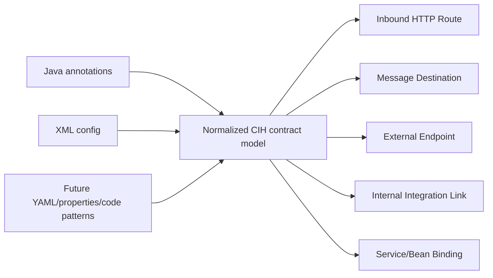

# Plan: Enterprise Java Genericity - Framework-Neutral HTTP + Integration Extraction

## Summary

CIH should expand beyond Spring MVC without hard-coding for one banking repo or one OSGi sample. Apache Fineract and Apache ServiceMix are evaluation fixtures, but the implementation target is generic enterprise Java extraction:

1. Normalize Spring MVC and JAX-RS annotations into the same inbound HTTP route model.
2. Normalize Camel/Blueprint/Spring XML integration config into framework-neutral integration facts.
3. Measure genericity with repeatable eval runs, not by adding repo-specific branches.

The core rule is: framework-specific extractors should emit framework-neutral graph facts.



## Context

Current CIH route extraction is Spring MVC-centered. Fineract has many JAX-RS resources using `jakarta.ws.rs` annotations such as `@Path`, `@GET`, and `@POST`, so most HTTP APIs are currently missed. ServiceMix is an XML-heavy enterprise integration sample where Camel routes, Blueprint services, JMS/ActiveMQ destinations, and CXF endpoints are often declared in config rather than Java annotations.

The existing eval repos are:

```text
/Users/phuc/BigMoves/AI/cih-eval-repos/fineract
/Users/phuc/BigMoves/AI/cih-eval-repos/servicemix
```

These repos should validate coverage, but code paths must stay framework- and repo-neutral.

---

## Schema additions in `cih-core`

Before the extractor changes, add the following to `crates/cih-core/src/lib.rs`:

### New NodeKind variants

```rust
NodeKind::IntegrationRoute,    // Camel/XML route definition
NodeKind::MessageDestination,  // JMS, ActiveMQ, Kafka, AMQP, RabbitMQ destinations
```

Keep `NodeKind::KafkaTopic` for backward-compat deserialization only. New extraction
should emit `MessageDestination`.

### New EdgeKind variant

```rust
EdgeKind::IntegrationLink,  // Internal Camel links: direct:, seda:, vm:, bean:, ref:
```

`EdgeKind::Uses` already carries a different meaning (class-level dependency). Using a
dedicated variant avoids ambiguity in graph queries and wiki page rendering.
Cypher label: `"INTEGRATION_LINK"`.

### RouteSource and IntegrationSource enums

Add to `cih-core` (serialized as lowercase snake_case strings via `#[serde(rename_all = "snake_case")]`):

```rust
#[derive(Serialize, Deserialize, Debug, Clone, PartialEq, Eq)]
#[serde(rename_all = "snake_case")]
pub enum RouteSource { SpringMvc, JaxRs }

#[derive(Serialize, Deserialize, Debug, Clone, PartialEq, Eq)]
#[serde(rename_all = "snake_case")]
pub enum IntegrationSource { CamelXml, BlueprintXml, SpringXml, CxfXml }
```

Store as `source` in node props via `serde_json::to_value`. This prevents magic-string
divergence across extractor and consumer code; adding a new framework means adding an enum
variant, not a string match in multiple files.

---

## Part 1 — Framework-Neutral HTTP Route Extraction

Refactor the current Spring route helper layer in `crates/cih-lang/src/java/parse.rs` so
it describes HTTP routes rather than Spring only.

### Extractor architecture

Split into per-framework inner functions orchestrated by one outer function. This makes
adding a third framework (Quarkus REST, MicroProfile) a bounded change:

```rust
// Outer function — collects from all frameworks, deduplicates
fn method_routes(node: TsNode<'_>, class_prefix: Option<&str>, src: &str) -> Vec<RouteCandidate> {
    let anns = annotations(node);
    let mut routes = Vec::new();
    routes.extend(spring_method_routes_inner(&anns, class_prefix, src));
    routes.extend(jaxrs_method_routes_inner(&anns, class_prefix, src));
    routes.sort_by(|a, b| a.sort_key().cmp(&b.sort_key()));
    routes.dedup_by(|a, b| a.dedup_key() == b.dedup_key());
    routes
}
```

### Implementation changes

- Rename `spring_class_prefix` → `route_class_prefix` (reads both `@RequestMapping` and `@Path`).
- Rename `spring_method_routes` → `method_routes` (calls both inner functions).
- Keep Spring MVC support for `@RequestMapping`, `@GetMapping`, `@PostMapping`,
  `@PutMapping`, `@DeleteMapping`, and `@PatchMapping`.
- Add `jaxrs_method_routes_inner`:
  - class-level and method-level `@Path`;
  - method-level `@GET`, `@POST`, `@PUT`, `@DELETE`, `@PATCH`, `@HEAD`, and `@OPTIONS`;
  - bare verb methods where method `@Path` is absent and class `@Path` is the full route.
- Do **not** early-return when a JAX-RS route is found — collect both frameworks' candidates
  before dedup. Mixed-annotation codebases (legacy migration in progress) should not drop
  valid candidates.

### Route node props

Replace the composite `decorator` string with a typed array. The composite `Path+GET`
encoding was JAX-RS-specific and would be meaningless for future frameworks:

```json
{
  "source": "jax_rs",
  "route_annotations": ["Path", "GET"],
  "httpMethod": "GET",
  "path": "/v1/loans/{id}"
}
```

For Spring MVC:
```json
{
  "source": "spring_mvc",
  "route_annotations": ["GetMapping"],
  "httpMethod": "GET",
  "path": "/orders"
}
```

- `source`: one of the `RouteSource` enum values, serialized as snake_case string.
- `route_annotations`: raw annotation names that contributed to this route (array, never composite string).
- `httpMethod` and `path`: unchanged.

Keep `NodeKind::Route` and `EdgeKind::HandlesRoute` unchanged.

### Tests

- Spring route extraction still emits the same routes as before.
- JAX-RS class `@Path("/v1/loans")` + method `@GET` + method `@Path("/{id}")` emits `GET /v1/loans/{id}`.
- JAX-RS class `@Path("/v1/charges")` + bare method `@GET` emits `GET /v1/charges`.
- JAX-RS `@POST` + method `@Path("/batch")` emits `POST /v1/charges/batch`.
- Mixed Spring and JAX-RS annotations on the same class do not drop either framework's routes.
- Duplicate route candidates (same method+path) dedupe deterministically; `route_annotations`
  from the surviving candidate is the one with the more specific path annotation.
- `route_annotations` is always an array, never a composite string like `Path+GET`.

---

## Part 2 — Framework-Neutral Integration XML Extraction

Add a new extractor in `cih-resolve` for enterprise XML integration config. It should scan
XML files directly from the repo root and emit normalized graph nodes/edges.

Module:

```text
crates/cih-resolve/src/integration_xml.rs
```

Public function:

```rust
pub fn emit_integration_xml(repo_root: &Path) -> Result<(Vec<Node>, Vec<Edge>)>;
```

### File discovery

Search common enterprise Java config locations. Patterns are ordered from most-specific to
broadest to avoid mis-classifying unrelated XML:

```text
**/OSGI-INF/blueprint/**/*.xml
**/META-INF/spring/**/*.xml
**/META-INF/camel/**/*.xml
**/WEB-INF/**/*.xml
**/spring/**/*.xml
**/camel/**/*.xml
src/main/resources/**/*.xml
**/applicationContext*.xml
**/camel-context*.xml
**/integration/**/*.xml
```

After glob match, filter by content signatures to avoid parsing unrelated XML:

```
<blueprint
<camelContext
Camel namespace URI (http://camel.apache.org/schema/*)
CXF namespace URI (http://cxf.apache.org/*)
OSGi Blueprint namespace URI (http://www.osgi.org/xmlns/blueprint/*)
Spring beans namespace URI (http://www.springframework.org/schema/beans)
```

**Skip policy (explicit):** if a file matches a glob but contains no recognized content
signature, log `tracing::debug!` and skip — do not warn or fail. If a file matches a
signature but fails to parse (malformed XML), log `tracing::warn!` with the file path and
continue. A bad XML file must never abort an analyze run.

### Parsing

- Use `quick-xml` (already a workspace dep).
- Parse by local element name so namespace prefixes do not matter.
- Track current Camel route while reading nested `<from>` and `<to>` endpoints.
- Preserve file path and XML route id in node props.

### Normalized node model

- `NodeKind::IntegrationRoute` for Camel/XML route definitions.
- `NodeKind::MessageDestination` for JMS, ActiveMQ, Kafka, AMQP, RabbitMQ destinations.
  Camel-internal URIs (`direct:`, `seda:`, `vm:`, `bean:`, `ref:`) do **not** create
  `MessageDestination` nodes — they only create `IntegrationLink` edges between routes.
- `NodeKind::ExternalEndpoint` for true outbound HTTP/remote calls (`http:`, `https:`,
  `cxf:` as client).
- `NodeKind::Route` for inbound HTTP APIs from XML (`cxf:`, `cxfrs:`, `rest:` as server,
  i.e., in `<from>`).

### Normalized edge model

- `EdgeKind::ListensTo` — inbound message consumption (`<from>` on a message URI).
- `EdgeKind::PublishesEvent` — outbound publish (`<to>` on a message URI).
- `EdgeKind::ExternalCall` — outbound HTTP/remote call (`<to>` on an HTTP URI).
- `EdgeKind::IntegrationLink` — internal Camel routing (`direct:`, `seda:`, `vm:`, `bean:`,
  `ref:`). **Not** `EdgeKind::Uses`, which means class-level dependency elsewhere in the graph.

### URI classification

| URI family | `<from>` context | `<to>` context |
|---|---|---|
| `http`, `https` | `Route` + `HandlesRoute` | `ExternalEndpoint` + `ExternalCall` |
| `cxf`, `cxfrs`, `rest` | `Route` + `HandlesRoute` | `ExternalEndpoint` + `ExternalCall` |
| `jms`, `activemq`, `kafka`, `amqp`, `rabbitmq` | `MessageDestination` + `ListensTo` | `MessageDestination` + `PublishesEvent` |
| `direct`, `seda`, `vm`, `bean`, `ref` | (route entry, no separate node) | `IntegrationLink` between routes |
| `timer`, `quartz`, `file`, `ftp`, `sftp`, `log`, `mock` | infrastructure — mark `infrastructure: true`; no edge | infrastructure — mark `infrastructure: true`; no edge |

The `<from>` vs `<to>` context determines direction. The same component family can be
inbound (server) or outbound (client) depending on context.

### Node props

```json
{
  "source": "camel_xml",
  "component": "activemq",
  "uri": "activemq:queue:ORDER.CREATED",
  "destination_type": "queue",
  "file": "META-INF/camel/routes.xml",
  "route_id": "order-processing"
}
```

- `source`: one of the `IntegrationSource` enum values, serialized as snake_case string.
- `component`: URI scheme (e.g., `activemq`, `jms`, `direct`, `http`).
- `uri`: original URI string.
- `destination_type`: `queue` | `topic` | `exchange` | `stream` | `channel` | `unknown`.
  - JMS/ActiveMQ: parse prefix from URI — `queue:X` → `queue`, `topic:X` → `topic`.
  - AMQP/RabbitMQ: RabbitMQ exchange names map to `exchange`; queue URIs map to `queue`.
  - Camel-internal (`direct:`, `seda:`, `vm:`): omit `destination_type` — these are routing
    channels, not message destinations, and the field has no meaningful value.
  - Kafka: `topic`.
- `file` and optional `route_id`.
- `infrastructure: true` only for timer/scheduler/file/log sources — omit the field otherwise.

### Tests

- Camel XML route emits an `IntegrationRoute` node.
- `from uri="activemq:queue:X"` emits a `MessageDestination` with `destination_type: queue` and `ListensTo`.
- `to uri="activemq:topic:X"` emits a `MessageDestination` with `destination_type: topic` and `PublishesEvent`.
- `to uri="rabbitmq:my-exchange"` emits a `MessageDestination` with `destination_type: exchange`.
- `to uri="http://example/api"` emits an `ExternalEndpoint` and `ExternalCall`.
- `direct:X` emits an `IntegrationLink` between two routes — no `MessageDestination` node, no `Uses` edge.
- `timer:` and `log:` endpoints are marked `infrastructure: true` and emit no edges.
- A malformed XML file is skipped with a warning; the extractor continues and returns
  whatever was parsed from other files.
- `source` prop is always a valid `IntegrationSource` string, never an ad-hoc value.

---

## Part 3 — Wire Into Analyze

Wire XML extraction into `crates/cih-engine/src/analyze.rs` after Java parse/resolve and
DB access emission, before content versioning and artifact writing.

Expected flow:

```text
scan -> scope -> parse Java -> resolve Java calls/contracts -> emit DB access -> emit integration XML -> write graph artifacts
```

Implementation notes:

- The XML extractor is additive: a bad XML file is skipped with a warning, not a fatal error.
- Deduplicate nodes and edges deterministically before artifact writing.
- Record `source` and `uri` in props so the wiki/browser can explain where each route or
  integration fact came from.

---

## Part 4 — Wire Into Evidence Packs

`NodeKind::IntegrationRoute` and `NodeKind::MessageDestination` are not visible to the
wiki LLM pipeline unless `build_evidence_pack` in `crates/cih-engine/src/llm/evidence.rs`
is taught about them. Without this step, a ServiceMix wiki run produces no LLM content
about Camel routes.

Add two new `EvidenceKind` variants and push functions:

```rust
EvidenceKind::IntegrationRoute,  // items labeled I1, I2, ...
EvidenceKind::MessageDestination, // items labeled M1, M2, ...
```

**`push_integration_routes`** — iterate `graph.process_nodes` (or a new
`community_integration_routes` index on `WikiGraph`) and emit items like:
```
[I1] order-processing (camel_xml, 4 steps)
[I2] payment-retry (camel_xml, 2 steps)
```

**`push_message_destinations`** — iterate published/consumed topics for the community,
but include `MessageDestination` nodes (which carry `destination_type: queue | topic | exchange`):
```
[M1] ORDER.CREATED (queue, activemq) — published
[M2] PAYMENT.RESULT (topic, kafka) — consumed
```

Call both from `build_evidence_pack` between the existing `push_events` and
`push_external_calls` calls. These items are eligible for truncation by `enforce_size_cap`.

Also update `WikiGraph::build` in `crates/cih-wiki/src/graph.rs` to index
`MessageDestination` nodes separately from `KafkaTopic` so the push functions can retrieve
them without a full node scan.

---

## Part 5 — Eval Harness

Add a reproducible script:

```text
scripts/eval-enterprise-java.sh
```

Behavior:

```bash
#!/usr/bin/env bash
set -euo pipefail

cargo build -p cih-engine

REPOS=(fineract servicemix spring-petclinic)
EVAL_BASE="target/cih-eval"
ENGINE="./target/debug/cih-engine"

for repo in "${REPOS[@]}"; do
  REPO_ROOT="/Users/phuc/BigMoves/AI/cih-eval-repos/$repo"
  OUT="$EVAL_BASE/$repo"
  mkdir -p "$OUT"

  "$ENGINE" scan "$REPO_ROOT" --json > "$OUT/scan.json"
  "$ENGINE" analyze "$REPO_ROOT" --all --no-load --json > "$OUT/analyze.json"
  "$ENGINE" discover "$REPO_ROOT" --no-load --json > "$OUT/discover.json"
  "$ENGINE" wiki "$REPO_ROOT" --out "$OUT/wiki" --json > "$OUT/wiki.json"
done
```

`spring-petclinic` is the **genericity smoke test**: it uses Spring MVC only and has no
JAX-RS or Camel. It must not regress — if it emits fewer routes than before, something
in the JAX-RS refactor broke Spring extraction. Clone it once into
`/Users/phuc/BigMoves/AI/cih-eval-repos/spring-petclinic` before running.

Output:

```text
target/cih-eval/
  fineract/
  servicemix/
  spring-petclinic/
    scan.json        ← should show Spring MVC routes
    analyze.json
    discover.json
    wiki.json
    wiki/
```

Metrics to compare:

| Metric | fineract | servicemix | spring-petclinic |
|---|---|---|---|
| Route count | ↑ from JAX-RS | (few) | must not decrease |
| Integration route count | 0 | ↑ from XML | 0 |
| Message destination count | 0 | ↑ from XML | 0 |
| External endpoint count | varies | varies | varies |
| `ListensTo` edges | 0 | ↑ | 0 |
| `PublishesEvent` edges | 0 | ↑ | 0 |
| `IntegrationLink` edges | 0 | ↑ | 0 |
| Unresolved ref count | benchmark | benchmark | benchmark |
| Community / process counts | benchmark | benchmark | benchmark |

---

## Acceptance Criteria

- Fineract route coverage increases significantly from JAX-RS extraction.
- ServiceMix emits non-zero `IntegrationRoute`, `MessageDestination`, `ListensTo`,
  `PublishesEvent`, and `IntegrationLink` facts.
- XML-derived ActiveMQ/JMS facts carry `destination_type: queue | topic`, not `kafka`.
- RabbitMQ exchange facts carry `destination_type: exchange`.
- Internal Camel `direct:` links emit `IntegrationLink` edges, not `ExternalCall` or `Uses`.
- `route_annotations` is always an array; no composite strings like `Path+GET` appear in props.
- Spring MVC extraction on spring-petclinic does not regress.
- Existing graph readers, wiki generation, and server/browser endpoints continue to load
  artifacts that contain the new node kinds without errors.
- `IntegrationRoute` and `MessageDestination` nodes appear as `[I1]` / `[M1]` evidence
  items in `--llm-debug-evidence` output when running wiki on servicemix.
- `target/cih-eval/` is not committed (covered by existing gitignore).

---

## Files Changed

| File | Change |
|---|---|
| `crates/cih-core/src/lib.rs` | Add `IntegrationRoute`, `MessageDestination` node kinds; add `IntegrationLink` edge kind; add `RouteSource` and `IntegrationSource` enums |
| `crates/cih-lang/src/java/parse.rs` | Rename `spring_*` helpers to framework-neutral names; add `jaxrs_method_routes_inner`; change `decorator` prop to `route_annotations` array; collect both frameworks' candidates before dedup |
| `crates/cih-resolve/src/integration_xml.rs` | **New** — XML integration extractor; uses `IntegrationSource` enum; emits `IntegrationLink` not `Uses` |
| `crates/cih-resolve/src/lib.rs` | Export `emit_integration_xml` |
| `crates/cih-engine/src/analyze.rs` | Add XML extraction to graph artifact assembly |
| `crates/cih-engine/src/llm/evidence.rs` | Add `EvidenceKind::IntegrationRoute` and `EvidenceKind::MessageDestination`; add `push_integration_routes` and `push_message_destinations` |
| `crates/cih-wiki/src/graph.rs` | Index `MessageDestination` nodes for efficient lookup in evidence push functions |
| `scripts/eval-enterprise-java.sh` | **New** — eval harness; includes spring-petclinic as genericity smoke test |

---

## Test Plan

```bash
cargo test -p cih-core
cargo test -p cih-lang
cargo test -p cih-resolve
cargo test -p cih-engine
cargo test -p cih-wiki
cargo test --workspace
scripts/eval-enterprise-java.sh
```

---

## Out of Scope

- LLM interpretation or LLM wiki enrichment specific to integration routes (beyond evidence items).
- Full runtime Camel semantics (content-based routing, split/aggregate, EIP patterns).
- WSDL/SOAP contract extraction.
- `@Consumes` and `@Produces` as graph nodes.
- Gradle/Maven module naming improvements.
- Quarkus REST, MicroProfile, or Micronaut annotation support (same `jaxrs_method_routes_inner` function handles `@Path`+`@GET` regardless of import package, so `javax.ws.rs` and `jakarta.ws.rs` both work; full Quarkus extensions are out of scope).

---

## Assumptions

- Fineract and ServiceMix are evaluation fixtures, not special-case code paths.
- The graph represents explicit code/config facts and conservative URI classification.
- Future extractors for YAML/properties, Servlet annotations, or framework-specific factories should feed the same normalized `RouteSource` / `IntegrationSource` model.
- `javax.ws.rs` (JAX-RS 2.x) and `jakarta.ws.rs` (JAX-RS 3.x) use the same annotation names — the extractor matches by annotation local name, not fully-qualified type, so both import styles work without a separate code path.
