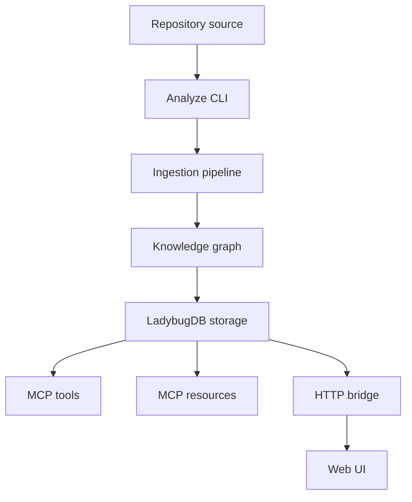
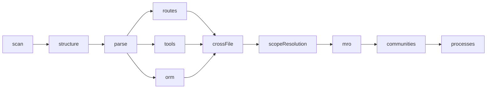
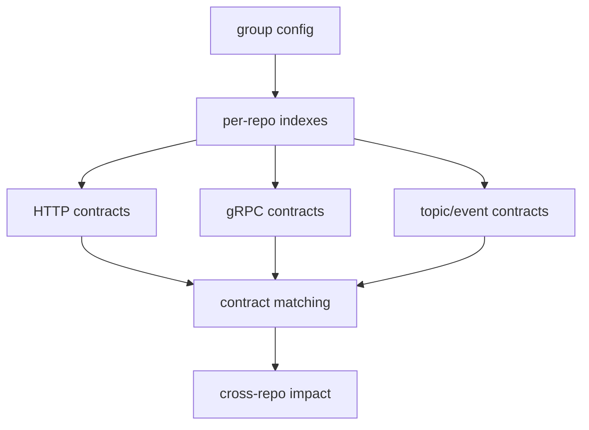

# GitNexus Discovery Notes

This document records what was found in the local GitNexus checkout at:

```text
/Users/phuc/BigMoves/AI/GitNexus
```

The goal is not to clone GitNexus. The goal is to identify ideas that can improve
`yummy-cih` as a Java/Spring code-understanding backend.

## Important License Constraint

GitNexus is licensed under **PolyForm Noncommercial 1.0.0**.

That means `yummy-cih` should treat GitNexus primarily as a reference for architecture,
product behavior, and terminology unless the project license and intended use are confirmed
to be compatible.

Recommended default:

- Do use GitNexus for product inspiration and design patterns.
- Do not copy source code directly.
- Reimplement needed behavior in Rust with CIH-specific tests and contracts.

## What GitNexus Is

GitNexus indexes repositories into a knowledge graph and exposes that graph through:

- CLI commands.
- MCP tools.
- MCP resources.
- A local HTTP bridge for a browser UI.
- Optional embeddings.
- Optional repo group and cross-repo contract analysis.

Its stated purpose is agent-oriented code understanding: dependency relationships, call chains,
clusters, execution flows, impact analysis, and repository navigation.

## GitNexus Architecture Summary



The main GitNexus packages are:

| Path | Purpose |
| --- | --- |
| `gitnexus/` | CLI, MCP server, HTTP bridge, ingestion, graph, search, embeddings |
| `gitnexus-web/` | Browser UI |
| `gitnexus-shared/` | Shared TypeScript contracts |
| `gitnexus/src/core/ingestion/` | Parse and graph construction pipeline |
| `gitnexus/src/core/group/` | Multi-repo contract extraction and cross-repo impact |
| `gitnexus/src/core/search/` | Search ranking |
| `gitnexus/src/core/embeddings/` | Embedding support |
| `gitnexus/src/mcp/` | MCP tools and resources |

## Pipeline Pattern

GitNexus uses an explicit phase pipeline:



Useful pattern for CIH:

- Keep each phase explicit.
- Give each phase typed input/output.
- Let phases depend only on declared upstream phases.
- Make "skip expensive graph enrichment" an option for tests and fast runs.

Current CIH already follows this direction through separate crates and engine subcommands:

- `scan`
- `analyze`
- `resolve`
- `discover`
- `embed`

The missing CIH improvement is a single written phase contract that documents the data produced
by each command and how later commands consume it.

## What CIH Already Borrowed Well

`yummy-cih` already has the highest-value GitNexus ideas for the Java/Spring vertical slice:

| GitNexus idea | CIH status |
| --- | --- |
| Scan before parse | Implemented in `cih-engine scan` |
| Scope selection | Implemented with CLI flags and `cih.scope.toml` |
| Tree-sitter language query | Implemented for Java in `cih-lang` and `cih-parse` |
| Graph artifacts | Implemented as JSONL nodes and edges |
| MCP `context` | Implemented |
| MCP `impact` | Implemented |
| Communities/clusters | Implemented in `cih-community` and `discover` |
| Process traces | Implemented in `cih-community` and `discover` |
| Hybrid search | Implemented with BM25 plus optional pgvector |
| `route_map` | Implemented for Spring routes |
| Incremental parse cache | Implemented in Phase 9 |
| Blue-green graph publish | Implemented in Phase 9 |

## High-Value Ideas CIH Should Add Next

### 1. Repo registry and staleness status

GitNexus registers analyzed repositories in a global registry and exposes status/staleness.

Why this helps CIH:

- The MCP server can list available repos instead of relying on one environment variable.
- Users can see whether an index is stale.
- Future `yummy` frontend can show "indexed repos" and "last analyzed" state.

Suggested CIH feature:

```text
cih-engine status <repo>
cih-engine list
```

Suggested artifact:

```text
~/.cih/registry.json
```

Suggested MCP additions:

```text
list_repos()
status({ repo })
```

Minimal registry row:

```json
{
  "name": "payment-service",
  "path": "/absolute/path/to/payment-service",
  "indexed_at": "2026-06-14T10:00:00Z",
  "last_git_head": "abc123",
  "graph_key": "cih",
  "artifacts_dir": "/absolute/path/.cih/artifacts",
  "stats": {
    "nodes": 12000,
    "edges": 48000,
    "routes": 94,
    "communities": 32,
    "processes": 140
  }
}
```

Priority: high.

### 2. MCP resources, not only tools

GitNexus exposes lightweight resources such as:

- repo context
- clusters
- individual cluster details
- processes
- individual process details
- schema

CIH currently exposes tools, but resources would make agent navigation cheaper and more predictable.

Suggested CIH resources:

```text
cih://repo/{name}/context
cih://repo/{name}/communities
cih://repo/{name}/community/{id}
cih://repo/{name}/processes
cih://repo/{name}/process/{id}
cih://repo/{name}/schema
```

Why this helps:

- Lower token cost than calling broad tools.
- Better first-step workflow for agents.
- Cleaner frontend reads for static overviews.

Priority: high.

### 3. `detect_changes` / change impact

GitNexus has a git-diff based workflow for "what did my current change affect?"

CIH already has graph impact and file hashes, so this is a natural next feature.

Suggested CIH tool:

```text
detect_changes({ scope: "working" | "staged" | "base_ref", base_ref?: string })
```

Suggested output:

```json
{
  "changed_files": [],
  "changed_symbols": [],
  "affected_symbols": [],
  "affected_processes": [],
  "risk": "low|medium|high|critical"
}
```

Implementation sketch:

1. Use `git diff --name-only` for selected scope.
2. Map changed files to graph nodes by `file`.
3. Run upstream `impact` from changed symbols.
4. Join with `STEP_IN_PROCESS` edges.
5. Return a risk summary.

Why this helps:

- Developers can ask "what did this PR affect?"
- Testers can later use it for regression-scope selection.
- It is a bridge toward Phase 16.

Priority: high.

### 4. Ambiguous symbol handling

GitNexus returns an explicit ambiguous response when `context` or `impact` matches multiple symbols.

CIH currently accepts a `NodeId`-like name in tools, but users often type simple names.

Suggested behavior:

```json
{
  "status": "ambiguous",
  "message": "Found multiple symbols named OrderService",
  "candidates": [
    {
      "id": "Class:com.acme.order.OrderService",
      "kind": "Class",
      "file": "src/main/java/com/acme/order/OrderService.java",
      "score": 0.98
    }
  ]
}
```

Why this helps:

- Prevents silent wrong-symbol analysis.
- Makes `yummy` frontend able to show a picker.
- Improves agent reliability.

Priority: high.

### 5. Agent workflow skills

GitNexus ships task-specific skill files for:

- exploration
- impact analysis
- debugging
- refactoring
- CLI operations
- PR review

CIH can use the same idea without copying the files.

Suggested CIH docs:

```text
docs/agent-workflows/
  exploring.md
  impact-analysis.md
  debugging.md
  product-owner.md
  tester.md
```

Each workflow should say which CIH tool to call first, what to inspect next, and what output shape
the agent should return.

Why this helps:

- The same graph can serve Developer, PO, BA, and Tester personas.
- It turns raw tools into repeatable reasoning workflows.
- It supports Phase 10 productization.

Priority: high.

### 6. Contract extraction for cross-service understanding

GitNexus has a group pipeline for cross-repo contracts:



For CIH, this is directly useful for Java/Spring systems.

Suggested CIH feature:

```text
cih-engine group create <name>
cih-engine group add <name> <repo>
cih-engine group sync <name>
```

Initial contracts to extract:

- HTTP routes provided by Spring controllers.
- HTTP clients from `RestTemplate`, `WebClient`, OpenFeign, and Retrofit.
- Kafka/Rabbit events from listeners and publishers.
- gRPC endpoints from generated/proto usage, later.

Why this helps:

- PO and BA questions often cross service boundaries.
- Java microservices need provider/consumer analysis.
- It supports future `trace_flow` and `cr_impact`.

Priority: medium-high.

### 7. API impact and shape checks

GitNexus has API-oriented tools such as `api_impact`, `route_map`, and `shape_check`.

CIH already has Spring `route_map`. The next step is consumer-aware API impact.

Suggested CIH additions:

```text
api_impact({ method: "GET", path: "/orders/{id}" })
shape_check({ provider: "...", consumer: "..." })
```

For Java/Spring, "shape" can start simple:

- response DTO class fields
- request DTO class fields
- route handler return type
- consumer property access if consumer source is indexed

Why this helps:

- It answers "what breaks if this API response changes?"
- It is more precise than raw symbol impact for REST-heavy systems.

Priority: medium.

### 8. Graph-assisted rename dry-run

GitNexus has a `rename` tool with `dry_run` to avoid unsafe find-and-replace.

CIH can add a Java-only version later:

```text
rename_symbol({ id, new_name, dry_run: true })
```

Suggested output:

- graph-confirmed edits
- text-search candidate edits
- ambiguous or unsafe edits
- tests to run

Why this helps:

- Refactoring is a major developer use case.
- Graph-backed rename is safer than text replacement.

Priority: medium.

### 9. Optional CFG/PDG and taint layer

GitNexus has an optional `--pdg` path that emits CFG and taint findings.

CIH should not implement this yet, but the idea is useful for a later security/testing phase.

Possible CIH future:

```text
cih-engine analyze <repo> --pdg
explain({ target })
```

Useful outputs:

- `BasicBlock` nodes
- `CFG` edges
- `REACHING_DEF` edges
- `TAINTED` edges
- `SANITIZES` edges

Why this helps:

- Security review.
- Path traversal, SQL injection, command injection checks.
- Better bug explanation than call graph alone.

Priority: low for now, high later if security analysis becomes a product goal.

### 10. Generated wiki from communities and processes

GitNexus can generate a repository wiki from graph data.

CIH already has communities and processes, so a Java/Spring wiki is realistic.

Suggested CIH command:

```text
cih-engine wiki <repo> --out docs/generated/wiki
```

Suggested pages:

- module overview
- API route catalog
- process trace pages
- community pages
- dependency/JAR surface pages

Why this helps:

- Useful for PO and BA personas.
- Turns the graph into readable documentation.
- Supports Phase 10.

Priority: medium.

## Lower-Value Ideas For CIH Right Now

These GitNexus capabilities are valuable, but not urgent for `yummy-cih`:

| GitNexus capability | Reason to defer |
| --- | --- |
| Broad multi-language support | CIH's current value is Java/Spring depth |
| Browser graph explorer | The `yummy` frontend should own UX, not engine |
| Raw Cypher MCP tool | Useful for developers, risky for non-technical personas |
| Full local HTTP bridge | CIH already uses Streamable HTTP MCP |
| Advanced worker-pool design | Rust rayon/thread-local parser is already simple and effective |
| In-browser WASM indexing | Not aligned with backend-first CIH architecture |

## Suggested CIH Roadmap Additions

### Near term

1. Add repo registry and status.
2. Add MCP resources for context, communities, processes, and schema.
3. Add ambiguous symbol responses for `context` and `impact`.
4. Add `detect_changes`.
5. Add CIH agent workflow docs.

### Mid term

1. Add cross-service contract extraction for Spring HTTP clients and events.
2. Add `api_impact`.
3. Add generated wiki pages from existing artifacts.
4. Add graph-assisted rename dry-run.

### Later

1. Add optional CFG/PDG.
2. Add taint/security explanation.
3. Add multi-repo group sync and cross-repo impact.
4. Add additional JVM languages such as Kotlin.

## Recommended Next Implementation Plan

The best next implementation target is **repo registry plus staleness plus MCP resources**.

Reason:

- Small schema surface.
- Does not require parser changes.
- Improves every future tool.
- Makes CIH easier to use from `yummy`.
- Mirrors GitNexus's most useful operational workflow.

Proposed files:

```text
crates/cih-core/src/registry.rs
crates/cih-engine/src/registry.rs
crates/cih-engine/src/status.rs
crates/cih-server/src/resources.rs
```

Proposed CLI:

```text
cih-engine list
cih-engine status <repo>
```

Proposed MCP:

```text
list_repos()
status({ repo })
```

Proposed resources:

```text
cih://repo/{name}/context
cih://repo/{name}/communities
cih://repo/{name}/processes
cih://repo/{name}/schema
```

## References Inspected

GitNexus files inspected:

- `README.md`
- `ARCHITECTURE.md`
- `RUNBOOK.md`
- `GUARDRAILS.md`
- `MIGRATION.md`
- `LICENSE`
- `gitnexus/skills/gitnexus-guide.md`
- `gitnexus/skills/gitnexus-exploring.md`
- `gitnexus/skills/gitnexus-impact-analysis.md`
- `gitnexus/skills/gitnexus-debugging.md`
- `gitnexus/src/core/group/PIPELINE.md`
- `gitnexus/src/storage/file-hash.ts`
- `gitnexus/src/storage/parse-cache.ts`
- `gitnexus/src/core/incremental/*`
- `gitnexus/src/core/ingestion/taint/*`
- `gitnexus/src/core/ingestion/cfg/*`

CIH files compared:

- `ROADMAP.md`
- `docs/phase-3.md`
- `docs/phase-4.md`
- `docs/phase-5.md`
- `docs/phase-6.md`
- `docs/phase-7.md`
- `docs/phase-9.md`
- `docs/architecture-improvements.md`
- `crates/cih-engine`
- `crates/cih-server`
- `crates/cih-resolve`
- `crates/cih-community`
- `crates/cih-search`
- `crates/cih-embed`
