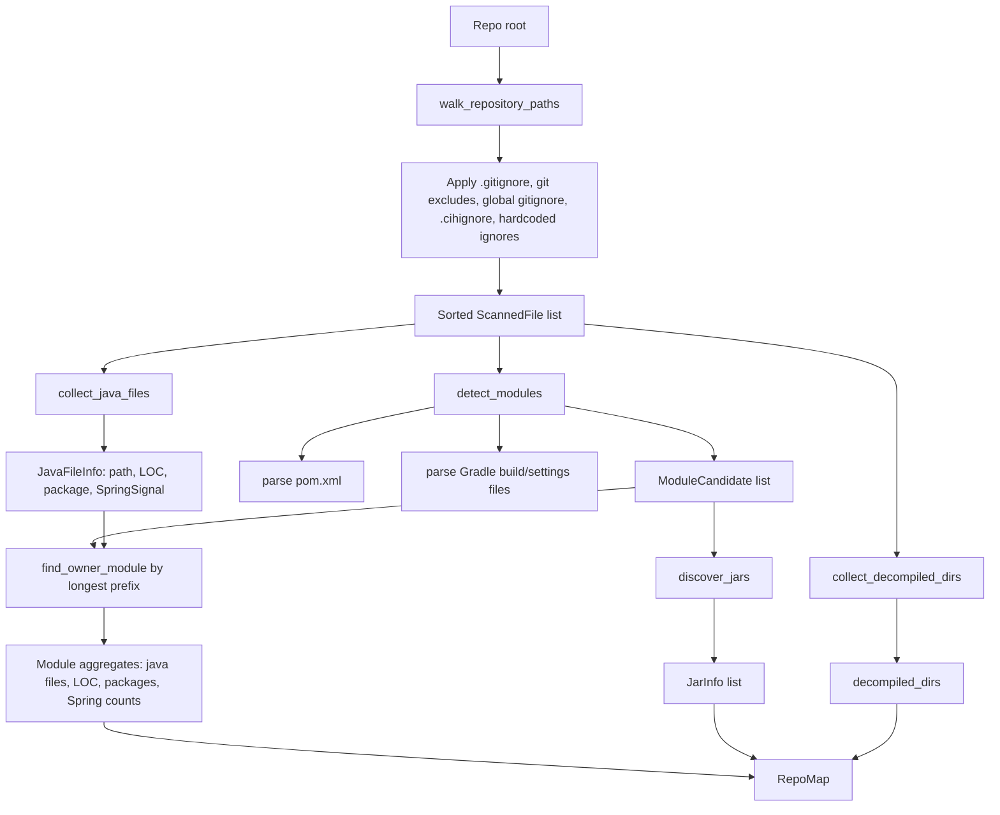
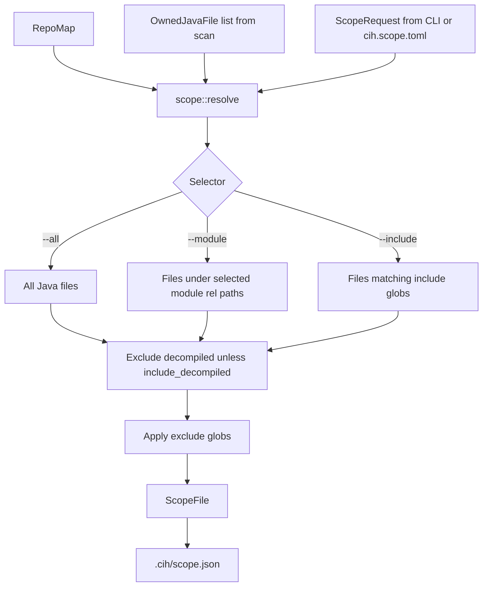
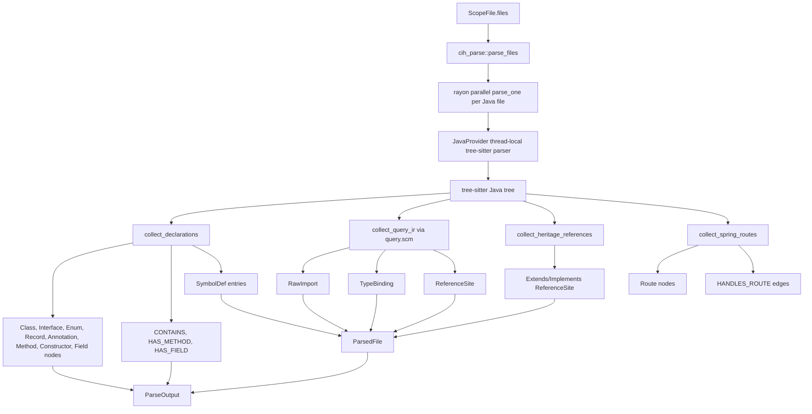
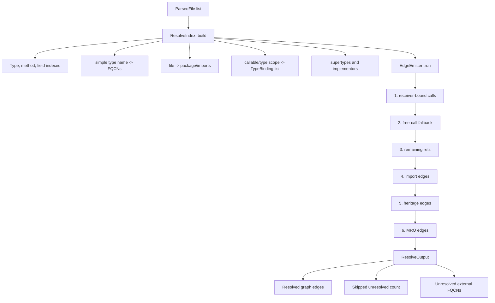
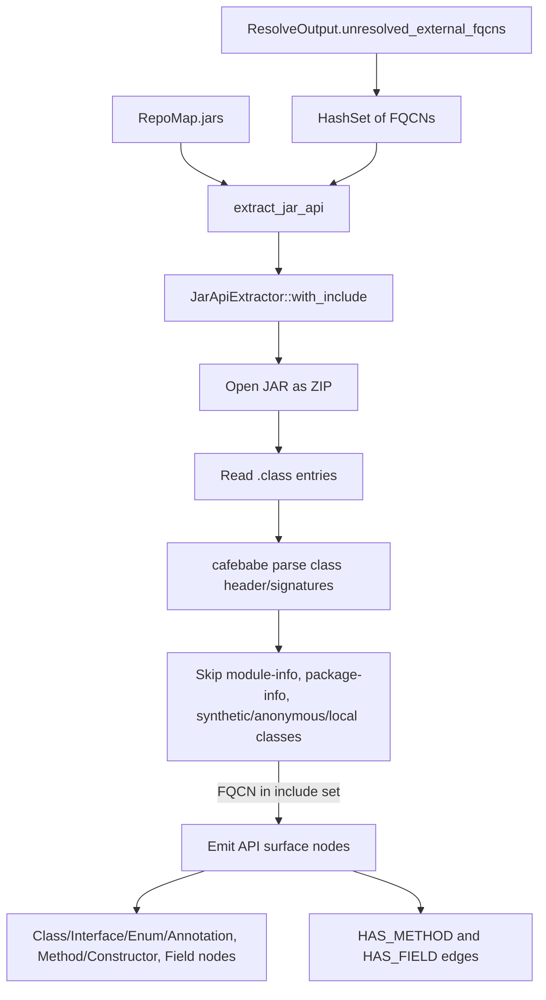
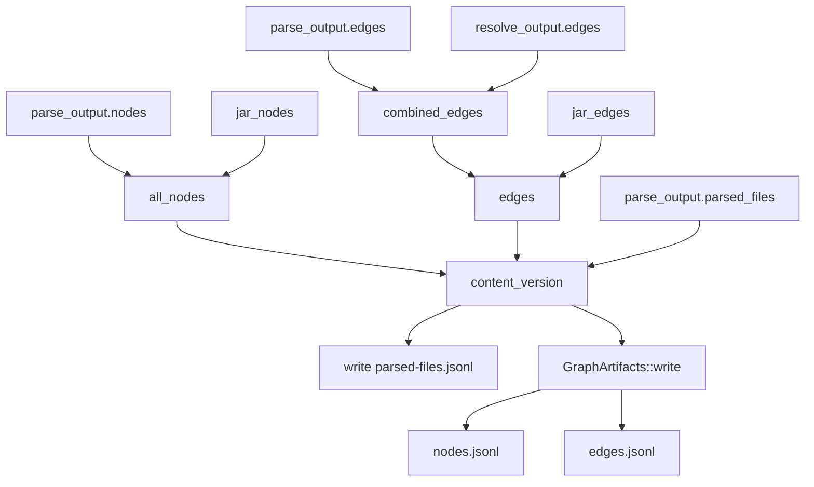
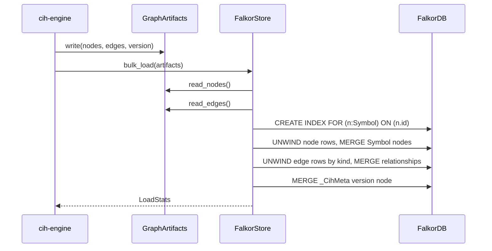
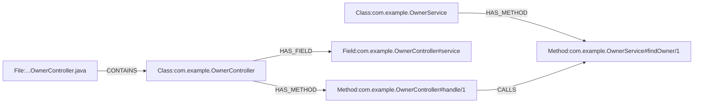

# How yummy-cih Finds, Parses, Resolves, and Builds the Graph

This document describes what the current code does today. It is written as a walkthrough of the implementation, not as a future plan.

For short definitions of terms like `RepoMap`, `ParsedFile`, `ReferenceSite`, `CALLS`, and `FQCN`, see [glossary.md](./glossary.md).

## One-Screen View

```mermaid
flowchart LR
  User["User runs cih-engine"] --> Cmd{"Command"}

  Cmd -->|"scan <repo>"| Scan["scan_repo"]
  Scan --> RepoMap[".cih/repo-map.json"]
  Scan --> Summary["Human module table or JSON"]

  Cmd -->|"analyze <repo> --all/--module/--include"| Analyze["run_analyze"]
  Analyze --> Scan2["scan_repo"]
  Scan2 --> Scope["scope::resolve"]
  Scope --> ScopeFile[".cih/scope.json"]
  ScopeFile --> Parse["cih_parse::parse_files"]
  Parse --> ParsedIR["ParsedFile IR"]
  Parse --> Structure["Structure nodes and edges"]
  ParsedIR --> Resolve["cih_resolve::resolve_edges"]
  Resolve --> ResolvedEdges["CALLS, ACCESSES, USES, IMPORTS, EXTENDS, IMPLEMENTS, MRO edges"]
  Resolve --> ExternalTypes["Unresolved external FQCNs"]
  ExternalTypes --> JarApi["cih_jar::JarApiExtractor"]
  JarApi --> JarGraph["JAR API nodes and HAS_METHOD/HAS_FIELD edges"]
  Structure --> Artifacts["GraphArtifacts"]
  ResolvedEdges --> Artifacts
  JarGraph --> Artifacts
  ParsedIR --> ParsedFileJsonl[".cih/parsed/<version>/parsed-files.jsonl"]
  Artifacts --> NodesJsonl[".cih/artifacts/<version>/nodes.jsonl"]
  Artifacts --> EdgesJsonl[".cih/artifacts/<version>/edges.jsonl"]
  Artifacts -->|"unless --no-load"| Falkor["FalkorDB bulk_load"]

  Cmd -->|"resolve <repo>"| ResolveCmd["run_resolve"]
  ResolveCmd --> SavedScope["read .cih/scope.json"]
  ResolveCmd --> SavedRepoMap["read .cih/repo-map.json for JARs"]
  SavedScope --> Parse
```



The current graph build is a two-part process:

1. `scan` finds what exists without parsing Java.
2. `analyze` chooses a file scope, parses those files, resolves references, writes JSONL graph artifacts, and optionally loads FalkorDB.

## Command Entry Points

The CLI lives in `crates/cih-engine/src/main.rs`.

### `cih-engine scan <repo>`

`scan` only discovers metadata. It does not use tree-sitter and it does not build code graph edges.

It produces:

- `.cih/repo-map.json`
- a human summary table, unless `--json` is used

### `cih-engine analyze <repo> ...`

`analyze` is the main build path.

It does:

1. Scan the repo.
2. Write `.cih/repo-map.json`.
3. Resolve the requested scope from `--all`, `--module`, `--include`, `--exclude`, `--include-decompiled`, or `cih.scope.toml`.
4. Write `.cih/scope.json`.
5. Parse selected Java files.
6. Resolve references into graph edges.
7. Extract demand-driven JAR API nodes for unresolved external FQCNs when JARs are known.
8. Write `.cih/parsed/<version>/parsed-files.jsonl`.
9. Write `.cih/artifacts/<version>/nodes.jsonl` and `edges.jsonl`.
10. Load FalkorDB unless `--no-load` is passed.

If the user gives no scope selector, `analyze` prints the scan summary and exits with code `2`. This is intentional: the project does not want to accidentally parse a huge repo.

### `cih-engine resolve <repo>`

Despite the name, current `resolve` does more than only resolve saved IR. It reads `.cih/scope.json`, reads `.cih/repo-map.json` for the JAR catalog if present, then calls the same `analyze_from_scope` path used by `analyze`.

That means current `resolve` reparses the files listed in saved scope, resolves again, writes fresh artifacts, and optionally loads FalkorDB.

## Find Phase: Scan Without Parsing Java

Implemented mainly in:

- `crates/cih-engine/src/scan.rs`
- `crates/cih-engine/src/scan/walk.rs`
- `crates/cih-engine/src/scan/java_scan.rs`
- `crates/cih-engine/src/scan/modules.rs`
- `crates/cih-engine/src/scan/build_files.rs`
- `crates/cih-engine/src/scan/jars.rs`



### Filesystem Walk

`walk_repository_paths` uses the `ignore` crate. It:

- starts from the canonical repo root
- honors `.gitignore`
- honors git exclude and global gitignore
- adds `.cihignore`
- keeps hidden files visible to the walker, then applies project ignore rules itself
- skips ignored directories before descending
- returns sorted repo-relative paths with file sizes

This returns `ScannedFile { path, size }`. No file content is read in this step except metadata.

### Java Scan

`collect_java_files` then filters scanned files to `.java` and reads only those file contents. It still does not parse Java with tree-sitter.

For each Java file it computes:

- repo-relative path
- LOC by counting newline bytes
- package declaration by line-prefix scan
- Spring signal by substring checks like `@RestController`, `@Service`, `@Repository`, `@Entity`, `@GetMapping`

This produces `JavaFileInfo`.

### Module Detection

`detect_modules` finds build units:

- Maven modules from `pom.xml`
- Gradle modules from `build.gradle`, `build.gradle.kts`, `settings.gradle`, and `settings.gradle.kts`
- fallback root module if no build files exist
- extra fallback root module if some Java files do not belong to any detected module
- `.workspace-dependencies` as a detected decompiled dependency area

Maven parsing uses `quick-xml`. Gradle parsing is string/regex-style matching for common group/dependency/include shapes.

Each Java file is assigned to a module with longest-prefix matching. For example:

```text
module rel path: services/owners
java file:       services/owners/src/main/java/com/acme/OwnerService.java
owner module:    services/owners
```

### JAR Discovery

`discover_jars` fills `RepoMap.jars`.

It looks in:

1. project-local `lib/`
2. project-local `libs/`
3. project-local `.workspace-dependencies/`
4. targeted dependency paths in `~/.m2/repository`
5. targeted dependency paths in Gradle cache

It skips source, javadoc, and test JAR variants. For each JAR it records:

- path
- group id if known
- artifact id if known
- `is_own` based on the project group prefix
- class count by reading ZIP entries ending in `.class`

### RepoMap Output

At the end of scan, CIH builds:

```text
RepoMap {
  root,
  build_system,
  total_java_files,
  total_loc,
  modules,
  jars,
  decompiled_dirs
}
```

`write_repo_map` writes this to:

```text
.cih/repo-map.json
```

## Scope Phase: Choose What to Parse

Implemented in `crates/cih-engine/src/scope.rs`.



The input is a `ScopeRequest`:

```text
ScopeRequest {
  all,
  modules,
  include,
  exclude,
  include_decompiled
}
```

The output is a `ScopeFile`:

```text
ScopeFile {
  repo_root,
  version,
  selection,
  modules,
  file_count,
  files
}
```

Important behavior:

- `--all` includes all scanned Java files except decompiled dirs by default.
- `--module` selects a module and its descendants.
- `--include` selects by glob.
- `--exclude` removes matches after selection.
- `.workspace-dependencies/` is excluded unless `--include-decompiled` is set.
- the selected file list is sorted and deduped.

## Parse Phase: Java Source to Structure Graph and IR

Implemented mainly in:

- `crates/cih-parse/src/lib.rs`
- `crates/cih-parse/src/java.rs`
- `crates/cih-lang/src/java/mod.rs`
- `crates/cih-lang/src/java/query.scm`



### Parser Setup

`JavaProvider` owns Java language behavior:

- uses `tree-sitter-java`
- stores the Java query from `query.scm`
- uses a thread-local parser so rayon workers reuse parsers without locking

### Per-File Parse

For each Java file, `parse_java_file` does this order:

1. parse source into a tree-sitter tree
2. read package name
3. `collect_declarations`
4. `collect_query_ir`
5. `collect_heritage_references`
6. `collect_spring_routes`
7. normalize and dedupe builder output

### Structure Nodes

`collect_declarations` walks the syntax tree and emits graph nodes for declarations.

Type ids:

```text
Class:<fqcn>
Interface:<fqcn>
Enum:<fqcn>
Record:<fqcn>
Annotation:<fqcn>
```

Callable ids:

```text
Method:<owner_fqcn>#<name>/<arity>
Constructor:<owner_fqcn>#<init>/<arity>
```

Field ids:

```text
Field:<owner_fqcn>#<field_name>
```

It also emits structure edges:

```text
File -> Class                  CONTAINS
OuterClass -> InnerClass       CONTAINS
Class -> Method/Constructor    HAS_METHOD
Class -> Field                 HAS_FIELD
```

### File and Folder Nodes

`parse_files` centrally adds file/folder structure for every selected file.

For a file:

```text
src/main/java/com/acme/Owner.java
```

it emits folder/file nodes and `CONTAINS` edges along the path.

### ParsedFile IR

The parse phase does not directly resolve most calls. Instead it stores raw facts in `ParsedFile`.

```text
ParsedFile {
  file,
  package,
  defs,
  imports,
  reference_sites,
  type_bindings
}
```

The important IR pieces are:

- `SymbolDef`: declarations found in this file
- `RawImport`: imports before resolution
- `ReferenceSite`: calls, constructor calls, field reads/writes, type refs, extends, implements
- `TypeBinding`: receiver name to raw type info, including params, locals, fields, aliases, var call results, and patterns

### Type Bindings

The Java query captures type-binding patterns such as:

```java
OwnerService service;
void handle(Owner owner) { ... }
var found = service.findOwner(id);
var alias = service;
if (value instanceof Owner owner) { ... }
```

The parser stores these as `TypeBinding` entries. These are essential later because resolving:

```java
service.findOwner(id)
```

requires knowing the type of `service`.

### Reference Sites

The parser records unresolved references. Example:

```java
service.findOwner(id)
```

becomes approximately:

```text
ReferenceSite {
  name: "findOwner",
  receiver: "service",
  kind: Call,
  arity: 1,
  in_fqcn: "com.example.OwnerController#handle/1",
  in_callable: "Method:com.example.OwnerController#handle/1"
}
```

At this point, the parser has not yet proven that `service` is an `OwnerService`. That happens in `cih-resolve`.

### Spring Routes

The parser also extracts Spring route graph data directly.

Example:

```java
@RestController
@RequestMapping("/owners")
class OwnerController {
  @GetMapping("/{id}")
  Owner findOwner(Long id) { ... }
}
```

emits:

```text
Route:GET /owners/{id}
Method:com.example.OwnerController#findOwner/1 -> Route:GET /owners/{id} HANDLES_ROUTE
```

Class-level `@RequestMapping` is used as a path prefix. Method-level mapping annotations provide the HTTP method and path.

## Resolve Phase: IR to Real Graph Edges

Implemented in `crates/cih-resolve/src/lib.rs`.



### ResolveIndex

`ResolveIndex::build` reads all `ParsedFile`s and builds lookup tables:

- `types_by_fqcn`: `com.example.OwnerService -> SymbolDef`
- `simple_to_fqcns`: `OwnerService -> [com.example.OwnerService]`
- `file_of_type`: type FQCN to file path
- `methods`: `(owner_fqcn, method_name) -> overloads`
- `fields`: `(owner_fqcn, field_name) -> field`
- `files`: file path to package/import context
- `bindings`: callable/type scope to type bindings
- `supertypes`: class to superclass/interfaces
- `implementors`: interface/supertype to implementors

### Raw Type to FQCN

`resolve_type` turns raw type names into FQCNs using this order:

1. already-qualified names pass through
2. explicit imports
3. same Java package if known in the indexed scope
4. wildcard imports if matching type is known
5. workspace-unique simple name fallback

Example:

```text
raw: OwnerService
file package: com.example
known type: com.example.OwnerService
result: com.example.OwnerService
```

### Receiver Type Resolution

For a receiver name inside a callable, `receiver_type` tries:

1. `this` -> current class
2. `super` -> first supertype
3. parameter/local/pattern bindings
4. alias and call-result chains
5. fields on current class or supertypes

This is the key to resolving calls like:

```java
service.findOwner(id)
```

If `service` is a field:

```java
private OwnerService service;
```

then `receiver_type` returns:

```text
com.example.OwnerService
```

Then the resolver searches `OwnerService` and its supertypes for `findOwner/1`.

### Resolver Pass Order

`EdgeEmitter::run` currently executes:

1. `emit_receiver_bound_calls`
2. `emit_free_call_fallback`
3. `emit_references_via_lookup`
4. `emit_import_edges`
5. `emit_heritage_edges`
6. `emit_mro_edges`

A handled set prevents duplicate edges from the same reference site.

#### Receiver-Bound Calls

Input:

```java
service.findOwner(id)
```

Output:

```text
Method:com.example.OwnerController#handle/1
  -CALLS->
Method:com.example.OwnerService#findOwner/1
```

Confidence:

- `1.0` for simple receiver resolution like `service`
- `0.7` for compound receiver expressions with dots or calls
- `0.8` for `super`

#### Free Calls

Input:

```java
helper()
```

The resolver searches the current class and inherited members. It can also use static imports.

Output:

```text
caller Method -> resolved helper Method CALLS
```

#### Constructors

Input:

```java
new Owner()
```

Output:

```text
caller Method -> Constructor:com.example.Owner#<init>/0 CALLS
```

#### Field Access

Input:

```java
this.service
service.owner
```

Output:

```text
caller Method -> Field:... ACCESSES
```

#### Imports

Input:

```java
import com.example.Owner;
```

Output:

```text
File:...OwnerController.java -> Class:com.example.Owner IMPORTS
```

Wildcard imports are currently not emitted as import edges because there is no single target node.

#### Heritage

Input:

```java
class OwnerService extends BaseService implements OwnerPort
```

Output:

```text
Class:com.example.OwnerService -> Class:com.example.BaseService EXTENDS
Class:com.example.OwnerService -> Interface:com.example.OwnerPort IMPLEMENTS
```

#### MRO Edges

The resolver builds a C3 linearization for each type and emits:

```text
METHOD_OVERRIDES
METHOD_IMPLEMENTS
```

Example:

```java
interface Animal { void speak(); }
class BaseAnimal { void move() {} }
class Dog extends BaseAnimal implements Animal {
  void speak() {}
  void move() {}
}
```

Possible edges:

```text
Dog#speak/0 -> Animal#speak/0 METHOD_IMPLEMENTS
Dog#move/0 -> BaseAnimal#move/0 METHOD_OVERRIDES
```

### Unresolved External FQCNs

If the resolver can infer a type but cannot find it in the indexed source graph, it records that FQCN.

Example:

```java
ExternalClient client;
client.fetch();
```

If `ExternalClient` resolves to `com.vendor.ExternalClient` but source does not contain that class, CIH records:

```text
com.vendor.ExternalClient
```

That list feeds demand-driven JAR API extraction.

## JAR API Extraction

Implemented in:

- `crates/cih-engine/src/main.rs`
- `crates/cih-jar/src/lib.rs`



Important detail: JAR extraction is signature-only. It does not decompile source and it does not inspect method bodies for calls.

It emits nodes using the same id scheme as source code:

```text
Class:com.vendor.ExternalClient
Method:com.vendor.ExternalClient#fetch/0
Field:com.vendor.ExternalClient#timeout
```

This lets future resolved app-to-library edges land on real target nodes instead of dangling ids.

Current `analyze_from_scope` extracts JAR API nodes after `resolve_edges`. It does not rerun resolution after adding JAR nodes in the same pass, so JAR API nodes are added to the graph, but previously skipped app-to-JAR `CALLS` edges are not automatically re-created in that same run unless the resolver already had enough target information.

## Graph Assembly

In `analyze_from_scope`, the engine combines:

1. source structure nodes from `cih-parse`
2. source structure edges from `cih-parse`
3. resolved edges from `cih-resolve`
4. JAR API nodes from `cih-jar`
5. JAR member edges from `cih-jar`



### Edge Deduplication

`combined_edges` dedupes structure and resolved edges by:

```text
(src, dst, edge kind)
```

If two edges share the same key, it keeps the higher-confidence edge.

JAR edges are appended after that.

### Version Hash

The version is a blake3 hash over:

1. final nodes
2. final edges
3. parsed IR

This means a source change, graph edge change, or IR-only change can produce a new artifact version.

### Output Files

The engine writes:

```text
.cih/parsed/<version>/parsed-files.jsonl
.cih/artifacts/<version>/nodes.jsonl
.cih/artifacts/<version>/edges.jsonl
```

Then it prunes older direct child directories under:

```text
.cih/parsed/
.cih/artifacts/
```

keeping only the current version.

## Load Phase: JSONL to FalkorDB

Implemented in:

- `crates/cih-core/src/artifacts.rs`
- `crates/cih-falkor/src/lib.rs`



### GraphArtifacts

`GraphArtifacts::write` writes two JSONL files:

```text
nodes.jsonl
edges.jsonl
```

Each line is one serialized `Node` or `Edge`.

### FalkorDB Node Load

`FalkorStore::load_nodes_edges` loads nodes first.

Every node is stored with a single `:Symbol` label and properties:

- `id`
- `name`
- `kind`
- `file`
- `qualifiedName`
- `startLine`
- `endLine`
- `props`
- selected promoted props such as `stereotype`, `httpMethod`, `path`, `decorator`, `handler`

The loader uses Cypher `MERGE` on `id`, so re-loading the same node id updates properties instead of duplicating the node.

### FalkorDB Edge Load

Edges are grouped by `EdgeKind` because relationship labels cannot be parameterized in Cypher.

For each kind:

```text
MATCH source Symbol by id
MATCH target Symbol by id
MERGE source -[RELATIONSHIP]-> target
SET confidence and reason
```

If either endpoint node is missing, the edge is not created by the `MATCH`.

### Version Marker

After loading, the Falkor adapter writes:

```text
(:_CihMeta { key: "version", value: <version> })
```

This records which artifact version was last loaded.

## Example Graph

Given Java source:

```java
package com.example;

class OwnerController {
  private OwnerService service;
  void handle(Long id) {
    service.findOwner(id);
  }
}

class OwnerService {
  Owner findOwner(Long id) { return null; }
}
```

CIH produces a graph like:



The key resolver steps for the `CALLS` edge are:

1. Parser records `service.findOwner(id)` as a `ReferenceSite`.
2. Parser records field `service` as a `TypeBinding` / `SymbolDef` with declared type `OwnerService`.
3. Resolver maps raw type `OwnerService` to FQCN `com.example.OwnerService`.
4. Resolver searches `OwnerService` for method `findOwner` with arity `1`.
5. Resolver emits:

```text
Method:com.example.OwnerController#handle/1
  CALLS
Method:com.example.OwnerService#findOwner/1
```

## What the Current Code Does Not Fully Do Yet

These are useful boundaries when reading the code:

- Scan is intentionally lightweight; it does not build an AST.
- Parser captures many Java facts, but not every possible Java language feature.
- Resolver handles common receiver, free-call, constructor, field, import, heritage, and MRO cases, but it is still conservative for complex expression typing.
- Dependency-injection-aware resolution, such as choosing a concrete Spring `@Service` implementation for an interface field, is not part of the current resolver behavior.
- JAR API extraction is signature-only and does not trace method bodies.
- JAR API extraction currently adds API nodes/edges after source resolution; app-to-JAR call edges may need a later rerun or extra resolver wiring to connect to newly added JAR API targets.
- FalkorDB loading is additive/upsert-style. It does not fully delete old out-of-scope graph data for narrowed scopes.

## File Map

| Area | Main files |
| --- | --- |
| CLI orchestration | `crates/cih-engine/src/main.rs` |
| Scan orchestration | `crates/cih-engine/src/scan.rs` |
| Filesystem walk | `crates/cih-engine/src/scan/walk.rs` |
| Ignore rules | `crates/cih-engine/src/scan/ignore_rules.rs` |
| Java scan signals | `crates/cih-engine/src/scan/java_scan.rs` |
| Maven/Gradle parsing | `crates/cih-engine/src/scan/build_files.rs` |
| Module ownership | `crates/cih-engine/src/scan/modules.rs` |
| JAR discovery | `crates/cih-engine/src/scan/jars.rs` |
| Scope selection | `crates/cih-engine/src/scope.rs` |
| Java parser provider | `crates/cih-lang/src/java/mod.rs` |
| Java tree-sitter query | `crates/cih-lang/src/java/query.scm` |
| Parse driver | `crates/cih-parse/src/lib.rs` |
| Java parse extraction | `crates/cih-parse/src/java.rs` |
| Resolver/indexes/MRO | `crates/cih-resolve/src/lib.rs` |
| JAR API extraction | `crates/cih-jar/src/lib.rs` |
| Core graph types | `crates/cih-core/src/lib.rs` |
| Parse IR types | `crates/cih-core/src/ir.rs` |
| Repo map types | `crates/cih-core/src/repo_map.rs` |
| Graph artifact IO | `crates/cih-core/src/artifacts.rs` |
| FalkorDB load/query adapter | `crates/cih-falkor/src/lib.rs` |
