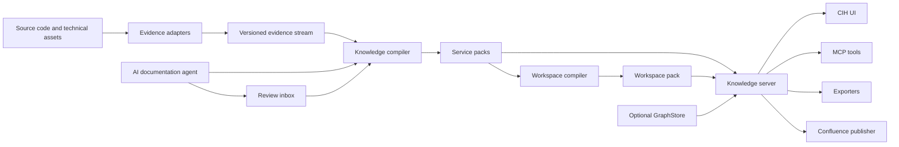

# CIH Universal Knowledge and Documentation System

Status: Proposed

Date: 2026-07-19

Target: Replace the current hardcoded wiki generation and Docusaurus viewer with a
versioned, scalable knowledge system for source code and technical assets.

## 1. Executive Summary

CIH currently turns analyzed code into a large collection of generated Markdown
pages. The generation structure, page types, navigation, and rendering are tightly
coupled. This becomes difficult to change and expensive to build, serve, search, and
display when a repository contains hundreds of thousands of graph nodes or when a
workspace contains many services.

The replacement must not treat source files or Markdown files as the primary
documentation model. It must treat documentation as a set of stable knowledge
objects, typed relations, evidence-backed content blocks, and role-specific views.
The UI, MCP server, static exporter, and optional Confluence publisher must all read
from that same model.

The resulting system will:

- Work with monoliths, microservices, libraries, data pipelines, infrastructure,
  and mixed-language workspaces.
- Organize knowledge by business domain, capability, process, system, service,
  quality, and technical evidence rather than by source directory.
- Provide PO, BA, Tester, and Dev views over the same facts without generating four
  independent documentation trees.
- Keep source files, classes, methods, and graph nodes searchable without placing
  hundreds of thousands of items in primary navigation.
- Build from versioned `GraphArtifacts` streams without requiring FalkorDB,
  LadybugDB, or another live `GraphStore`.
- Use AI to classify changes, find the correct documentation location, and generate
  typed changes with evidence, confidence, validation, review, and idempotency.
- Serve large workspaces with bounded memory, lazy section loading, server-side
  search, paginated relations, virtualized lists, and bounded graph projections.
- Continue to work without AI, embeddings, Confluence, or network access.

The system is a knowledge compiler and knowledge server. It is not another static
site generator.

## 2. Current State and Problems

### 2.1 Current pipeline

The current documentation flow is approximately:

```text
source code
  -> cih analyze
  -> GraphArtifacts
  -> cih discover / feature grouping
  -> cih wiki
  -> hardcoded Markdown pages and manifest
  -> Docusaurus build
  -> browser
```

`cih-wiki` currently defines page subjects such as system index, route index,
feature PO page, feature BA page, developer class page, controller page, API flow
page, scheduled flow, listener flow, and community pages. A `PageIndex` enumerates
those page types and slugs. Adding a new concept often requires changes to page
enumeration, render context, Markdown rendering, manifest generation, sidebar
generation, search indexing, and Docusaurus behavior.

The resident serving path improves per-page latency but retains a complete node and
edge graph and constructs additional `WikiGraph`, render-context, page-index, page
body, and search structures. Multiple repositories can multiply that memory.

### 2.2 Information architecture problems

- Source and generated page structure leak into user navigation.
- Package and graph communities are useful evidence but are not reliable business
  domains or capabilities.
- A strict source tree cannot represent cross-service business processes.
- PO, BA, Tester, and Dev need different levels of detail, but duplicated role pages
  cause drift and repeated generation.
- Tester documentation is not a first-class view in the current page taxonomy.
- Large class, method, API, or community collections produce unusable sidebars.
- One entity may belong to multiple capabilities, processes, or services, which a
  simple folder tree cannot represent.

### 2.3 Scale problems

- Full `Vec<Node>` and `Vec<Edge>` loading increases peak memory.
- Derived maps clone identifiers and node values.
- Rendering every page up front produces work that most users never request.
- Static site generation and local client-side indexing scale with page count.
- A browser cannot safely render or search hundreds of thousands of navigation
  entries or graph nodes.
- Unbounded per-repository caches grow with the number of services.
- Rebuilding whole documents for a small code change prevents efficient incremental
  refresh.

### 2.4 AI generation problems

Current LLM enrichment generates prose for predefined page locations. It does not
own a stable knowledge model, cannot reliably decide where a new feature belongs,
and has no typed change set, placement confidence, conflict policy, or review
workflow.

An instruction such as "document the new refund APIs" must not result in an AI
editing arbitrary Markdown paths. It must result in a bounded, evidence-backed,
validated update to known knowledge objects.

## 3. Goals

### 3.1 Product goals

1. Make documentation useful to PO, BA, Tester, and Dev users.
2. Make business capabilities and cross-service processes the primary navigation.
3. Keep service and source-code navigation available as a technical facet.
4. Let users search from business language to implementation evidence.
5. Let AI place and update documentation from natural-language instructions.
6. Preserve human ownership, provenance, review, and audit history.
7. Support CIH's current language providers and future evidence adapters.
8. Operate locally and offline when optional AI and semantic features are disabled.
9. Export curated Markdown and static HTML from the same knowledge model.
10. Integrate with Confluence without making Confluence the source of truth.

### 3.2 Scale goals

The design target is:

- 500,000 graph nodes and 5,000,000 graph edges per service.
- 20 services in one workspace.
- 10,000,000 total graph nodes across a maximum-scale workspace.
- Thousands of high-level knowledge objects and millions of technical evidence
  records without millions of rendered pages.
- Full service-pack build in 10 minutes or less on the agreed benchmark host.
- Full service-pack build below 1 GiB peak RSS.
- No-change index check in 2 seconds or less.
- A change affecting 1 percent of evidence reindexed in 60 seconds or less.
- Warm object retrieval p95 below 200 ms.
- Workspace navigation p95 below 100 ms.
- Workspace search p95 below 500 ms.
- Documentation subsystem RSS below 512 MiB, excluding explicitly loaded embedding
  models and live graph backends.

### 3.3 Quality goals

- Every generated claim can point to evidence or be explicitly marked inferred.
- Human and pinned content is never silently overwritten.
- Re-running the same operation against the same inputs is idempotent.
- A partial or failed build never replaces the active document generation.
- Unsupported analysis is visible as unknown coverage, not reported as absence.
- Legacy wiki slugs continue to resolve during migration.

## 4. Non-goals for the First Release

- A full Confluence-style collaborative rich-text editor.
- Real-time multi-user coauthoring.
- Enterprise RBAC beyond the existing authenticated server boundary.
- Full bidirectional Confluence body synchronization.
- Rendering the complete code graph in the browser.
- Creating a persisted document page for every source symbol.
- Treating AI output as authoritative without evidence and validation.
- Guaranteeing deep semantic extraction for every programming language or framework
  immediately. Unsupported inputs remain importable at file/module level.

## 5. Design Principles

1. Knowledge objects, not files, are the primary model.
2. Documents are views, not persisted rendered pages.
3. Business hierarchy is primary; service hierarchy is a technical facet.
4. One object has one primary parent and many typed relations.
5. Role views share facts and differ in ordering, depth, and presentation.
6. Evidence and provenance are part of every generated claim.
7. Deterministic analysis runs before semantic or LLM classification.
8. AI proposes typed operations; it does not directly edit storage or Markdown.
9. High-confidence generated-content changes may be automatic; taxonomy mutations
   require review.
10. Primary navigation remains small even when technical evidence is large.
11. Search, rendering, graph expansion, and caches are bounded by default.
12. Graph databases are optional runtime collaborators, not documentation sources.
13. All generated formats use the same model and renderer contracts.
14. Unknown and ambiguous are valid states.

## 6. Terminology

| Term | Meaning |
| --- | --- |
| Evidence | A source-backed fact from code, tests, APIs, schemas, config, or another adapter. |
| Knowledge object | A stable entity such as a capability, process, service, API, or scenario. |
| Knowledge block | A typed section fragment belonging to a knowledge object. |
| Document view | A role-filtered, ordered projection of an object and its blocks. |
| Service pack | A versioned SQLite projection for one repository or deployable service. |
| Workspace pack | A compact cross-service taxonomy, catalog, relation, and search projection. |
| Placement | Assignment of evidence or an object to a primary parent or related capability. |
| Change envelope | Bounded evidence describing a requested or detected code change. |
| Change set | Validated object, relation, block, placement, and review operations. |
| Overlay | Repository-owned human content attached to an object or section. |
| Generation | An immutable, successfully published pack version. |

## 7. Target Architecture



### 7.1 Crate boundaries

#### `cih-knowledge`

Foundation-level, backend-independent types and ports:

- `KnowledgeKey`
- `KnowledgeKind`
- `RelationKind`
- `KnowledgeObject`
- `KnowledgeRelation`
- `KnowledgeBlock`
- `EvidenceRef`
- `DocumentView`
- `ChangeEnvelope`
- `DocumentationChangeSet`
- `PlacementCandidate`
- `PlacementDecision`
- `ReviewItem`
- `KnowledgeStore`
- `KnowledgeSearch`
- `EvidenceAdapter`
- `KnowledgeProjector`
- `PlacementEngine`
- `RoleViewAssembler`
- `KnowledgePublisher`

It may depend on `cih-core`, serialization, hashing, and small utility crates. It
must not depend on SQLite, graph backends, HTTP, MCP, UI, LLM providers, or the
engine.

#### `cih-doc-store`

Storage-layer implementations:

- SQLite schema and migrations.
- Service-pack and workspace-pack readers and writers.
- FTS5 indexing and queries.
- Local vector-index mapping and USearch sidecar.
- Atomic generation publishing.
- Read-only pack pooling and LRU management.
- Integrity validation, diagnostics, and repair/rebuild decisions.

#### `cih-docs`

Product and orchestration logic:

- Artifact-backed evidence adapter.
- Technical-asset adapters.
- Knowledge compiler and projectors.
- Taxonomy and placement rules.
- Incremental projection.
- Role-view assembly.
- Overlay parsing and precedence.
- AI documentation workflow.
- Markdown and HTML export.
- Confluence publication mapping.
- Legacy wiki migration and slug adapters.

#### `cih-llm`

Extract the existing generic LLM provider code from `cih-engine` so both the CLI
and server can use the same:

- Provider enum and configuration.
- OpenAI-compatible, Anthropic, Bedrock, DeepSeek, Gemini, and custom HTTP adapters.
- API-key resolution.
- Retry, timeout, and concurrency handling.
- Base-URL validation.
- Dry-run and evidence-debug modes.
- Structured JSON response validation.

#### Existing crates

- `cih-engine` owns CLI orchestration and pack-building commands.
- `cih-server` owns HTTP, MCP, authentication, jobs, and runtime composition.
- `cih-search` supplies reciprocal-rank fusion and common ranking types.
- `cih-embed` supplies embedding models and the existing pgvector adapter.
- `cih-grouping` remains a source of classification signals during migration.
- `cih-wiki` remains a compatibility adapter until migration completes.
- `GraphStore` remains the port for interactive graph analysis only.

### 7.2 Dependency direction

```text
cih-core --------------------+
cih-knowledge ---------------+--> cih-doc-store
      |                      |
      +----------------------+--> cih-docs
cih-search / cih-embed ------+
cih-llm ---------------------+
                                 |
                                 +--> cih-engine
                                 +--> cih-server
```

The workspace layering check must include the new crates and reject reverse
dependencies.

## 8. Universal Evidence Layer

### 8.1 Why an evidence layer is required

CIH's current graph schema is optimized for source analysis. A universal
documentation system also needs facts from OpenAPI, AsyncAPI, GraphQL, test
frameworks, database migrations, deployment manifests, infrastructure, repository
documents, and future external systems.

The knowledge model must not require every source to become a new `NodeKind`.
Adapters emit normalized evidence records that projectors can map into core or
namespaced knowledge kinds.

### 8.2 Evidence adapter interface

Conceptual Rust interface:

```rust
pub trait EvidenceAdapter: Send + Sync {
    fn namespace(&self) -> &'static str;
    fn schema_version(&self) -> u32;
    fn discover(&self, context: &EvidenceContext) -> Result<Vec<EvidenceInput>>;
    fn fingerprint(&self, input: &EvidenceInput) -> Result<ContentHash>;
    fn extract(
        &self,
        input: &EvidenceInput,
        sink: &mut dyn EvidenceSink,
    ) -> Result<ExtractionReport>;
}
```

`ExtractionReport` includes:

- Adapter and schema version.
- Inputs examined.
- Objects and relations emitted.
- Unsupported constructs.
- Parse failures.
- Coverage measurements.
- Diagnostics and severity.
- Duration and peak batch size.

### 8.3 First-party adapters

The first release will provide:

1. `GraphArtifactsAdapter`
   - Streams `nodes.jsonl` and `edges.jsonl`.
   - Reads graph and community versions.
   - Emits code entities, APIs, events, processes, data access, tests, and source
     evidence.
   - Never calls `read_nodes` or `read_edges` for a full in-memory copy.
2. `RepositoryDocsAdapter`
   - Reads selected Markdown and text documentation.
   - Respects ignore rules, size limits, and explicit include patterns.
   - Marks repository documents as Human or External, not Observed code behavior.
3. `OpenApiAdapter`
   - Imports operations, schemas, parameters, responses, security, and tags.
4. `AsyncApiAdapter`
   - Imports channels, messages, producers, consumers, and schemas.
5. `GraphQlAdapter`
   - Imports operations, object types, inputs, and resolvers when available.
6. `DatabaseSchemaAdapter`
   - Imports SQL migrations, tables, columns, constraints, and migration order.
7. `ConfigurationAdapter`
   - Imports application configuration keys and environment-variable references
     without persisting secret values.
8. `ContainerAdapter`
   - Imports Dockerfiles and Compose services, ports, dependencies, and volumes.
9. `KubernetesAdapter`
   - Imports workloads, services, ingress, configuration references, and ownership.
10. `TerraformAdapter`
    - Imports modules, resources, data sources, and dependencies.

Tests already represented by graph `TESTS` edges are projected by the artifact
adapter. Framework-specific scenario or fixture extraction can be added as
namespaced adapters.

### 8.4 External adapter bundle

To support systems without recompiling CIH, define a versioned import format:

```text
evidence-bundle/
  manifest.json
  objects.jsonl
  relations.jsonl
  evidence.jsonl
  diagnostics.jsonl
```

`manifest.json` contains:

```json
{
  "format": "cih-evidence",
  "schema": 1,
  "adapter": "vendor:platform",
  "adapter_version": "1.0.0",
  "source_id": "repository-or-system-id",
  "source_version": "immutable-version",
  "generated_at": "RFC3339 timestamp"
}
```

External kinds and relation kinds must use the adapter namespace. Imports are
schema-validated, size-bounded, and treated as untrusted input.

### 8.5 Coverage semantics

Coverage must distinguish:

- Supported and found.
- Supported and not found.
- Partially supported.
- Unsupported.
- Adapter failed.
- Source omitted by configuration.

The UI and AI must not convert unsupported or failed extraction into claims such as
"this service has no tests" or "this repository has no APIs."

## 9. Knowledge Ontology

### 9.1 Extensible identifiers

`KnowledgeKind` and `RelationKind` are validated strings rather than closed Rust
enums.

Examples:

```text
core:workspace
core:domain
core:capability
core:process
core:service
core:api
core:test-case
kafka:consumer
terraform:resource
```

Validation rules:

- Lowercase ASCII.
- Exactly one namespace separator.
- Namespace and local name use letters, digits, and hyphens.
- `core:` is reserved.
- Unknown namespaced kinds are preserved and displayed through generic renderers.

### 9.2 Stable keys

Canonical form:

```text
cih://<workspace-id>/<scope-id>/<kind>/<stable-id>
```

Examples:

```text
cih://banking/business/core:capability/payment-refunds
cih://banking/payment-service/core:api/post-payments-id-refund
cih://banking/payment-service/core:service/payment-service
```

Rules:

- Keys never include display titles.
- Human-configured objects use configured IDs.
- Generated objects use deterministic hashes of durable evidence anchors.
- Renames create aliases and update titles without changing keys.
- Merges preserve old keys as aliases to the selected target.
- Splits require reviewed mappings because one old key cannot deterministically
  identify multiple new objects.

### 9.3 Core object kinds

| Kind | Purpose | Typical evidence |
| --- | --- | --- |
| Workspace | Top-level multi-repository context | CIH group registry |
| Domain | Business bounded context | Human taxonomy, capability clustering |
| Capability | Business ability provided by the system | Routes, processes, events, requirements |
| UseCase | Actor goal and outcome | Process traces, requirements, tests |
| Process | Ordered cross-component or cross-service behavior | Entrypoints and graph flow |
| BusinessRule | Constraint, validation, decision, or policy | Branches, validation code, requirements |
| System | Independently understood software system | Workspace configuration |
| Service | Deployable or independently operated unit | Repository, Compose, Kubernetes |
| Component | Cohesive technical implementation unit | Modules, communities, packages |
| Interface | Generic boundary or contract | APIs, events, CLI, files |
| API | Callable operation or endpoint | Routes, OpenAPI, GraphQL |
| Event | Published or consumed message | Kafka, AsyncAPI, framework events |
| Job | Scheduled or asynchronous entrypoint | Schedulers, workers, listeners |
| DataAsset | Table, schema, queue, file, or durable store | SQL and schemas |
| DeploymentUnit | Runtime packaging or workload | Containers, Kubernetes, Terraform |
| Scenario | Testable behavior and expected outcome | Requirements, flow branches, tests |
| TestCase | Existing executable test | Test nodes and framework adapters |
| Requirement | Intended behavior from a human/external source | Overlays or Confluence |
| Decision | Architectural or product decision | ADRs and overlays |
| Risk | Quality, security, operational, or change risk | Analysis and human input |
| CodeEntity | Class, method, function, field, or language-level definition | Graph nodes |
| SourceFile | Source or technical asset | Repository scan |

### 9.4 Core relation kinds

Core relations include:

```text
core:contains
core:implements
core:participates-in
core:depends-on
core:invokes
core:exposes
core:publishes
core:consumes
core:reads
core:writes
core:tests
core:covers
core:validates
core:evidence-for
core:derived-from
core:references
core:conflicts-with
core:replaces
core:owned-by
core:deployed-as
core:affects
```

Every relation has:

- Stable relation ID.
- Source and target key.
- Kind.
- Authority.
- Truth status.
- Confidence.
- Evidence references.
- Source adapter.
- Content hash.
- Created, updated, and deleted generations.

### 9.5 Knowledge object

Conceptual structure:

```rust
pub struct KnowledgeObject {
    pub key: KnowledgeKey,
    pub kind: KnowledgeKind,
    pub title: String,
    pub summary: Option<String>,
    pub primary_parent: Option<KnowledgeKey>,
    pub facets: BTreeMap<String, Vec<String>>,
    pub lifecycle: Lifecycle,
    pub authority: Authority,
    pub truth: TruthStatus,
    pub confidence: f32,
    pub content_hash: ContentHash,
    pub first_seen: GenerationId,
    pub last_seen: GenerationId,
}
```

`Lifecycle` values:

- Active
- Proposed
- Deprecated
- Deleted
- Merged

### 9.6 Knowledge blocks

A document is assembled from blocks. A block is the smallest independently
fingerprinted, generated, reviewed, searched, cached, and rendered unit.

```rust
pub struct KnowledgeBlock {
    pub id: BlockId,
    pub object: KnowledgeKey,
    pub section: SectionId,
    pub ordinal: i32,
    pub audiences: BTreeSet<Audience>,
    pub payload: BlockPayload,
    pub authority: Authority,
    pub truth: TruthStatus,
    pub confidence: f32,
    pub evidence: Vec<EvidenceRef>,
    pub content_hash: ContentHash,
    pub generator: Option<GeneratorInfo>,
}
```

Supported `BlockPayload` values:

| Payload | Purpose |
| --- | --- |
| RichText | CommonMark prose without raw HTML |
| Properties | Key/value facts |
| RelationList | Paginated typed links |
| Flow | Ordered or branching process model |
| ScenarioMatrix | Preconditions, actions, expected results, and coverage |
| EvidenceList | Source-backed references |
| CodeExcerpt | Bounded source excerpt with location |
| Metric | Count, percentage, trend, confidence, or quality value |
| Table | Typed columns and paginated rows |
| Callout | Warning, gap, conflict, decision, or stale-content notice |

Large relation lists and evidence lists store query descriptors rather than all rows
inside the block payload.

### 9.7 Truth and authority

Truth states:

- Observed: directly supported by current evidence.
- Inferred: produced by deterministic analysis or AI interpretation.
- Intended: requirement or human statement about desired behavior.
- Conflicting: evidence and intended behavior disagree.
- Stale: supporting evidence changed or disappeared.

Authority order:

```text
Pinned > Human > External > AI > Generated
```

Higher authority does not automatically delete lower-authority content. It controls
replacement and conflict behavior:

- Generated content may replace matching Generated blocks.
- AI content may replace matching AI blocks when the base hash matches.
- Human and Pinned blocks cannot be replaced automatically.
- External and Observed claims may coexist and be marked Conflicting.
- A block replacement must preserve comments and history.

## 10. Information Architecture

### 10.1 Canonical navigation

```text
Workspace
|-- Business
|   `-- Domain
|       `-- Capability
|           |-- Use cases
|           |-- Processes
|           `-- Business rules
|-- Cross-system processes
|-- Systems
|   `-- Service
|       |-- Components
|       |-- Interfaces
|       |   |-- APIs
|       |   |-- Events
|       |   `-- Jobs
|       |-- Data
|       `-- Deployments
|-- Quality
|   |-- Scenarios
|   |-- Test coverage
|   |-- Regression scope
|   `-- Risks and gaps
|-- Glossary
|-- Recent changes
`-- Documentation inbox
```

### 10.2 Primary parent and relations

Every object has at most one primary parent. This guarantees:

- Stable breadcrumbs.
- One canonical URL.
- No duplicate tree entries.
- Predictable exports.
- Deterministic move behavior.

Objects may have any number of secondary relations. For example:

```text
Payment Refunds capability
  implemented-by -> payment-service
  implemented-by -> ledger-service
  participates-in -> Merchant Refund process
  exposes -> POST /payments/{id}/refund
  publishes -> RefundRequested
  writes -> REFUND table
  covered-by -> RefundIntegrationTest
```

### 10.3 Role modes

Role mode never creates a second object. It changes:

- Home dashboard.
- Navigation ordering.
- Section ordering.
- Default relation filters.
- Search ranking.
- Terminology and display depth.
- Suggested actions.

The same capability key remains addressable for every role.

### 10.4 PO view

Default sections:

1. Purpose and business outcome.
2. Users and stakeholders.
3. Capability status.
4. Supported use cases.
5. Business dependencies.
6. Cross-service impact.
7. Recent changes.
8. Quality and risk summary.
9. Intended-versus-observed gaps.

Technical evidence is collapsed by default.

### 10.5 BA view

Default sections:

1. Actors and triggers.
2. Preconditions.
3. Main workflow.
4. Alternate and failure flows.
5. Business rules and validations.
6. Inputs and outputs.
7. Data and event contracts.
8. External dependencies.
9. Open questions and conflicts.
10. Evidence traceability.

### 10.6 Tester view

Default sections:

1. Testable scenarios.
2. Preconditions and fixtures.
3. Expected outcomes.
4. Branch and exception matrix.
5. Existing tests.
6. Uncovered behavior.
7. Regression scope.
8. Changed APIs, events, and data.
9. Risk-ranked test recommendations.
10. Source evidence.

Generated scenarios describe observed paths unless linked to Intended requirements.
They must not be presented as approved acceptance criteria without human authority.

### 10.7 Dev view

Default sections:

1. Technical overview.
2. Components and ownership.
3. API, event, job, and data interfaces.
4. Execution and call flows.
5. Dependencies and cross-service contracts.
6. Persistence behavior.
7. Tests and quality signals.
8. Complexity and risk.
9. Source symbols.
10. Evidence and history.

### 10.8 Navigation constraints

- SourceFile and CodeEntity objects are excluded from primary navigation.
- Navigation endpoints return 100 children by default and 500 maximum.
- Large child sets become searchable collections instead of expanded tree nodes.
- The UI displays counts without preloading children.
- Unclassified objects remain visible in a dedicated inbox.
- Empty generated categories are omitted.

## 11. Configuration and Human Overrides

### 11.1 Configuration locations

Default workspace configuration:

```text
~/.cih/groups/<group>/docs.toml
```

`cih docs init --group <group> --config <path>` may record a source-controlled
configuration path in group metadata.

Per-repository configuration:

```text
<repo>/cih.docs.toml
```

Repository-owned overlays:

```text
<repo>/cih-docs/**/*.md
```

### 11.2 Workspace configuration

Example:

```toml
schema = 1

[workspace]
id = "banking"
title = "Banking Platform"
canonical_language = "en"
default_role = "dev"

[ai]
mode = "auto_high_confidence"
auto_apply_threshold = 0.90
review_threshold = 0.65
allow_taxonomy_mutation = false
max_candidates = 20
max_llm_candidates = 8

[search]
semantic = true
semantic_backend = "local"
embedding_model = "all-minilm-l6-v2"

[[domains]]
id = "payments"
title = "Payments"

[[capabilities]]
id = "payment-refunds"
domain = "payments"
title = "Payment Refunds"
aliases = ["refund", "reverse payment"]

[[mappings]]
target = "payment-refunds"
repo = "payment-service"
route = "/payments/{*}/refund"

[[mappings]]
target = "payment-refunds"
event = "RefundRequested"

[publish.confluence]
enabled = false
site_url = "https://example.atlassian.net"
space_key = "PAY"
root_page_id = "123456"
kinds = ["core:domain", "core:capability", "core:process", "core:service"]
```

### 11.3 Mapping matchers

Mapping rules may match:

- Repository or service.
- File path glob.
- Package or module prefix.
- Object or graph-node kind.
- Route method and path.
- Event or topic.
- Database table.
- Process or entrypoint.
- Source symbol ID.
- Existing tag or facet.

Rules may assign:

- Primary domain.
- Primary capability.
- Related capabilities.
- Service ownership.
- Exclusion.
- Alias.
- Display title.
- Pinned status.

### 11.4 Precedence

Placement precedence:

1. Pinned human placement.
2. Exact configuration mapping.
3. Reviewed prior placement.
4. Existing stable placement with unchanged evidence.
5. Deterministic classifier.
6. AI high-confidence classifier.
7. Review inbox.
8. Unclassified.

Content precedence:

1. Pinned overlay block.
2. Human overlay block.
3. External requirement block.
4. AI block.
5. Deterministic generated block.

### 11.5 Overlay format

Example:

```markdown
---
schema: 1
object: cih://banking/business/core:capability/payment-refunds
section: business-rules
mode: append
authority: human
block_id: human-refund-settlement-rule
audiences: [po, ba, tester, dev]
---

Refund settlement must complete before the daily ledger close.
```

Allowed modes:

- `before`
- `after`
- `append`
- `replace-generated`

`replace-generated` replaces only the matching generated block ID. It cannot delete
another human or external block.

Raw HTML, MDX imports, executable expressions, and scripts are rejected.

## 12. Storage Design

### 12.1 Pack layout

Service pack:

```text
<repo>/.cih/docs/v1/
  current.json
  <generation>/
    manifest.json
    service.sqlite
    vectors.usearch
    diagnostics.jsonl
```

Workspace pack:

```text
~/.cih/groups/<group>/docs/v1/
  current.json
  <generation>/
    manifest.json
    workspace.sqlite
    vectors.usearch
    diagnostics.jsonl
```

`vectors.usearch` is omitted when semantic search is disabled.

### 12.2 Manifest

```json
{
  "format": "cih-knowledge-pack",
  "schema": 1,
  "scope": "service",
  "workspace": "banking",
  "service": "payment-service",
  "generation": "blake3-value",
  "graph_version": "graph-version",
  "taxonomy_version": "taxonomy-hash",
  "overlay_version": "overlay-hash",
  "generator_version": "cih-version",
  "embedding_model": "all-minilm-l6-v2",
  "created_at": "RFC3339 timestamp",
  "counts": {
    "objects": 0,
    "relations": 0,
    "blocks": 0,
    "evidence": 0
  },
  "checksums": {
    "service.sqlite": "blake3-value",
    "vectors.usearch": "blake3-value"
  }
}
```

### 12.3 SQLite schema

The exact migration files are versioned, but the logical schema is:

```sql
CREATE TABLE meta (
  key TEXT PRIMARY KEY,
  value TEXT NOT NULL
);

CREATE TABLE objects (
  key TEXT PRIMARY KEY,
  kind TEXT NOT NULL,
  title TEXT NOT NULL,
  summary TEXT,
  primary_parent TEXT,
  lifecycle TEXT NOT NULL,
  authority TEXT NOT NULL,
  truth_status TEXT NOT NULL,
  confidence REAL NOT NULL,
  content_hash BLOB NOT NULL,
  first_seen TEXT NOT NULL,
  last_seen TEXT NOT NULL,
  deleted_generation TEXT
);

CREATE TABLE object_facets (
  object_key TEXT NOT NULL,
  facet TEXT NOT NULL,
  value TEXT NOT NULL,
  PRIMARY KEY (object_key, facet, value)
);

CREATE TABLE relations (
  id TEXT PRIMARY KEY,
  source_key TEXT NOT NULL,
  target_key TEXT NOT NULL,
  kind TEXT NOT NULL,
  authority TEXT NOT NULL,
  truth_status TEXT NOT NULL,
  confidence REAL NOT NULL,
  content_hash BLOB NOT NULL,
  first_seen TEXT NOT NULL,
  last_seen TEXT NOT NULL,
  deleted_generation TEXT
);

CREATE TABLE blocks (
  id TEXT PRIMARY KEY,
  object_key TEXT NOT NULL,
  section TEXT NOT NULL,
  ordinal INTEGER NOT NULL,
  audiences_json TEXT NOT NULL,
  block_type TEXT NOT NULL,
  payload_json TEXT NOT NULL,
  authority TEXT NOT NULL,
  truth_status TEXT NOT NULL,
  confidence REAL NOT NULL,
  content_hash BLOB NOT NULL,
  generator_json TEXT,
  first_seen TEXT NOT NULL,
  last_seen TEXT NOT NULL,
  deleted_generation TEXT
);

CREATE TABLE evidence (
  id TEXT PRIMARY KEY,
  repo TEXT NOT NULL,
  source_version TEXT NOT NULL,
  graph_node_id TEXT,
  file TEXT,
  start_line INTEGER,
  start_col INTEGER,
  end_line INTEGER,
  end_col INTEGER,
  adapter TEXT NOT NULL,
  confidence REAL NOT NULL,
  snippet_hash BLOB,
  metadata_json TEXT NOT NULL
);

CREATE TABLE block_evidence (
  block_id TEXT NOT NULL,
  evidence_id TEXT NOT NULL,
  claim_id TEXT,
  PRIMARY KEY (block_id, evidence_id, claim_id)
);

CREATE TABLE relation_evidence (
  relation_id TEXT NOT NULL,
  evidence_id TEXT NOT NULL,
  PRIMARY KEY (relation_id, evidence_id)
);

CREATE TABLE aliases (
  alias TEXT PRIMARY KEY,
  object_key TEXT NOT NULL,
  alias_kind TEXT NOT NULL
);

CREATE TABLE comments (
  id TEXT PRIMARY KEY,
  object_key TEXT NOT NULL,
  block_id TEXT,
  author TEXT,
  body TEXT NOT NULL,
  state TEXT NOT NULL,
  created_at TEXT NOT NULL,
  resolved_at TEXT
);

CREATE TABLE change_sets (
  id TEXT PRIMARY KEY,
  idempotency_key TEXT NOT NULL UNIQUE,
  base_generation TEXT NOT NULL,
  status TEXT NOT NULL,
  instruction TEXT,
  metadata_json TEXT NOT NULL,
  created_at TEXT NOT NULL,
  applied_at TEXT
);

CREATE TABLE change_operations (
  change_set_id TEXT NOT NULL,
  ordinal INTEGER NOT NULL,
  operation_type TEXT NOT NULL,
  payload_json TEXT NOT NULL,
  PRIMARY KEY (change_set_id, ordinal)
);

CREATE TABLE reviews (
  id TEXT PRIMARY KEY,
  change_set_id TEXT NOT NULL,
  review_type TEXT NOT NULL,
  status TEXT NOT NULL,
  payload_json TEXT NOT NULL,
  created_at TEXT NOT NULL,
  resolved_at TEXT,
  resolution_json TEXT
);

CREATE TABLE projection_state (
  projector TEXT NOT NULL,
  input_key TEXT NOT NULL,
  input_hash BLOB NOT NULL,
  output_hash BLOB NOT NULL,
  generation TEXT NOT NULL,
  PRIMARY KEY (projector, input_key)
);

CREATE TABLE legacy_slugs (
  slug TEXT PRIMARY KEY,
  object_key TEXT NOT NULL,
  preferred_role TEXT
);

CREATE TABLE vector_keys (
  vector_id INTEGER PRIMARY KEY,
  object_key TEXT NOT NULL,
  block_id TEXT,
  model TEXT NOT NULL,
  content_hash BLOB NOT NULL
);
```

Additional publication tables:

```sql
CREATE TABLE publication_targets (
  id TEXT PRIMARY KEY,
  kind TEXT NOT NULL,
  config_hash BLOB NOT NULL,
  metadata_json TEXT NOT NULL
);

CREATE TABLE publication_items (
  target_id TEXT NOT NULL,
  object_key TEXT NOT NULL,
  remote_id TEXT NOT NULL,
  remote_version TEXT,
  published_hash BLOB NOT NULL,
  published_generation TEXT NOT NULL,
  status TEXT NOT NULL,
  last_error TEXT,
  PRIMARY KEY (target_id, object_key)
);
```

### 12.4 FTS schema

Use contentless FTS5 tables maintained in the same transaction as source rows:

```sql
CREATE VIRTUAL TABLE search_fts USING fts5(
  result_key UNINDEXED,
  object_key UNINDEXED,
  block_id UNINDEXED,
  kind UNINDEXED,
  title,
  aliases,
  summary,
  body,
  evidence_terms,
  tokenize = 'unicode61 remove_diacritics 2'
);
```

The search document for a technical entity contains names, qualified names, route
paths, event names, tables, signatures, and bounded doc comments. It does not store
full source bodies by default.

### 12.5 Indexes and constraints

Required indexes:

- `objects(primary_parent, kind, lifecycle)`
- `relations(source_key, kind, deleted_generation)`
- `relations(target_key, kind, deleted_generation)`
- `blocks(object_key, section, ordinal)`
- `evidence(repo, source_version, graph_node_id)`
- `block_evidence(evidence_id)`
- `reviews(status, created_at)`
- `publication_items(status)`

Foreign keys are enforced inside a pack. Workspace-to-service references use stable
keys rather than cross-database foreign keys.

### 12.6 Vector index

The local semantic feature uses a USearch HNSW sidecar:

- Cosine distance.
- Stable `u64` vector IDs mapped by `vector_keys`.
- Memory-mapped read-only serving.
- Atomic replacement with the containing generation.
- No in-place mutation of an active index.
- Default embedding model: `all-MiniLM-L6-v2`.
- Only titles, summaries, and bounded knowledge blocks are embedded by default.
- Source symbols are embedded only when explicitly enabled.

The feature is optional:

- `local-semantic`: local embedding plus USearch.
- `pgvector-semantic`: existing `cih-embed` storage.
- No semantic feature: FTS plus graph/context ranking remains complete.

The standalone no-model build must not include ONNX/ORT or native vector
dependencies.

### 12.7 Generation and atomicity

Build sequence:

1. Resolve immutable input versions.
2. Create a new staging generation directory.
3. Build SQLite with WAL disabled for the final read-only artifact.
4. Build optional vector sidecar.
5. Run integrity, schema, referential, count, and checksum validation.
6. Write `manifest.json`.
7. Fsync files and generation directory where supported.
8. Atomically replace `current.json` using temporary-file rename.
9. Leave the previous generation available for rollback.
10. Prune old generations only after retention policy permits it.

Readers open the generation named by one snapshot of `current.json`. They never
follow a moving file during a request.

### 12.8 Runtime pack manager

The server maintains:

- One open workspace pack.
- At most four active service-pack handles by default.
- LRU eviction by last completed request.
- A 128 MiB block/view cache by default.
- Bounded per-pack SQLite cache configuration.
- Memory-mapped vector files rather than resident vector copies.
- Single-flight pack opening to avoid duplicate initialization.
- Generation-aware cache keys.

Eviction never interrupts an active request; pack handles are reference counted.

## 13. Knowledge Compilation

### 13.1 Full service build

Pass 1: metadata and nodes

- Read the repository registry entry.
- Resolve the exact `GraphArtifacts` version.
- Stream nodes.
- Insert lightweight technical objects and evidence in transaction batches.
- Record route, event, table, process, test, ownership, package, module, and source
  signals needed by projectors.

Pass 2: edges

- Stream graph edges.
- Insert normalized technical relations.
- Accumulate only bounded high-level statistics in memory.
- Write large relation sets directly to temporary SQLite tables.

Pass 3: technical assets

- Run configured evidence adapters.
- Reuse unchanged adapter outputs by input fingerprint.
- Record coverage and diagnostics.

Pass 4: deterministic projection

- Build Service, Component, Interface, API, Event, Job, DataAsset, DeploymentUnit,
  TestCase, and Process objects.
- Materialize summary facts and role-neutral blocks.
- Create evidence-backed relations.

Pass 5: classification

- Apply pinned and exact mappings.
- Reuse stable reviewed placement.
- Score deterministic capability candidates.
- Queue unresolved or ambiguous placement.

Pass 6: content

- Build deterministic blocks.
- Merge overlays according to authority and mode.
- Mark stale or conflicting blocks.

Pass 7: search

- Populate FTS rows.
- Generate changed embeddings only.
- Build the immutable vector index.

Pass 8: validation and publish

- Validate and atomically activate the generation.

No pass constructs a complete `WikiGraph` or renders every possible document.

### 13.2 Workspace build

The workspace compiler reads service manifests and compact service summaries, not
all raw graph evidence.

It builds:

- Workspace, System, Domain, and Capability objects.
- Cross-service processes.
- Service membership and ownership.
- Cross-service API and event contracts.
- Capability implementation relations.
- Workspace quality and risk summaries.
- Workspace FTS and semantic indexes.
- Navigation counts and recent-change feeds.

When deep evidence is requested, the server opens the relevant service pack.

### 13.3 Incremental build

Inputs are fingerprinted by adapter and projector.

Incremental logic:

1. Compare active manifest inputs to current inputs.
2. Exit successfully with `unchanged` when all fingerprints match.
3. Stream new artifacts and compare technical object hashes.
4. Create Added, Changed, Deleted, and Renamed evidence sets.
5. Find projectors dependent on those evidence keys.
6. Rebuild only affected objects, relations, and blocks.
7. Rebuild FTS rows and embeddings only for changed blocks.
8. Recalculate workspace objects only for changed service summaries.
9. Publish a complete immutable generation.

The output remains a complete generation even when the work was incremental.

### 13.4 Rename and deletion

Rename detection uses:

- Stable graph IDs where available.
- Git rename information.
- Content fingerprints.
- Same-kind structural similarity.
- Reviewed aliases.

Deletion behavior:

- Missing generated evidence becomes a tombstone.
- Dependent blocks become Stale in the first generation.
- Removal occurs only after retention policy or explicit cleanup.
- Human overlays remain and show a missing-evidence warning.
- Legacy slugs continue to resolve to deprecated or replacement objects.

## 14. Classification and Placement

### 14.1 Replacing `FeatureStrategy`

Current feature grouping produces one feature slug per node. The new classifier
produces typed, many-to-many placement evidence:

```rust
pub struct Classification {
    pub subject: KnowledgeKey,
    pub relation: RelationKind,
    pub target: KnowledgeKey,
    pub score: f32,
    pub signals: Vec<PlacementSignal>,
    pub authority: Authority,
}
```

A code entity may:

- Belong to one primary component.
- Implement several capabilities.
- Participate in several processes.
- Expose one or more interfaces.
- Read or write multiple data assets.
- Be covered by multiple tests.

### 14.2 Deterministic signals

Classifiers use:

- Explicit mapping rules.
- Existing reviewed placement.
- Repository and deployable service.
- Module and package.
- Structural community.
- Route path and API tags.
- Entrypoint and process membership.
- Event production and consumption.
- Database table access.
- Cross-repository contract matches.
- Test ownership and fixtures.
- Naming and qualified names.
- Repository documentation links.

Package and community names are candidate evidence, not automatically accepted
business names.

### 14.3 Candidate scoring

Candidate generation is staged:

1. Exact and pinned candidates.
2. Existing classified graph neighbors.
3. Process and contract neighbors.
4. Route, event, data, module, and name candidates.
5. FTS candidates.
6. Semantic candidates.
7. LLM adjudication among the bounded top candidates.

Default decisions:

- Exact pinned or configured mapping: apply.
- Score at least `0.90` and at least two independent signals: auto-apply generated
  placement.
- Score from `0.65` through `0.89`: review.
- Score below `0.65`: Unclassified.
- New Domain or Capability: always review.
- Rename, move, merge, or split: always review.
- A conflict with a pinned placement: keep the pin and create a diagnostic.

Thresholds are configurable but validated as:

```text
0.0 <= review_threshold < auto_apply_threshold <= 1.0
```

### 14.4 Stability

Placement is sticky:

- Unchanged evidence retains its accepted placement.
- Small score changes do not move an object.
- A move is considered only when the current placement loses supporting evidence
  or a deterministic mapping changes.
- Automatic moves between capabilities are disabled.
- AI may suggest a move in review with old and new evidence.

This prevents taxonomy churn between indexing runs.

## 15. AI Documentation Agent

### 15.1 User experience

Examples:

```bash
cih docs document \
  --group banking \
  --instruction "Document the new refund APIs"

cih docs document \
  --group banking \
  --repo payment-service \
  --since origin/main \
  --instruction "Update BA and tester documentation for this change"

cih docs document \
  --group banking \
  --route "/payments/{*}/refund" \
  --proposal-only \
  --instruction "Document this endpoint and its failure scenarios"
```

When scope is omitted, the command uses evidence changed since the active document
generation. It refuses an unbounded instruction when no deterministic scope can be
resolved.

### 15.2 Change envelope

```rust
pub struct ChangeEnvelope {
    pub workspace: WorkspaceId,
    pub repositories: Vec<RepositoryVersion>,
    pub base_document_generation: GenerationId,
    pub instruction: String,
    pub added: Vec<EvidenceRef>,
    pub changed: Vec<EvidenceRef>,
    pub deleted: Vec<EvidenceRef>,
    pub renamed: Vec<RenameEvidence>,
    pub affected_objects: Vec<KnowledgeKey>,
    pub affected_processes: Vec<KnowledgeKey>,
    pub diagnostics: Vec<Diagnostic>,
}
```

The envelope includes bounded summaries of:

- New or changed APIs.
- Handlers and downstream calls.
- Events and external calls.
- Database reads and writes.
- Tests and coverage.
- Cross-service contracts.
- Configuration and deployment changes.
- Existing placement and neighboring knowledge objects.

### 15.3 AI pipeline

1. Resolve instruction scope.
2. Build the change envelope.
3. Run deterministic projections.
4. Retrieve at most 20 placement candidates.
5. Select at most 8 candidates for LLM adjudication.
6. Ask the LLM for schema-constrained placement and missing-information output.
7. Generate role-neutral facts before role-specific prose.
8. Generate or update stable blocks only.
9. Validate every object, relation, claim, and evidence reference.
10. Compute confidence and review requirements.
11. Create a `DocumentationChangeSet`.
12. Auto-apply eligible operations in one transaction.
13. Place remaining operations in the review inbox.
14. Rebuild affected search and role-view cache entries.

### 15.4 Structured LLM output

The LLM never returns storage mutations directly. It returns a schema-validated
proposal:

```json
{
  "placement": {
    "selected_parent": "cih://banking/business/core:capability/payment-refunds",
    "alternatives": [],
    "confidence": 0.94,
    "signals": [
      "route-prefix",
      "existing-process-neighbor"
    ],
    "rationale": "The new endpoint extends the existing refund process."
  },
  "facts": [
    {
      "claim_id": "refund-api-created",
      "truth_status": "observed",
      "text": "A refund can be requested for an existing payment.",
      "evidence_ids": ["evidence-id"]
    }
  ],
  "blocks": [
    {
      "stable_purpose": "capability-overview-change",
      "section": "overview",
      "audiences": ["po", "ba"],
      "block_type": "rich-text",
      "claims": ["refund-api-created"]
    }
  ],
  "missing_information": [],
  "taxonomy_proposal": null
}
```

Unknown keys and unsupported object references fail validation.

### 15.5 Documentation change set

```rust
pub struct DocumentationChangeSet {
    pub id: ChangeSetId,
    pub idempotency_key: String,
    pub base_workspace_generation: GenerationId,
    pub base_service_generations: BTreeMap<ServiceId, GenerationId>,
    pub instruction: Option<String>,
    pub object_operations: Vec<ObjectOperation>,
    pub relation_operations: Vec<RelationOperation>,
    pub block_operations: Vec<BlockOperation>,
    pub placement_operations: Vec<PlacementOperation>,
    pub review_items: Vec<ReviewItem>,
    pub diagnostics: Vec<Diagnostic>,
    pub generator: GeneratorInfo,
}
```

Operations are Add, Update, Deprecate, DeleteGenerated, Alias, or ProposeTaxonomy.
There is no unrestricted SQL or Markdown-edit operation.

### 15.6 Validation

Before apply:

- Base generations still match.
- Object keys and kinds are valid.
- Referenced objects and evidence exist.
- New relations do not create forbidden primary-parent cycles.
- Block payloads match their type schema.
- Every Observed claim has evidence.
- Inferred claims are labeled.
- Human and pinned authority rules are respected.
- Replacement base hashes match current blocks.
- Deletion targets are generated content.
- Prompt and model metadata are present.
- Content and instruction sizes are within limits.
- Idempotency key has not already been applied.

Any failure leaves the active generation unchanged.

### 15.7 Idempotency

The idempotency key hashes:

- Normalized instruction.
- Resolved scope.
- Graph versions.
- Technical-asset fingerprints.
- Taxonomy version.
- Overlay version.
- Model and prompt versions.
- Agent policy version.

Repeating the request returns the prior change-set result.

### 15.8 Review inbox

Review types:

- Ambiguous placement.
- New domain or capability.
- Proposed move.
- Merge or split.
- Human-content conflict.
- Intended-versus-observed conflict.
- Missing evidence.
- Low-confidence generated content.
- Stale external requirement.

Review actions:

- Accept.
- Reject.
- Edit title or target.
- Pin placement.
- Convert generated block to human block.
- Merge into another proposal.
- Defer.

Review resolution creates an auditable change set. It does not mutate rows directly.

### 15.9 AI failure behavior

- Provider unavailable: deterministic output remains available.
- Timeout or rate limit: retry according to provider policy, then create diagnostic.
- Malformed JSON: one repair attempt using the validation errors, then fail closed.
- Truncated response: fail closed.
- Hallucinated key or evidence: reject.
- Low confidence: review or Unclassified.
- Stale base generation: rebase deterministic evidence and request explicit retry.
- Secret detection: redact or omit the affected snippet and report it.

## 16. Search and Retrieval

### 16.1 Search tiers

1. Workspace knowledge search.
2. Service knowledge search.
3. Technical symbol and evidence search.
4. Scoped relation expansion.
5. Optional semantic search.

The default search opens only the workspace pack. Service packs are queried when:

- The user scopes to a service.
- Workspace hits reference a service.
- The query intent requests implementation details.
- The selected role is Dev and deep search is enabled.

### 16.2 Query processing

Deterministic query parsing recognizes:

- Kind filters such as API, event, service, test, or table.
- HTTP methods and paths.
- Qualified symbols.
- Role terms.
- Domain or service scope.
- Truth states such as stale, conflicting, or uncovered.
- Change windows.

AI query rewriting is optional and cannot remove explicit user filters.

### 16.3 Retrieval pipeline

1. Query FTS5.
2. Query the semantic index when enabled.
3. Expand bounded graph/context neighbors for top results.
4. Merge result lists with reciprocal-rank fusion.
5. Apply role, authority, truth, freshness, and context reranking.
6. Deduplicate by object and block.
7. Return top results with score explanation.

Default limits:

- 20 results.
- Maximum 100.
- Top 50 from each internal retriever.
- Maximum one graph hop for search expansion.
- Maximum four service searches concurrently.

### 16.4 Search response

```json
{
  "results": [
    {
      "object_key": "cih://banking/business/core:capability/payment-refunds",
      "block_id": "capability-overview",
      "kind": "core:capability",
      "title": "Payment Refunds",
      "breadcrumb": ["Banking Platform", "Payments", "Payment Refunds"],
      "excerpt": "A refund can be requested...",
      "truth_status": "observed",
      "authority": "generated",
      "evidence_count": 8,
      "scores": {
        "lexical": 0.81,
        "semantic": 0.77,
        "graph": 0.52,
        "final": 0.86
      },
      "matched_terms": ["refund"],
      "reason": "Title and API evidence matched in the active Payments domain."
    }
  ],
  "degraded": [],
  "next_cursor": null
}
```

### 16.5 AI answers

AI answers over CIH knowledge must:

- Cite knowledge object and evidence IDs.
- Separate Observed, Inferred, and Intended claims.
- State when extraction coverage is unknown.
- Avoid presenting a missing relation as proof that behavior does not exist.
- Respect repository and workspace scope.
- Use bounded evidence excerpts.

## 17. Document View Assembly

### 17.1 View request

```rust
pub struct ViewRequest {
    pub object: KnowledgeKey,
    pub role: Audience,
    pub locale: String,
    pub sections: Option<Vec<SectionId>>,
    pub include_history: bool,
}
```

### 17.2 View response

```rust
pub struct DocumentView {
    pub object: KnowledgeObject,
    pub role: Audience,
    pub breadcrumbs: Vec<NavigationItem>,
    pub sections: Vec<DocumentSection>,
    pub backlinks: Page<KnowledgeRelation>,
    pub evidence_summary: EvidenceSummary,
    pub freshness: Freshness,
    pub available_actions: Vec<ViewAction>,
    pub generation: GenerationId,
}
```

### 17.3 Assembly order

1. Load object.
2. Resolve role section template.
3. Load only requested or initially visible blocks.
4. Apply authority and overlay precedence.
5. Add conflict and stale callouts.
6. Convert large block data to paginated query descriptors.
7. Add breadcrumbs, backlinks, evidence summary, and actions.
8. Cache by object, role, locale, and generation.

No rendered document body is stored as the source of truth.

### 17.4 Section loading

Initial object response includes:

- Header.
- Summary.
- Section metadata.
- First visible section.
- Counts for relations and evidence.

Additional sections use independent requests. A section payload is capped at 256
KiB; larger data is paginated.

## 18. HTTP API

Base path:

```text
/api/knowledge/v1
```

### 18.1 Read endpoints

```text
GET /workspaces
GET /workspace?id=<workspace>
GET /navigation?workspace=<id>&role=<role>&parent=<key>&cursor=<cursor>
GET /object?key=<knowledge-key>&role=<role>
GET /section?key=<knowledge-key>&section=<id>&role=<role>
GET /relations?key=<knowledge-key>&kind=<kind>&direction=<direction>&cursor=<cursor>
GET /evidence?key=<knowledge-key>&block=<block-id>&cursor=<cursor>
GET /search?q=<query>&workspace=<id>&role=<role>&filters...
GET /changes?workspace=<id>&since=<generation>&cursor=<cursor>
GET /change?id=<change-set-id>
GET /reviews?workspace=<id>&status=<status>&cursor=<cursor>
GET /review?id=<review-id>
GET /status?workspace=<id>
GET /legacy?slug=<legacy-slug>
```

Knowledge keys are query parameters because they contain URI separators. Cursors are
opaque, generation-bound, and invalidated when filters change.

### 18.2 Write endpoints

```text
POST /proposals
POST /changes/apply
POST /reviews/resolve
POST /comments
POST /comments/resolve
POST /exports
POST /publications/confluence
```

Write routes require:

- Configured API token.
- Authenticated request.
- Request body size limit.
- Idempotency key where applicable.
- CSRF-safe API usage.
- Audit record.

The server refuses to enable AI apply or publication writes when running in an
explicitly open unauthenticated posture.

### 18.3 Async jobs

Long operations use the existing server job abstraction:

```text
POST /proposals -> 202 { job_id }
GET  /jobs/<id>
```

Job states:

- Queued
- Running
- AwaitingReview
- Completed
- Failed
- Cancelled

Progress reports stable phases rather than unbounded log text.

## 19. MCP Interface

### 19.1 Read tools

`list_knowledge`

- Inputs: workspace, parent, role, kind, cursor, limit.
- Returns: bounded navigation or collection entries.

`search_knowledge`

- Inputs: query, workspace, role, service, kinds, truth states, limit.
- Returns: block-level search results and score explanations.

`get_knowledge`

- Inputs: key, role, sections, include_history.
- Returns: typed document view.

`get_related_knowledge`

- Inputs: key, relation kinds, direction, cursor, limit.
- Returns: paginated relations.

`get_knowledge_evidence`

- Inputs: key, block ID, cursor, limit.
- Returns: bounded evidence references and snippets.

`get_documentation_status`

- Inputs: workspace or repository.
- Returns: generations, staleness, coverage, diagnostics, and review counts.

### 19.2 Write tools

`propose_documentation_change`

- Inputs: instruction, workspace, optional repository, since ref, route, symbol,
  proposal-only flag.
- Returns: job or completed proposal.

`apply_documentation_change`

- Inputs: change-set ID and expected base generation.
- External write classification.
- Requires explicit client approval.

`resolve_documentation_review`

- Inputs: review ID, resolution, optional edited target/title, pin flag.
- External write classification.
- Requires explicit client approval.

`publish_knowledge`

- Inputs: target, workspace, object filters, dry-run.
- External write classification.
- Requires explicit client approval for non-dry-run.

### 19.3 Compatibility tools

- `search_wiki` delegates to `search_knowledge`.
- `get_wiki_page` resolves `legacy_slugs`, assembles the preferred role view, and
  renders Markdown.
- Compatibility results include a deprecation field and canonical knowledge key.

## 20. CLI Interface

```text
cih docs init
cih docs index
cih docs sync
cih docs status
cih docs search
cih docs document
cih docs review list
cih docs review show
cih docs review accept
cih docs review reject
cih docs export
cih docs publish confluence
cih docs migrate-wiki
cih docs gc
```

### 20.1 `cih docs init`

Creates or registers workspace configuration, validates group membership, and emits
a starter taxonomy with an Unclassified domain. It never invents approved business
domains without review.

### 20.2 `cih docs index`

```text
cih docs index <repo> [--group <group>] [--force] [--no-ai]
               [--semantic disabled|local|pgvector] [--json]
```

Builds or incrementally refreshes one service pack.

### 20.3 `cih docs sync`

```text
cih docs sync --group <group> [--force] [--json]
```

Validates service generations, builds the workspace pack, and reports stale or
missing services.

### 20.4 `cih docs status`

Reports:

- Active generations.
- Input and taxonomy versions.
- Staleness.
- Object, block, relation, and evidence counts.
- Extraction coverage.
- Search availability.
- Review backlog.
- Confluence publication state.
- Last failed build diagnostics.

Exit codes:

- `0`: current and usable.
- `2`: stale, missing, or review-required according to selected policy.
- `3`: corrupt or unusable.

### 20.5 `cih docs export`

```text
cih docs export --group <group> --format markdown|html
                --scope curated|compatibility|full
                --out <path>
```

`curated` is the default. `full` includes generated technical entity views and
requires explicit selection because output may be very large.

## 21. UI Design

### 21.1 Application structure

Evolve `graph-ui` into `cih-ui` and keep it embedded in `cih-server`.

Primary routes:

```text
/docs
/docs/object/<url-safe-id>
/search
/changes
/reviews
/graph
```

The application uses canonical keys internally. Browser URLs use a short URL-safe
identifier resolved through the API.

### 21.2 Main workspace

Desktop:

```text
+----------------+--------------------------------+------------------+
| Workspace tree | Document view                  | Context panel    |
| Role switcher  | Header and sections            | Backlinks        |
| Filters        | Lazy block rendering           | Evidence         |
| Recent items   | Tables and process views       | History/actions  |
+----------------+--------------------------------+------------------+
```

Mobile:

- Document view is primary.
- Navigation and context are drawers.
- Role selection is a compact segmented control.
- Long tables use responsive column priorities rather than horizontal overflow
  where possible.

### 21.3 Required features

- Workspace and service selector.
- PO, BA, Tester, and Dev role switcher.
- Lazy navigation tree.
- Breadcrumbs.
- Search and command palette.
- Document tabs/history.
- Backlinks and relation filters.
- Evidence drawer with source locations.
- Bounded graph neighborhood.
- Change history and diff.
- Documentation inbox.
- Overlay/comment display.
- Stale, inferred, conflict, and unsupported-coverage indicators.
- Copy-link and export actions.

### 21.4 Performance behavior

- Initial shell contains no workspace dataset.
- Navigation children load on expansion.
- Search runs server-side.
- Lists with more than 100 visible rows are virtualized.
- Relation and evidence tables are cursor-paginated.
- Graph defaults to 200 nodes and 400 edges.
- Graph hard maximum is 1,000 nodes and 3,000 edges per response.
- Expansions preserve viewport and do not rebuild the entire scene.
- Section requests are cancellable.
- View caches are generation-aware.
- Long code excerpts are truncated with explicit fetch-more actions.

### 21.5 Accessibility

- Full keyboard navigation.
- Visible focus.
- Semantic headings and landmarks.
- Screen-reader labels for icons and graph controls.
- Color is not the only indicator of truth or review status.
- Reduced-motion support.
- Role and truth badges meet contrast requirements.

## 22. Export

### 22.1 Shared renderer

Exporters consume `DocumentView` and typed block payloads. They do not invoke page
generators.

Render targets:

- UI JSON.
- CommonMark Markdown.
- Static HTML.
- Confluence storage/document format.
- MCP text/structured content.

### 22.2 Markdown export

- Deterministic file names from stable keys.
- Relative links from relation resolution.
- YAML frontmatter containing canonical key, kind, generation, and truth summary.
- No MDX or raw executable HTML.
- Evidence references rendered as bounded source links.
- Large collections rendered as indexes with pagination shards.

### 22.3 Static HTML export

- Curated objects by default.
- Pre-rendered document sections.
- Sharded navigation data.
- Sharded search data; no single all-workspace JSON payload.
- No requirement for a Node/Docusaurus build at runtime.
- Static snapshot banner with generation and created timestamp.
- Deep technical entities included only in compatibility or full scope.

## 23. Confluence Integration

### 23.1 Architecture

CIH is authoritative. Confluence is an optional publication and collaboration
surface.

Two independent integration paths:

1. Codex or another agent connects directly to both CIH MCP and Atlassian Rovo MCP
   for interactive reading and deliberate agent actions.
2. CIH uses Confluence Cloud REST APIs for deterministic, repeatable publication.

CIH does not proxy Rovo MCP credentials.

### 23.2 Publication scope

Default publishable kinds:

- Domain.
- Capability.
- Process.
- Service.
- Interface/API summary.
- Quality summary.

CodeEntity and SourceFile objects are excluded.

### 23.3 Page ownership

CIH creates managed pages beneath a configured root. Each managed page stores:

- Canonical `KnowledgeKey`.
- CIH workspace and generation.
- Content hash.
- Ownership marker.
- Last published CIH generation.
- Confluence page version.

Rules:

- Never claim or overwrite an unmanaged page.
- Never overwrite an unexpected remote version.
- Preserve comments.
- Report conflicts.
- Retry rate-limited operations with bounded backoff.
- Resume idempotently from publication state.

### 23.4 Content layout

One capability page contains shared sections:

- Overview.
- Analysis.
- Testing.
- Engineering.
- Evidence link back to CIH.

This avoids creating four Confluence pages for every role.

### 23.5 Authentication

- OAuth is preferred.
- API token support is optional and admin-controlled.
- Secrets come from environment or secret storage.
- Secrets are never written to config, packs, logs, or exports.

## 24. Security and Privacy

### 24.1 Server security

- Read routes use existing bearer-token policy.
- Write and external-publication routes require a configured token.
- Request bodies remain size-limited.
- Long-running jobs have per-user/per-server concurrency limits.
- Error responses omit secrets and raw provider payloads.
- Audit records contain IDs and hashes, not credentials.

### 24.2 AI evidence policy

Before an external LLM call:

- Resolve an explicit bounded scope.
- Apply file and evidence allow/deny rules.
- Detect and redact likely secrets.
- Limit source excerpt sizes.
- Prefer signatures and normalized facts over full source.
- Record what evidence IDs were sent.
- Support prompt dry-run without sending data.

Configuration may require local-only AI or disable AI entirely.

### 24.3 Untrusted content

Repository documents, external bundles, comments, and LLM text are untrusted:

- Parse Markdown without raw HTML.
- Escape exported content.
- Validate URLs.
- Reject executable MDX.
- Validate JSON payloads against schemas.
- Prevent path traversal in adapter inputs and export paths.
- Bound decompression and imported-bundle sizes.

## 25. Observability and Operations

### 25.1 Metrics

Index metrics:

- Nodes and edges streamed.
- Adapter duration and coverage.
- Objects, relations, blocks, and evidence emitted.
- Reused versus rebuilt projections.
- FTS and vector build duration.
- Peak batch size and RSS.
- Validation failures.

Runtime metrics:

- Pack-open count and duration.
- LRU hits and evictions.
- Object and section latency.
- Search latency by retriever.
- Search degradation.
- Cache hit ratio.
- Graph request sizes.
- AI proposal latency and failure category.
- Review backlog.
- Publication success, conflict, and rate-limit counts.

### 25.2 Diagnostics

Diagnostics use stable codes and severities:

- Info.
- Warning.
- Error.
- Blocking.

Examples:

```text
DOC001 unsupported adapter input
DOC101 ambiguous capability placement
DOC201 stale evidence
DOC301 corrupt pack
DOC401 invalid AI response
DOC501 publication conflict
```

`cih docs status --json` exposes diagnostics for automation.

### 25.3 Health

Readiness checks:

- Active workspace pack exists and passes quick integrity checks.
- Required service packs are resolvable.
- Optional semantic and GraphStore dependencies report degraded rather than making
  documentation unavailable.
- Write readiness is separate from read readiness.

## 26. Migration from `cih-wiki` and Docusaurus

### 26.1 Migration principles

- Do not remove the current pipeline before parity gates pass.
- Do not require byte-identical page output.
- Preserve addressability, major content, evidence, and MCP behavior.
- Run old and new outputs from the same graph versions during comparison.
- Keep rollback available for one compatibility release.

### 26.2 Legacy mapping

Import current manifest slugs into `legacy_slugs`.

Examples:

```text
<feature>/po        -> capability object, PO role
<feature>/ba        -> capability object, BA role
<feature>/dev/<id>  -> CodeEntity or Component object, Dev role
<feature>/api/...   -> API object, Dev role
communities/...     -> Component object
routes              -> API collection
```

Unknown pages remain available through compatibility export until explicitly
resolved.

### 26.3 Dual-run period

For selected repositories:

1. Generate the existing wiki.
2. Build service and workspace packs.
3. Compare page subjects to knowledge objects.
4. Compare routes, processes, APIs, events, tables, tests, and source evidence.
5. Crawl legacy links.
6. Compare search recall on role-based query sets.
7. Review PO, BA, Tester, and Dev outputs with users.
8. Record unsupported parity items as migration diagnostics.

### 26.4 Cutover

Cutover order:

1. New read APIs.
2. New MCP read tools.
3. Compatibility wiki MCP adapters.
4. New embedded UI under `/docs`.
5. Default product link switches from Docusaurus to `/docs`.
6. Static export replaces Docusaurus deployment needs.
7. Keep `cih wiki` compatibility wrapper for one release.
8. Remove Docusaurus and `docs-viewer`.
9. Remove resident `OwnedWiki`, `LiveWikiIndex`, and hardcoded page generation after
   no supported caller remains.

## 27. Delivery Plan

### Phase 0: Baseline and architecture contracts

Deliverables:

- Benchmark corpus and hardware definition.
- Current wiki content inventory.
- Role-based evaluation queries.
- Architecture decision records for keys, ontology, packs, AI authority, and vector
  backend.
- New crate skeletons and layering enforcement.

Acceptance:

- Reproducible current memory, page-count, generation-time, and search baselines.
- Agreement on the benchmark repositories and required role outputs.

### Phase 1: Knowledge model and service packs

Deliverables:

- `cih-knowledge`.
- `cih-doc-store`.
- Stable key and kind validation.
- SQLite migrations.
- Artifact streaming adapter.
- Technical object, relation, block, and evidence projection.
- Atomic generation publication.
- Status and integrity commands.

Acceptance:

- Builds a service pack without a graph database.
- Does not load all nodes or edges into memory.
- Can resolve object, relation, and evidence queries.
- Survives interrupted builds without changing the active generation.

### Phase 2: Taxonomy, role views, and workspace packs

Deliverables:

- Workspace and repository config parsing.
- Domain and capability taxonomy.
- Deterministic placement.
- Overlay system.
- Shared role-view assembly.
- Workspace compiler.
- FTS5 indexing.
- Markdown export.

Acceptance:

- PO, BA, Tester, and Dev views resolve from the same object.
- No source files or code entities appear in primary navigation.
- One capability can span multiple services.
- Uncertain placement appears in Unclassified.

### Phase 3: Server, MCP reads, and UI

Deliverables:

- Knowledge pack manager.
- HTTP read APIs.
- MCP read tools.
- Legacy slug resolver.
- `cih-ui` document workspace.
- Lazy navigation, sections, evidence, search, and bounded graph integration.

Acceptance:

- UI meets navigation and retrieval latency targets on the benchmark workspace.
- Browser receives no unbounded collection.
- Legacy `search_wiki` and `get_wiki_page` work through adapters.

### Phase 4: Semantic search and AI documentation

Deliverables:

- `cih-llm` extraction.
- Local USearch semantic index and optional pgvector adapter.
- Hybrid search and score explanation.
- Change envelopes.
- Placement engine.
- Structured AI proposals.
- Change-set validation and idempotent apply.
- Review inbox and UI.
- Authenticated MCP/HTTP write tools.

Acceptance:

- "Document the new API" scenarios update the correct existing capability when
  evidence is strong.
- Ambiguous and taxonomy-changing scenarios require review.
- Hallucinated or stale references cannot be applied.
- Repeating an instruction is idempotent.

### Phase 5: Universal technical assets

Deliverables:

- OpenAPI, AsyncAPI, GraphQL, database, configuration, container, Kubernetes,
  Terraform, and repository-doc adapters.
- External evidence-bundle import.
- Coverage reporting.
- Cross-service workspace compilation.

Acceptance:

- Mixed-language and mixed-asset fixtures produce normalized knowledge.
- Unsupported constructs are reported without false absence claims.

### Phase 6: Export, Confluence, and migration

Deliverables:

- Static HTML export.
- Confluence publisher and publication state.
- Wiki migration command.
- Dual-run reports.
- Default UI cutover.
- Docusaurus removal after compatibility release.

Acceptance:

- Curated exports are complete and navigable.
- Confluence publication is idempotent and conflict-safe.
- All current supported wiki slugs resolve.
- Rollback works during the compatibility window.

### Phase 7: Scale hardening

Deliverables:

- Full benchmark runs.
- Profiling and query-plan review.
- Cache and LRU tuning.
- Fault injection.
- Windows, macOS, and Linux build/test matrix for selected feature profiles.
- Operational runbooks.

Acceptance:

- All performance budgets pass.
- No unbounded endpoint or cache remains.
- Corrupt and unavailable optional components degrade safely.

## 28. Test Strategy

### 28.1 Unit tests

- Knowledge kind and key validation.
- Stable ID generation.
- Alias and merge behavior.
- Primary-parent cycle prevention.
- Authority precedence.
- Truth-state transitions.
- Block schema validation.
- Overlay merge modes.
- Config validation.
- Placement thresholds and sticky placement.
- Idempotency keys.
- Change-set validation.
- SQLite migrations.
- FTS indexing.
- Vector-key mapping.
- Cursor encoding and generation binding.

### 28.2 Adapter tests

Each adapter requires:

- Valid minimal input.
- Representative full input.
- Malformed input.
- Unsupported construct.
- Oversized input.
- Incremental unchanged input.
- Changed and deleted input.
- Coverage report assertions.
- Path traversal and secret-handling assertions where relevant.

### 28.3 Cross-language fixtures

Fixtures cover:

- Java/Spring.
- TypeScript/Node.
- Python.
- Go.
- Rust.
- Kotlin.
- C#.
- Mixed-language repository.
- Unsupported-language fallback.

Each fixture asserts stable knowledge rather than language-specific page bytes.

### 28.4 Placement scenarios

1. New API belongs to an existing capability.
2. New API is ambiguous between two capabilities.
3. New event expands a cross-service process.
4. New table access changes a capability's data view.
5. API rename preserves object key and legacy alias.
6. API deletion marks blocks stale before removal.
7. New behavior has no tests.
8. Existing test covers several capabilities.
9. Pinned placement conflicts with automatic classification.
10. AI proposes a new capability.
11. AI proposes a capability move.
12. Same instruction is repeated.
13. Base generation changes before apply.
14. LLM returns an unknown evidence ID.
15. External requirement conflicts with code.

### 28.5 Search tests

- Exact symbol and route search.
- Business-language capability search.
- Acronyms and aliases.
- Role-dependent ranking.
- Truth and authority filters.
- Cross-service results.
- Search without embeddings.
- Search with one unavailable service.
- Pagination stability.
- Result explanation.
- Evidence citation integrity.

### 28.6 UI tests

- Role switching preserves object identity.
- Lazy navigation.
- Deep links and legacy redirects.
- Empty, stale, conflict, and unsupported states.
- Long titles and unbroken identifiers.
- Large virtualized lists.
- Evidence and relation pagination.
- Review diff and resolution.
- Mobile and desktop layouts.
- Keyboard and screen-reader navigation.
- Bounded graph expansion.
- Cancelled and superseded requests.

### 28.7 Failure tests

- Process killed during each build phase.
- Invalid active pointer.
- Missing or corrupt SQLite file.
- Checksum mismatch.
- Unsupported pack schema.
- Missing vector sidecar.
- Embedding model unavailable.
- LLM timeout, rate limit, malformed JSON, and truncation.
- Read-only repository.
- Disk full.
- Concurrent index attempts.
- Concurrent apply with stale base.
- Confluence permission, version, and rate-limit errors.

### 28.8 Performance tests

Service benchmark:

- 500k nodes.
- 5m edges.
- Representative APIs, events, data, processes, and tests.
- Full and incremental builds.
- Object, relation, evidence, FTS, and semantic queries.

Workspace benchmark:

- 20 service packs.
- Cross-service contracts and processes.
- Cold and warm navigation.
- PO, BA, Tester, and Dev search workloads.
- LRU churn.
- Concurrent users.

Record:

- Wall time.
- CPU time.
- Peak RSS.
- Disk size.
- Read/write volume.
- p50/p95/p99 latency.
- Cache hit ratio.
- Search recall against the evaluation set.

## 29. Acceptance Criteria

The replacement is ready for default use only when:

1. Documentation builds from `GraphArtifacts` without a graph database.
2. Primary navigation remains business/service oriented on the largest fixture.
3. PO, BA, Tester, and Dev views share one canonical object.
4. Every Observed generated claim has evidence.
5. Human and pinned blocks survive regeneration unchanged.
6. Full and incremental performance budgets pass.
7. Search works without embeddings and improves when semantic search is enabled.
8. No endpoint returns an unbounded collection.
9. AI high-confidence placement meets the agreed precision target.
10. Ambiguous and taxonomy-changing operations enter review.
11. AI change application is transactional and idempotent.
12. Unsupported extraction is visible.
13. Static Markdown and HTML exports resolve internal links.
14. Confluence publication is optional, idempotent, and conflict-safe.
15. Existing MCP wiki tools and legacy slugs remain functional during migration.
16. The system can roll back to the previous pack generation.
17. Docusaurus removal does not remove a supported user workflow.

## 30. Risks and Mitigations

| Risk | Mitigation |
| --- | --- |
| Automatic taxonomy becomes unstable | Sticky placement, pins, reviewed mutations, aliases, and score thresholds |
| AI places content incorrectly | Deterministic candidates first, bounded options, evidence, confidence, and review |
| Business meaning cannot be derived from code | Separate Observed from Intended; support human taxonomy and requirements |
| SQLite packs become too large | Lightweight technical entities, no rendered symbol pages, indexes, sharding by service |
| Search fan-out opens every service | Workspace-first retrieval, bounded service expansion, LRU and concurrency limits |
| Vector dependency breaks standalone builds | Feature-gated local semantic adapter and complete FTS fallback |
| Native vector library has platform issues | CI matrix; slim profile excludes it; active pack never depends on vector availability |
| Adapter failure creates false claims | Coverage states and fail-closed claim generation |
| Human content is overwritten | Authority model and content-hash preconditions |
| Confluence edits are lost | CIH-managed page ownership and remote-version conflict checks |
| Migration misses obscure wiki pages | Legacy manifest import, dual run, link crawl, compatibility export |
| Scope grows into a full CMS | Keep block overlays/comments; exclude rich editing and real-time collaboration |
| Graph rendering fails at scale | Bounded neighborhoods and server-side expansion only |

## 31. Default Decisions

The following defaults are fixed for the first implementation:

- Business-domain-first primary hierarchy.
- Service hierarchy as a secondary technical facet.
- Shared knowledge objects with role-specific views.
- Automatic grouping plus human overrides.
- Code and technical assets as initial evidence.
- Observed implementation separated from Intended requirements.
- Controlled core ontology with namespaced extensions.
- SQLite service and workspace packs.
- FTS5 as the mandatory search baseline.
- Feature-gated USearch local semantic index.
- `GraphArtifacts` as the indexing source.
- `GraphStore` as an optional runtime query collaborator.
- High-confidence automatic generated-content updates.
- Review required for taxonomy changes.
- Repository-owned Markdown overlays.
- Optional Confluence Cloud publication.
- No full rich editor, RBAC platform, or bidirectional Confluence body sync in V1.

## 32. Expected End State

After migration:

```text
cih analyze
  -> versioned technical evidence

cih docs index
  -> immutable service knowledge pack

cih docs sync
  -> immutable workspace knowledge pack

cih-server
  -> CIH UI
  -> knowledge HTTP APIs
  -> knowledge MCP tools
  -> optional live GraphStore analysis

cih docs document "Document the new refund APIs"
  -> bounded change envelope
  -> deterministic and AI placement
  -> validated change set
  -> automatic safe updates
  -> review inbox for ambiguity

cih docs export / publish
  -> Markdown
  -> static HTML
  -> optional Confluence
```

The source graph remains the technical foundation, but users navigate a stable,
role-aware knowledge system rather than a generated mirror of the repository.
