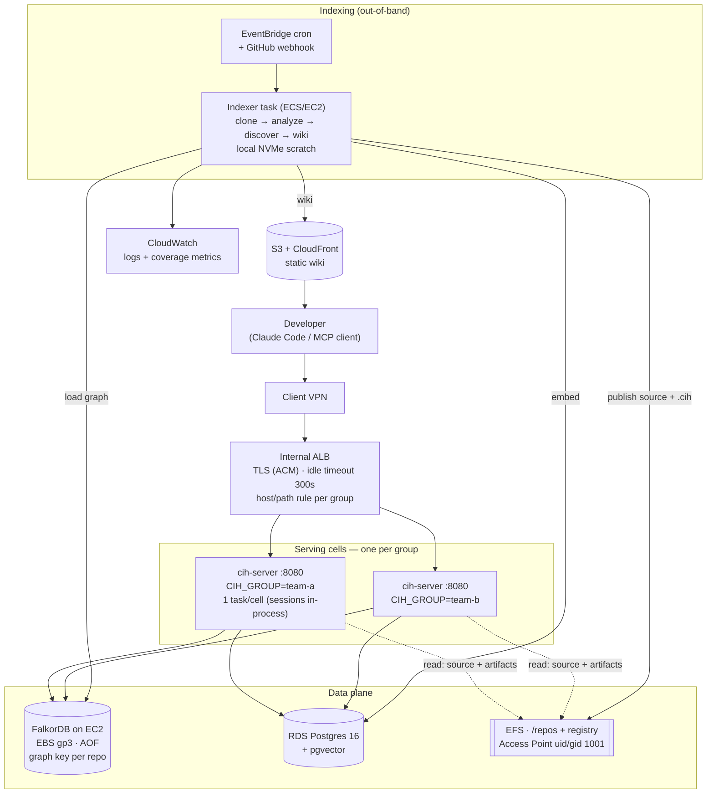

# AWS Deployment Architecture — yummy-cih

Target: **org-wide** (many teams/repos), **VPC-private** access over VPN,
**out-of-band batch** indexing, on **ECS/EC2 + EFS**.

## Context

CIH is a Rust MCP server (`cih-server`) over a FalkorDB graph, fed by a batch
pipeline (`cih-engine`: `scan → parse → resolve → load → discover → embed → wiki`).
It indexes proprietary source, so the deployment has to be private-by-default and
provably non-exfiltrating. The design below is driven by five properties of *this*
codebase, not by a generic template — each one rules something out:

| Constraint (verified in code) | Consequence |
|---|---|
| Registry (`$HOME/.cih/registry.json`) stores **absolute** `path` / `artifacts_dir`; "the server process must see those same paths" (`docs/runbooks/multi-repo-host-serving.md`) | Indexer and server must share **one filesystem at identical mount paths**. This is the single most load-bearing constraint. |
| `LocalSessionManager` (`startup.rs:74`) — MCP sessions are held **in-process** | You cannot put N replicas of one server behind an ALB. Scale by **cell**, not by replica. |
| FalkorDB is Redis-based → **graphs live in RAM**; no managed AWS equivalent | Self-hosted on EC2/EBS. **RAM is the ceiling**, and it's the main sizing input. |
| Server refuses to start on a non-loopback bind without `CIH_API_TOKEN` (`SECURITY.md`) | Token from Secrets Manager. **Never** set `CIH_ALLOW_INSECURE` in AWS. |
| Server is LLM-egress-free; only outbound call is the fastembed model download from huggingface.co | Bake the model → `HF_HUB_OFFLINE=1` → **server needs no egress at all**. |

Everything CIH stores is **derived data**. The source of truth is the git remotes.
That single fact sets the whole DR posture (see [Backup](#backup--dr)).

## Architecture



## Component decisions

### Serving: one cell per group — not N replicas

`LocalSessionManager` keeps MCP sessions in process memory, and MCP streamable HTTP
identifies sessions with an **`Mcp-Session-Id` header**. ALB stickiness is
cookie-based and cannot route on that header, so two replicas of one group's server
would drop sessions non-deterministically.

So: **one `cih-server` task per group**, each its own ECS service + target group,
selected by an ALB host or path rule (`team-a.cih.internal` → team-a target group).
Scale *vertically* within a cell (CPU/RAM, `CIH_MAX_CONCURRENT_QUERIES`, default
**64**), and *horizontally* by adding cells. This also gives per-team blast-radius
isolation for free, which the org-wide target wants anyway.

> **Honest limitation:** there is no HA *within* a group today. A cell is a single
> task; a task restart drops that group's live MCP sessions (clients reconnect).
> True in-group HA needs a shared session store — an rmcp/`cih-server` change, not
> an infra one. Worth a follow-up if the SLA demands it.

One server is already multi-repo (`repo=` arg; graphs keyed per repo; `CIH_GROUP`
scopes `list_repos`), so a cell fronting a whole team's repos is the intended shape.

### Storage: EFS at identical paths, but parse on local disk

EFS mounted at **`/repos` in both the indexer and every server task**, plus the
registry (`/home/cih/.cih`). Identical mount paths satisfy the absolute-path
constraint — the registry's `/repos/team-a/app` resolves in both.

**Use an EFS Access Point with POSIX user `uid=1001, gid=1001`** (the Dockerfile's
`cih` user). This is the clean fix for the chown-to-1001 pain recorded in the
Windows runbook — the access point enforces ownership so nothing has to be chowned.

**Do not parse on EFS.** EFS is NFS: per-file-op latency in the milliseconds, and
parsing is millions of small reads. Your own runbook already learned this
("bind-mounts too slow → copy source into a volume"). The indexer therefore:

1. clones to **task-local NVMe scratch at the same absolute path** (`/repos/<group>/<repo>`),
2. runs `analyze`/`discover` against fast local disk,
3. **publishes** the tree (source + `.cih`) to EFS at that same path.

The path string the registry records is identical either way, so this is invisible
to the server. Net: EFS takes one bulk sequential write per index instead of
millions of random reads; the server's reads (`read_file`, `grep_files`, artifacts)
are light and occasional.

Set EFS to **Elastic throughput** (Bursting will exhaust credits on publish spikes).

> If a first measurement shows analyze-on-EFS is fast enough for your repo sizes,
> drop step 1–3 and parse in place. Measure before adding the machinery — the
> corpus A/B habit applies here too.

### Graph store: FalkorDB on EC2, sized by RAM

No managed equivalent — self-host on a memory-optimized instance (`r7i`) in a
private subnet, EBS **gp3**, `REDIS_ARGS: --appendonly yes` (as in compose).

**RAM is the sizing input**: every graph a cell serves is resident. Start with one
FalkorDB holding all graph keys (many keys per instance is fine) and **shard by
group when RAM or blast radius demands** — a cell's `FALKOR_URL` simply points at
its shard. Alarm on FalkorDB `used_memory` well before the instance ceiling; the
failure mode is eviction/OOM, not graceful degradation.

Run it as an ECS task with an attached EBS volume + placement constraint, or plain
Docker on a dedicated instance. Either is fine; the EBS volume and its snapshot
schedule are what matter.

### Embeddings: RDS Postgres + pgvector

`pgvector/pgvector:pg16` in compose → **RDS PostgreSQL 16 with the `pgvector`
extension** (`CREATE EXTENSION vector`). Managed backups/patching, no reason to
self-host. Only `cih-embed` and the semantic half of `query` use it; the server
degrades to BM25-only if `CIH_PG_URL` is unset, so it is not on the critical path.

### Indexing: batch, off the serving path

An ECS task (EC2 launch type, local NVMe) triggered by **EventBridge cron** for
scheduled refresh and a **GitHub webhook → API Gateway → Lambda → RunTask** for
push-driven re-index. It runs the documented sequence per repo:

```
cih-engine analyze  /repos/<g>/<r> --all --graph-key <key>
cih-engine discover /repos/<g>/<r> --graph-key <key>
cih-engine embed    /repos/<g>/<r>          # optional, needs CIH_PG_URL
cih-engine wiki     /repos/<g>/<r> --out .../wiki
```

Never share the default `cih` graph key across repos (per the runbook) — key per
repo, `CIH_GROUP` per cell. Serialize per-repo indexing (a queue or a per-repo
lock); concurrent analyze on one graph key will corrupt state.

This keeps a heavy re-index from starving queries — the reason for choosing
out-of-band over the in-server `index_repo` subprocess.

### Wiki: S3 + CloudFront, not a Docusaurus container

The compose `docs-viewer` rebuilds the static site **at container start** and needs
`--max-old-space-size=8192` (it OOMs a 4 GiB heap on ~5k-page wikis). Running that
as a service in AWS is paying for a build every restart.

Instead: the **indexer** runs the Docusaurus build once per index and syncs the
output to **S3**; serve via CloudFront with OAC, private (VPN/WAF or a VPC
endpoint). Static, cheap, no 8 GiB node process in production.

### Security posture

- **No public ingress.** Internal ALB in private subnets; devs arrive over Client VPN.
- **TLS at the ALB (ACM)** — the bearer token is a header and must never be cleartext.
- **`CIH_API_TOKEN` in Secrets Manager**, injected as an ECS secret. `CIH_ALLOW_INSECURE`
  must not appear in any AWS task definition; the server's fail-safe is a feature.
- **Server subnets get no NAT and no IGW.** Bake the fastembed model into the image
  and set `HF_HUB_OFFLINE=1`, removing the only outbound call. The server then holds
  no LLM key and makes no code-bearing call — enforced by routing, not by policy.
- **The indexer needs egress** (git clone) — give *it* a NAT gateway or use
  CodeCommit / a VPC endpoint. Keep that egress off the serving cells.
- Security groups: ALB → server:8080; server → FalkorDB:6379, RDS:5432; indexer →
  same + NAT. Nothing else.
- `/graph` (the browser UI) sits behind the same token — it is reachable by anyone
  who can reach the ALB. That is intended, but worth knowing.

### Observability — wire the coverage metric to an alarm

The extraction-coverage work gives this deployment something unusual: a
**correctness** signal, not just liveness. The indexer's `analyze --json` emits
`callable_coverage`, `resolved_edge_count`, `unresolved_reference_count`.

Publish them per repo as **CloudWatch custom metrics** and alarm when
`callable_coverage` drops sharply or sits near zero. That is the difference between
"the index is running" and "the index is any good" — a silently-degraded graph looks
perfectly healthy to a liveness check, which is exactly how the CommonJS blind spot
survived. Ship the alarm with the system.

Also: ALB health checks → **`/health`** (liveness) and **`/ready`** (readiness —
use this as the target-group check so a cell only takes traffic once its graph is
reachable). Logs via `RUST_LOG=info,cih_server=debug` → CloudWatch (awslogs driver).

## Sizing (starting point — then measure)

| Component | Start | Scaling input |
|---|---|---|
| `cih-server` cell | 2 vCPU / 4 GiB | Concurrency (`CIH_MAX_CONCURRENT_QUERIES`, default 64); resident wiki |
| FalkorDB | `r7i.xlarge` (32 GiB) | **Total graph RAM** — the hard ceiling |
| Indexer | 8 vCPU / 16 GiB + NVMe | Largest repo; parse is CPU + I/O bound |
| RDS | `db.t4g.medium`, gp3 | Embedding volume |
| EFS | Elastic throughput | Publish spikes |

Calibrate FalkorDB RAM against a real index (Fineract/liferay are already in your
eval set) rather than guessing — same measure-first discipline as the corpus A/B.

## Backup / DR

**Everything here is derived data.** The source of truth is the git remotes; the
graph, `.cih` artifacts, embeddings and wiki are all reproducible by re-indexing.
That makes DR cheap and should be stated explicitly rather than over-engineered:

- **RPO/RTO = one re-index.** Keep the indexer job runnable from a clean slate; that
  *is* the recovery plan, and it's exercised on every scheduled run.
- EBS snapshots of FalkorDB (AOF) + RDS automated backups are a *speed* optimization
  (skip a re-index), not a correctness requirement.
- Back up what is **not** derived: the ECR images, task definitions/IaC, and the
  Secrets Manager token.

## Rollout

1. **Cell of one.** One group end-to-end: EFS + access point, FalkorDB, RDS, one
   server cell, one indexer run, ALB + VPN. Prove `list_repos`/`context`/`trace_flow`
   from a laptop over VPN.
2. **Measure before optimizing.** Time `analyze` on EFS vs local-scratch+publish for
   your largest repo; only add the scratch/publish step if the numbers justify it.
   Record FalkorDB `used_memory` per repo → the real RAM model.
3. **Second cell.** Proves ALB host-rule routing and per-group isolation.
4. **Automate.** Webhook → indexer, coverage metrics + alarms, wiki → S3.
5. **Harden.** Drop NAT from server subnets (`HF_HUB_OFFLINE=1`), confirm the server
   fails closed without the token, IaC everything (Terraform/CDK).

## Open questions

- **Repo source**: GitHub (cloud/Enterprise) vs CodeCommit? Decides indexer egress
  (NAT vs VPC endpoint) and credential handling (a GitHub App / deploy keys in
  Secrets Manager).
- **Group ↔ team mapping**: how many cells on day one? Drives ALB rules and FalkorDB
  sharding.
- **In-group HA**: is a session drop on task restart acceptable? If not, the shared
  session store is a code change to schedule.
