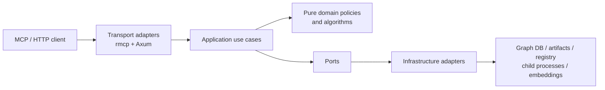

# CIH Server Clean Architecture, Scalability, and Maintainability Proposal

> **Status:** IN PROGRESS - reviewed 2026-07-20; Section 29 first slice
> implemented 2026-07-20 (S9 graph-key targeting at both sites,
> `detect_changes` completeness + budgeted batching, typed
> `DiffScope`/`DirectionArg`, git diff via the blocking pool, `trace_flow`
> instruction fix, instruction/schema validation test). Milestone 1 completed
> 2026-07-20: cross-repo handlers (`group_contracts`/`api_impact`/
> `trace_flow_x`/`shape_check`) and `read_resource` run through `run_blocking`;
> communities/processes resources are streamed, item- and byte-bounded, and
> paged by version-stamped cursor (`CIH_RESOURCE_MAX_BYTES`); `format` args are
> typed per-tool enums (empty string still accepted as the documented default).
> Milestone 2 core completed 2026-07-20: `store_for`/`search_for` are
> single-flight (new `single_flight.rs`, per-key async gates, failures never
> cached); the §9.2 heavy blocking lane exists (`run_blocking_heavy`,
> `CIH_BLOCKING_MAX_CONCURRENT` default 2, queue timeout 5 s, typed
> `Saturated` rejection, permit held by the running closure per §9.3) and
> gates contracts/resources/taint; `IndexScheduler` gives index jobs admission
> control (running cap 1, queue 16, one active job per repo with dedup), a
> deadline that kills the child (`CIH_INDEX_TIMEOUT_SECS`, default 30 min),
> capped output retention with truncation flags, and `queued`/`timed_out` job
> states. §13 cancel operation completed 2026-07-20: the `index_cancel` tool
> (tool count 31) signals a per-job watch channel; a queued job settles as
> `cancelled` without running, a running job's engine is killed via
> `kill_on_drop` on future drop. Registry freshness needs no invalidation
> (mtime-checked cache).
> Milestone 3 first slice (bounded retention) completed 2026-07-20: `MtimeCache`
> now enforces an entry cap with strict-LRU eviction plus an idle TTL
> (`CIH_ARTIFACT_CACHE_MAX_ENTRIES` default 32,
> `CIH_ARTIFACT_CACHE_IDLE_TTL_SECS` default 1800), gates evicted with their
> entries — so the xflow `ArtifactGraph` and `ArtifactBundle` caches (the two
> raw-graph holders) no longer grow monotonically, and stale versioned-dir keys
> age out after a re-index. Deliberately deferred to the M3 re-pricing:
> byte-weighted budgets (`CIH_ARTIFACT_CACHE_MAX_BYTES`), the unified
> `ArtifactSnapshot` (xflow migration is a rewrite), and wiki/search cache
> budgets (§12.5).
> Follow-up safety slice completed 2026-07-20: communities/processes now cap
> the serialized `ReadResourceResult` rather than estimating raw JSONL bytes,
> reject an individually oversize record, and use typed `v1` cursors carrying
> artifact version, resource kind, and offset; both artifact representations
> invalidate on independent node and edge mtimes; index-job deduplication is
> command-aware, so only equivalent graph-key/language requests coalesce and a
> different command for an active repository returns a conflict. Live wiki
> resident loading and live search-index construction now also use independent
> per-repository single-flight gates with post-wait freshness rechecks, and
> their freshness token now includes both graph files.
> Repository-context slice completed 2026-07-20: introduced the initial
> transport-independent `AppError`, `RepoSelector`, `ResolvedRepo`,
> `RepoContext`, and `RepoContextProvider`; moved graph/search connection,
> schema initialization, path normalization, and single-flight policy out of
> `CihServer`; and migrated graph-backed MCP resolution,
> `architecture_overview`, and `detect_changes`. `detect_changes` now consumes
> the provider's canonical repository path instead of reloading the registry.
> Contract tests cover 32-way same-key coalescing, retry after failure,
> independent different-key initialization, equivalent artifact-path
> normalization, and catalog refresh.
> Repository-identity migration slice completed 2026-07-20: added the
> identity-only `RepoContextProvider::resolve_repo` operation so file and
> artifact capabilities do not initialize unused graph/search infrastructure;
> migrated file tools, wiki MCP tools, the wiki HTTP route,
> `architecture_overview` wiki lookup, and cross-repository caller/trace/shape
> lookups to resolved canonical paths and artifact directories. `read_file`
> filesystem work now also runs on the blocking pool. The obsolete
> `find_repo_path` helper and wiki-owned graph-key resolver were removed.
> Provider tests verify identity-only resolution performs zero graph/search
> initializations.
> Catalog-snapshot migration slice completed 2026-07-20: added provider-owned
> `RepoCatalogSnapshot` with immutable `Arc` snapshots of the repository and
> group registries plus typed selector resolution; normalized community
> artifact paths in `ResolvedRepo`; and migrated taint, MCP resource
> list/read, `list_repos`, `status`, overview group facts, and all contract
> freshness/member lookups. Each cross-repository operation now observes one
> catalog snapshot inside its blocking task. Missing-repository errors at
> migrated MCP boundaries use `AppError`, and the obsolete
> `repo_not_found`/`resolve_repo_entry`/tuple `resolve_repo` helpers were
> removed. Snapshot tests prove in-flight stability across catalog refresh and
> zero graph/search initialization.
> Single-flight failure fan-out completed 2026-07-20: `SingleFlight` now owns
> an explicit per-key generation state and publishes one cloned success or
> failure to every caller registered with that generation. Failed generations
> are removed before publication, so later requests retry; successful values
> remain cached; cancellation marks a generation abandoned so the next caller
> can replace it. Generic tests cover 32-way shared failure and cancellation,
> and the production provider contract proves 32 concurrent failed resolves
> perform one graph initialization, return the same `AppError`, then retry
> successfully. This closes the remaining S6 concurrency contract.
> **Review:** all S1-S9 claims, the instruction-drift claim, and the module
> inventory were verified against code at `dev@5d95f95` and confirmed;
> corrections from that review are folded in below as "Review note" callouts  
> **Date:** 2026-07-20  
> **Review baseline:** `dev@5d95f95`  
> **Primary scope:** `crates/cih-server`  
> **Adjacent scope:** existing ports and adapter configuration in
> `cih-graph-store`, `cih-store-factory`, and artifact-producing crates where a
> server contract cannot be fixed locally  
> **Out of scope:** changing analysis semantics, replacing MCP, splitting the
> server into deployable microservices, or rewriting all tools at once

## 1. Executive Summary

`cih-server` already has several strong foundations:

- `GraphStore` is an injected port rather than a concrete database dependency.
- `startup.rs` acts as a composition root.
- graph query concurrency is bounded by store-level semaphores;
- CPU-heavy work has an existing `run_blocking` mechanism;
- tool routers have started moving into capability-oriented modules;
- pure algorithms such as graph layout and cross-repo traversal have hermetic
  tests;
- `architecture_overview` demonstrates deterministic, typed, size-bounded
  output.

The main problem is that these patterns are not applied consistently. The
server currently mixes transport concerns, repository resolution, cache
lifecycle, filesystem parsing, process management, use-case orchestration, and
response serialization. This creates concrete correctness and scalability
failures for large repositories and multi-repository servers.

This proposal evolves the server into a **capability-oriented hexagonal modular
monolith**:

1. MCP and HTTP code become thin transport adapters.
2. Application use cases own validation and orchestration.
3. Pure domain logic remains free of MCP, Axum, filesystem, and process types.
4. External work is accessed through a small set of stable ports.
5. Infrastructure implementations provide bounded concurrency, single-flight
   loading, cache budgets, deadlines, and observability.
6. Every query has explicit work, result-count, byte-size, and completeness
   contracts.

This is an incremental migration. Existing tool names and successful response
shapes remain compatible unless a separate design decision explicitly approves
a breaking change.

## 2. Problem Statement

The server is expected to support:

- repositories with at least 500,000 graph nodes;
- repositories with more than 12,000 source files;
- groups containing multiple services;
- concurrent MCP clients;
- long-lived server processes;
- both graph-backed and artifact-backed analysis;
- interactive latency for narrow queries;
- explicit degradation when complete analysis exceeds a bounded budget.

The current implementation violates those expectations in several places:

| ID | Severity | Problem | Current consequence |
|---|---|---|---|
| S1 | P1 | Full artifact graphs are loaded synchronously from async cross-repo handlers | A cold request can block Tokio workers and stall unrelated requests |
| S2 | P1 | `detect_changes` traverses only the first 20 changed symbols without marking omitted symbols incomplete | Risk and blast radius can be under-reported |
| S3 | P1 | MCP resources read, parse, collect, and pretty-print complete artifact files | Unbounded latency, allocation, and response size |
| S4 | P1 | Multiple independent caches retain duplicate repository representations without eviction | Memory grows with every repository and capability used |
| S5 | P1 | Index jobs have no admission control, deduplication, deadline, cancellation, or output cap | Clients can start unbounded CPU- and database-heavy child processes |
| S6 | P2 | Lazy store initialization is check-then-connect without single-flight | Concurrent misses create duplicate connections and schema initialization |
| S7 | P2 | Inputs and formats are stringly typed and sometimes silently default on invalid values | Typos can run the wrong analysis instead of returning an error |
| S8 | P2 | Application modules return `McpError` and `CallToolResult` directly | Use cases are coupled to one transport and response contracts drift |
| S9 | P1 | `index_repo` passes the server's primary graph key to every repository it indexes | Indexing a different repository can target the wrong graph key |

S9 was identified while detailing the indexing solution. It must be resolved
with S5 because scheduling unsafe work more carefully does not fix targeting
the wrong graph.

**Review note (2026-07-20):** S9 is broader than the anchor suggests — the same
`self.graph_key` mis-targeting flows through `add_resolve_pattern`'s reindex
path (`app/tools_admin.rs` → `patterns::add_resolve_pattern`), so both call
sites are in scope. Because this is live data corruption (indexing any
non-primary path writes that repository into the primary graph via the
`CIH_GRAPH_KEY` env var), the *targeting* fix is pulled forward into the first
implementation slice (Section 29) and does not wait for the Milestone 2
scheduler; S5's scheduling work still lands with Milestone 2.

### 2.1 Current code anchors

The proposal is based on these baseline implementation points:

| Issue | Current symbols |
|---|---|
| S1 | `contracts::api_impact`, `contracts::trace_flow_x`, `contracts::shape_check`, `xflow::XflowState::graph_for` |
| S2 | `changes::detect_changes`, especially `symbol_limit` and `failed_traversals` |
| S3 | `resources::read_resource`, `resources::read_community_nodes` |
| S4 | `app::CihServer`, `mtime_cache::MtimeCache`, `artifact_cache::ArtifactCache`, `xflow::XflowState`, `wiki::WikiSearchState` |
| S5 | `indexing::start_index_job`, `jobs::Jobs`, `jobs::evict_terminal` |
| S6 | `app::CihServer::store_for`, `app::CihServer::search_for` |
| S7 | `utils::parse_direction`, `symbol::git_changed_files`, `args.rs`, `app::CihServer::get_info` |
| S8 | use-case modules importing `rmcp::ErrorData` and returning `CallToolResult` |
| S9 | `app::tools_admin::index_repo` passing `self.graph_key` into `indexing::index_repo`; also `app::tools_admin::add_resolve_pattern` passing `self.graph_key` into `patterns::add_resolve_pattern` |

## 3. Goals

### 3.1 Functional goals

- Preserve all existing MCP tool names.
- Preserve successful response fields by default.
- Make incomplete analysis explicit and machine-readable.
- Make invalid arguments fail with `invalid_params`.
- Ensure repository selection consistently resolves to the correct registry
  entry, graph key, artifact version, and search state.
- Keep MCP and HTTP behavior aligned when they expose the same capability.

### 3.2 Scalability goals

- No full-file parsing or CPU-heavy graph construction on Tokio worker threads.
- No unbounded response collections.
- No unbounded child-process creation.
- No unbounded cache growth.
- No duplicate cold initialization for the same repository and artifact
  version.
- Support a configurable process-wide memory budget for resident repository
  data.
- Keep narrow graph queries interactive while expensive offline work is queued.

### 3.3 Maintainability goals

- Keep protocol mapping separate from use-case behavior.
- Make application outputs typed and independently testable.
- Centralize repository resolution, limits, errors, cache policy, and blocking
  execution.
- Organize code by business capability rather than by technical helper type
  alone.
- Add abstractions only at real I/O boundaries.
- Avoid a big-bang crate split.

## 4. Non-Goals

- Do not introduce a dependency-injection framework.
- Do not define a trait for every function or service.
- Do not replace `GraphStore`; it is already the correct graph persistence port.
- Do not move every module into a separate crate during the first migration.
- Do not make artifact-backed analysis unbounded in the name of completeness.
- Do not hide partial results. A bounded incomplete answer is acceptable only
  when the response says exactly what was omitted.
- Do not build a distributed job queue in the first version.
- Do not change graph extraction or resolution semantics as part of this plan.

## 5. Architecture Decision

### 5.1 Chosen pattern

Adopt a **capability-oriented hexagonal modular monolith**.



### 5.2 Dependency rules

1. `transport` may depend on rmcp, Axum, application commands, application
   outputs, and transport error mapping.
2. `application` may depend on domain types and ports, but not on rmcp or Axum.
3. `domain` may depend on CIH core model types where appropriate, but not on
   filesystem, network, database, runtime, MCP, or HTTP types.
4. `ports` define boundaries for registry lookup, repository context, artifact
   loading, job scheduling, and external process execution.
5. `infrastructure` implements ports using existing crates and standard I/O.
6. `bootstrap` constructs concrete services and adapters. It is the only layer
   that should know the complete object graph.

### 5.3 Why not microservices

The current problem is boundary discipline inside one process, not deployment
topology. Splitting the server would add network failure modes while leaving
the same unbounded loading and contract problems in each service. A modular
monolith is easier to test, deploy, and evolve while preserving local
performance.

### 5.4 Why not a generic handler framework

Use cases should follow a common shape:

```rust
impl DetectChanges {
    pub async fn execute(
        &self,
        command: DetectChangesCommand,
    ) -> Result<DetectChangesOutput, AppError>;
}
```

They do not all need to implement a generic `UseCase<I, O>` trait. Traits are
reserved for external boundaries or test substitution. Concrete use-case
structs keep call sites clear and avoid type-erasure or object-safety
complexity.

## 6. Proposed Module Structure

The end state may use the following layout. Migration can move one capability
at a time.

```text
crates/cih-server/src/
  bootstrap.rs
  config.rs

  transport/
    mod.rs
    mcp/
      mod.rs
      server.rs
      error.rs
      resources.rs
      tools/
        graph.rs
        search.rs
        cross_repo.rs
        testing.rs
        docs.rs
        files.rs
        admin.rs
    http/
      mod.rs
      health.rs
      browser.rs
      wiki.rs

  application/
    mod.rs
    app_services.rs
    repo_context.rs
    graph/
      context.rs
      impact.rs
      communities.rs
      route_map.rs
      trace_flow.rs
      detect_changes.rs
      architecture_overview.rs
    search/
    cross_repo/
      trace_flow.rs
      api_impact.rs
      shape_check.rs
    testing/
    docs/
    files/
    admin/
      index_repo.rs
      index_status.rs
      resolve_patterns.rs

  domain/
    mod.rs
    error.rs
    paging.rs
    completeness.rs
    limits.rs
    validation.rs

  ports/
    mod.rs
    repo_catalog.rs
    repo_context_provider.rs
    artifact_repository.rs
    job_scheduler.rs
    process_runner.rs

  infrastructure/
    mod.rs
    registry_catalog.rs
    graph_store_provider.rs
    artifact_repository.rs
    search_provider.rs
    wiki_repository.rs
    local_job_scheduler.rs
    engine_process_runner.rs
    blocking_runtime.rs
```

This structure is a direction, not a requirement to create every file before
moving behavior. Empty layers and pass-through modules should not be added.

## 7. Standard Request Pattern

Each MCP request should follow one predictable path:

```text
rmcp Parameters<ToolArgs>
  -> TryFrom<ToolArgs> for ValidatedCommand
  -> capability.execute(command)
  -> domain/port calls
  -> Result<TypedOutput, AppError>
  -> MCP result/error mapping
```

### 7.1 Transport responsibilities

- Deserialize protocol arguments.
- Convert arguments into validated commands.
- Invoke exactly one application entry point.
- Convert typed output into MCP or HTTP output.
- Map `AppError` to protocol-specific error codes.
- Attach transport-level metadata such as request IDs.

Transport handlers must not:

- read registry or artifact files;
- create database connections;
- spawn child processes;
- perform graph traversal policy;
- shape dynamic business responses with ad hoc JSON;
- decide cache freshness or eviction.

### 7.2 Application responsibilities

- Resolve the target repository through `RepoContextProvider`.
- Apply use-case limits and completeness policy.
- Orchestrate graph, artifact, search, wiki, and job ports.
- Combine independent calls concurrently when safe.
- Return typed outputs and explicit partial-result metadata.

### 7.3 Domain responsibilities

- Pure traversal and grouping algorithms.
- Risk calculation.
- Paging and completeness semantics.
- Validation types and policy constants.
- Deterministic sorting and stable response ordering.

## 8. Shared Application Types

### 8.1 Application error

Introduce one transport-independent error taxonomy:

```rust
pub enum AppError {
    InvalidInput {
        field: &'static str,
        message: String,
    },
    NotFound {
        entity: &'static str,
        key: String,
    },
    Conflict {
        message: String,
    },
    Unavailable {
        dependency: &'static str,
        message: String,
        retryable: bool,
    },
    Overloaded {
        resource: &'static str,
        retry_after_ms: Option<u64>,
    },
    TimedOut {
        operation: &'static str,
        duration_ms: u64,
    },
    Internal {
        operation: &'static str,
        source: anyhow::Error,
    },
}
```

The MCP adapter maps:

| `AppError` | MCP mapping |
|---|---|
| `InvalidInput`, `NotFound` for user-selected entities | `invalid_params` |
| `Conflict` | tool error with stable machine-readable code |
| `Unavailable`, `Overloaded`, `TimedOut`, `Internal` | `internal_error` with safe public message |

Internal sources are logged with a request ID and are not serialized verbatim
when they may contain filesystem paths, credentials, or backend details.

### 8.2 Completeness metadata

Use one shape for bounded analyses:

```rust
pub struct Completeness {
    pub complete: bool,
    pub total_candidates: usize,
    pub analyzed: usize,
    pub omitted: usize,
    pub failed: usize,
    pub reasons: Vec<IncompleteReason>,
}
```

This replaces ambiguous combinations of `partial`, `truncated`, and
`incomplete_symbols` over time. Existing fields remain during compatibility
migration and are derived from `Completeness`.

### 8.3 Page type

Use one typed page contract:

```rust
pub struct Page<T> {
    pub items: Vec<T>,
    pub next_cursor: Option<String>,
    pub total: Option<usize>,
    pub truncated: bool,
    pub source_version: String,
}
```

Every page must be bounded by both item count and serialized byte size.

## 9. Solution S1: Safe Artifact-Backed Execution

### 9.1 Immediate correction

Move all cold artifact reads and graph construction behind the existing
blocking execution mechanism:

- `api_impact` caller graph loading;
- `trace_flow_x` initial and cross-repo graph loading;
- `shape_check` provider and consumer bundle loading;
- resource file scans;
- synchronous `git diff`;
- contract artifact parsing when files can be large.

Do not call `run_blocking` independently for every small step. One blocking
closure should own a coherent cold-load and pure-compute phase where possible,
so large vectors do not cross runtime boundaries repeatedly.

### 9.2 BlockingRuntime service

**Review note (2026-07-20):** `blocking.rs` already provides the deadline half
of this service — `run_blocking` with a 90-second default deadline
(`CIH_BLOCKING_TIMEOUT_SECS`), typed `TimedOut`/`Panicked` errors, and tests —
and it is already used by taint, files, search, wiki, and browser. This step is
an extension (semaphore, queue timeout, label enum), not a green-field build.
Its module doc currently overclaims that "every CPU-/IO-heavy operation" runs
on the blocking pool — false while `contracts.rs` and `resources.rs` bypass
it — and must be corrected together with the code.

Replace direct calls to the free `run_blocking` helper with one concrete
`BlockingRuntime` service containing:

- a semaphore for maximum concurrent heavy loads;
- queue acquisition timeout;
- operation deadline;
- structured timing and queue-wait logging;
- operation labels from a closed enum;
- test hooks for saturation and timeout behavior.

Proposed defaults:

| Setting | Default |
|---|---:|
| Heavy blocking operations | 2 concurrent |
| Queue timeout | 5 seconds |
| Operation timeout | 90 seconds |

The exact defaults must be validated against production hardware. They are
configuration defaults, not hard-coded assumptions in use cases.

### 9.3 Cancellation rule

`spawn_blocking` work cannot be force-cancelled. A timeout only stops waiting.
Therefore:

- reject new heavy work when the blocking lane is saturated;
- keep the concurrency cap small;
- make loaders cooperative where practical by checking a cancellation token
  between file chunks;
- do not launch another load for the same key while a timed-out load is still
  running;
- record abandoned tasks as a metric.

### 9.4 Acceptance criteria

- No synchronous artifact graph load is reachable directly from an async
  transport or application handler.
- A cold 500k-node artifact load does not block a lightweight `/health` request
  or a cached graph query.
- Saturation produces a typed overload error within the configured queue
  timeout.
- Tests prove that concurrent loads for the same artifact version coalesce.

## 10. Solution S2: Correct and Bounded Change Impact

### 10.1 Deterministic candidate handling

`detect_changes` must:

1. validate `DiffScope`;
2. run `git diff` through `BlockingRuntime`;
3. resolve changed nodes;
4. sort candidates by canonical NodeId;
5. deduplicate NodeIds;
6. process candidates in bounded concurrent batches;
7. report every omission and failure.

### 10.2 Work budget

Introduce a `DetectChangesBudget`:

```rust
pub struct DetectChangesBudget {
    pub max_symbols: usize,
    pub batch_size: usize,
    pub max_depth: u32,
    pub deadline: Duration,
}
```

Suggested first defaults:

- `max_symbols = 200`;
- `batch_size = 20`;
- `max_depth = 4`;
- application deadline below the HTTP 120-second limit.

The store semaphore remains the final graph-query concurrency bound.

### 10.3 Completeness and risk

If 350 symbols are found and only 200 are analyzed:

```json
{
  "partial": true,
  "incomplete_symbols": 150,
  "completeness": {
    "complete": false,
    "total_candidates": 350,
    "analyzed": 200,
    "omitted": 150,
    "failed": 0,
    "reasons": ["symbol_budget"]
  }
}
```

The existing `risk` field must not imply a complete assessment. During
compatibility migration:

- calculate a lower-bound risk from completed traversals;
- set `partial = true` whenever any candidate was omitted or failed;
- add `risk_complete = false`;
- expose `risk_lower_bound` separately and keep the displayed risk an honest
  lower bound. Do not silently inflate the displayed risk to `high` on every
  budget hit — if every large change set reads "high", users learn to ignore
  the field. If a conservative override is wanted, it must be an explicit,
  client-visible flag rather than baked into the risk value.

### 10.4 Tests

- 0 changed symbols;
- 1, 20, 21, 200, and 201 changed symbols;
- duplicate changed nodes;
- deterministic ordering from unordered store responses;
- one failed traversal;
- one panicked join;
- deadline expiration;
- invalid diff scope;
- option-like base refs remain rejected (already guarded and tested today in
  `symbol.rs` — keep as a regression test, this is not new work);
- no result can have `partial = false` when `omitted + failed > 0`.

## 11. Solution S3: Bounded MCP Resources

### 11.1 Resource contract

Replace complete collection resources with paged resources:

```text
cih://repo/{name}/communities?cursor={cursor}&limit={limit}
cih://repo/{name}/processes?cursor={cursor}&limit={limit}
```

The cursor is opaque to clients and contains:

- artifact version;
- resource kind;
- logical offset or indexed position.

A cursor from an old artifact version returns an explicit stale-cursor error
instead of silently paging through a different dataset.

### 11.2 Bounds

Each resource page is limited by:

- default 100 items;
- hard maximum 500 items;
- default 256 KiB serialized response budget;
- deterministic order by canonical ID.

The exact byte default is configurable. The server stops before exceeding the
budget and emits `next_cursor`.

### 11.3 Compatibility

The existing URI without a cursor returns the first page. It does not return
the entire artifact. This is a behavioral correction required for safe large
repository support.

Resource descriptions and templates must explain pagination and link to the
next URI. `architecture_overview` remains the preferred compact orientation
resource.

### 11.4 Efficient implementation

Milestone 1 may scan a JSONL file in a blocking task and retain only the current
page. It must not collect all matches.

Milestone 3 should use `ArtifactRepository` indexes or a persisted side index so
later pages do not rescan the file from the beginning.

### 11.5 Tests

- page boundaries and stable ordering;
- byte budget reached before item budget;
- stale cursor after artifact version change;
- malformed cursor;
- 500k-record generated fixture in a non-default performance suite;
- response memory remains bounded independently of total file size.

## 12. Solution S4: Unified, Budgeted Repository Data

### 12.1 Replace duplicate caches

**Review note (2026-07-20):** the duplication today is exactly two resident
copies, not three — xflow's `ArtifactGraph` (id-keyed nodes + adjacency) and
the `ArtifactBundle` in `ArtifactCache`, which taint and shape checking already
share (`taint.rs` uses `artifacts.bundle()`; it does not load separately).
Per-key single-flight coalescing also already exists for these caches:
`MtimeCache::get_or_load` serializes concurrent misses per key with a proof
test (16 threads → 1 load). The net-new work in this section is eviction,
memory budgeting, dual node/edge freshness, and moving the coalesced load off
the async worker — not coalescing itself.

Introduce one `ArtifactRepository` for artifact-backed server capabilities.

```rust
#[async_trait]
pub trait ArtifactRepository: Send + Sync {
    async fn snapshot(
        &self,
        repo: &ResolvedRepo,
    ) -> Result<Arc<ArtifactSnapshot>, AppError>;
}
```

The external port is async because cache waiting and blocking execution are
runtime concerns. The concrete filesystem implementation uses
`BlockingRuntime`.

### 12.2 Shared snapshot

```rust
pub struct ArtifactSnapshot {
    pub version: ArtifactVersion,
    pub nodes: Arc<[Node]>,
    pub edges: Arc<[Edge]>,
    indexes: OnceLock<Arc<ArtifactIndexes>>,
}

pub struct ArtifactIndexes {
    pub node_by_id: HashMap<NodeId, usize>,
    pub outgoing_edges: HashMap<NodeId, Vec<usize>>,
    pub incoming_edges: HashMap<NodeId, Vec<usize>>,
}
```

Indexes reference positions in shared node and edge arrays. They do not clone
complete `Node`, `Edge`, ID, or property values into a second graph.

The lazy index cell must be initialized through an asynchronous single-flight
repository operation whose CPU work runs on `BlockingRuntime`. The `OnceLock`
in the sketch expresses one-value ownership only; it must not cause index
construction to run directly on a Tokio worker.

Taint analysis, shape checking, and cross-repo flow tracing consume views over
the same snapshot.

### 12.3 Freshness

Cache keys include:

- canonical repository identity;
- artifact version ID;
- nodes file identity;
- edges file identity;
- schema version where available.

Do not invalidate only on `nodes.jsonl` mtime. Both node and edge inputs affect
the snapshot.

### 12.4 Weighted cache

Use a weighted LRU or TinyLFU-style cache with:

- configurable process-wide byte budget;
- estimated weight for base arrays and built indexes;
- entry-count safety cap;
- idle TTL;
- explicit invalidation after successful indexing;
- eviction of single-flight gates with their keys;
- metrics for hit, miss, build, weight, eviction, and oversize entries.

Suggested initial configuration:

| Setting | Default |
|---|---:|
| Artifact cache budget | 512 MiB |
| Entry count cap | 32 repositories |
| Idle TTL | 30 minutes |

These values must be configurable and benchmarked. A single entry larger than
the cache budget is served without being retained, or rejected with
`Overloaded` if it would exceed a configured per-request memory ceiling.

### 12.5 Wiki and search caches

Wiki and BM25 caches must join the same process memory policy. They may use
separate cache implementations, but the sum of configured budgets must be
validated at startup.

Live wiki cold builds require per-repository single-flight for both:

- resident `OwnedWiki` loading;
- rendered live search index construction.

**Review note (2026-07-20):** `wiki.rs` already has per-repo `wiki_gates`;
verify their coverage of both cold paths before building new machinery here.

The live search index should not duplicate page bodies when it can reference
resident rendered content.

### 12.6 Future disk-backed option

For repositories where one snapshot exceeds practical memory:

- persist adjacency and ID indexes during analysis;
- memory-map immutable index files;
- or query the configured `GraphStore` for operations that do not require raw
  source artifacts.

This is a later optimization, but `ArtifactRepository` creates the boundary
needed to introduce it without changing use cases.

## 13. Solution S5 and S9: Safe Index Job Scheduling

### 13.1 Introduce IndexJobScheduler

Replace direct `tokio::spawn` and the shared jobs map with a local scheduler:

```rust
#[async_trait]
pub trait IndexJobScheduler: Send + Sync {
    async fn submit(
        &self,
        command: IndexCommand,
    ) -> Result<JobReceipt, AppError>;

    async fn status(&self, id: &JobId) -> Result<JobSnapshot, AppError>;

    async fn cancel(&self, id: &JobId) -> Result<JobSnapshot, AppError>;
}
```

The first implementation remains in-process.

### 13.2 Admission control

The scheduler enforces:

- global running-job limit, default 1;
- bounded queue, default 16;
- one active job per canonical repository;
- deduplication of identical queued/running commands;
- queue timeout or immediate overload rejection;
- maximum execution duration, initially 30 minutes;
- cancellation token and child-process termination;
- bounded retained history and TTL.

### 13.3 Correct graph targeting

`IndexCommand` carries an explicit `ResolvedRepoTarget`:

```rust
pub struct ResolvedRepoTarget {
    pub canonical_path: PathBuf,
    pub repo_name: String,
    pub graph_key: String,
}
```

Resolution policy:

1. If the path already exists in the registry, reuse that entry's graph key.
2. If the request names a registered repository, verify that its canonical path
   matches the target path.
3. For a new repository, require an explicit graph key or create one through a
   separately approved deterministic policy with collision checks.
4. Never reuse the server's primary graph key merely because the request was
   sent to that server.
5. Reject a graph key already owned by a different canonical repository.

### 13.4 Process execution

Introduce an `EngineProcessRunner` port and local implementation:

- use `kill_on_drop(true)`;
- launch the child in a process group where supported;
- terminate the process group on cancellation or timeout;
- stream stdout and stderr into a bounded ring buffer;
- cap retained output, for example 1 MiB per stream;
- preserve a truncation flag;
- record exit code, duration, and termination reason;
- avoid holding full process output in `Command::output()`.

### 13.5 Job states

```text
queued
running
succeeded
failed
timed_out
cancelled
```

Each state includes timestamps and safe progress metadata. Job IDs remain
opaque and unique.

### 13.6 Cache invalidation

On successful indexing:

- reload or invalidate the registry catalog;
- invalidate the target repository's graph-store context if graph identity
  changed;
- invalidate artifact, search, and wiki entries for the old artifact version;
- do not invalidate unrelated repositories.

### 13.7 Tests

- queue capacity;
- global concurrency never exceeded;
- duplicate submission coalesces;
- same repo cannot run twice;
- distinct repos follow configured concurrency;
- timeout kills the child;
- cancellation kills the child;
- output truncation;
- retained-job TTL and cap;
- graph key from registered target is preserved;
- new-repo graph-key collision is rejected;
- primary graph key is never reused implicitly for a different repository.

## 14. Solution S6: Single-Flight Repository Context

**Review note (2026-07-20):** this is where single-flight is genuinely
missing — `store_for` and `search_for` are check-then-connect with connect and
`ensure_schema` outside any lock. The artifact and wiki caches already
coalesce (see 12.1, 12.5), so the scope of this section is store connections
and search state.

**Implementation status (2026-07-20):** the provider boundary is implemented
in `repo_context.rs`. `CihServer` delegates graph-backed repository resolution
to it, while retaining the primary graph/search handles only for the HTTP
browser composition path. Graph and search initialization use independent
per-key single-flight gates; successful results are cached, failed
initializations can be retried, graph keys and normalized artifact roots are
the cache identities, and registry lookup remains fresh on every resolve.
`detect_changes` is the first application capability to consume the resolved
canonical path directly. File, wiki (MCP and HTTP), and cross-repository
capabilities now consume identity-only resolved contexts without initializing
unused graph/search infrastructure. Taint and registry-wide resource/catalog
consumers now use `ResolvedRepo` and `RepoCatalogSnapshot`; administrative
indexing and pattern operations retain direct registry access because they
apply mutation/validation policy rather than ordinary read-side resolution.
`SingleFlight` now shares both successful and failed generation results with
current waiters, removes failures before publication, and recovers from a
cancelled leader; later independent requests still retry.

### 14.1 RepoContextProvider

Move repository resolution, graph-store connection, and search-state lookup out
of `CihServer`:

```rust
#[async_trait]
pub trait RepoContextProvider: Send + Sync {
    fn catalog_snapshot(&self) -> RepoCatalogSnapshot;

    fn resolve_repo(&self, selector: RepoSelector)
        -> Result<ResolvedRepo, AppError>;

    async fn resolve(&self, selector: RepoSelector)
        -> Result<Arc<RepoContext>, AppError>;
}

pub struct RepoContext {
    pub repo: ResolvedRepo,
    pub graph: Arc<dyn GraphStore>,
    pub search: SearchState,
}
```

`ResolvedRepo` contains one canonical source of:

- registry name;
- canonical path;
- graph key;
- versioned artifact directory;
- versioned community artifact directory;
- unversioned artifact root;
- index timestamp and version.

No use case should independently reload the registry to rediscover these
values.

### 14.2 Single-flight connection

For each graph key:

- one async initialization is active;
- concurrent requests await the same result;
- failures are not cached permanently;
- a failed entry is removed so a later request can retry;
- successful entries are reused;
- schema initialization policy is owned by the provider.

Do not hold a global write lock while connecting or awaiting
`ensure_schema`.

### 14.3 Search context

Search-state creation follows the same single-flight pattern. The provider
normalizes artifact paths before keying, preventing two entries for equivalent
paths.

### 14.4 Tests

- 32 concurrent resolves call connect and `ensure_schema` once;
- failure wakes all waiters with consistent error;
- later request retries after failure;
- different graph keys initialize concurrently;
- versioned artifact paths normalize to one search key;
- registry refresh replaces stale context safely.

## 15. Solution S7: Typed Inputs and Generated Examples

### 15.1 Replace string modes with enums

Define schema-visible enums:

```rust
#[derive(Deserialize, JsonSchema)]
#[serde(rename_all = "snake_case")]
pub enum DirectionArg {
    Upstream,
    Downstream,
    Both,
}

#[derive(Deserialize, JsonSchema)]
#[serde(rename_all = "snake_case")]
pub enum DiffScope {
    Working,
    Staged,
    BaseRef,
}
```

Apply the same approach to:

- output formats;
- contract kinds;
- taint categories;
- supported pattern kinds;
- backend selectors where passed through server APIs.

Optional modes use `Option<Enum>` or explicit serde defaults. Unknown strings
must fail deserialization or `TryFrom` validation.

**Review note (2026-07-20):** validation today is inconsistent, not absent —
taint `category`, contract `kind`, and overview `sections` already reject
unknown values with clear errors, while `direction`, diff `scope`, and every
`format` field silently default (and `api_impact.method` is unvalidated). The
work here is bringing the silent group up to the standard the strict group
already meets; the enum approach above is the right mechanism.

### 15.2 Validated commands

Transport argument structs mirror wire compatibility. Application commands
contain validated values:

```rust
impl TryFrom<ImpactArgs> for ImpactCommand {
    type Error = AppError;
}
```

Validation includes:

- non-empty required strings after trimming;
- range validation rather than silent clamping when a value is invalid;
- documented default application;
- mutually exclusive argument checks;
- repository selector normalization.

Clamping remains appropriate only for explicitly documented result limits. The
response should report the effective limit when it differs from the request.

### 15.3 Prevent instruction drift

Replace manually duplicated tool examples with a small typed example registry
used by:

- `ServerInfo.instructions`;
- documentation generation;
- tests against `ToolRouter` schemas.

A contract test verifies:

- every example names a registered tool;
- every example argument exists in that tool's generated schema;
- required arguments are present;
- overview `next` hints use real tools and real argument names.

This would catch the current `trace_flow(name=...)` versus
`trace_flow(entry_point=...)` drift.

**Review note (2026-07-20):** that drift is currently the only mismatch — every
other instruction example was verified against its args struct. The minimal
version (fix the one line, add the contract test validating instruction
examples against `ToolRouter` schemas) achieves the goal; build the typed
example registry only if examples multiply or start feeding documentation
generation.

## 16. Solution S8: Decouple Use Cases from MCP

### 16.1 Typed application outputs

Application modules return serializable structs, not `CallToolResult`.

Before:

```rust
pub async fn group_contracts(
    args: GroupContractsArgs,
) -> Result<CallToolResult, McpError>;
```

After:

```rust
pub async fn execute(
    &self,
    command: GroupContractsCommand,
) -> Result<GroupContractsOutput, AppError>;
```

The MCP adapter calls `json_result(&output)`.

Typed outputs are also the enabler for emitting MCP `structured_content` at
the `json_result` choke point (fix C in the earlier
`cih-mcp-improvement-proposal`); plan to land the two together so migrated
tools gain schema-visible structured output for free.

### 16.2 Migration by capability

Move capabilities in this order:

1. `detect_changes`, because it needs immediate correctness fixes;
2. cross-repo tools, because they need artifact and blocking boundaries;
3. indexing, because it needs a scheduler;
4. resources and wiki;
5. graph query tools;
6. file and testing tools;
7. remaining administrative tools.

Do not move all argument structs or outputs in one mechanical commit.

### 16.3 Typed response policy

New or migrated outputs must:

- use named structs;
- document field semantics;
- preserve deterministic order;
- include source/provenance when combining data stores;
- include completeness when bounded;
- avoid arbitrary nested `serde_json::Value` unless the field intentionally
  contains schemaless graph properties.

## 17. CihServer Target Shape

`CihServer` becomes a transport object rather than the application:

```rust
#[derive(Clone)]
pub struct CihServer {
    services: Arc<AppServices>,
    tool_router: ToolRouter<CihServer>,
}

pub struct AppServices {
    pub graph: GraphUseCases,
    pub search: SearchUseCases,
    pub cross_repo: CrossRepoUseCases,
    pub testing: TestingUseCases,
    pub docs: DocsUseCases,
    pub files: FileUseCases,
    pub admin: AdminUseCases,
}
```

The browser and HTTP routes receive the relevant service rather than reaching
into public `CihServer.store` or `CihServer.search` fields.

Router composition remains explicit and keeps the existing test that verifies
all tools are registered.

## 18. Configuration

Change environment parsing from silent fallback to validated startup:

```rust
pub fn Config::try_from_env() -> Result<Config, ConfigError>;
```

Invalid configured values must fail startup with the exact variable name.
Values such as zero query concurrency must not produce a permanently
unavailable store.

Proposed grouped settings:

```rust
pub struct QueryLimits { ... }
pub struct BlockingLimits { ... }
pub struct CacheLimits { ... }
pub struct IndexLimits { ... }
pub struct OutputLimits { ... }
```

Proposed new environment variables:

| Variable | Purpose |
|---|---|
| `CIH_BLOCKING_MAX_CONCURRENT` | Heavy filesystem/CPU blocking lane |
| `CIH_ARTIFACT_CACHE_MAX_BYTES` | Shared artifact snapshot budget |
| `CIH_ARTIFACT_CACHE_MAX_ENTRIES` | Repository entry safety cap |
| `CIH_WIKI_CACHE_MAX_BYTES` | Wiki resident/index budget |
| `CIH_INDEX_MAX_CONCURRENT` | Running engine jobs |
| `CIH_INDEX_QUEUE_CAPACITY` | Queued jobs |
| `CIH_INDEX_TIMEOUT_SECS` | Child-process deadline |
| `CIH_JOB_TTL_SECS` | Terminal job retention |
| `CIH_RESOURCE_MAX_BYTES` | Resource page byte cap |
| `CIH_DETECT_CHANGES_MAX_SYMBOLS` | Change-impact work cap |

Startup logs effective non-secret limits once.

## 19. Observability

Every application request should produce one structured completion event:

```text
request_id
transport
capability
repo
duration_ms
queue_wait_ms
result_count
response_bytes
complete
error_kind
```

Heavy infrastructure emits:

- artifact cache hit/miss/build/eviction and current estimated bytes;
- wiki/search cache hit/miss/build/eviction;
- blocking lane active/queued/rejected;
- graph query overload and queue timeout;
- index queue depth, running count, duration, exit reason;
- repository-context single-flight waiters;
- partial analysis reasons.

Avoid unbounded metric cardinality. Repository names may be logged, but metric
labels should use a controlled identifier or omit the repository dimension.

## 20. Security and Operational Hardening

The architectural migration should also enforce:

- index paths must be canonical and permitted by deployment policy;
- graph keys must be validated and collision-checked;
- child processes receive only an allowlisted environment;
- child output is bounded and sanitized;
- public readiness must use a cheap bounded dependency probe, not an expensive
  query that can consume normal query capacity indefinitely;
- resource cursors are validated and cannot request arbitrary files;
- internal errors do not expose secrets or unrestricted absolute paths;
- all size and concurrency limits fail closed.

## 21. Test Strategy

### 21.1 Unit tests

- command validation and typed enums;
- paging and byte budgets;
- completeness invariants;
- risk behavior for partial results;
- cache weight and eviction;
- graph-key ownership policy;
- application error to MCP/HTTP mapping.

### 21.2 Port contract tests

Reusable contract suites for:

- `RepoContextProvider`;
- `ArtifactRepository`;
- `IndexJobScheduler`;
- `EngineProcessRunner`.

Each infrastructure implementation must pass the relevant suite.

### 21.3 Concurrency tests

- cold cache stampede for one repository;
- independent cold loads for different repositories;
- store initialization stampede;
- blocking lane saturation;
- index queue saturation;
- cancellation and timeout;
- cache eviction while readers retain `Arc` snapshots.

### 21.4 Integration tests

- MCP tool arguments and structured outputs;
- HTTP and MCP wiki behavior through the same application service;
- indexed repository refresh invalidates only that repository;
- resource pagination across an artifact version;
- multi-repository server resolves correct graph/search/artifacts for each tool;
- new repository indexing never overwrites the primary graph.

### 21.5 Scale tests

Add generated or captured fixtures for:

- 100k nodes;
- 500k nodes;
- 1 million edges;
- 10 and 50 registered repositories;
- change sets with more than 1,000 symbols;
- multiple simultaneous cold requests.

Large scale tests may run in a scheduled performance workflow rather than every
pull request. Small deterministic versions of every invariant remain in the
normal suite.

### 21.6 Performance acceptance targets

Targets must be measured on a documented reference machine:

| Scenario | Target |
|---|---|
| Cached narrow graph tool | p95 below 500 ms, excluding backend outage |
| Lightweight request during artifact cold load | p99 event-loop delay below 50 ms |
| Same-key cold-load burst | exactly one loader execution |
| Resource response | never exceeds configured byte cap |
| Artifact resident memory | never exceeds configured cache budget, excluding active borrowed entries |
| Index concurrency | never exceeds configured running limit |
| Overload rejection | returned within configured queue timeout |

## 22. Migration Plan

**Commitment scope (review, 2026-07-20):** Milestones 0-2 are committed work.
Milestones 3-5 are re-evaluated after Milestone 2 lands, with fresh latency and
memory measurements. Milestone 3 in particular migrates xflow's ~835-line
`ArtifactGraph` to index-views over shared arrays — effectively a rewrite of
the cross-repo traversal core — and its cost/benefit must be re-priced at that
point rather than assumed now.

### Milestone 0: Characterization and guardrails

Purpose: pin current successful behavior before moving boundaries.

Work:

- add missing tests for `detect_changes`, indexing, resource size, store
  initialization, and wiki cold-load concurrency;
- add instruction/schema example validation;
- record current latency and memory baselines;
- define `AppError`, `Completeness`, and validated enum types without moving all
  tools.

Exit criteria:

- known failures are reproduced by tests;
- no production behavior changes except correction of invalid instruction text;
- baseline data is committed under `docs/perf`.

### Milestone 1: Correctness and runtime safety

Purpose: stop wrong answers and event-loop blocking before structural cleanup.

Work:

- fix `detect_changes` omission accounting and batching;
- validate direction and diff scope;
- run git and cross-repo artifact work through `BlockingRuntime`;
- bound resource responses;
- add typed overload/timeout errors.

Exit criteria:

- no known full artifact load runs on a Tokio worker;
- `partial` is correct for every bounded change-impact path;
- invalid string modes are rejected;
- current tool names remain compatible.

### Milestone 2: Repository context and safe indexing

Purpose: centralize identity and control expensive administrative work.

Work:

- introduce `ResolvedRepo` and `RepoContextProvider`;
- make store/search initialization single-flight;
- introduce local `IndexJobScheduler`;
- correct graph-key targeting;
- add queue, timeout, cancellation, output caps, and cache invalidation.

Exit criteria:

- one initialization per graph key under concurrency;
- one active indexing job per repository;
- wrong-graph indexing is impossible by construction;
- job state is bounded and observable.

### Milestone 3: Unified artifact repository

Purpose: control memory and eliminate duplicate graph representations.

Work:

- introduce shared `ArtifactSnapshot`;
- migrate xflow, taint, and shape checking;
- add lazy shared indexes;
- implement weighted cache and freshness;
- add live wiki/search single-flight and memory budgets.

Exit criteria:

- artifact-backed capabilities share one base snapshot per repo version;
- resident data follows configured budgets;
- stale nodes or edges invalidate the snapshot;
- cache behavior passes concurrency and eviction tests.

### Milestone 4: Transport/application separation

Purpose: establish the codebase pattern feature by feature.

Work:

- move migrated use cases to typed application services;
- remove rmcp types from application and domain modules;
- map errors and outputs in transport adapters;
- reorganize tool routers under `transport::mcp`;
- pass relevant services to HTTP routes.

Exit criteria:

- application modules compile without rmcp or Axum imports;
- core use cases can be called directly from tests;
- MCP dispatch tests remain green;
- no dynamic response is used where a stable typed contract is known.

### Milestone 5: Large-repository optimization

Purpose: go beyond safe bounded loading to efficient 500k+ node operation.

Work:

- persist or memory-map artifact indexes;
- avoid full scans for resource pages;
- evaluate moving more cross-repo reads to `GraphStore`;
- optimize wiki generation/search around page-level incremental materialization;
- establish scheduled load and soak tests.

Exit criteria:

- reference 500k-node fixture meets memory and latency targets;
- multi-service soak test has stable memory;
- no cache or job state grows without policy bounds.

## 23. Commit Strategy

Use small conventional commits, each independently testable:

```text
test(server): reproduce incomplete change-impact accounting
fix(server): report bounded change-impact completeness
refactor(server): add validated analysis command types
refactor(server): route heavy artifact work through blocking runtime
feat(server): page and size-cap MCP resources
refactor(server): introduce repository context provider
feat(server): add bounded index job scheduler
fix(server): resolve index jobs to the target graph key
refactor(server): unify artifact snapshots and indexes
refactor(server): separate MCP adapters from application use cases
perf(server): add large-repository artifact indexes
```

Do not combine transport movement, response redesign, and cache replacement in
one commit.

## 24. Compatibility Strategy

- Existing tool names remain unchanged.
- Existing required arguments remain accepted.
- New optional arguments are additive.
- Existing response fields remain during a deprecation window.
- `Completeness` fields are additive before replacing older flags.
- Existing resource URIs return the first bounded page and advertise the next
  page.
- Error corrections for invalid values are intentional behavior changes.
- Indexing a non-primary repository may require a new graph-key argument; this
  is preferable to silently targeting the wrong graph.

Any breaking response change requires:

1. a separate ADR;
2. server instructions update;
3. schema/dispatch tests;
4. migration notes;
5. a versioning decision for MCP clients.

## 25. Risks and Mitigations

| Risk | Mitigation |
|---|---|
| Architecture work becomes a rewrite | Migrate one capability at a time and preserve routers/tools |
| Too many abstractions obscure behavior | Add traits only at external boundaries; use concrete services internally |
| Cache budget causes thrashing | Measure weights, expose metrics, tune defaults, support disk-backed indexes |
| Evicted values remain alive through `Arc` readers | Report resident cache weight separately from borrowed live weight; bound concurrent heavy requests |
| `spawn_blocking` timeout leaves work running | Add admission control and cooperative cancellation; never start duplicate same-key loads |
| Partial analysis is misunderstood | One completeness contract, conservative risk, explicit reasons |
| Index cancellation leaves child processes | Process-group management and kill-on-drop contract tests |
| Typed outputs accidentally break JSON | Golden serialization tests for migrated tools |
| Multi-repo identity drifts | One `ResolvedRepo` source and graph-key ownership checks |
| Large tests slow normal CI | Small invariant tests per PR; large fixtures in scheduled performance workflow |

## 26. Definition of Done

The proposal is complete when all of the following are true:

- all S1-S9 issues have implementation tests;
- all cold heavy work uses bounded blocking or indexed infrastructure;
- all list/resource outputs have count and byte bounds;
- `detect_changes` cannot report complete when work was omitted or failed;
- one repository version has one shared artifact snapshot;
- caches have enforced memory and entry policies;
- live wiki and repository initialization are single-flight;
- indexing is queued, bounded, cancellable, timed, and correctly targeted;
- invalid analysis modes fail instead of silently defaulting;
- application/domain modules do not depend on rmcp or Axum;
- every migrated capability returns a typed output;
- current MCP dispatch and tool registration tests pass;
- 500k-node and multi-service performance targets are documented and met;
- operational metrics expose queueing, cache, completeness, and overload state;
- architecture and developer documentation describe the adopted pattern.

## 27. Required Documentation Updates During Implementation

- `docs/ARCHITECTURE.md`: target layers, dependency rules, and request flow.
- `docs/DEVELOPERS.md`: feature-slice template and test expectations.
- `docs/SECURITY.md`: index path policy, child-process controls, and safe errors.
- `docs/runbooks/multi-repo-host-serving.md`: graph-key ownership and cache
  budgets.
- MCP server instructions: generated or validated examples.
- `docs/perf`: before/after latency, memory, and concurrency baselines.

## 28. Implementation Gate

Each milestone must pass:

```bash
cargo fmt --all --check
cargo clippy -p cih-server -p cih-core --all-targets -- -D warnings
cargo test -p cih-server -p cih-core
```

Milestones that touch shared ports or adapters also run:

```bash
cargo clippy --workspace --all-targets -- -D warnings
cargo test --workspace
```

Performance-sensitive milestones additionally run:

- the live Falkor smoke suite where available;
- artifact cold-load concurrency benchmarks;
- 500k-node scheduled scale tests;
- process memory measurements before, during, and after cache eviction.

## 29. First Implementation Slice

The recommended first implementation slice is intentionally narrow:

1. fix S9 graph-key targeting at both call sites (`index_repo` and
   `add_resolve_pattern`): resolve the key from the registry entry for
   registered paths, require an explicit key for unregistered paths, and
   reject a key owned by a different canonical repository;
2. add a failing test proving `detect_changes` is incomplete above 20 symbols;
3. add typed `DiffScope` and `DirectionArg`;
4. fix completeness accounting with deterministic batched traversal;
5. run `git diff` through bounded blocking execution;
6. correct the `trace_flow(entry_point=...)` server instruction;
7. add instruction/schema validation.

This slice stops live data corruption (S9), fixes incorrect answers,
establishes the command-validation pattern, and has low coupling to the later
cache redesign. It should land before moving module boundaries.
