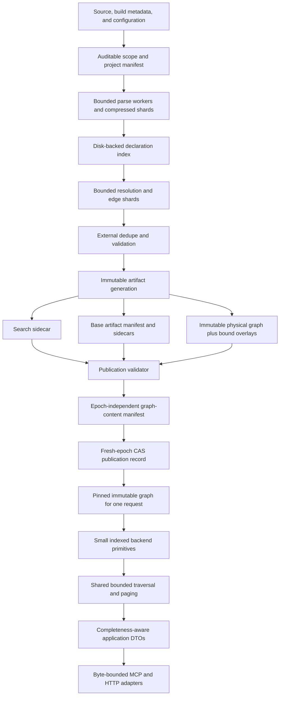

# CIH Large-Repository Correctness, Scale, and Reliability Program

Status: Active — implementation checkpoint recorded; program not complete

Owner: CIH maintainers

Created: 2026-07-26

Last verified against CIH commit: `13283959be2d62874dc4c366b0fbecd24c6ec164`
plus the working-tree checkpoint described in Section 2.1

Primary scale fixture: JetBrains IntelliJ Community commit
[`f0b8096f352ed37bacfc8a3fcf10e2df3fb916b0`](https://github.com/JetBrains/intellij-community/commit/f0b8096f352ed37bacfc8a3fcf10e2df3fb916b0)

## 1. Executive decision

CIH's large-repository failures do not have one cause. Four independent failure
classes were observed:

1. FalkorDB can accept Redis `PING` while its persisted graph is still loading.
2. A search index larger than its retention budget is repeatedly loaded and
   discarded.
3. Several legacy graph reads hide truncation or perform whole-graph work.
4. The analyzer retains repository-scale data structures and therefore grows
   memory with repository size.

The solution is one generation-based, bounded architecture from source discovery
through MCP serialization. Increasing timeouts or memory may mitigate one
incident, but cannot make stale, incomplete, or oversized results correct.

This plan establishes these system-wide rules:

- correctness and honest completeness are release gates, not optional metadata;
- every request has independent admission, execution, work, result, and byte
  budgets;
- graph adapters perform small indexed reads while shared Rust code owns
  traversal semantics;
- artifacts, sidecars, graph publications, semantic rows, and continuations are
  bound to explicit identities rather than mtimes;
- publication is staged, validated, atomic, and rollback-capable;
- analyzer memory is bounded by configured stages, not repository cardinality;
- unsupported semantic coverage is reported explicitly;
- performance evidence always includes a result digest and completeness state.

The program is sequenced so production correctness and availability land before
large analyzer or language-model changes.

## 2. Plan authority and related work

This document owns the cross-cutting reliability contract. Specialized plans
remain useful only within the boundaries below.

| Document | Continuing ownership | Relationship to this plan |
|---|---|---|
| [`search-index-scale-performance.md`](search-index-scale-performance.md) | Implemented lexical-search, grep, sidecar, single-flight, and bounded-work design; production gates remain open | Historical implementation specification and subordinate search workstream |
| [`graph-read-path-500k.md`](graph-read-path-500k.md) | Historical synthetic-fixture and adapter-query research | On acceptance of this master plan, mark it superseded; migrate any still-needed experiment details rather than maintain two active specifications |
| [`universal-knowledge-document-system.md`](universal-knowledge-document-system.md) | Knowledge compiler, packs, role views, AI changes, and documentation product | Separate product program that consumes the repository/artifact identities defined here |
| [`standalone-milestone-1-offline-analyze.md`](standalone-milestone-1-offline-analyze.md) | Standalone packaging only | Orthogonal and requires a current-code rebase before implementation |
| [`ARCHITECTURE.md`](../ARCHITECTURE.md) | Shipped behavior and known limitations | Updated only after each phase ships |
| [`docs/runbooks/`](../runbooks/) | Deployable commands and current configuration | Must not document proposed settings as if already shipped |
| [`docs/perf/`](../perf/) | Immutable benchmark evidence | Stores phase baselines and acceptance reports |

Once accepted, this plan controls every conflict with the graph plan. The older
graph plan must not maintain a second active set of system-wide phases or SLOs.

Plan lifecycle states are:

- `Proposed`: design is being reviewed;
- `Active`: implementation has begun;
- `Implemented - validation open`: code is present, but a mandatory live or
  production gate has not passed;
- `Complete`: code, mandatory gates, durable docs, and rollback evidence exist;
- `Superseded`: another named plan owns the remaining work.

A plan is not complete merely because unit tests pass. Completion requires its
live-backend and corpus-specific gates. Completed substantive plans move to
`docs/archive/plans/YYYY-MM/`; only redundant checklists with no durable evidence
may be deleted.

### 2.1 Implementation checkpoint — 2026-07-26

This checkpoint records what the first implementation pass actually delivered.
It does not waive the remaining phase gates, and it does not change an open item
into an implemented claim merely because an adjacent safeguard exists.

| Program slice | State | Delivered in this checkpoint | Remaining before the phase is complete |
|---|---|---|---|
| Phase -1 destructive-path guard | Implemented locally; fault evidence open | Edge-only taint stays `publication_pending`; bootstrap and normal loads use unique staging; base plus overlays are composed as a complete replacement; latest and published registry state are separated; registry promotion and pruning happen only after a successful load; the MCP response guard defaults to warning/measurement | Complete the phase fault-injection report and retain rollback evidence on a qualification host |
| Phase 0 trustworthy harnesses | Partial | Backend-neutral graph contracts now cover route, topic/listener, table access, cycles, equal shortest paths, filters, budgets, pagination, ranges, and both Ladybug and live Falkor; the pinned IntelliJ fixture provides a real large-repository smoke workload | Freeze the dedicated approximately 500k/1.5M semantic fixture, immutable seed manifest, cleaned-full IntelliJ manifest, qualification-host profile, and three-run release evidence |
| Phase 1 identity, containment, and readiness | Partial | Registry writes use an inter-process lock, reread under lock, unique temporary files, `fsync`, atomic rename, backup recovery, monotonic revision, and digest; immutable 64-hex `RepositoryId` migration exists; published artifact/content/epoch mirrors update only after load; backend errors are typed; Falkor reads have backend and driver timeouts with cancellation-safe admission; restore readiness uses `INFO persistence`, is cached/single-flight, and gates graph operations while file/search/status remain available; validated cache, grep, response, and inference limits are composed at startup | Add the authoritative backend-local publication store, immutable epoch-specific physical graphs, fenced CAS, request-pinned publication identity, authoritative manifest transport, operational repository readiness, crash reconciliation, and rollback |
| Phase 2 truthful bounded contracts | Implemented locally; corpus gates open | Authenticated, expiring, operation-bound cursors cover independent context sections and repository pages; cursors bind registry or graph publication identity; expanded search has aggregate node/edge/byte budgets, deduplication, endpoint closure, and honest traversal versus presentation status; legacy repository listing fails loudly when it cannot remain exact; architecture sections degrade independently; exact JSON-RPC envelope measurement and optional hard enforcement are implemented | Run the recorded 2,141-caller, 16,027-impact, multi-page, mutation, and payload gates on immutable published fixtures |
| Phase 3 shared graph kernel | Core implemented; full specification partial | A backend-neutral BFS owns execution flow, shortest paths, CALLS impact, and multi-root stored-orientation subgraphs; adapters expose deterministic batched one-hop transitions capped at 256 sources; 10,000-node and 50,000-edge budgets, cycles, equal-depth predecessors, reverse evidence, stable ordering, filters, and inconclusive status are shared; Ladybug and live Falkor pass the common contract | Finish the persisted `edge_uid` plus backend keyset-page contract, migrate/deprecate remaining raw neighbor and call-chain paths, and publish the required high-fan release benchmarks |
| Phase 4 O(1) reporting and indexes | Partial | A publication-bound `RegistryGraphReport` supplies exact reduced totals, per-kind counts, and 256 deterministic symbol hubs to architecture summary/default symbol-pool reads; arbitrary node properties are stripped and serialized reports are capped and revalidated at 256 KiB; stale or inconsistent reports use the legacy fallback; required Falkor indexes for `Symbol.id`, `kind`, `name`, and `file` are centralized and unexpected DDL failures invalidate staging | Move the report into the authoritative graph-content manifest; make general `graph_overview` use bounded structural-node/selected-edge projections; verify operational index state after load; capture live `GRAPH.EXPLAIN`/`GRAPH.PROFILE` evidence; remove repeated global-scan fallback from republished graphs |
| Phase 5 publication hardening | Open beyond prerequisites | Generation-aware fields, safe staging, and post-publication cleanup are prerequisites now present | Implement one authoritative coordinator, full overlay manifests, fenced pointer CAS, request-aware retention, crash recovery, rollback, and generation-bound graph caching |
| Phase 6 bounded analyzer | Open | Search-sidecar construction releases large edge collections before building and reporting metadata reuses resident graph data | Implement streaming parse/resolve/emission, disk-backed indexes, bounded queues, explicit size/complexity skips, and the qualification RSS gates |
| Phase 7 project model and fidelity | Open | Existing DI, SQL, accessor, and parser-schema correctness fixes are preserved | Implement the canonical project model, durable symbol identity, Kotlin reference semantics, IntelliJ extension modeling, and the defined truth-corpus gates |
| Phase 8 semantic search | Partial containment only | Synchronous inference moved to a bounded blocking lane with admission, timeout, cancellation-safe capacity ownership, metrics, and validated runtime configuration | Bind semantic rows to repository/artifact/model generations, remove production model ambiguity, add rebuild/state transitions, and pass lexical/hybrid isolation and offline gates |
| Phase 9 knowledge compiler | Open | No completion claim | Implement generation-bound knowledge IR/packs, provenance, OpenWiki import/export validation, and compatibility policy |
| Phase 10 qualification and closeout | Open | The local gates below are green | Complete pinned release-mode workload evidence, restore/publication/rollback drills, external OCB verification, documentation closeout, and archive only after every mandatory gate passes |

Validation completed for this checkpoint:

- `cargo fmt --all -- --check`;
- `cargo clippy --workspace --all-targets -- -D warnings`;
- `cargo test --workspace`;
- the ignored live Falkor graph-store contract, run explicitly with
  `cargo test -p cih-falkor --test falkor_integration -- --ignored --nocapture`;
- focused core, engine, graph-store, Falkor, Ladybug, store-factory, embedding,
  and server suites;
- a strictly read-only check of the pinned IntelliJ fixture and its live graph.

The read-only IntelliJ check used the pinned commit and existing artifacts; it
did not analyze, reindex, prune, migrate, or modify Docker data. The artifact,
registry, and live graph agree on 415,604 nodes and 941,559 edges. Indexed exact
node lookup was approximately 0.366 ms internally, a bounded ten-neighbor lookup
approximately 0.510 ms, and node/edge count probes approximately 0.174/0.233 ms.
The existing 2.02 GiB `.cih` directory includes parse-cache schema 27 and a
format-2 search sidecar of 120,409,953 bytes.

The same smoke check deliberately exposes migration work rather than hiding it:
the IntelliJ publication is legacy and has no repository identity, publication
epoch, graph-content binding, or persisted graph report, and its live Symbol
index lacks the newly required `file` field. It therefore does not prove the new
publication/readiness path. The external OCB repository is not local and its
change-password gate has not been run. The 50-sample, three-run qualification
matrix, restore drill, concurrent-publisher fencing, crash matrix, and rollback
drill also remain mandatory. The macOS Ladybug/server test link still emits the
known duplicate-Zstd-symbol warning, although the tests pass.

### 2.2 Publication-store foundation checkpoint — 2026-08-03

The first bounded Phase 1 publication slice is implemented on branch
`feat/authoritative-publication-foundation`. It adds the backend-neutral
`GraphPublicationStore` lifecycle port and validated publication identities without
expanding the existing `GraphStore` read/write trait. Ladybug persists immutable epoch
records and commits `(epoch, fencing token)` through a same-directory, write-through
atomic `CURRENT` replacement. Falkor persists the same contract through one Redis Lua
CAS whose keys share a cluster hash slot. The store factory constructs the lifecycle
port independently from graph-query stores.

The shared contract proves expected-epoch conflicts, monotonic fencing, immutable
epoch lookup, repository binding, durable reconnect, orphan-epoch safety, and exactly
one winner for concurrent CAS attempts. Server repository resolution supports an
injected authoritative store and connects the request to its immutable physical graph
key. Production injection remains deliberately disabled until the engine coordinator
writes authoritative records, so file/search-only requests do not gain a premature
backend dependency.

This is not Phase 1 completion. The engine publication coordinator still has to load
directly into immutable physical graph keys, produce the manifest and validation
digests, acquire durable publisher leases/tokens, CAS the new record, mirror the
registry only after CAS, and reconcile abandoned candidates. The shared request
context must expose the pinned publication identity in a separately reviewed change;
its current shape has a high application-wide blast radius. Browser/readiness paths
also remain on their legacy primary-store wiring until that coordinator is active.

## 3. Current baseline

### 3.1 Capabilities that must be preserved

The following work is already implemented and is not to be redesigned without a
measured regression:

- parse cache schema 27 and its golden guard;
- search sidecar format 2, including `DbQuery` documents;
- retained weighted caches, result-carrying search single-flight, bounded cold
  memory admission, bounded scorer execution, and search metrics;
- grep concurrency default 2, cooperative deadlines, exact-file containment,
  directory-symlink rejection, and partial-result behavior;
- MCP `read_file` with inclusive `start_line`/`end_line`, file-byte validation,
  default line caps, and truncation guidance; a separate source-snippet tool is
  not required for the known large-method workflow;
- `RegistryStats.routes_current` and legitimate-zero versus legacy-stale route
  reporting;
- safe event-based DI XML parsing, deterministic conflicting bean-ID behavior,
  qualifier binding, Unicode-safe SQL detection, objectless configured SQL
  constants, and strict accessor recognition;
- centralized node projections with source ranges in both graph adapters;
- backend-neutral `trace_flow` and `reaches` traversal over batched
  `execution_transitions`;
- 256-source batches, 10,000-node and 50,000-edge traversal budgets, cycle
  termination, stable ordering, equal shortest predecessors, reverse route and
  listener evidence, checked trace offsets, and explicit inconclusive reachability;
- independent architecture summary failure handling, route `limit + 1` exactness,
  and DB-effect incompleteness on traces.

These features receive regression tests in this program but are not re-opened as
new implementation work unless a fixture proves a defect.

### 3.2 Measured IntelliJ platform fixture

The pinned, sparse IntelliJ `platform` scope contains:

| Dimension | Measured value |
|---|---:|
| JVM files | 27,605 |
| Java / Kotlin / KTS | 15,085 / 12,469 / 51 |
| Source LOC | approximately 3.257 million |
| Graph nodes | 415,604 |
| Graph edges | 941,559 |
| Resolved edges | 525,850 |
| Unresolved references | 290,254 |
| Artifact directory | approximately 2.0 GiB |
| Analyze without load | 16.93 s, approximately 4.08 GiB peak RSS |
| Analyze plus load | 21.04 s, approximately 4.62 GiB peak RSS |
| No-op analyze | 2.78 s |
| Falkor steady memory | approximately 606 MB |
| Falkor observed peak | approximately 962 MB |
| Search documents | 371,090 |
| Search sidecar payload | approximately 120.4 MB |
| Retained search weight | approximately 144.4 MB |
| Cold search | approximately 301 ms |
| Warm search p95 | approximately 1.65 ms |
| Exact file read | approximately 1.4 ms |
| Exact-file grep | approximately 1.1 ms |
| Broad no-match Java grep | approximately 1.15 s over 15,490 files |
| Representative `trace_flow` | approximately 20 ms |
| Representative `reaches` | approximately 6-8 ms |

Sixteen concurrent cold searches correctly produced one load and fifteen flight
joins. When the search retention budget was deliberately lowered below the
144.4 MB decoded weight, two sequential requests both performed a roughly
322-326 ms cold load and retained nothing. This reproduces the production
409,409,243-byte oversize-cache incident.

The selected fixture is a scale and Java-call-graph workload, not a semantic
truth corpus. The current Kotlin provider emits declarations but no ordinary
reference sites, and IntelliJ's `plugin.xml` semantics are not modeled.

### 3.3 Confirmed high-fan-out failures

| Operation | Observed behavior | Correct interpretation |
|---|---|---|
| `context` for `ApplicationManager#getApplication/0` | returned 100 callers | direct graph count was 2,141; the result was silently truncated |
| upstream `impact` depth 4 for the same symbol | returned exactly 200 and claimed complete | direct reachability count was 16,027; completeness and risk were false |
| `query(expand=true)` with ten hits | approximately 1.2 MB response | duplicated seeds/subgraphs, unbounded neighbor edges, and dual MCP encoding dominate |
| expanded high-degree single hit | approximately 1.1 MB response | low latency does not make the response correct or safely bounded |
| `graph_summary` relationship count | approximately 984-1,004 ms | it collides with the deployed Falkor 1,000 ms global timeout |
| default `architecture_overview` | approximately 3.0 s with optional failures | summary and degree scans repeat whole-graph work |
| `list_repos` | 288 entries, approximately 287 KB | registry enumeration is not paged and stale test entries accumulate |

### 3.4 Incident diagnosis

The original MCP session was healthy: initialization and repository listing
completed. The later `BusyLoadingError` has a distinct meaning: Redis/FalkorDB
was restoring its dataset and could not yet execute graph queries. Separately,
the 409 MB search index exceeded a 256 MiB retention budget and was repeatedly
loaded without being retained. Slow global graph reads and oversized expansion
responses are a third failure class.

A large method such as the observed approximately 680-line authentication method
increases source payload and often correlates with a large neighborhood, but it
does not cause `BusyLoadingError`. The expensive operation is the legacy 360-degree
graph expansion around its callers/callees/processes; a line-range `read_file`
request remains bounded even for that method.

These must remain separate in logs, metrics, alerts, and remediation:

- MCP/session connectivity;
- backend restore readiness;
- admission saturation;
- search cold load or retention failure;
- graph execution time;
- traversal/result truncation;
- serialization and response delivery.

Until the bounded graph phases ship, the safe operational path for a known large
method is exact symbol search, then `read_file` on the returned path and line
range. Do not expand it through legacy `context` or replace an exact range read
with repository-wide `grep_files`. During `BACKEND_LOADING`, wait for readiness
instead of reconnecting repeatedly; a new MCP session does not accelerate Redis
restore.

## 4. Confirmed issue inventory

### 4.1 P0 correctness and availability

| ID | Problem | Current source anchor | Required outcome |
|---|---|---|---|
| REL-01 | `ensure_schema` discards all Falkor index DDL errors, including loading failures | `crates/cih-falkor/src/query.rs::ensure_schema` | classify already-exists separately; propagate all unexpected failures |
| REL-02 | Docker health uses Redis `PING`, which can pass while the graph dataset is loading | `docker-compose.yml` | restore-aware health/readiness and a graph-generation probe |
| REL-03 | `/ready` checks `communities()` and artifact-directory existence only | `cih-server/src/application/browser.rs::ReadinessService` | explicit state machine with loading, generation, indexes, graph query, and sidecar checks |
| REL-04 | read retry waits 20 seconds per caller and timeout remediation names the write knob | `cih-falkor/src/lib.rs` | one shared readiness monitor, correct typed errors, retry-after, compatibility backstop only |
| REL-05 | semaphore admission does not stop a running Falkor query | `FalkorStore::run` | `GRAPH.QUERY TIMEOUT` plus application deadline and cancellation accounting |
| GRAPH-01 | `impact` enumerates variable-length paths, caps at 200, and is marked exact | both graph adapters; `GraphQueryService::impact` | shared bounded BFS with honest status and risk exactness |
| GRAPH-02 | `context` hard-caps unordered callers/callees at 100 | both graph adapters; raw `SymbolContext` | independently bounded, stable context sections with `has_more` |
| GRAPH-03 | `subgraph` is per-seed, recursive, not deduplicated, and edge-unbounded | both graph adapters | shared bounded expansion with endpoint closure and byte control |
| PUB-01 | fixed `<graph>-staging` keys allow publisher collisions and no graph generation is recorded | `cih-engine/src/db.rs` | unique staging, validated publication epoch, atomic pointer, rollback |
| PUB-02 | taint publishes an edge-only artifact through replacement-style staging | `cih-engine/src/cmd/taint.rs` plus `db::load_to_store` | one publication coordinator composing base and optional overlays; never publish an edge-only replacement |
| PUB-03 | artifact bootstrap bulk-loads the live graph directly | `cih-engine/src/cmd/artifact.rs` | use the same staged, validated publication coordinator |
| PUB-04 | registry writes are unlocked/direct and artifact state can advance on `--no-load` or failed publication | `cih-core/src/registry.rs`; analyze/discover command paths | locked atomic registry storage; separate latest artifact from authoritative published state |

`PUB-02` must be audited and fixed before relying on the current staged loader:
an empty-node taint artifact must not replace a complete live graph.

### 4.2 P1 bounded serving and query efficiency

| ID | Problem | Required outcome |
|---|---|---|
| SERVE-01 | MCP JSON is emitted in both legacy content and `structuredContent` with no general hard cap | application-owned logical budgets plus transport serialized-byte guard |
| SERVE-02 | `list_repos` returns the complete registry | stable filter/page/cursor and explicit dry-run stale pruning |
| SERVE-03 | architecture entrypoint pool failure suppresses the scheduled sidecar | independent subqueries and independent availability |
| GRAPH-04 | `graph_summary` performs three full scans | generation-manifest read or proven constant-time metadata |
| GRAPH-05 | `graph_overview` repeats counts and globally sorts broad symbol sets by degree | precomputed hubs/anchors plus bounded selected-node reads |
| GRAPH-06 | `neighbors` is unbounded and `call_chain` hides `LIMIT 25` | paged neighbors and shared bounded shortest CALLS path |
| GRAPH-07 | required index DDL is duplicated, errors are discarded, and `Symbol(file)` is missing | centralized definitions, status verification, and plan evidence |
| SEARCH-01 | an oversize index is explicitly served but guaranteed to reload on every later request | startup/hot-set preflight and explicit oversize policy |
| SEARCH-02 | retrieval and cache-budget environment is reparsed by multiple runtime components | construct and inject one validated serving configuration composed from `RetrievalConfig` and `CacheBudgets` |
| SEARCH-03 | some admission errors omit the exact tuning knobs | every rejection names the relevant count, byte, and timeout settings |

### 4.3 P2 analyzer scale and fidelity

| ID | Problem | Required outcome |
|---|---|---|
| ANALYZE-01 | parse units, parsed files, indexes, nodes, edges, diagnostics, and search construction overlap in memory | staged streaming pipeline with bounded queues and disk-backed indexes |
| ANALYZE-02 | JSONL emission builds parallel chunks and then a second complete byte vector | streaming atomic writers with checksums |
| ANALYZE-03 | parser reads every selected file fully and has no size/complexity limit | configurable limits and explicit skipped/incomplete diagnostics |
| ANALYZE-04 | cached units are all reloaded and recombined for resolve | shard/index-based access and safe invalidation scopes |
| ANALYZE-05 | similarity LSH buckets can produce unbounded pairwise work | deterministic bucket/pair budgets and incompleteness metrics |
| ANALYZE-06 | content-only parse keys can reuse a `ParsedUnit` whose embedded relative path/module is wrong | path/module-safe key now; path-independent rebasable IR only after proof |
| ANALYZE-07 | native bulk loading, bundles, and downstream commands can re-materialize repository-scale data | stream and independently bound every artifact consumer/producer |
| SCOPE-01 | hard ignores conflate traversal safety with repository source policy | non-overridable safety rules plus overridable source policy |
| SCOPE-02 | no JPS/Bazel or source-set model | canonical module/dependency/source-set model |
| SCOPE-03 | tests, previews, samples, fixtures, and generated sources can pollute production identity | auditable scope manifest and production defaults with positive/negative probes |
| ID-01 | callable IDs use owner, name, and arity only | module/source namespace and normalized signature identity v2 |
| KOTLIN-01 | Kotlin emits declarations/routes but no normal reference sites | explicit coverage state, then heuristic and compiler-assisted resolution tiers |
| FRAMEWORK-01 | IntelliJ `plugin.xml` registrations are not represented | dedicated safe extractor over the normalized graph IR |

### 4.4 P3 semantic search and knowledge-system gaps

| ID | Problem | Required outcome |
|---|---|---|
| SEM-01 | semantic rows are not isolated by repository, artifact, and exact model | versioned semantic generations with immutable repository identity |
| SEM-02 | server hard-codes MiniLM while CLI permits another model | one shared model parser and persisted fingerprint |
| SEM-03 | synchronous model inference holds a mutex in async request execution | dedicated blocking lane with permit lifetime covering uncancellable inference |
| SEM-04 | model cache/offline behavior is not one canonical CIH contract | `CIH_EMBED_CACHE_DIR`, prefetch manifest, and network-disabled validation |
| DOC-01 | wiki page taxonomy, dispatch, and eager generation are hardcoded | typed knowledge compiler and lazy role views |
| DOC-02 | resident wiki retains graph-scale data and eagerly renders low-value pages | bounded SQLite service/workspace packs and server-side search/paging |
| DOC-03 | AI edits prose locations rather than typed, evidence-backed state | validated change sets, provenance, review, and authored-state protection |

## 5. Goals and non-goals

### 5.1 Goals

1. Never present a backend-limited or budget-limited collection as complete.
2. Keep ordinary MCP operations below client timeout without allowing abandoned
   backend work to continue unbounded.
3. Make startup and restore state explicit and prevent graph-request stampedes.
4. Eliminate repeated search-index reload caused by a knowingly unretainable hot
   index.
5. Make summary and default overview independent of live whole-graph scans.
6. Make graph publication generation-aware, atomic, and rollback-capable.
7. Keep analyzer memory and staging disk within declared budgets.
8. Model repository modules and source sets before introducing signature IDs.
9. Report per-language and per-framework semantic coverage.
10. Preserve local/offline lexical operation when semantic or LLM systems are
    absent.
11. Validate scale and semantics with different fit-for-purpose corpora.
12. Leave durable architecture, runbook, and performance evidence when each phase
    closes.

### 5.2 Non-goals

- Raising all timeouts until current whole-graph queries happen to finish.
- Treating more container memory as the analyzer architecture.
- Replacing the working shared `trace_flow`/`reaches` BFS with Falkor-only path
  procedures.
- Claiming IntelliJ is a Spring, SQL, Kotlin, or XML semantic gold standard.
- Running the raw full IntelliJ tree as the initial production semantic scope.
- Enabling graph-result caching before an authoritative live graph generation
  exists.
- Enabling hybrid search before repository/artifact/model isolation exists.
- Replacing CIH's evidence graph with OpenWiki or Markdown files.
- Performing in-place destructive graph schema migrations.
- Claiming the external OCB gate passed from local-only evidence.

## 6. System invariants

### 6.1 Identity

The following identities must be distinct:

| Identity | Semantics |
|---|---|
| `RepositoryId` | portable immutable repository identity persisted in repository metadata and bundles; survives path, name, graph-key, and host changes |
| `AnalysisInputFingerprint` | deterministic digest of sorted relative inputs, effective configuration, and semantic schemas |
| `ArtifactVersion` | deterministic full digest of canonical base analyzer outputs |
| `GraphContentVersion` | deterministic digest of base artifact plus the exact ordered overlay set and graph-model/loader schema |
| `GraphPublicationEpoch` | fresh opaque value for every successful current-publication pointer change, even for identical graph content |
| `RegistryRevision` | monotonic revision plus full registry-content digest for stable registry paging and write reconciliation |
| `KnowledgeGenerationId` | deterministic identity of canonical knowledge-compiler inputs |

`graph_key` remains a physical backend locator and compatibility alias. It is not
the future repository identity. Registry migration adds `RepositoryId` and a
repository-owned identity record. Bundle export/import preserves it. Registering
the same ID at two writable paths is rejected unless the operator explicitly
creates a new repository identity or declares a read-only alias. Losing both the
repository identity record and every bundle/registry backup creates a new
identity; it is never reconstructed from a mutable path.

Current registry writes are neither locked nor atomic. The migration therefore
first introduces a registry storage boundary with an inter-process write lock,
read-latest-under-lock, same-directory temporary write, file `fsync`, atomic
rename, parent-directory `fsync`, backup, and corruption recovery. Only then does
an idempotent migrator allocate collision-safe IDs for legacy entries. Once
assigned, an ID is never recomputed. Every successful registry mutation also
increments `RegistryRevision` and stores the full canonical content digest under
the same atomic write; read-only status probes do not change it.

Repository ID is not included in canonical Node IDs or artifact content digests,
so identical source/configuration produces portable deterministic artifacts across
hosts. All identities use full BLAKE3 digests over domain-separated,
length-prefixed canonical records with recursively sorted object keys.

`AnalysisInputFingerprint` contains sorted normalized relative paths and content
hashes, the canonical effective analyzer/project/scope configuration, and every
semantic schema/provider version that can change logical output.

`ArtifactVersion` contains the analysis-input fingerprint and these canonical
base streams after deterministic reduction:

- nodes and all semantic node properties;
- edges, confidence/reason/call-site evidence, and semantic edge properties;
- unresolved/ambiguous-reference diagnostics;
- coverage, scope, route-freshness, and completeness records that describe the
  trustworthiness of those streams.

It explicitly excludes `RepositoryId`, its own version field, the manifest
envelope and checksum table, timestamps, absolute paths, discovery/shard order,
JSON/compression bytes, parsed debug data, lexical search/hub summary sidecars,
community/taint/PDG overlays, semantic embeddings, and knowledge packs. Those are
derived from or composed with `ArtifactVersion` and carry their own digests.
This removes self-reference and allows representation-only rebuilds without a
false semantic version change.

Existing 16-hex versions deserialize only as an explicit legacy identity. They
are never treated as equal to a full digest by prefix and cannot enable current-
generation caching or continuation. A normal re-analysis/republish upgrades them;
no in-place graph mutation is required.

Every overlay manifest declares its kind, version, digest, and exact base
`ArtifactVersion`. `GraphContentVersion` hashes the base artifact, ordered included
overlay descriptors, deterministic merge-policy version, and graph-model/loader
schema. A requested stale overlay fails publication; an automatically discovered
stale optional overlay is explicitly excluded with a recorded warning. It is
never accidentally carried forward or silently dropped.

An overlay digest covers its canonical reduced nodes/edges/evidence and semantic
configuration, excluding its envelope, checksum field, timestamps, paths, and
encoding. `GraphContentVersion` therefore changes for semantic overlay changes,
not for moving or recompressing the same component.

`GraphPublicationEpoch` is an opaque collision-safe value allocated before
staging; it is not a timestamp or content hash. Semantic generations are keyed by
`RepositoryId`, `ArtifactVersion`, exact model fingerprint, and embedding schema.
Search sidecars are keyed by artifact identity and search format. Graph query
continuations are keyed by graph publication epoch.

### 6.2 Completeness

Every bounded application result separates evaluation completeness from page
presentation:

```rust
enum EvaluationStatus {
    Complete,
    Inconclusive,
    Unavailable,
}

enum EvaluationReason {
    NodeBudget,
    EdgeBudget,
    PathBudget,
    BackendLimit,
    ResultLimit,
    ResponseLimit,
    PageOffset,
    DependencyUnavailable,
    DbEffectsUnavailable,
    MetadataUnavailable,
    CoverageIncomplete,
    GenerationChanged,
}

struct PageBounds {
    returned: usize,
    limit: usize,
    total_known: Option<usize>,
    has_previous: bool,
    has_more: bool,
    previous_cursor: Option<String>,
    next_cursor: Option<String>,
    result_limited: bool,
    response_limited: bool,
}
```

Existing `complete`, `returned`, `total_known`, `omitted`, `failed`, `limit`, and
string `reasons` fields remain during compatibility. `evaluation`, page bounds,
typed traversal statistics, and continuation metadata are additive. The legacy
aggregate `complete` is true only when evaluation is complete, the returned page
has neither previous nor later omitted results, and every required component is
available. A later page can therefore have `evaluation.status=complete` while the
legacy aggregate remains false.

Context caller/callee/process sections, architecture sections, and trace
`db_effects` each carry their own evaluation and page/component bounds. One
component failure does not rewrite another component's status. An exact total is
populated only after observing the full collection or reading a validated
authoritative manifest.

A short backend page is not proof of completeness. A traversal stopped by a work
budget is inconclusive, not unreachable. Result- or response-limited evaluation
may still be computationally complete while its page reports more data. Risk
derived from a truncated population is marked `lower_bound`.

### 6.3 Work and response bounds

Every interactive operation has five independent controls:

1. admission queue timeout;
2. backend/application execution deadline;
3. work budget such as files, nodes, edges, or paths;
4. logical result/page limit;
5. serialized-response hard cap.

The application layer owns work, result, and estimated-byte budgets. The
transport measures the complete uncompressed JSON-RPC/SSE envelope, including
legacy text plus `structuredContent` while both are emitted. It records exact
wire bytes and enforces a final hard guard. Ordinary responses target at most
256 KiB. The guard first ships in measurement-only mode with a ceiling above the
largest known successful response; Phase 2 introduces logical paging before a
1 MiB enforcement ceiling is enabled. Exceeding an application byte budget
returns a valid partial page with `response_limit`; exceeding the transport
safety guard is an implementation bug and returns a typed bounded error rather
than sending an oversized payload. Existing smaller operation-specific limits,
such as the architecture overview backstop, remain in force and take precedence;
the global target is not permission to enlarge them.

### 6.4 Publication and rollback

- A physical graph name is immutable and unique per materialization attempt. A
  later rollback publication may point to a retained physical graph under a fresh
  publication epoch; the graph itself is never renamed or mutated.
- Base, community, taint, PDG, and future overlays are composed by one publication
  coordinator.
- The active graph is never mutated in place by production commands.
- Counts, required indexes, sample paths, sidecars, and generation metadata are
  validated before publication.
- One backend-local, compare-and-swap `CurrentPublication` record is the sole
  atomic publication authority. It contains repository ID, physical graph key,
  artifact version, graph content version, publication epoch, graph-content-
  manifest digest, validation digest, and previous epoch.
- Registry data is discovery/configuration and a reconciled mirror. A filesystem
  registry update is never part of the atomic commit and cannot make a graph
  current.
- Publication uses an expected-current epoch and a per-repository lease/fencing
  token. Two concurrent publishers cannot let an older build overwrite a newer
  one.
- A request resolves and pins one immutable physical graph key once. Every query
  in that request uses the same graph, so a pointer change cannot produce a mixed
  result.
- A failed build, validation, or pointer CAS leaves the previous publication
  current.
- At least one previous compatible generation is retained within a byte/count
  policy.
- Admitted requests hold a bounded generation lease/reference so garbage
  collection cannot delete their graph. Old generations are removed only after
  request grace, retention checks, and pointer/reference revalidation.
- A crash reconciler removes abandoned staging graphs and repairs registry mirrors
  without changing the authoritative pointer.
- Rollback copies a retained validated publication's physical graph/content
  references into a new `CurrentPublication` with a fresh epoch, then performs an
  explicit pointer CAS. Epochs never repeat, so cursors and caches cannot suffer
  an ABA rollback.
- Caches never cross publication epochs.
- Legacy stable-key repositories are discoverable with readiness state
  `DEGRADED` and issue code `LEGACY_GRAPH_REPUBLISH_REQUIRED`; safe file/search
  operations may remain available when their artifacts validate.
  Graph tools return `republish_required` by default. An explicit administrative
  read-only compatibility mode may allow documented single-backend-call graph
  lookups only while all publishers for that repository are disabled; it never
  enables multi-query traversal, continuation, cache, or completeness claims.

### 6.5 Analyzer safety

- Peak memory is bounded by stage configuration, worker count, shard size, and
  disk-index cache rather than total repository size.
- Disk preflight accounts for the active generation, staging generation,
  temporary sort/shard data, rollback retention, and safety margin.
- Discovery produces an auditable decision for every candidate file.
- Unsupported or skipped input is status data, never silently interpreted as no
  behavior.
- Cache reuse includes parser schema, project model, scope policy, configuration,
  and symbol-identity version.
- Ambiguous declarations are omitted or surfaced as ambiguous; discovery order
  never selects the winner.

## 7. Target architecture



### 7.1 Artifact, graph-content, and publication records

The base analyzer publishes an immutable checksummed artifact manifest with at
least:

- `RepositoryId`, source revision, analysis input fingerprint, artifact version,
  and configuration digest;
- parser, artifact, search, symbol-ID, graph-model, and coverage schema versions;
- selected file counts and LOC by language, module, and source set;
- included, excluded, skipped, declarations-only, heuristic, and resolved counts;
- base node and edge totals by kind;
- resolved and unresolved-reference counts and callable coverage;
- route count and exactness/freshness;
- encoded search payload and estimated decoded weight;
- canonical artifact sizes and staging-space estimate;
- checksums for every immutable artifact and sidecar.

Every community, taint, PDG, or future overlay has its own immutable component
manifest bound to the exact base artifact.

After deterministic composition, the publication coordinator writes an immutable,
epoch-independent `GraphContentManifest` containing:

- graph content version;
- ordered included component descriptors and explicitly excluded stale optional
  components;
- deterministic node/edge evidence merge-policy version;
- exact final unique node and edge totals by kind;
- deterministic top hubs globally and by kind;
- bounded structural anchors and entrypoint summaries;
- final route/coverage/overlay status;
- required graph-index definitions;
- content-addressed repository-relative artifact/component references and all
  component semantic digests.

It excludes publication epoch, physical graph key, prior epoch, timestamps, and
per-load index/probe outcomes. Those belong to `CurrentPublication`, the
fresh-epoch authoritative publication record. That record binds the repository,
immutable physical graph, artifact/content versions, graph-content-manifest
digest, previous epoch, and validation digest. Rollback can therefore reference
the same retained graph/content manifest through a new record without rewriting
semantic metadata or reusing an epoch.

The graph-content-manifest digest covers its canonical body but excludes the
outer checksum/version field itself. Absolute storage paths and serialization or
compression bytes are never part of graph-content identity.

`graph_summary` and overview use the graph-content manifest, not base
artifact counts or `LoadStats`; load statistics describe input work and are not
proof of final unique cardinality.

The manifest is an immutable checksummed artifact exposed through an application
`GraphContentManifestStore` port.
`CurrentPublication.graph_content_manifest_digest` is the authoritative binding.
`RepoContextProvider` loads that exact digest and verifies it once per pinned
request/context; graph adapters never read the filesystem.
Missing or mismatched metadata yields `metadata_unavailable` and blocks
manifest-dependent readiness rather than falling back to a global graph scan.

The server never uses artifact-directory mtime as a graph generation. It may use
mtime only as a legacy discovery hint before validating the manifest.

### 7.2 Graph backend boundary

Adapters own:

- exact node lookup;
- deterministic indexed one-hop reads;
- bounded selected-ID reads;
- bounded edges among a selected node set;
- schema/index creation and verification;
- immutable physical-graph creation and deletion primitives;
- backend health reads.

A separate `GraphPublicationStore` owns the authoritative logical-to-physical
publication pointer. Graph queries cannot mutate it, and registry persistence is
not part of it. This separation prevents an ordinary `GraphStore` implementation
from accidentally treating graph replacement and pointer publication as one
best-effort operation.

Shared `cih-graph-store` code owns:

- logical versus stored edge direction;
- BFS/shortest-path behavior;
- depth and cycle semantics;
- stable ordering and predecessor selection;
- node, edge, path, and result budgets;
- continuation and generation checks;
- path reconstruction;
- completeness and traversal statistics.

### 7.3 Readiness model

Readiness has two levels. `BackendReadiness` reports Redis/Falkor connectivity,
restore/loading state, and the publication-store dependency. `RepoReadiness`
reports the current pointer, physical graph, required indexes, composed
graph-content manifest, and search sidecar for one repository. Overall `/ready`
requires backend readiness plus every declared hot repository; a request for any
other repository performs or consults that repository's bounded readiness check.

The hot set is explicit through proposed `CIH_HOT_REPOS`. Its default is the
primary configured repository only. It never means every registry entry, so 288
stale or cold registrations cannot make process startup scan or warm 288 graphs.
A declared-hot legacy repository keeps overall state `DEGRADED` with issue
`LEGACY_GRAPH_REPUBLISH_REQUIRED` until it is republished, and `/ready` returns
HTTP 503. Component-level MCP/application checks may still permit validated
file/search/status operations for directly connected clients, but graph readiness
does not pretend a missing pointer is current. Deployments that want a
component-degraded load-balancer policy must expose a separate explicitly named
endpoint; `/ready` retains the strict contract.

The server exposes stable component states:

```text
STARTING
  -> BACKEND_LOADING
  -> PUBLICATION_CHECK
  -> INDEX_CHECK
  -> SIDECAR_CHECK
  -> WARMING
  -> READY
             \-> DEGRADED
```

`/health` remains process liveness. The HTTP listener starts without graph DDL,
even while a 60-second restore is active. A typed background monitor checks
loading and bounded repository readiness. Index creation belongs to publication
or an explicit administrative repair workflow, never a readiness probe.
`/ready` returns HTTP 200 only for `READY`; `STARTING`, `BACKEND_LOADING`, and
`DEGRADED` return HTTP 503 with state, bounded issue codes, generation, and retry
guidance. It
must not block for the full interactive BusyLoading retry budget. MCP graph tools
consult the same monitor and reject promptly while the backend is loading. The
existing per-query read retry remains only as a compatibility backstop for races
after readiness. The monitor single-flights probes: 100 simultaneous requests
while loading execute zero graph queries and cause at most one readiness poll per
configured poll interval.

Keep layering intact: readiness state and issue codes live in `domain`, an
application-facing `GraphReadiness` port exposes snapshots/subscription, the
Falkor infrastructure adapter owns `INFO persistence` and probe polling, and
HTTP/MCP transports only map application results. `ReadinessService` must not
grow backend-specific Redis parsing.

### 7.4 Capacity model

Server memory is planned as:

```text
base server RSS
+ retained hot search indexes
+ search concurrency * scorer scratch
+ cold-load reservation
+ graph concurrency * result/serialization scratch
+ bounded artifact/wiki/resource caches
+ at least 30% headroom
```

Falkor memory uses an additive peak model:

```text
max(
  measured restore peak,
  live graph
    + staging graph
    + retained rollback graph
    + AOF/RDB rewrite or fork copy-on-write allowance
    + concurrent query/index scratch
)
+ measured allocator/backend overhead
+ at least 30% headroom
```

Server capacity multiplies the cold-search reservation by configured cold-load
concurrency and adds encoded/mmap input, decoded index, build/scorer scratch, and
already retained hot indexes. Graph, search, grep, semantic, and artifact-loader
lanes share one top-level transient-memory admission budget so their individually
valid reservations cannot collectively exhaust the process or cgroup.

Publication disk is planned as:

```text
active artifacts
+ staging artifacts
+ staging graph persistence
+ retained rollback generation
+ external-sort/checkpoint space
+ 20% safety margin
```

For the evaluated IntelliJ platform fixture, 2 GiB is evidence only for the
single-live-graph experiment; it is not a safe atomic-publication allocation.
Qualification must measure simultaneous live, staging, rollback, persistence
rewrite, and query scratch and size the container from the additive formula. The
approximately 11 GiB free disk observed during evaluation is not enough for a
safely staged cleaned-full IntelliJ generation plus rollback and graph
persistence.

## 8. Implementation program

Phases are gate-driven rather than calendar promises. Every phase includes code,
tests, a before/after report, rollback, and durable-document closeout.

### Phase -1 - Immediate destructive-path guard

#### Objective

Remove known ways to corrupt the published graph or lie about published state
before running a long baseline or adding new query behavior.

#### Changes

1. Reject edge-only taint publication through the replacement loader. Until
   composition is implemented, taint may write a bound overlay artifact but must
   force `--no-load` and report `publication_pending`.
2. Stop artifact bootstrap from loading directly into the current physical graph;
   it must use a unique staging key and leave current publication untouched until
   validated publication exists.
3. Replace every fixed staging key with a cryptographically unique,
   repository-scoped attempt key and record its owner/creation metadata for
   recovery.
4. Split registry state into `latest_artifact_version` and
   `published_artifact_version`/`published_epoch`. `--no-load`, failed load, and
   failed validation may update only the latest-artifact fields; they cannot
   claim or prune published state.
5. Disable no-op publication reuse unless the authoritative current pointer,
   physical graph, content version, and artifact manifest all exist and match.
6. Postpone artifact/graph pruning until a later current-pointer commit succeeds
   and retention has selected a safe rollback generation.
7. Add the response-byte guard in metrics-only mode at a ceiling above the known
   approximately 1.2 MiB response. Do not convert an existing successful request
   into a transport error before Phase 2 paging can return a complete logical
   page.

#### Exit gate

- Edge-only taint and bootstrap cannot replace or mutate the current graph.
- A killed, failed, or `--no-load` command cannot alter published registry fields
  or prune the current/rollback artifacts.
- Two concurrent staging attempts cannot share a key.
- Existing oversized responses are measured without a new hard regression.

### Phase 0 - Freeze evidence and build trustworthy harnesses

#### Objective

Make every later optimization comparable and make a fast wrong result fail.

#### Changes

1. Add a graph-specific approximately 500,000-node/1.5-million-edge fixture
   beside the existing Method/CALLS search fixture. Include:

   - route to handler to service chains;
   - publisher to topic to listener logical flow;
   - read and write paths to the same table;
   - cycles and equal-shortest diamonds;
   - 101-plus direct callers/callees;
   - 201-plus impact results;
   - high fan-in and high fan-out seeds;
   - at least one source with more than 10,000 transitions and a full 256-source
     batch frontier;
   - opposite-direction same-kind edges and duplicate/conflicting edge evidence;
   - overlapping subgraph seeds;
   - tests and changed-file mappings;
   - disconnected and budget-inconclusive cases;
   - structural overview nodes and promoted ranges.

2. Publish a deterministic seed manifest containing expected IDs, depth, status,
   cardinality, final edge, path count, and completeness.
3. Add a safe fixture loader using a digest-derived graph key. It must report
   native `GRAPH.BULK` versus Cypher fallback and may clean up only its exact key.
4. Extend direct adapter and MCP runners to record:

   - p50, p95, p99, min, max, errors, and timeouts;
   - queue, backend, application, serialization, and total time;
   - returned items, response bytes, and stable result digest;
   - status, reasons, visited nodes, and expanded edges;
   - commit, fixture digest, backend image/module version, host, limits, and
     concurrency.

5. Run 50 warm samples across three release-mode runs. Collect every spawned
   task result; no discarded task or query errors are allowed.
6. Commit separate sanitized evidence for:

   - synthetic graph fixture;
   - pinned IntelliJ platform fixture;
   - Fineract semantic smoke;
   - ServiceMix XML smoke;
   - external OCB before-change report when available.

7. Before using the phrase "cleaned full IntelliJ" as a gate, commit
   `docs/perf/fixtures/intellij-cleaned-full-v1.toml` and its generated immutable
   input manifest. They pin commit, include roots, all exclusions/overrides,
   selected relative paths/content hashes, configuration digest, exact selected
   file/byte counts, and expected logical digest/counts. The intended scale band
   is 900,000-1,100,000 reduced nodes; if the frozen source policy falls outside
   it, review and version the fixture rather than silently changing scope.
8. Commit a qualification-host profile beside that fixture with CPU model/core
   count, OS/architecture, allocator, release compiler/profile, 24 GiB memory
   cgroup, and disk/filesystem. RSS gates require that profile; latency comparisons
   run on the same profile or are reported as non-comparable. These files and
   their SHA-256 digests are prerequisites, not values to fill in after a result.

#### Exit gate

- The fixture reproduces high-fan truncation, cycles, paths, paging, and budget
  cases with deterministic expected results.
- Current broken behavior is captured before fixes.
- Backend and MCP measurements contain correctness metadata and payload bytes.
- Falkor image digest and configuration are recorded.
- The cleaned-full scope and qualification-host files exist with immutable
  digests before their analyzer gates are considered runnable.
- Synthetic search evidence is not presented as graph-semantic evidence.

### Phase 1 - Authoritative identity, publication, and production containment

#### Objective

Create the minimum trustworthy publication boundary required by readiness,
paging, and later caching; then contain backend restore, runaway work, and
unretainable search indexes without terminating the server.

#### Registry and identity foundation

1. Add the registry storage boundary from Section 6.1: an inter-process lock,
   read-latest-under-lock, same-directory temporary write, file and directory
   `fsync`, atomic rename, backup, and corruption recovery. Test two concurrent
   writers and process termination at each write stage.
2. Allocate and persist immutable `RepositoryId` values through an idempotent
   migrator. Keep mutable display name, path, and compatibility graph alias
   separate.
3. Track `latest_artifact_version` independently from
   `published_artifact_version`, `published_graph_content_version`, and
   `published_epoch`. Registry publication fields are a mirror updated only
   after the authoritative pointer commits.
4. Introduce full-digest `ArtifactVersion` and `GraphContentVersion` calculation.
   The latter binds the exact base artifact, ordered overlays, merge-policy
   version, and graph-model/loader schema.
5. Write a minimal epoch-independent `GraphContentManifest` in this phase
   containing those identities, component checksums, and required-index
   definitions. Phase 4 enriches it with exact final counts and bounded hubs;
   pointer/readiness do not wait for the reporting optimization to gain an
   authoritative digest. Physical key and validation outcomes remain in the
   fresh-epoch publication record.

#### Authoritative publication foundation

Introduce a lifecycle port separate from graph reads:

```rust
struct CurrentPublication {
    repository_id: RepositoryId,
    epoch: GraphPublicationEpoch,
    graph_content_version: GraphContentVersion,
    physical_graph_key: String,
    artifact_version: ArtifactVersion,
    graph_content_manifest_digest: String,
    validation_digest: String,
    previous_epoch: Option<GraphPublicationEpoch>,
}

trait GraphPublicationStore {
    async fn current(&self, repository_id: &RepositoryId)
        -> Result<Option<CurrentPublication>>;

    async fn by_epoch(
        &self,
        repository_id: &RepositoryId,
        epoch: &GraphPublicationEpoch,
    ) -> Result<Option<CurrentPublication>>;

    async fn compare_and_swap(
        &self,
        repository_id: &RepositoryId,
        expected_epoch: Option<&GraphPublicationEpoch>,
        next: &CurrentPublication,
        fencing_token: &PublisherFencingToken,
    ) -> Result<PublicationCasResult>;
}
```

`validation_digest` identifies an immutable validation report bound to the exact
physical graph key and graph-content version. It records loader/reducer parity,
operational index status, sidecar checks, and representative probes; it is not
part of semantic `GraphContentVersion`.

1. Load every attempt into an immutable epoch-specific physical graph. Never
   rename it over a stable live graph.
2. Store the Falkor current-publication record in backend-local Redis and change
   it with one verified server-side CAS operation. Redis `MULTI`/`EXEC` command
   errors are not rollback; do not claim transaction rollback semantics.
   That operation validates the expected epoch and fencing token and writes both
   the immutable epoch record and current pointer, or neither. Retained immutable
   publication records are addressable by epoch for rollback and audit.
3. Store Ladybug's authoritative pointer in its atomic `CURRENT` record.
4. Acquire a per-repository publisher lease with a monotonically fenced token.
   A stale publisher cannot win after its lease expires.
5. Resolve and pin one `CurrentPublication` at request admission. All graph reads
   in that request use its immutable physical key.
6. Route analyze, resolve, discover, taint composition, artifact bootstrap, and
   server-driven publication through one minimal coordinator. It validates a
   complete base plus bound overlays, durably finalizes immutable artifacts,
   sidecars, and manifest before the CAS, then CAS-publishes the pointer. A crash
   before CAS leaves only an unreferenced candidate for later cleanup; only after
   CAS success may it mirror the registry or select data for pruning.
7. Before loading, reduce every edge to the canonical `(stored_src,stored_dst,
   kind)` record and persist its deterministic `edge_uid`; graph validation rejects
   missing, duplicate, or key-mismatched tokens.
8. Make no-op analysis verify that the pointer, immutable graph, content version,
   artifact, and manifest exist and agree. Missing live state forces republish,
   not a false no-op.

#### Readiness and typed backend errors

1. Preserve Redis/Falkor error kind before conversion. Use typed variants such as
   `Loading`, `Overloaded`, `ExecutionTimeout`, `Unavailable`, and `Index`, each
   with bounded dependency code and optional `retry_after_ms`; map them through
   application, MCP data, and HTTP 503 without string matching.
2. Start the HTTP listener and `/health` without running DDL. Replace the current
   startup `ensure_schema` retry-and-exit path with a background readiness
   monitor, so a measured 60-second restore cannot terminate the process after
   roughly ten seconds.
3. Monitor `BackendReadiness` separately from `RepoReadiness`. Overall readiness
   checks only `CIH_HOT_REPOS`, defaulting to the primary repository. Cold
   repositories are checked when requested.
4. Backend readiness requires connectivity, `loading:0`, and publication-store
   access. Repository readiness requires a current pointer, physical graph,
   graph-content manifest, operational required indexes, and sidecars required by the
   enabled serving configuration.
5. Index creation moves to publication/admin repair. A readiness probe observes
   index state but never performs DDL.
6. Requests consult one cached/single-flight monitor. During loading, 100
   simultaneous requests issue zero graph queries and cause at most one backend
   readiness poll per interval.
7. Keep the existing 20-second read-load wait only as a race backstop after a
   ready snapshot. Return typed retry guidance promptly in all other loading
   states.

#### Deadline, cancellation, and admission changes

1. Introduce one absolute `OperationDeadline` at application admission and pass
   it through every adapter call and BFS page. Each backend query receives
   `min(per_query_cap, remaining_operation_time)`.
2. Separate queue admission, Falkor query timeout, driver/socket I/O timeout,
   application operation deadline, and HTTP transport safety. Proposed starting
   values are 5 seconds, 10 seconds, 12 seconds, 15 seconds, and 120 seconds,
   with a one-second readiness probe. Startup validates only this internal
   hierarchy; expected client timeouts are documented guidance because the
   server cannot validate them.
3. Pass the backend cap to `GRAPH.QUERY TIMEOUT`. Inspect and record Falkor's
   global `TIMEOUT`; after global scans are removed, require it to be at least
   the adapter hard limit.
4. A query supervisor holds its semaphore and memory reservations until the
   backend call actually completes or reaches timeout plus a bounded cleanup
   grace, even if the client disconnects.
5. Use separate interactive-read, readiness, and admin/load lanes. Interactive
   limits never abort a publication load, and write/load operations retain their
   existing longer budget until a dedicated measured policy replaces it.
6. Parse validated server settings once at composition roots and inject typed
   runtime options. Infrastructure does not reinterpret environment variables.

#### Search configuration and capacity changes

1. Compose one validated serving runtime configuration from `RetrievalConfig`
   plus `CacheBudgets`; inject it into `SearchCache`, `SearchRuntime`, sidecar
   loading, file access, and metrics.
2. Preflight the declared hot set, default primary only, against both retained
   cache capacity and `CIH_SEARCH_COLD_MAX_BYTES`.
3. Reserve peak cold memory as encoded read or mmap buffer plus decoded index,
   build/scorer scratch, existing retained hot indexes, and allocator overhead,
   multiplied by configured cold concurrency and checked against an explicit or
   cgroup-derived process limit.
4. Keep one non-retaining single-flight and strict no-retain behavior. Share
   transient-memory admission with graph serialization, grep, semantic inference,
   and artifact work.
5. Ship `warn` first for compatibility. The final default is `reject` for a
   declared-hot repository that cannot meet the warm contract. An explicit
   `uncached` cold-SLO mode may serve it but must report degraded readiness,
   bounded reloads, and its own cold latency target.
6. Every admission or blocking error names the exact count, byte, concurrency,
   and timeout knobs involved.

For the observed approximately 409 MB index, a temporary measured starting point
after cgroup/headroom validation is:

```text
CIH_SEARCH_CACHE_MAX_BYTES=536870912
CIH_CACHE_MAX_BYTES=1610612736
```

These are fixture evidence, not universal defaults.

#### Serving safety changes

1. Keep the response guard measurement-only until Phase 2 logical bounds land;
   measure the complete duplicated MCP envelope.
2. Fix architecture entrypoint assembly so scheduled sidecar data remains
   available when hub queries fail.

#### Exit gate

- Concurrent registry writes and killed writes preserve a valid latest registry.
- Two concurrent publishers race on the same expected epoch and exactly one CAS
  wins; the loser cannot change current state or published registry fields.
- One thousand concurrent readers during publication observe all-old or all-new
  immutable graph identities, never a mixed request.
- Kill hooks before and after every publication step leave a valid current
  pointer; startup reconciliation repairs mirrors and abandoned staging only.
- A forced 60-second backend load leaves `/health` live, reports
`BACKEND_LOADING`, issues no graph-query stampede, and becomes ready without
process restart.
- Typed loading, overload, timeout, unavailable, and index failures preserve
  retryability and do not depend on message substring matching.
- The query supervisor proves no cancelled work exceeds its declared backend
  deadline plus cleanup grace.
- Sixteen concurrent cold searches perform exactly one load/build; a declared-hot
  oversize is explicit and cannot masquerade as warm.

### Phase 2 - Truthful, bounded application and MCP contracts

#### Objective

Eliminate false completeness and unbounded synchronous responses without waiting
for the final shared graph traversal rewrite.

#### Shared result model

1. Replace operation-specific completeness guesses with the shared status and
   reason model from Section 6.2.
2. Define operation-specific, versioned cursor payloads containing operation,
   canonical filter hash, expiry, page bounds, and the minimal stable key or
   replay state. Graph cursors additionally bind repository ID and publication
   epoch; registry cursors bind `RegistryRevision` and its content digest.
   Authenticate server-issued cursors with HMAC (including key ID for rotation);
   validate all fields before use.
3. Use keyset cursors for simple ordered lists. Traversals may use deterministic
   bounded replay or a generation-bound snapshot, but may issue continuation only
   when evaluation completed and replay is reproducible. A work-budget or backend-
   limited traversal is inconclusive and has no continuation masquerading as a
   complete next page.
4. Reject continuation after a graph publication change with
   `generation_changed`; never silently mix pages from different graphs.
5. Preserve legacy arrays and booleans. Add metadata fields rather than removing
   current fields.

#### Context

1. Add `ContextFilter` and `ContextPage` with independent caller, callee, and
   process limits, bounds, and cursors. A context request cannot use one shared
   cursor because its three sections advance independently.
2. Both adapters query each section with stable ordering and `limit + 1`.
3. Default caller/callee page size remains 100 for compatibility, maximum 500;
   the page reports `has_more` and continuation with `(name,id)` tie-breaking.
4. Default process page size is 100, maximum 500, and process lookup is bounded
   independently.
5. Keep `context()` as a compatibility wrapper until transports and callers
   migrate to `context_page()`. The wrapper succeeds only when every legacy array
   fits its exact compatibility cap; it never silently returns page one as the
   whole context.

#### Impact containment

1. Immediately stop using `ResultBounds::requested_scope` for backend-limited
   impact.
2. Before Phase 3 BFS lands, use deterministic order and `LIMIT 201`, return 200,
   and report `backend_limit`/`has_more` conservatively.
3. Add traversal metadata fields and `risk_exact`. The temporary recursive result
   always reports risk as a lower bound when capped.

#### Subgraph and expanded search containment

1. Add explicit `max_nodes`, `max_edges`, and response budget to expanded search
   and browser subgraph requests.
2. Deduplicate roots, nodes, and `(src,dst,kind)` edges in the application layer
   as an interim safety measure.
3. Remove edges whose endpoints are not present, or include the missing endpoint
   within budget; a response may not contain dangling evidence.
4. Return bounds and status. The final single shared expansion replaces this
   interim implementation in Phase 3.
5. Keep the existing top-five expansion seed limit but count all seeds against
   one aggregate result/byte budget.

#### Repository listing and transport

1. Add `list_repos_page` v2 with `filter`, `limit`, and HMAC cursor, deterministic
   `(name, RepositoryId)` ordering, default 50, and maximum 200. The first page
   captures `RegistryRevision`; a continuation rejects `registry_changed` if the
   revision/digest changed, preventing concurrent add/remove/rename from causing
   page omissions or duplicates.
2. Keep legacy `list_repos` exact only while the entire result fits the legacy
   count and wire-byte cap. Otherwise return a typed deprecation/result-too-large
   error pointing to `list_repos_page`; never silently return only page one.
3. Include stale/missing status without deleting anything.
4. Add a separate explicit registry-prune command with dry-run preview; never
   silently delete stale entries during listing.
5. Measure the full uncompressed JSON-RPC/SSE envelope. While clients require
   legacy content plus structured data, the *complete same logical result* must
   fit both representations; size pressure cannot silently omit one. Use a
   capped/counting serializer before allocation where possible.
6. Define capability/version negotiation for a short text summary plus one
   structured payload. Do not remove or truncate either legacy representation
   before negotiation.

#### Architecture independence

1. Ensure every requested architecture section has an independent result and
   warning.
2. Scheduled entrypoints load independently of graph hub/anchor results.
3. Summary absence suppresses only divergence checks that require summary data.

#### Exit gate

- The 2,141-caller probe returns a stable first 100 with `has_more=true` and a
  reproducible next page.
- The 16,027-node impact probe cannot claim `complete=true`.
- Expanded high-degree search remains below the configured hard byte ceiling,
  has no duplicate nodes/edges, and has endpoint closure.
- Two context/list pages cannot cross publication epochs.
- Tampered, expired, wrong-operation, wrong-filter, and old-epoch cursors are
  rejected deterministically.
- A registry mutation between repository pages yields `registry_changed`; it
  never resumes against a different ordering snapshot.
- The default repository page stays below the ordinary response target.
- Legacy `list_repos` is either exact or returns the documented typed migration
  error; it never claims a bounded prefix is the full registry.
- An entrypoint hub failure does not suppress scheduled sidecar entries.

### Phase 3 - Shared bounded graph kernel

#### Objective

Move `impact`, subgraph, neighbors, and call-chain semantics into the same
backend-neutral bounded layer already used by `trace_flow` and `reaches`.

#### GraphStore interface

Add an additive primitive, sharing query construction with
`execution_transitions`:

```rust
struct TransitionQuery {
    direction: Direction,
    edge_kinds: Vec<EdgeKind>,
    orientation: TransitionOrientation,
    include_node: bool,
    include_evidence: bool,
    page_limit: usize, // at most verified backend-safe limit, initially 8,000
    after: Option<TransitionCursorKey>,
    deadline: OperationDeadline,
}

struct TransitionCursorKey {
    source_id: NodeId,
    target_name: String,
    target_id: NodeId,
    edge_kind: EdgeKind,
    traversed_reverse: bool,
    stored_edge_token: String,
}

struct TransitionBatch {
    transitions: Vec<GraphTransition>,
    next_cursor: Option<TransitionCursorKey>,
    backend_limited: bool,
}

async fn batched_transitions(
    &self,
    sources: &[NodeId], // at most 256
    query: &TransitionQuery,
) -> Result<TransitionBatch>;
```

`TransitionOrientation::Execution` preserves route/listener logical reversal.
`TransitionOrientation::Stored` preserves raw graph direction for browser
subgraphs and neighbor evidence. Stable aggregate order is source ID, target
name, target ID, edge kind, and `traversed_reverse`.

`execution_transitions` remains as a compatibility/default wrapper while
existing traversal migrates.

The adapter cursor orders raw stored-edge rows by `(source_id, target_name,
target_id, edge_kind, traversed_reverse, stored_edge_token)`. The final token is a
deterministic `edge_uid` persisted at load from canonical stored source, target,
and kind after evidence reduction; it is internal and never exposed as graph
evidence. Opposite-direction edges receive distinct tokens, while conflicting
same-key evidence has already merged. Legacy graphs without `edge_uid` cannot use
this paged traversal and follow the republish/read-only compatibility policy.
Adapters request `page_limit + 1`, below the
verified Falkor result cap (initial page 8,000 versus measured
`RESULTSET_SIZE=10000`), and never infer exhaustion from a short server-truncated
result. The shared walker repeatedly pages a 256-source frontier until it is
exhausted or the operation edge/deadline budget is reached. Direction is
explicitly relative to stored or logical orientation, and truncation is aggregate
across the supplied source batch.

Publication reduces duplicate stored evidence to one `(stored_src,stored_dst,kind)`
edge using maximum confidence, deterministic reason selection,
sorted/deduplicated call-site union under an explicit cap, and canonical property
merge. Adapters verify that `edge_uid` agrees with that key. If a duplicate key or
token is nevertheless observed across pages, shared code merges it idempotently,
marks the publication/backend invalid, and reports the walk inconclusive rather
than claiming clean evidence. A backend cap or unavailable continuation likewise
makes the entire frontier layer inconclusive; no caller may claim complete-layer
processing or all equal-depth predecessors.

#### Shared impact BFS

Implement upstream, downstream, and both-direction CALLS traversal with:

- minimum-depth visitation;
- complete-layer processing;
- deterministic `(depth,name,id)` output;
- deterministic parent selection;
- cycle termination;
- result, node, and edge budgets;
- absolute operation deadline propagated through every transition page;
- explicit complete, truncated, and inconclusive states;
- `has_more` and traversal statistics;
- risk exactness or lower-bound metadata.

Do not enumerate every variable-length path. Preserve current affected-node and
risk fields for compatibility.

#### Shared subgraph expansion

Implement one multi-root walk with:

- explicit radius, node, and edge limits;
- roots always present;
- minimum depth per node;
- stable `(depth,name,id)` node selection;
- deduplicated nodes and stored-orientation edges;
- endpoint closure;
- `limit + 1` probes;
- response-budget backstop;
- continuation only when the walk is reproducible and not work-budget truncated.

#### Neighbor and call-chain cleanup

- Add `NeighborPage` with limit, cursor, stable order, and completeness.
- Implement CALLS-only `call_chain` through shared bounded shortest-path logic.
- Deprecate raw unbounded `neighbors` and backend variable-length `call_chain`
  after all callers migrate.

#### Optional Falkor acceleration

After shared parity passes, time-box an `algo.SSpaths` impact-only experiment.
Keep it only when it preserves IDs, depth, parent, direction, budgets, and status
and improves depth-6/8 p95 by at least 1.5 times. Shared BFS remains mandatory.
Do not use a Falkor procedure for route/listener/database `reaches`.

#### Exit gate

- Ladybug and live Falkor pass the identical traversal contract.
- Cycles terminate, diamonds select stable parents, and equal shortest evidence
  remains reproducible.
- Impact result, node, and edge exhaustion produce the correct distinct reasons.
- A source with more than 10,000 transitions and a full 256-source batch page
  correctly across the backend cap or report `backend_limit`/inconclusive; neither
  silently loses an edge.
- Opposite stored-direction edges between the same pair cross page boundaries
  without cursor collision; duplicate/conflicting evidence reduces to one stable
  `edge_uid` and identical evidence on Ladybug and Falkor.
- Overlapping subgraph seeds produce no duplicates or dangling edges.
- `trace_flow` and `reaches` preserve result digests and meet their absolute SLOs.
  Performance comparison uses 50 warm samples across three runs and accepts the
  worse of a statistically supported regression or a practical 15 percent
  tolerance; a noisy millisecond-scale five-percent threshold is not a gate.
- Shared impact meets the absolute product SLO. The 1.5-times depth-6/8 threshold
  only decides whether optional `algo.SSpaths` ships; it cannot block or waive
  the shared correct implementation.

### Phase 4 - O(1) summary, bounded overview, and trustworthy indexes

#### Objective

Remove whole-graph reporting work from interactive requests and make index state
observable.

#### Manifest-backed reporting

1. During analysis/publication, compute exact node/edge counts by kind and
   bounded deterministic hubs/anchors. Initial implementation may reuse existing
   in-memory data; Phase 6 moves computation to streaming/external aggregation.
2. Make `graph_summary` read the validated graph-content manifest through
   `GraphContentManifestStore`.
3. Make default `graph_overview` merge precomputed structural samples and
   per-kind hubs, followed only by bounded selected-ID and selected-edge queries.
4. For custom kinds, merge precomputed per-kind ranked lists. Do not scan and
   sort the live symbol population.
5. Treat `GRAPH.INFO` as a version-tested health cross-check, not semantic Symbol
   count truth, unless exact parity is proven for the pinned backend.
6. Legacy graphs without metadata return `metadata_unavailable` or require an
   explicit administrative rebuild; user requests do not fall back repeatedly
   to global scans.

#### Index lifecycle

1. Centralize required Falkor index definitions for schema initialization,
   Cypher loading, native bulk completion, and publication validation.
2. Require indexes for `Symbol.id`, `Symbol.kind`, `Symbol.name`, and
   `Symbol.file`.
3. Handle verified already-exists errors idempotently; all other DDL failures
   mark staging invalid.
4. Verify operational status through `db.indexes()` after load.
5. Use `GRAPH.EXPLAIN`/`GRAPH.PROFILE` in live integration to prove indexed plans
   for name, file, changed-file, tests-for-files, and untested-symbol queries.
6. Stabilize hot query bodies for transition batches, file/test reads,
   communities, DB effects, and selected overview IDs. Escaping remains
   load-bearing where Falkor preambles interpolate literals.

#### Exit gate

- Summary exact counts equal the graph-content manifest's final unique
  counts and warm p95 is at most one second.
- Default overview warm p95 is at most two seconds and executes no global degree
  aggregation.
- Required indexes exist and are operational after every supported load path.
- Query plans demonstrate expected index use.
- Architecture optional sections remain independently available.

### Phase 5 - Publication hardening, retention, rollback, and safe caching

#### Objective

Extend the Phase 1 immutable-graph/CAS foundation with full overlay composition,
crash recovery, request-aware retention, rollback, and generation-safe caches.

#### Publication hardening

1. Define a typed `GraphPublicationSet` containing the required base artifact,
   ordered optional community/taint/PDG components, all component manifests, and
   the graph-content manifest. It rejects an edge-only set and any overlay
   bound to another base version.
2. Use one canonical node/edge reducer for artifact composition, graph loading,
   final manifest counts, and subgraph evidence. Validate exact *final unique*
   logical records rather than loader input counts or compressed bytes.
3. Add representative path probes, sidecar checksums, index status, and optional
   warmup before the existing coordinator attempts pointer CAS.
4. Add kill/fault hooks around preflight, load, index, validate, CAS, registry
   mirror, and cleanup. Startup reconciliation may repair mirrors and remove an
   abandoned owned staging graph, but never infer or change the authoritative
   current pointer.
5. Give admitted requests bounded references to their pinned publication. The
   garbage collector rechecks the current pointer, request references, age,
   count/byte retention, and fencing state before deleting an exact immutable
   physical key, manifest, artifact, or sidecar generation.
6. Retain at least one validated compatible prior publication. Rollback reads it
   by epoch, revalidates physical existence, content/manifest digest, indexes,
   sidecars, and server compatibility, then creates a new `CurrentPublication`
   with a fresh epoch, fresh validation-report digest, and the retained
   physical/content references and fenced-CASes from current. It does not reuse
   the old epoch, rename graph data, or attempt a cross-filesystem/Redis
   transaction.
7. Keep the registry as a recoverable mirror. Reconciliation updates it after
   pointer truth; registry failure cannot roll back or invalidate a successful
   pointer CAS.

#### Generation-bound server context

`RepoContextProvider` resolves once per request:

- immutable repository ID;
- physical graph key;
- graph publication epoch;
- artifact version and manifest;
- sidecar identities;
- semantic generation availability;
- coverage state.

The provider rejects or degrades mismatches instead of combining generations.
Pagination validates the epoch on every continuation, and every multi-query
operation continues using the already pinned immutable physical key even if the
current pointer changes.

#### Graph result cache

Only after generation publication passes its contracts, create one process-wide
cache keyed by:

```text
(RepositoryId, graph key, publication epoch, typed method, canonical arguments)
```

Initial cache tiers are:

- Tier A: `candidates_by_name`;
- Tier B: summary, overview, communities, and route map;
- deferred Tier C: impact, trace, and paths, enabled only after repeat-call
  metrics demonstrate value.

Cache rules:

- cache successes only;
- use non-retaining single-flight for concurrent misses;
- insert results only under the request's pinned immutable publication key;
- purge older epochs when a new one is observed;
- an oversize result is served but not retained;
- writes invalidate the logical repository;
- readiness always uses the raw backend;
- a missing epoch always bypasses cache; the graph read proceeds only for an
  operation allowed by explicit legacy read-only mode, otherwise it returns
  `republish_required`.

When the optional graph cache ships, add its exact default family budget to
configuration validation. The current total cache default is 1040 MiB; it becomes
1072 MiB only if a 32 MiB graph-cache default actually ships. Documentation must
not advertise the larger total beforehand.

#### Search retention policy

Promote the Phase 1 hot-set preflight to an enforceable production policy:

- `warn`: explicit degraded state, compatibility only;
- `reject`: hot repositories that cannot be retained prevent ready promotion;
- `uncached`: explicitly requested operator mode with reload metrics and no warm
  SLO claim.

Keep weighted LRU for multiple repositories. Add per-repository reservations or
pinning only after aggregate hot-set measurement. Trigger mmap/segmented index
work when a correctly sized hot set cannot fit safe container headroom or when
measured alternating-repository reloads are material. Do not trigger it solely
from repository node count.

#### Exit gate

- Every successful publish changes the publication epoch.
- Republishing identical artifacts still changes the epoch while preserving the
  deterministic artifact and graph-content versions.
- A failed load, validation, or publish leaves the previous graph and epoch live.
- Taint, discover, bootstrap, analyze, resolve, and server-driven indexing all
  use the same coordinator.
- Continuations fail explicitly after an epoch change.
- Legacy repositories expose safe file/search/status behavior; graph operations
  follow the explicit read-only compatibility allowlist or return
  `republish_required`, and always bypass graph-result caching.
- Exactly one of two concurrent fenced publishers wins; 1,000 concurrent readers
  observe only all-old or all-new pinned publications.
- Garbage collection does not delete a graph used by an admitted request and
  cleans abandoned owned attempts after the configured grace.
- Warm cache hits have measured benefit. Explicit uncached mode meets its stated
  cold p95, performs one single-flight load per burst, shows no retained RSS leak,
  and remains visibly degraded rather than claiming the warm SLO.
- A real rollback drill CAS-switches to the retained graph under a fresh epoch,
  invalidates old continuations/cache keys, and restores matching artifacts,
  sidecars, registry mirror, and server compatibility.

### Phase 6 - Bounded analyzer and artifact pipeline

#### Objective

Make analyzer peak memory and staging disk predictable at approximately one
million nodes and create a safe foundation for larger repositories.

#### Phase 6a - Scope audit and resource preflight

Before classifying source sets, introduce a minimal versioned project model using
the current Maven, Gradle, explicit-config, and deterministic path-fallback
evidence. It may emit source set `unknown`, but it must not guess production from
an unversioned path rule. Phase 7 expands this same model with JPS, Bazel, and
richer dependency semantics; Phase 6 does not create a disposable competing
model.

Both phases use one versioned enum from the start:

```rust
enum SourceSetRole {
    Production,
    Test,
    GeneratedProduction,
    GeneratedTest,
    Fixture,
    Sample,
    Benchmark,
    Vendor,
    Unknown,
}
```

Evidence resolution is deterministic: explicit repository configuration wins;
otherwise the provider with the longest canonical owning source root wins;
equal-specificity providers merge only when module, role, and dependency evidence
agree. A semantic conflict emits `Unknown` plus a diagnostic and requires an
explicit override—it never falls through to provider discovery order. Path
fallback runs only when no structured provider owns the path. Provider name is
used only to sort diagnostics, not to select a winner. The project-model version
and complete evidence/override digest participate in scope and parse-cache
identity.

Add `AnalysisScopeManifest`, written before parsing, with one record per candidate
file:

- canonical repository-relative path;
- language and parser provider;
- module and versioned `SourceSetRole`;
- include/exclude decision;
- rule source and human-readable reason;
- byte size and estimated complexity class;
- semantic support level;
- content hash.

Add an `analyze --scope-audit` or equivalent machine-readable dry run. It must
show why a path is excluded and whether an explicit policy can restore it.

Introduce validated resource settings:

- analyzer memory budget;
- parser worker count and channel depth;
- parse-shard target bytes;
- file-size limit and optional allowlist override;
- AST-node/depth/cooperative parser budget;
- similarity bucket and pair caps;
- external merge fan-in and maximum open files;
- staging-disk safety margin;
- retained generation count/bytes.

Preflight estimates active, staging, temporary, rollback, and safety-margin disk.
Insufficient disk fails before parsing and names the required versus available
bytes. A skipped oversized/complex file appears in coverage diagnostics; it is
not silently absent.

An in-process wall-clock timeout cannot kill a synchronous parser safely. File,
AST, and cooperative limits therefore hold their worker permit until the parser
returns. A hard time cutoff requires an isolated worker subprocess with kill and
result validation. Prefer provider-specific declarations-only fallback for a
legitimate oversized source; otherwise emit an explicit skipped/incomplete
record. Never release capacity merely because the caller stopped waiting.

Acquire one per-repository analyzer lease before creating a unique temporary
generation. Continuously enforce a live disk high-water mark, not only preflight.
Manifest publication uses same-directory atomic write and recovery metadata;
startup identifies abandoned owned temporary generations without deleting active
or rollback data.

#### Phase 6b - Streaming parity engine

Refactor in stages while preserving normalized Java/XML output:

1. Parse through bounded workers into compressed per-file or per-shard blobs.
2. Stop collecting every parsed unit in one vector before cache publication.
3. External-sort declarations into a compact disk-backed symbol index.
4. Resolve reference shards through bounded readers and write edge shards.
5. External-sort and deduplicate nodes and edges deterministically.
6. Stream unresolved/ambiguity diagnostics.
7. Stream `nodes.jsonl` and `edges.jsonl` through atomic writers and incremental
   checksums; do not build a second complete byte buffer.
8. Build the search sidecar from the node stream.
9. Build summary/hub metadata through streaming or external aggregation.
10. Release each phase's memory before starting the next incompatible phase.

Use one canonical deterministic reducer everywhere:

- a node key is its versioned logical identity; byte-identical normalized records
  merge, while conflicting records emit an identity-collision/ambiguity
  diagnostic and never select discovery-first;
- an edge key is `(src,dst,kind)`; merge maximum confidence, deterministic reason,
  sorted/deduplicated call sites under a declared cap, and canonical properties;
- artifact emission, native/Cypher loading, composed-manifest counts, and browser
  subgraph output use the same reducer implementation and version.

Compare canonical logical records and their full digests, not compressed shard or
JSON serialization bytes. Compression level, shard boundaries, and worker order
may change without changing semantic parity.

Bound the native `GRAPH.BULK` loader separately. Stream node/edge batches instead
of retaining all encoded batches, and replace repository-sized ordinal/dedup maps
with compact or disk-backed indexes when they exceed admission. Record loader
RSS, temporary disk, batch size, and retry/recovery independently from analyzer
RSS.

Inventory every artifact consumer and producer—`discover`, `taint`, `features`,
wiki generation, server-driven indexing, and bundle export/import. Each must
either consume the new streaming manifests within its own memory/byte bounds or
remain explicitly gated to the legacy engine. Bundle I/O becomes checksummed,
streaming, size-limited, and format-versioned; it may not materialize an entire
multi-gigabyte archive merely to verify or rewrite it.

Initially keep JSONL as the canonical recovery format. Make parsed debug output
optional or compacted, but do not remove it until resolve-only and diagnostic
workflows have a replacement.

Run legacy and streaming engines on identical inputs and compare normalized:

- node and edge digests;
- unresolved-reference digest;
- diagnostics and coverage;
- route and DB counts;
- search result goldens;
- source ranges;
- graph semantic probes.

The streaming engine stays behind a rollback feature flag until parity passes.

#### Phase 6c - Safe incrementality and cache lifecycle

Use content-addressed compressed parse shards plus an indexed manifest. Cache
identity includes:

- parser schema;
- project-model version;
- scope-policy digest;
- effective analyzer configuration;
- symbol-ID version;
- language provider version;
- source content hash;
- normalized repository-relative path and module/source namespace.

The short-term parse-cache key is `(content hash, normalized relative path,
module/provider/config identity)`, because current `ParsedUnit` values embed
relative file paths. A later path-independent cached IR may remove the path only
after explicit rebasing tests. Add `PARSE_CACHE_STORAGE_FORMAT` independently
from semantic parse schema 27 so shard compression/index layout can evolve
without pretending the analyzer IR changed.

Incremental policy is conservative:

- body-only change with unchanged declaration surface may re-resolve the changed
  body and proven dependents;
- declaration change invalidates the affected module/dependency closure;
- module, source-set, parser, scope, or identity change triggers broader or full
  resolution;
- if invalidation completeness cannot be proven, fall back to a broader resolve;
- no-op reuse is allowed only when the complete generation fingerprint matches.

Run randomized differential edit sequences—method-body edit, declaration edit,
module/dependency edit, delete, rename, and analysis-config edit—and require each
incremental result digest and diagnostics set to equal a clean full analysis of
the final tree. Any unproven invalidation widens or falls back to full resolution.

Add resumable checkpoints and reference-aware cache garbage collection. Cleanup
has dry-run output, count and byte retention, crash safety, and never deletes the
active or rollback generation.

#### Resource exit gates

- Every run records CIH commit/release profile, corpus commit, `.cihignore` and
  scope/config digests, allocator, host/cgroup limits, RSS measurement method,
  worker count, repetitions, and output logical digest.
- Current 415,604-node IntelliJ platform scope peaks at no more than 3 GiB
  analyzer RSS, excluding the separate graph backend.
- The frozen `intellij-cleaned-full-v1` fixture in its 900,000-1,100,000 reduced-
  node band peaks at no more than 8 GiB under the committed 24 GiB qualification
  profile. Without the scope/input/host digests this gate is `not runnable`, not a
  pass based on an approximate local checkout.
- No-op analysis completes in at most five seconds.
- Output digests are stable across worker counts and discovery order.
- Scale sweeps at several file/node counts demonstrate bounded stage memory;
  release gates are not inferred from one point.
- Similarity work cannot exceed its declared bucket/pair budgets.
- Killing the process at every checkpoint leaves the prior generation usable.
- Disk preflight correctly refuses a staged publication that cannot retain its
  rollback and safety margin.
- Analyzer, native loader, bundle export/import, and every still-enabled
  downstream command meet separate RSS/disk/response bounds.
- Version mismatch causes explicit rebuild/refusal, never partial reuse.

### Phase 7 - Canonical project model, symbol identity, Kotlin, and framework fidelity

#### Objective

Eliminate identity pollution and make semantic coverage explicit before claiming
full-repository understanding.

#### Phase 7a - Project model and source sets

Introduce pluggable project-model providers that emit one common model:

- Maven;
- Gradle;
- IntelliJ JPS from selected `.idea` metadata and `.iml` files;
- Bazel `MODULE`/`WORKSPACE`/`BUILD` targets;
- Node and Python providers;
- explicit repository configuration;
- deterministic path fallback.

These providers extend the Phase 6 model and obey its explicit-config,
longest-owning-root, agree-or-ambiguous merge rules. Adding JPS/Bazel/Node/Python
does not change provider precedence implicitly; any precedence/schema change
bumps the project-model version and invalidates affected scope/parse artifacts.

The model contains:

- immutable module/source namespace;
- build target and dependencies;
- source roots;
- the shared `SourceSetRole`: production, test, generated-production,
  generated-test, fixture, sample, benchmark, vendor, or unknown;
- language level and selected compiler/classpath information;
- framework evidence.

Split ignore behavior into:

1. non-overridable traversal/security rules, such as escaping the canonical root
   or following directory symlinks;
2. overridable source policy for tracked paths named `build`, `generated`,
   `fixtures`, `third_party`, or similar.

JAR and generated-source discovery consume the same scope manifest. Production
analysis excludes non-production source sets by default, but users can request
separate indexed test/fixture views.

Duplicate rules are deterministic:

- declarations in different source namespaces remain separate;
- production defaults do not merge test duplicates into production;
- conflicting declarations in the same namespace remain ambiguous;
- discovery order never selects the first declaration.

The IntelliJ production profile must use both exclusion and retention probes. It
must remove known test entities, previews, samples, benchmarks, and test SDKs
while retaining real product types under names such as `testFramework` and
`testIntegration`.

#### Phase 7b - Symbol identity v2

After module/source namespaces are stable, define a versioned canonical callable
identity tuple:

- module/source namespace within the portable artifact (repository scoping stays
  outside `NodeId` in `RepositoryId`);
- owner;
- symbol kind;
- callable name;
- normalized erased parameter types;
- language-specific receiver information where required;
- explicit constructor marker.

Java return type does not distinguish overloads. The wire `NodeId` is produced by
one canonical encoder; language providers do not hand-build identity strings.

Allocation is explicitly two-pass:

1. parse declarations into stable provisional keys that do not require unresolved
   imported parameter types;
2. build the project/module declaration and import index;
3. resolve/normalize owner and parameter types, preserving explicit ambiguity;
4. allocate final v2 IDs from the canonical tuple;
5. rewrite declaration references, edges, search documents, routes, diagnostics,
   and overlays from provisional to final IDs;
6. fail or mark ambiguous when two declarations still collide—never keep the
   discovery-first record.

Compatibility:

- retain legacy `owner#name/arity` in a versioned alias sidecar/index during
  transition, not as duplicate graph nodes;
- resolve a legacy alias automatically only when exactly one v2 symbol matches;
- return alternatives for an ambiguous legacy alias;
- emit v2 IDs from newly analyzed results;
- record the identity version in artifacts, registry, search, graph, semantic,
  and knowledge manifests.

This is a full re-analysis/reload migration. It is not an in-place graph patch.
Build the v2 generation beside v1, validate, switch atomically, and retain v1 for
rollback. Parse/search sidecars and bundle format bump automatically; imports
either migrate through the declared format or reject incompatibility. The alias
map digest is part of the artifact and graph-content manifests.

#### Phase 7c - Kotlin semantic tiers

Keep one normalized declaration/reference IR across languages. Expose per-module
coverage as:

- `declarations_only`;
- `heuristic`;
- `compiler_resolved`;
- `unsupported` or `skipped`.

Implement Kotlin in two tiers:

1. conservative syntax-derived reference sites with explicit ambiguity and
   confidence;
2. optional compiler/K2-assisted extraction for extension receivers, named and
   default arguments, companion/top-level declarations, properties/accessors,
   constructors/operators/suspend functions, generics, inheritance, and
   Java/Kotlin overload resolution.

A parser-only pass must never advertise compiler-resolved coverage.

#### Phase 7d - Framework extractor layer

Define extractors over normalized IR and framework evidence. Add an IntelliJ
`plugin.xml` extractor for:

- application/project/module services;
- listeners and topics;
- actions and groups;
- extension points and extensions;
- implementation/interface registration;
- plugin/module ownership.

Reuse the existing safe event-based XML parser, namespace handling,
deterministic conflict behavior, malformed-input diagnostics, and conservative
resolution policy.

#### Exit gate

- Scope manifests are stable and auditable for Maven, Gradle, JPS, and Bazel
  fixtures.
- IntelliJ positive and negative source-set probes pass.
- Same-name/same-arity overload fixtures emit distinct nodes and correct edges
  with zero arbitrary resolution.
- Legacy aliases resolve only when unique.
- Kotlin coverage is visible and matches the selected tier.
- Java/Kotlin cross-language fixtures cover overloads, extensions, defaults,
  properties, constructors, and inheritance.
- `plugin.xml` services/listeners/actions/extension points produce deterministic
  nodes and edges.
- Existing Fineract route/SQL and ServiceMix XML digests do not regress.

### Phase 8 - Scoped, bounded, offline-capable semantic search

#### Objective

Make semantic search optional, isolated, reproducible, and safe under timeout or
outage.

#### Model cache and identity

Introduce `CIH_EMBED_CACHE_DIR` as the canonical proposed setting. Compatibility:

- only `CIH_EMBED_CACHE_DIR`: use it;
- only `HF_HOME`: use it with a deprecation warning;
- both with the same canonical path: accept;
- both with different paths: fail before model initialization.

Add a machine-readable model-prefetch command that records repository, revision
or fingerprint, files, dimension, and embedding schema. Network-disabled startup
must succeed from the exact read-only preseeded cache and fail clearly when it is
absent or incomplete.

Use one shared model parser for engine and server. Add `CIH_EMBED_MODEL`, initially
defaulting to `all-minilm-l6-v2`. Dimension equality is not model identity.

#### Semantic generations

Create versioned Postgres tables keyed by:

- immutable repository ID;
- artifact version;
- exact model repository/revision fingerprint;
- embedding schema;
- node ID and chunk index.

Build a complete new semantic generation, validate all chunks and node vectors,
then atomically mark it current. Failed embedding leaves the previous complete
generation live. Prune stale chunks and generations only after successful
publication. Legacy unscoped rows are unavailable rather than silently mixed.

#### Request execution

Introduce a mockable `SemanticSearchProvider` port. Move model inference into a
dedicated blocking lane, default concurrency one. Acquire the permit before
`spawn_blocking` and move it into the closure so caller timeout does not release
capacity while uncancellable inference continues.

Set separate deadlines for:

- queue admission;
- inference;
- Postgres connection;
- Postgres statement;
- total semantic request.

Lexical and semantic futures may run concurrently. Failure policy:

- lexical plus semantic: semantic error/timeout returns lexical results with
  explicit degradation metrics;
- semantic-only: error/timeout returns retryable unavailable, never a successful
  empty result;
- lexical-enabled startup may be explicitly degraded when semantic initialization
  fails;
- semantic-only configuration cannot become ready without a matching generation.

#### Exit gate

- Two repositories with colliding node IDs remain isolated.
- Model change requires a new generation and cannot mix vector spaces.
- A timeout burst never exceeds configured running inference concurrency.
- Network-disabled startup works from the documented read-only cache.
- Hybrid failure preserves deterministic lexical results and increments the
  correct degradation counter.
- Healthy hybrid search meets the two-second warm p95 gate on the production
  fixture.

### Phase 9 - Knowledge compiler and OpenWiki interoperability

#### Objective

Replace graph-sized eager wiki rendering with a stable knowledge model without
blocking the reliability phases above.

This phase follows `universal-knowledge-document-system.md`; this plan adds only
the integration constraints required for large-repository correctness.

#### Adopt from OpenWiki

- repository-owned documentation instructions that normal generation does not
  overwrite;
- Git/PR-based review and update workflow;
- agent-facing entry documents;
- Open Knowledge Format import/export;
- deterministic connector ingestion into local raw manifests;
- preservation of user-authored sections;
- update/no-op metadata and diagnostics.

#### Do not adopt as CIH's canonical model

- Markdown files as the only source of truth;
- an LLM agent as the primary code analyzer;
- untyped prose edits without evidence and validation;
- eager one-page-per-symbol generation;
- a second graph/traversal implementation.

#### CIH integration

Build typed knowledge objects, relations, claims, blocks, evidence references,
coverage, role views, and change sets. Compile bounded SQLite service packs and
workspace packs tied to `RepositoryId` and `ArtifactVersion`. Serve navigation,
FTS, relations, and role views lazily and page large technical evidence sets.

AI proposes typed changes with evidence, confidence, conflict policy, review,
idempotency, and authored-state protection. Markdown, HTML, OKF, and Confluence
are exports or publication targets, not canonical state.

Keep the current wiki path as a compatibility adapter until pack parity, legacy
slug redirects, export parity, backup/recovery, and rollback pass. Knowledge
system memory/SLO targets remain distinct from analyzer and MCP server targets.

#### Exit gate

- No default navigation contains graph-scale symbol lists.
- Warm knowledge-object retrieval is at most 200 ms p95 and workspace search at
  most 500 ms p95 under its own benchmark profile.
- A one-percent evidence change republishes incrementally without rebuilding all
  rendered pages.
- Every generated claim points to evidence or is marked inferred.
- Human/pinned content survives full rebuild and failed AI operations.
- Current wiki output remains available as a rollback until migration closes.

### Phase 10 - Production qualification and closeout

#### Objective

Prove the full operating contract on exact production-like versions and leave a
repeatable deployment and rollback procedure.

#### Qualification sequence

1. Run all focused unit and backend-neutral contracts.
2. Run mandatory live Falkor integration against the pinned image.
3. Run the synthetic 500k graph suite.
4. Run the pinned IntelliJ scale suite.
5. Run Fineract and ServiceMix semantic suites.
6. Run external OCB validation.
7. Run cold, warm, concurrency, restart, and fault-injection tests.
8. Run a one-hour mixed soak, then the longer production soak where required.
9. Perform an actual graph/server rollback drill.
10. Update architecture, security, environment, quickstart, and runbooks.
11. Commit sanitized reports and close or archive subordinate plans.

No ignored live Falkor suite may be silently skipped in release qualification.
OCB remains explicitly external; lack of access is reported as an open gate.

#### Pinned qualification inputs

Every report records immutable inputs, not only repository names:

- CIH commit `b1420829810f1f4f6533620408006fbab1098963` as this plan's review
  baseline, replaced by the exact implementation commit in later reports;
- IntelliJ Community commit
  `f0b8096f352ed37bacfc8a3fcf10e2df3fb916b0`;
- IntelliJ `.cihignore` SHA-256
  `15840179d67a95b48bf584994be8a6cfb44a9589d9c8ddeffc6a9385354322cc`;
- IntelliJ scope TOML SHA-256
  `4c2e25f38c51661372da56375822707a2c76a29c6522c08505c5391d6af6faec`;
- for analyzer-scale qualification, the committed SHA-256 digests of
  `intellij-cleaned-full-v1.toml`, its exact input manifest, and its host profile;
  Phase 0 must create these before the gate is runnable;
- Fineract commit `0655191138f1dca52e63882a34c7671d0b40887c`;
- ServiceMix commit `efaa40471643f003571fdfc853b3f1657b797831`;
- qualification Falkor image digest
  `sha256:0d793d4b249a9cf0837faa9f30fea1b86fb50086fc8aa21e9447078a07f995bc`
  and module version `4.18.10`, until an explicitly reviewed update report
  replaces both;
- release compiler/profile, allocator, OS/architecture, CPU, memory/cgroup, disk,
  backend settings, and all CIH configuration digests.

Fineract and ServiceMix run from temporary archived copies so their existing
`.cih` directories remain untouched.

#### Soak definition

Run the mixed MCP workload at concurrency 1, 2, 4, 8, 16, and 32 for calibration,
then one hour at the selected safe production concurrency. The steady mix is 30%
indexed search, 15% exact read/grep, 15% context pages, 10% impact, 10%
trace/reaches, 10% overview/summary, 5% expanded search, and 5% repository/status
operations. Include a cold-search burst, one pointer publication, cancelled
clients, and a backend restart in separate fault windows so ordinary steady-state
latency is also observable.

Acceptance requires zero unexpected application/backend errors, every expected
fault classified, event-loop delay below 50 ms p99, no repeated build for one hot
search generation, and no dangling publication. After a 15-minute warmup, the
median RSS of the final ten minutes must be no greater than the first ten steady
minutes plus `max(5%, 64 MiB)` after accounting for intentionally retained cache.
The report contains the request distribution, random seed, exact commands, raw
samples, result digests, and completeness counts.

## 9. Phase dependencies and safe parallelism

| Work | Depends on | May proceed in parallel with |
|---|---|---|
| Phase -1 destructive guards | none | none; ship before long-running baselines |
| Phase 0 harness/evidence | Phase -1 | documentation audit |
| Phase 1 identity/publication/readiness/search containment | Phase -1 and Phase 0 incident reproduction | Phase 2 DTO design |
| Phase 2 bounded contracts | Phase 1 identities and pinned publication | late Phase 1 implementation |
| Phase 3 shared graph kernel | Phase 2 result semantics | Phase 4 manifest format design |
| Phase 4 manifest/index work | Phase 1 publication identity and Phase 0 exact counts | Phase 3 traversal implementation |
| Phase 5 publication hardening/cache | Phase 1 publication foundation and Phase 4 manifest | early Phase 6 scope audit |
| Phase 6 streaming analyzer | Phase 0 parity harness | Phases 3-5 after interfaces stabilize |
| Phase 7 project model | Phase 6a scope manifest | Phase 6b streaming engine |
| Phase 7 symbol identity v2 | stable project/source namespace | Kotlin/framework extractor work using provisional IR |
| Phase 8 semantic generations | repository/artifact identity and publication rules | late analyzer work |
| Phase 9 knowledge compiler | repository/artifact identity and manifest | semantic search; not on incident critical path |
| Phase 10 qualification | corresponding implementation phases | none for final release gate |

Important ordering constraints:

- do not run the large baseline before Phase -1 blocks known destructive paths;
- do not expose readiness/cursors before authoritative repository/publication
  identity exists;
- do not cache graph results before immutable graph pinning and publication CAS
  pass concurrency/fault contracts;
- do not introduce symbol identity v2 before module/source namespace is stable;
- do not implement sophisticated delta resolution before streaming parity and
  invalidation rules exist;
- do not enable semantic hybrid mode before scoped semantic generations exist;
- do not archive current wiki or OCB runbooks before their replacement passes.

## 10. Interface and persistence changes

| Surface | Change | Compatibility | Migration |
|---|---|---|---|
| Registry | add immutable `RepositoryId`, monotonic `RegistryRevision`/content digest, separate latest/published artifact fields, published graph content/epoch, manifest identity, and coverage summary; introduce locked atomic storage | serde defaults, backup, and idempotent one-time migration for legacy entries | no source reanalysis solely for registry ID |
| `GraphStore` | add keyset-paged `batched_transitions`, paged context/neighbors/subgraph, and immutable physical-key reads | additive methods and legacy wrappers first | adapters and mocks update; no early Symbol migration |
| `GraphPublicationStore` | add authoritative `current` and fenced `compare_and_swap` over `CurrentPublication` | legacy stable-key resolver is read-only/degraded | republish to immutable key before cursors/cache/readiness claim current generation |
| `Impact` | add status, bounds, traversal, `has_more`, continuation, and risk exactness | retain `affected` and `risk` | none until symbol ID v2 |
| `SymbolContext` | add independently bounded sections | retain current caller/callee/process arrays during transition | none |
| `Subgraph` | add bounds, traversal, generation, and continuation | retain nodes/edges arrays | none |
| MCP `list_repos_page` | add v2 filter, limit, authenticated cursor, status, and bounds | legacy `list_repos` remains exact only while it fits, otherwise typed migration error | clients request later pages explicitly |
| MCP success encoding | measure/enforce complete wire-envelope budgets; later negotiate one structured payload plus summary | complete dual representation retained initially | protocol capability/version transition |
| MCP errors | structured retryability, dependency state, and retry-after data | message remains human-readable | none |
| Artifact manifest | add identities, base counts, coverage, capacity, checksums, and schema versions | legacy artifacts readable in degraded mode | rebuild for full features |
| Graph-content manifest | add epoch-independent component digests, reducer version, final unique counts, hubs, coverage, and index definitions | missing metadata disables summary/cache/readiness claims | rebuild/republish; rollback reuses content under a fresh publication record |
| Graph lifecycle | add immutable physical keys, content versions, fenced CAS pointer, request pinning, and retention references | legacy repositories report `DEGRADED` + `LEGACY_GRAPH_REPUBLISH_REQUIRED`; graph reads default to `republish_required` except explicit single-call read-only allowlist | republish to enable graph tools/metadata/cache |
| Parse cache | retain semantic schema 27; add independent storage-format version and path/module-safe cache identity | semantic schema guard remains | storage rebuild for shard-format change; semantic bump only with IR change |
| Search sidecar | current format 2 remains until representation changes | automatic rebuild on mismatch | possible later format bump for segmented/mmap index |
| Symbol identity | introduce v2 normalized signature IDs | unique-only v1 aliases | mandatory full reanalysis, graph reload, and sidecar rebuild |
| Semantic Postgres | repository/artifact/model-scoped generations | legacy unscoped rows ignored | re-embed required |
| Knowledge store | new versioned SQLite service/workspace packs | current wiki remains fallback | independent pack build |

Near-term graph-read fixes and publication metadata do not require a persisted
Symbol/edge identity migration. New immutable publications do persist derived
`edge_uid` for stable internal paging; legacy graphs are republished rather than
patched in place. Symbol identity v2 explicitly requires a full rebuild. Plans
and release notes must not use a blanket “no graph migration” statement for the
entire program.

## 11. Validation matrix

### 11.1 Corpus responsibilities

| Corpus | Required proof | Must not be used to claim |
|---|---|---|
| Synthetic graph 500k/1.5M | deterministic traversal, high fan-out, budgets, pages, paths, indexes, timeouts | real framework extraction quality |
| Pinned IntelliJ platform | search/cache, payload, Java scale, graph restore, high-degree reads, analyzer resources | complete Kotlin, DI, route, SQL, or plugin semantics |
| Frozen `intellij-cleaned-full-v1` plus host profile | post-streaming analyzer and disk capacity in the declared node band | any result from an unpinned ad hoc "full" checkout |
| Fineract pinned fixture | Spring DI, routes, SQL, read/write table flow, business path | IntelliJ-scale memory |
| ServiceMix | Blueprint/Camel/OSGi/CXF XML and integration routes | generic large-repo scale |
| OCB | real domain flows and change-password gate | local pass when repository is unavailable |
| Focused language fixtures | overloads, source sets, Kotlin, plugin XML, malformed XML, Unicode SQL, oversized files | production scale alone |

### 11.2 Stable IntelliJ probes

Keep these probes or versioned equivalents in the seed manifest:

- `ApplicationManager#getApplication/0`: high direct caller fan-in;
- `Disposer#register/2` to `ObjectTree#register/2`: reachable path;
- `VirtualFileManager#constructUrl/2`: low-degree lookup/context;
- `ConfigImportHelper#importConfigsTo/2`: higher out-degree;
- `ApplicationImpl` same-arity overloads: identity correctness;
- `PluginManagerCore.initializePlugins`: Kotlin declaration/search coverage;
- exact `PlatformExtensions.xml` grep.

If symbol identity v2 changes IDs, store logical selectors plus expected v2 IDs
and preserve v1 aliases only for the transition tests.

### 11.3 Fineract acceptance

Use archived temporary copies so existing `.cih` state is untouched. Preserve the
known correctness floors unless an intentional analyzer change is reviewed:

- 929 current routes;
- at least 442 DB queries;
- at least 262 tables;
- at least 257 writes;
- at least 260 reads;
- datatable deregistration traces to `WRITE X_REGISTERED_TABLE`;
- `reaches(access="write")` returns route to handler to service to query to
  table evidence;
- two ten-node trace pages equal the first twenty nodes of a larger trace with no
  duplicates;
- SQL search returns the physical `DbQuery`;
- exact-file grep scans exactly one candidate and rejects an outside-root
  symlink.

### 11.4 Fault injection

Automate:

- 60-second Redis/Falkor loading window;
- graph restart during active reads;
- query exceeding backend deadline;
- query semaphore saturation;
- more than 10,000 transitions from one source and a 256-source frontier;
- corrupt, stale, missing, and read-only search sidecars;
- search index larger than retention and cold budgets;
- client cancellation while blocking work continues;
- Postgres connection and statement timeout;
- missing offline embedding cache;
- disk below publication threshold;
- process kill after every publication stage;
- two fenced publishers racing from the same expected epoch;
- garbage collection while an admitted request pins the prior graph;
- registry mirror write failure after a successful pointer CAS;
- registry add/remove/rename between `list_repos_page` continuations;
- failed index verification;
- failed representative path validation;
- graph epoch change between pages;
- rollback to the same retained graph under a fresh epoch (old cursor/cache must
  not revive through ABA);
- rollback to prior graph and server/image version.

### 11.5 Required commands

Every implementation phase runs:

```bash
cargo fmt --all -- --check
cargo clippy --workspace --all-targets -- -D warnings
cargo test --workspace
```

Graph changes additionally run the hermetic and live contracts explicitly:

```bash
cargo test -p cih-ladybug --test contract
FALKOR_URL=redis://127.0.0.1:6380 \
  cargo test -p cih-falkor --test falkor_integration -- --ignored --nocapture
```

The live command is mandatory and its test count must be nonzero. As new scale,
publication, and fault cases are added, they remain in these shared contract
runners rather than a silently optional second suite. Semantic changes run the
named Postgres integration and network-disabled model-cache runners introduced by
their phase. Analyzer changes run a named legacy-versus-streaming differential
runner. Every acceptance report records the exact resolved commands and verifies
that filters did not select zero tests; performance commands use release builds.

## 12. Performance and resource gates

### 12.1 Product SLOs

| Operation | Warm p95 gate |
|---|---:|
| Indexed name/file lookup | at most 250 ms |
| `graph_summary` | at most 1 s |
| default `graph_overview` | at most 2 s |
| representative complete impact/trace/reaches | at most 2 s |
| complete bounded hub or unreachable case | at most 5 s |
| mixed MCP graph workload | at most 5 s |
| healthy hybrid search | at most 2 s |
| backend-enforced hard query ceiling | at most 10 s |
| event-loop delay under load | below 50 ms p99 |

The IntelliJ fixture has a tighter warm lexical regression target of 10 ms p95;
this is distinct from the 250 ms product SLO.

### 12.2 Response gates

- ordinary target: at most 256 KiB serialized;
- metrics-only safety ceiling above known responses before Phase 2; enforce a
  configurable 1 MiB ceiling only after each affected operation has logical
  paging/truncation;
- count the full uncompressed transport envelope and both compatibility
  representations until negotiation removes duplication;
- no duplicates in paged node/edge collections;
- every returned edge has both endpoints;
- continuation is stable within one publication epoch;
- no `complete=true` when a backend, work, result, or byte limit may have omitted
  data.

### 12.3 Search gates

- valid-sidecar cold search on IntelliJ: at most one second;
- warm IntelliJ search: at most 10 ms p95;
- 16 concurrent cold callers: exactly one load/build and joins for all others;
- configured hot repositories: zero oversize and no repeated same-generation
  builds;
- explicit uncached mode: declared cold p95, one single-flight load per burst,
  stable post-request RSS, and degraded status; it cannot claim warm operation;
- hot-set admission includes retained plus cold-concurrency peak within cgroup
  headroom;
- exact read and exact-file grep: at most 50 ms p95;
- broad no-match Java grep: at most two seconds p95 on the pinned scope.

### 12.4 Analyzer gates

- current pinned platform scope: at most 3 GiB peak analyzer RSS after the
  streaming phase;
- frozen `intellij-cleaned-full-v1` scope: at most 8 GiB peak RSS under the
  committed 24 GiB qualification-host profile, with scope/input/host digests;
- no-op analyze: at most five seconds;
- stable logical digest across worker counts;
- disk preflight includes double-generation and temporary space;
- no monotonic retained-disk growth across bounded generation cleanup.

Latency improvement never overrides correctness. A faster stale, incomplete,
empty, nondeterministic, or schema-mismatched result fails.

## 13. Observability contract

Metrics use only bounded labels: hashed repository bucket, tool, operation class,
backend, and bounded outcome/reason. Publication epochs, exact repository IDs,
physical graph keys, symbol IDs, and source text belong in authenticated status
and structured logs, not time-series labels; an epoch label would grow without
bound on every publish.

Required metrics:

### 13.1 Request pipeline

- end-to-end duration;
- admission queue wait;
- backend execution duration;
- application traversal/assembly duration;
- serialization duration;
- response bytes and returned item count;
- cancellation/disconnect status;
- completeness status and reason;
- active/queued/rejected counts by lane.

### 13.2 Graph

- readiness state and time in state;
- restore duration/progress when available;
- steady and observed peak memory;
- active and queued queries;
- backend timeout and error class;
- nodes visited and edges expanded;
- current-publication availability and age gauges; exact graph key/epoch only in
  status and structured logs;
- index verification status;
- publication attempts, failures, validation failures, and rollbacks.

### 13.3 Search and grep

- configured retention and cold budgets;
- per-generation encoded payload and decoded weight;
- hits, misses, builds, sidecar loads, flight joins, oversize, evictions, and
  reloads;
- scorer active/queued/rejected and scratch high-water;
- cold reserved bytes and queue time;
- grep candidates, scanned files, partials, deadline, and capacity rejection.

### 13.4 Analyzer and coverage

- files/bytes by scope decision, language, module, and source set;
- parse cache hits/misses and shard bytes;
- per-stage duration, peak RSS, and temporary disk;
- declarations, nodes, edges, unresolved and ambiguous references;
- semantic coverage level by language/module;
- skipped oversized/complex files;
- similarity buckets/pairs omitted by budget.

### 13.5 Status surface and alerts

Authenticated operations/status output includes current identities, schemas,
coverage, cache requirements, configured budgets, readiness, graph indexes,
sidecar freshness, and remediation.

Alert on:

- repeated search build for one configured-hot generation;
- any unexpected hot-index oversize;
- readiness exceeding measured restore p99;
- graph queue growth or backend timeouts;
- response hard-cap violation;
- unexpected completeness degradation;
- publication generation mismatch;
- memory above 75 percent warning or 85 percent critical;
- disk below the full staged-publication requirement;
- semantic generation/model mismatch.

## 14. Timeout, concurrency, and capacity policy

Internal timeout hierarchy is validated at startup:

```text
queue admission: proposed 5 s (parallel budget, before execution)
backend interactive query hard limit: proposed 10 s
driver/socket I/O limit: proposed 12 s
interactive operation hard deadline: proposed 15 s
HTTP transport safety: 120 s
readiness probe: 1 s on its separate lane
```

Canonical proposed serving settings are:

| Setting | Initial value/policy | Purpose |
|---|---:|---|
| `CIH_HOT_REPOS` | primary repository | bounded startup/readiness/search hot set |
| `CIH_QUERY_QUEUE_TIMEOUT_MS` | `5000` | interactive admission only |
| `CIH_GRAPH_QUERY_TIMEOUT_MS` | `10000` | backend `GRAPH.QUERY` hard cap |
| `CIH_GRAPH_DRIVER_TIMEOUT_MS` | `12000` | socket/driver I/O cap |
| `CIH_GRAPH_OPERATION_TIMEOUT_MS` | `15000` | complete interactive operation deadline |
| `CIH_READINESS_PROBE_TIMEOUT_MS` | `1000` | background probe cap |
| `CIH_MCP_RESPONSE_TARGET_BYTES` | `262144` | ordinary logical/wire target |
| `CIH_MCP_RESPONSE_MAX_BYTES` | measurement-only, then `1048576` | final envelope guard after Phase 2 |
| `CIH_SEARCH_OVERSIZE_POLICY` | `warn`, then `reject` | declared-hot retention policy |
| `CIH_TRANSIENT_MEMORY_MAX_BYTES` | explicit or cgroup-derived | shared cross-lane peak admission |

Names that already exist keep their canonical parser; new names are proposed
until implementation. Do not add duplicate aliases or a second environment
parser. Admin/load timeouts remain separate and are documented only after their
measured values are selected.

The absolute operation deadline is created once, and every nested query receives
the smaller of its per-query cap and remaining operation time. Serialization must
also fit the operation/transport contract. Expected client timeout is documented,
not startup-validated, because the server does not control client configuration.
Admin publication/load has a separate measured long deadline and cannot inherit
the 10-second interactive read ceiling.

The deployed Falkor global `TIMEOUT=1000` conflicts with a proposed 10-second
adapter ceiling. Rewrite global-scan queries first, then set and validate a
global/backend hierarchy that permits explicit operation deadlines. A low global
timeout must not be the mechanism that bounds badly shaped queries.

Choose `CIH_MAX_CONCURRENT_QUERIES` from throughput/latency measurements at
concurrency 1, 2, 4, 8, 16, and 32 and around Falkor `THREAD_COUNT` and
`MAX_QUEUED_QUERIES`. The current default or a value of 64 is not accepted merely
because it exists in documentation.

Search scoring, cold search load, graph reads, grep, artifact loads, semantic
inference, and index jobs retain separate admission lanes. A timeout never
releases a permit while the underlying uncancellable work is still running.
Their memory reservations additionally pass the shared transient-memory gate.

## 15. Rollout and rollback

### 15.1 Rollout order

1. Ship additional metrics and exact version reporting with no semantic change.
2. Ship Phase -1 unsafe-publisher, registry-state, and unique-staging guards.
3. Add locked atomic registry storage, repository identity, immutable physical
   graphs, and the authoritative fenced CAS publication pointer.
4. Pin Falkor and deploy restore-aware backend/per-repository readiness.
5. Enable search preflight in warning mode and size production.
6. Add bounded metadata fields in shadow comparison with legacy results.
7. Enable truthful context/impact/subgraph pages tool by tool.
8. Switch impact/subgraph to the shared graph kernel.
9. Switch summary/overview to composed publication metadata after exact parity.
10. Harden overlay publication, request-aware retention, and rollback drills.
11. Enable graph cache tiers individually.
12. Canary the streaming analyzer on copied repositories.
13. Introduce the expanded project/source-set model.
14. Build and switch symbol identity v2 as a blue/green generation.
15. Enable scoped semantic search only after re-embedding.
16. Migrate knowledge packs separately.

### 15.2 Feature and rollback switches

Maintain independently testable switches for:

- legacy versus shared impact/subgraph traversal;
- manifest versus legacy graph reporting, with legacy fallback restricted to an
  explicit administrative mode rather than user requests;
- graph result cache enablement and cache tier;
- search sidecar and future segmented index;
- streaming versus legacy analyzer;
- project-model provider;
- symbol identity v1/v2 alias acceptance;
- Kotlin declarations-only/heuristic/compiler mode;
- semantic search and model;
- current wiki versus knowledge packs.

A rollback never re-enables an unbounded scan as an automatic user-request
fallback. Keep previous immutable artifacts, graph publication, compatible
sidecars, image digest, and registry pointer until the new release passes soak.

### 15.3 Compatibility rules

- Preserve legacy MCP fields while adding status/bounds.
- Document deterministic ordering changes as correctness fixes and update
  goldens.
- Reject stale continuation instead of silently restarting at another
  generation.
- Treat legacy graphs/artifacts as degraded, not corrupt, when safe reads remain
  possible.
- Rebuild derived parse/search/semantic/knowledge formats on schema mismatch.
- Never partially consume incompatible artifacts.

## 16. Security and failure containment

- Continue canonical-root containment for exact-file access and grep.
- Do not traverse directory symlinks; exact symlinks remain allowed only when the
  canonical target is inside the repository.
- Treat cursors, filters, kinds, relationship labels, paths, and limits as
  untrusted. Validate enums and cap values before query construction.
- Authenticate cursors with a dedicated rotatable secret and key ID; never reuse
  repository credentials. Reject unknown keys/versions, invalid MACs, excessive
  expiry, and non-canonical filter encodings before touching a backend.
- Keep Cypher escaping tests for every interpolated list or scalar; parameterize
  stable query bodies where supported.
- Never emit source text, proprietary selectors, credentials, or private raw
  repository names into committed performance reports. Public pinned fixture
  labels and commits are permitted; private repositories use sanitized aliases
  and digests.
- Keep the default server LLM-egress-free. Optional semantic/model download paths
  remain feature/configuration controlled and offline-testable.
- Registry pruning is explicit and previewable.
- Publication cleanup targets only exact generation-owned keys and directories.
- Do not use recursive destructive commands against unresolved paths.

## 17. Documentation and plan closeout

Each phase updates only documentation for behavior that actually shipped.

Required durable updates across the program:

- `ARCHITECTURE.md`: readiness, bounded result semantics, shared graph kernel,
  identity model, publication generations, analyzer coverage, and known gaps;
- `DEVELOPERS.md`: interface ownership, completeness rules, contracts, and
  benchmark workflow;
- `SECURITY.md`: real MCP response caps, query deadlines, cursor validation, and
  resource isolation;
- `DOCKER-QUICKSTART.md` and Compose: pinned acceptance image, correct
  `/var/lib/falkordb/data` persistence path, restore-aware health, real graph
  readiness check, and current cache settings;
- multi-repository runbook: hot-set sizing, generation status, registry paging,
  rollback, and diagnostics;
- environment documentation: every new setting and timeout hierarchy;
- OCB runbooks: only after external verification; retain the older CXF runbook
  while the newer DI/SQL runbook still depends on it;
- semantic runbooks: update all `HF_HOME` references together only when
  `CIH_EMBED_CACHE_DIR` ships;
- `docs/perf`: new IntelliJ report rather than overwriting the older platform
  report.

Plan cleanup after acceptance:

1. Once this master plan is accepted, mark `graph-read-path-500k.md`
   `Superseded by large-repo-correctness-scale-and-reliability.md`; move any still-
   useful fixture/query experiment details into implementation tickets or this
   plan. Do not keep two active phase/SLO specifications.
2. Keep `search-index-scale-performance.md` at `Implemented - validation open`
   until platform, mixed soak, and real multi-repository hot-set gates pass.
3. Keep `universal-knowledge-document-system.md` separate and update its identity
   references.
4. Rebase or archive the standalone milestone against current feature layout.
5. Add an active reliability milestone/link to `ROADMAP.md` instead of rewriting
   historical completed phases.
6. Create `docs/archive/plans/YYYY-MM/` when the first plan is archived; the
   currently documented archive directory does not yet exist.

## 18. Critical implementation areas

- `crates/cih-falkor/src/{lib,query,serialize}.rs`
- `crates/cih-ladybug/src/{lib,query,schema}.rs`
- `crates/cih-graph-store/src/{lib,traversal,contract,publication}.rs`
- `crates/cih-server/src/domain/completeness.rs`
- `crates/cih-server/src/application/{graph,architecture_overview,search,browser,graph_content_manifest}.rs`
- `crates/cih-server/src/application/admin/`
- `crates/cih-server/src/infrastructure/{graph_store_provider,repo_context_provider,search_provider}.rs`
- `crates/cih-server/src/infrastructure/cache/`
- `crates/cih-server/src/transport/mcp/{error,server,args,tools}.rs`
- `crates/cih-server/src/config.rs`
- `crates/cih-engine/src/{db,publication,analyze,scan,scope,embed,discover}.rs`
- `crates/cih-engine/src/cmd/{artifact,taint,analyze,refresh}.rs`
- `crates/cih-core/src/{artifacts,registry,repo_map,ir,lib}.rs`
- `crates/cih-parse/src/lib.rs`
- `crates/cih-resolve/src/{lib,index,emit,similarity}.rs`
- `crates/cih-lang/src/{java,kotlin}/`
- `crates/cih-search/src/{lib,persist,bm25}.rs`
- `crates/cih-embed/src/{model,store,text}.rs`
- graph/search/analyzer benchmark runners and `docs/perf/`
- Compose, Docker quickstart, architecture, security, and operational runbooks.

## 19. Milestone definitions of done

Milestones close independently. Core serving may be production-qualified without
waiting for the knowledge product, while later fidelity work cannot borrow a
`Complete` label from serving. Each milestone uses the lifecycle states in
Section 2 and links its own evidence report.

### 19.1 Serving correctness and publication reliability

Complete only when:

1. Backend restore state gates readiness, the process remains live through the
   restore fixture, and normal MCP clients receive typed retryable errors rather
   than raw `BusyLoadingError`.
2. Immutable physical graphs plus the fenced authoritative pointer pass
   concurrent-publisher, 1,000-reader, kill-hook, reconciliation, GC-reference,
   and rollback contracts on Ladybug and mandatory live Falkor.
3. Every publisher uses the coordinator; edge-only taint, bootstrap, failed load,
   and `--no-load` cannot alter published state.
4. Configured hot search indexes remain retained, are rejected, or run in an
   explicit bounded uncached mode; no silent reload loop exists.
5. Every potentially truncated graph/list response is deterministic and carries
   honest evaluation/page state. The 2,141-caller and 16,027-impact probes no
   longer produce false completeness.
6. Expanded graph results are deduplicated, endpoint-closed, and wire-byte
   bounded. Summary/default overview perform no live whole-graph scan, and every
   required index is verified.
7. Pinned IntelliJ and synthetic cold/warm/concurrency/restart/fault/one-hour soak
   reports meet correctness, payload, latency, memory, and RSS-slope gates.
8. Architecture, security, environment, and rollback runbooks describe exactly
   the shipped behavior, and the superseded graph plan is closed.

### 19.2 Analyzer scale

Complete only when:

1. Streaming and clean legacy analyses have identical canonical logical digests
   and diagnostics on pinned corpora.
2. Parse-cache path identity, storage-format migration, deterministic reducers,
   incremental differential edits, and crash recovery pass.
3. Analyzer, native graph loader, bundles, and every enabled downstream command
   satisfy their independent RSS/disk/work bounds.
4. The pinned platform and cleaned-full IntelliJ resource gates pass with exact
   config digests, repeated release measurements, and scale-sweep evidence.

### 19.3 Language and project fidelity

Complete only when:

1. Maven, Gradle, JPS, Bazel, explicit, and fallback project/source-set decisions
   are auditable and pass positive/negative scope probes.
2. Two-pass symbol ID v2 distinguishes same-name/same-arity overloads with no
   discovery-first resolution; aliases, bundles, graph, search, and sidecars
   migrate together.
3. Kotlin coverage levels and IntelliJ framework extraction are explicit and
   fixture-verified rather than implied by declaration indexing.
4. Fineract commit `0655191138f1dca52e63882a34c7671d0b40887c` and ServiceMix
   commit `efaa40471643f003571fdfc853b3f1657b797831` pass their semantic floors
   on archived copies.
5. The OCB change-password/business-flow gate passes in the external repository.
   If code is implemented but OCB is unavailable, this milestone remains
   `Implemented - validation open`; it is never called `Complete` locally.

### 19.4 Optional semantic search

Complete only when repository/artifact/model isolation, atomic semantic
generation, offline preseeded startup, cancellation-safe admission, Postgres fault
tests, and healthy/degraded SLOs all pass. Lexical serving remains independently
qualified when this optional milestone is disabled.

### 19.5 Knowledge compiler and OpenWiki interoperability

Complete only under the separate knowledge plan's pack, provenance, authored-
state, incremental build, export, backup, recovery, and rollback gates. This
milestone consumes stable repository/artifact identities but is not a prerequisite
for serving, analyzer-scale, or language-fidelity completion.

The umbrella program may be called `Complete` only when every milestone selected
for that product release is complete; dashboards and release notes must still
show each milestone status independently. Any open mandatory external gate keeps
its relevant milestone at `Implemented - validation open`.
