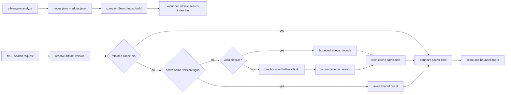

# Plan - Predictable MCP retrieval at 500k-node scale

> **Status:** PROPOSED - revised 2026-07-21 after the `platform` production incident.
> No implementation has started. Land this as independently measurable slices from `dev`.

## 1. Objective

Make Codex retrieval through `cih-server` predictable for repositories with at least
500,000 graph nodes, 1.5 million edges, and tens of thousands of source files.

The motivating incident was not an MCP protocol or FalkorDB connectivity failure. Codex
initialized the MCP session successfully, then hit three independent local workload
failures:

1. every lexical search rebuilt an uncacheable 390 MiB BM25 index;
2. `architecture_overview` tried to materialize an entire live wiki and timed out;
3. two whole-repository `grep_files` calls timed out while their uncancellable blocking
   closures continued running.

This plan closes all three paths. Fixing only BM25 would make `search_code` faster while
leaving the observed Codex workflow unreliable.

## 2. Verified Incident Evidence

Production repository:

| Dimension | Observed |
|---|---:|
| Source files | 31,226 |
| Graph nodes | 474,470 |
| Graph edges | 1,354,368 |
| Resolved edges | 867,870 |
| Unresolved references | 741,450 |
| BM25 estimated weight | 409,409,243 B (390 MiB) |
| Search cache budget | 268,435,456 B (256 MiB) |
| Blocking deadline | 90 seconds |

The search cache correctly rejected the oversize value, but the request path treated that
as a normal cache miss forever:

```text
search cache updated retained=false weight_bytes=409409243
cache_hits=0 cache_misses=4 cache_builds=2
cache_entries=0 cache_oversize=2
```

The same session then reported:

```text
wiki resident load timed out after 90s
grep timed out after 90s
grep timed out after 90s
```

Important conclusions:

- Warm BM25 scoring is already fast: 500k-document p95 is 16-17 ms.
- Warm scoring currently executes directly in the async request path and allocates dense
  score, touched-document, and candidate buffers per caller. A concurrent burst can stall
  Tokio workers and add hundreds of MiB even when the retained index is healthy.
- There is no evidence that FalkorDB query concurrency was saturated.
- The generic MCP message `blocking runtime unavailable` hid an operation deadline and
  caused Codex to infer the wrong failure mode.
- The existing heavy lane limits task count, not transient bytes. Two simultaneous 200+ MiB
  index decodes/builds can still violate container headroom.
- The missing OData route is a separate extraction gap. Faster retrieval cannot graph-trace
  a route that was never emitted.

## 3. Goals

1. A warm `search_code`, `query`, or `feature_map` call must never rebuild BM25.
2. Concurrent cold callers for one repository version must share exactly one load/build.
3. Cache budgets remain hard ceilings for retained entries; transient and borrowed memory
   are accounted separately rather than hidden outside the configured cache total.
4. A valid persisted search index must survive server restarts and load substantially faster
   than rebuilding from `nodes.jsonl`.
5. Old artifact directories, missing sidecars, stale formats, and corrupt sidecars must
   self-heal through one bounded fallback build when artifacts are writable, and still serve
   from memory with explicit remediation when they are read-only.
6. `architecture_overview` must not build a live wiki merely to list page metadata and must
   not fail because an optional wiki section is unavailable.
7. `grep_files` must prune by glob, bound concurrency, observe an internal deadline, and
   return useful partial results before the outer request timeout.
8. Operations must expose enough metrics to distinguish cache miss, sidecar load, fallback
   build, queue saturation, and operation timeout without debug logging.
9. Ranking and result ordering remain deterministic and behavior-compatible unless a later
   explicitly approved relevance change says otherwise.
10. Warm scoring must run off async workers behind bounded admission, stay within a measured
    scratch ceiling, and avoid duplicate O(matches) candidate buffers.
11. Cold load/build work must have a separate transient-memory bound in addition to retained
    cache limits.
12. Multi-repository deployments must size the aggregate hot-index working set explicitly
    and have a measured disk-backed escalation path when that working set does not fit RAM.

## 4. Non-goals

- Replacing BM25 with Elasticsearch, Tantivy, or another service.
- Treating semantic search as a substitute for lexical retrieval.
- Sharding FalkorDB to solve an in-process CPU/memory problem.
- Raising every default cache budget until benchmarks happen to pass.
- Building a zero-copy/mmap index before a measured compact heap format is evaluated.
- Solving the 741k unresolved references in this program.
- Claiming that retrieval work adds OData/Olingo route extraction. That is an adjacent
  correctness slice defined in Section 15.

## 5. Service-level Objectives

All performance gates apply to release builds. Synthetic results are necessary but not
sufficient; final acceptance must include the real `platform` artifacts in their deployment
container or a sanitized artifact-equivalent fixture.

BM25 latency gates run with semantic search disabled so external embedding/database latency
does not contaminate lexical measurements. Add a separate hybrid-query row when semantic
search is enabled in the target deployment.

| Operation | Target |
|---|---|
| Warm BM25 query, 500k docs | p95 <= 250 ms end-to-end MCP; scoring p95 <= 50 ms |
| 16 concurrent warm BM25 queries | p95 <= 500 ms; event loop remains responsive |
| First query with valid sidecar | <= 10 s, no fallback build |
| First query without sidecar | <= 60 s, exactly one fallback build |
| 16 concurrent same-version cold searches | exactly one load/build; all callers share its result |
| Retained BM25 weight on `platform` | <= 230 MiB and <= 90% of configured search budget |
| `architecture_overview` without generated wiki | p95 <= 2 s; wiki section reports unavailable |
| `architecture_overview` with generated manifest | p95 <= 2 s; manifest metadata only |
| Common scoped grep (`**/*.java`) | p95 <= 10 s on `platform` |
| Worst-case/no-match grep | complete or partial response <= 80 s |
| Event-loop delay under cold retrieval | p99 < 50 ms |
| Thirty-minute mixed retrieval soak | no monotonic RSS growth; no duplicate same-key builds |
| Eight-repository alternating search | no rebuilds; reload/eviction rate and aggregate bytes match configured policy |

The 230 MiB index target leaves approximately 10% headroom under the 256 MiB default. If
measurement proves that target infeasible without a high-risk representation change, stop
and record the measured minimum before changing the default budget.

Initial per-operation memory budgets, measured as incremental RSS over an idle warm server:

| Work | Target budget |
|---|---:|
| One active warm scorer | <= 6 MiB at 500k documents |
| All active warm scorers | <= 32 MiB by default |
| Valid sidecar decode | <= 300 MiB, one active cold load by default |
| Fallback JSONL build | <= 350 MiB, one active cold build by default |
| One active grep | <= 16 MiB excluding the existing bounded response |
| Manifest-only wiki listing | <= 4 MiB |

These are acceptance budgets, not estimates to encode as constants blindly. Slice 0 must
measure them on the real artifact and record any justified adjustment.

`CIH_SEARCH_CACHE_MAX_BYTES` is an aggregate process cache, not a per-repository allowance.
The runbook must calculate its minimum as:

```text
sum(estimated bytes of concurrently hot repository indexes) + 10% headroom
```

If that value does not fit the container after artifact, wiki, transient-work, and runtime
headroom are included, use the Tier 2 trigger in Section 11.7. Do not alternate heap decode
and eviction indefinitely and call that a warm deployment.

## 6. Required Invariants

### 6.1 Memory

- `CIH_SEARCH_CACHE_MAX_BYTES` remains an enforced retention ceiling.
- `CIH_CACHE_MAX_BYTES` remains an enforced sum of configured cache-family ceilings.
- In-flight values are accounted separately from retained values and exposed in metrics.
- Cold search loads/builds reserve transient-memory admission before reading or allocating.
- Scoring concurrency and scratch memory are bounded independently of index retention.
- A timeout does not release concurrency accounting while its blocking closure still runs.
- Persisting an index must not require holding two full serialized copies in memory.

### 6.2 Correctness

- BM25 score, tie-breaking, and result order remain identical through compacting stages.
- A sidecar is accepted only when source identity and search schema both match.
- Sidecar write publication is atomic; readers observe the old complete file or the new
  complete file, never a partial payload.
- Corruption and incompatible formats never fail the repository permanently.
- Grep never follows a symlink outside the resolved repository root.

### 6.3 Request behavior

- Optional overview sections fail soft and produce warnings/remediation, not a failed tool.
- Deadline-aware operations return an operation-specific error or partial output. They do
  not report a healthy blocking runtime as unavailable.
- Concurrent callers do not amplify one cold miss into sequential rebuilds.

## 7. Target Architecture



Ownership rules:

- `cih-search` owns the in-memory representation, ranking behavior, format version, schema
  fingerprint, and sidecar codec.
- `cih-engine` builds/publishes the derived sidecar after graph artifacts are complete.
- `cih-server` owns request coalescing, blocking admission, strict cache retention, fallback
  build/persist, and operational metrics.
- The persisted index is derived data. `nodes.jsonl` remains the recovery source of truth.

## 8. Slice 0 - Baseline and Instrumentation

Do not estimate field costs from string lengths alone. Add a bench-only or debug-only
`SearchIndexSizeBreakdown` containing:

- `docs_struct_bytes`;
- `node_id_bytes`;
- `name_bytes`;
- `qualified_name_bytes`;
- `file_bytes` and distinct file count;
- retained `text_bytes`;
- `doc_freq_bytes`;
- postings keys, vector headers, capacity, and payload bytes;
- `doc_len_bytes`;
- allocator-independent total estimate.

Record these timings separately:

1. locate latest artifacts;
2. read/deserialize nodes;
3. tokenize/build index;
4. encode and write sidecar;
5. read and decode sidecar;
6. cache admission;
7. warm scoring and MCP serialization.

Profile warm scoring with rare, common, repeated, and multi-term queries. Record score-buffer,
touched-buffer, candidate-selection, and final-result allocation separately. Run 1, 4, and
16 concurrent scorers so a fast single-query number cannot hide burst memory amplification.

Extend `scale_bench` with:

- configurable search cache bytes;
- an oversize-budget mode;
- 16 concurrent cold search callers;
- persisted cold-start and corrupt-sidecar scenarios;
- RSS samples before nodes, after nodes, after build, after nodes are dropped, and after
  decode;
- a mixed search/overview/grep event-loop delay probe.

Create a production measurement record under `docs/perf/` with sanitized commands and
numbers. Do not commit proprietary node names or source content.

**Exit gate:** the baseline reproduces `retained=false`, at least two sequential builds from
concurrent callers, and the current wiki/grep timeouts before any behavior change.

## 9. Slice 1 - Stop Work Amplification First

This is the incident-containment slice and lands before representation changes.

### 9.1 Result-carrying single flight

Replace `SearchCache`'s mutex-only gate with an in-flight generation keyed by:

```text
(canonical artifacts root, artifact version, search schema version)
```

Represent this as a typed `SearchIndexKey`, not a delimiter-concatenated string. Canonicalize
once during repository resolution and retain a deterministic absolute fallback when the path
cannot be canonicalized.

Required semantics:

- one leader performs sidecar load or fallback build;
- all callers that joined that generation receive the same cloned
  `Result<Arc<SearchIndex>, SearchLoadError>`;
- a cache rejection does not cause current waiters to rebuild;
- the completed generation is removed after its participants receive the result;
- a later request may retry when the value was not retained;
- failures are shared with current waiters but are not cached permanently;
- a cancelled/panicked leader lets a later caller start a new generation.
- participant ownership is RAII-based so cancelled waiters decrement the generation count;
  remove a completed generation only after its registered participants have consumed or
  abandoned the result.

Generalize the existing `infrastructure/cache/single_flight.rs` only if it can preserve
these non-retaining semantics clearly. Do not put an oversize value into its permanent
`values` map as a hidden second cache.

### 9.2 Keep strict cache admission

Do **not** change `AsyncWeightedCache` to retain a value larger than its configured budget.
The earlier proposal to admit an oversize sole entry is rejected because it violates the
documented cache-family ceiling and becomes unsafe in multi-repository deployments.

Instead:

- compact the index below budget in Slice 2;
- retain explicit configuration as the temporary operator escape hatch;
- emit one warning per `(repo, version, search schema)` when an index is served unretained;
- include actual bytes, configured bytes, and remediation in that warning;
- rate-limit repeated warnings.

Temporary production mitigation, only after checking the container memory limit:

```text
CIH_SEARCH_CACHE_MAX_BYTES=536870912
CIH_CACHE_MAX_BYTES=1358954496
```

This changes configured policy explicitly. It is not the product fix.

### 9.3 Typed errors

Map failures by operation:

- search load deadline -> `search index load timed out`, retryable;
- search build deadline -> `search index build timed out`, retryable;
- heavy-lane rejection -> `search capacity saturated`, retryable;
- transient-byte admission rejection -> `search cold-memory capacity saturated`, retryable;
- panic -> internal failure, bounded error class;
- corrupt sidecar with successful fallback -> success plus warning/metric.

Do not expose these as `blocking runtime unavailable`.

### 9.4 Bound warm scoring execution

`SearchState::query_hits` currently calls `SearchIndex::search` directly after awaiting the
index. Move lexical scoring to a dedicated bounded executor or `spawn_blocking` lane; do not
use the cold/heavy lane because a 20 ms warm score must not queue behind a 60 s artifact
build.

Proposed defaults:

| Setting | Default |
|---|---:|
| `CIH_SEARCH_SCORE_MAX_CONCURRENT` | min(4, logical CPUs) |
| `CIH_SEARCH_SCORE_QUEUE_TIMEOUT_MS` | 2,000 |

Acquire the permit asynchronously, move the permit into the blocking closure, and release it
only when scoring actually exits. A disconnected or timed-out caller must not make the slot
appear free while work is still executing. Return retryable `search scoring capacity
saturated` when admission expires.

When both lexical and semantic providers are configured, start their independent futures
concurrently and perform deterministic RRF only after both complete. Preserve the existing
error policy; this is latency overlap, not a silent partial-result behavior change. Benchmark
hybrid latency separately from the lexical SLOs in Section 5.

**Exit gate:** with a one-byte cache budget, 16 concurrent calls execute exactly one build
and all 16 receive the same result. Retained bytes remain zero, the configured cache budget
is never exceeded, and a 16-query warm burst keeps event-loop p99 below 50 ms.

## 10. Slice 2 - Compact and Accelerate BM25

### 10.1 Remove behavior-neutral retained data

In `crates/cih-search/src/bm25.rs`:

1. Remove `IndexedDoc.text`. `node_text` is needed only while tokenizing; no result contains
   a snippet and no query reads retained text.
2. Remove `doc_freq` from both `SearchIndex` and `TextIndex`. For every term, document
   frequency equals `postings[term].len()` because build emits one posting per distinct term
   per document. This also removes the duplicate term map from generated/live wiki search.
3. Update size accounting and serialization compatibility through a new sidecar schema
   version rather than serde defaults.

The retained-text justification must acknowledge that `node_text` also includes selected
route/integration/message properties. Removing retained text remains safe because those
tokens stay in postings.

### 10.2 Avoid temporary string duplication during build

Current `node_text` clones fields into a `Vec<String>`, joins them, and then tokenizes the
joined allocation. Introduce a token sink that can consume fields directly in the same
logical order:

```rust
tokenize_into(node.kind.label(), &mut scratch);
tokenize_into(&node.name, &mut scratch);
// qualified name, node id, file, and selected properties
```

Requirements:

- token sequence and term frequencies remain identical;
- the tokenizer inserts an explicit field boundary so camel-case state never leaks from the
  last character of one field into the first character of the next;
- per-document scratch allocation is reused;
- no full concatenated document string survives the current iteration;
- benchmark build CPU and peak transient RSS.

Expose a streaming/owned build API in addition to the compatibility slice API. Server
fallback uses `GraphArtifacts::stream_nodes()` and analyze moves owned `Node` values when its
lifecycle permits; neither path should require a second full `Vec<Node>` solely for search.

### 10.3 Intern repeated file paths

Replace per-document `file: String` with:

```rust
file_id: u32
files: Vec<String>
```

Use a temporary map during build and drop it before returning the index. Use `Vec<String>`,
not `Vec<Arc<str>>`, unless the workspace intentionally enables serde's `rc` support and
measurement shows an advantage. Rehydrate only the top-k results.

### 10.4 Bound query scratch and top-k selection

The current query path allocates:

- `scores: Vec<f32>` for every document;
- `touched: Vec<usize>` for every matching document;
- a second `candidates: Vec<(usize, f32)>` for every touched document.

Keep the dense score buffer because it is efficient for common terms, but remove duplicate
O(matches) storage:

1. benchmark the simplest path first: drop `touched`, scan the initialized dense score array
   once, and feed positive scores directly into a bounded top-k heap;
2. if rare-term scoring p95 regresses by more than 10%, retain only `touched: Vec<u32>` and
   scan those ordinals instead; do not also build a full candidate vector;
3. select the exact best `limit` results with a bounded heap or equivalent O(limit) buffer;
4. sort only those selected results with the existing score/node-ID comparator;
5. preserve contribution order and `f32` bits exactly.

Evaluate a bounded reusable scratch pool only after the simpler change is measured. If added,
its entries and bytes are hard-capped, included in operational metrics, and included in the
search memory budget. Do not hide permanent scratch buffers inside `SearchIndex` without
counting them in `estimated_size_bytes`.

### 10.5 Measurement-gated representation work

Only continue if the index remains above 230 MiB or build time remains excessive:

- switch build maps to `FxHashMap` when benchmarked faster without material memory loss;
- freeze posting lists to exact-capacity boxed slices;
- replace per-term `String` hash keys with a sorted term table plus offsets;
- intern repeated qualified-name/package prefixes;
- use compact ordinal metadata for `NodeId` only if public result semantics stay unchanged.

Do not introduce an FST, prefix codec, or mmap layout without a before/after result for the
specific dominating field.

### 10.6 Correctness tests

- Existing `inverted_index_matches_naive_reference` passes unchanged.
- Add randomized ranking parity over repeated terms, empty fields, Unicode identifiers,
  route properties, and exact score ties.
- Compare complete ordered `(node_id, score.to_bits())` results, not just hit sets.
- Compare bounded-heap top-k against a full stable ordering for limits 1, 10, and 50.
- Test `u32` ordinal overflow defensively even though practical repositories are smaller.

**Exit gate:** real `platform` index <= 230 MiB, warm score p95 <= 50 ms, build is no slower
than baseline, one scorer uses <= 6 MiB incremental scratch, and ranking is bit-for-bit
identical.

## 11. Slice 3 - Versioned Persistent Search Index

### 11.1 Format contract

Add `crates/cih-search/src/persist.rs`. `cih-search` owns one codec used by engine and
server. The file path is:

```text
.cih/artifacts/<artifact-version>/search-index.bin
```

Header fields:

| Field | Purpose |
|---|---|
| 8-byte magic | reject unrelated/corrupt files quickly |
| format version | binary layout compatibility |
| search schema fingerprint | tokenizer, fields, searchable kinds, BM25 constants |
| artifact version | bind to immutable artifact directory |
| nodes file length + mtime | detect ordinary source replacement without rereading JSONL |
| retained-size estimate | reserve cold-load bytes before decode |
| payload length | reject truncation/oversize before allocation |
| payload checksum | detect corruption |

The repository already has `cih-server-index-v1.bin` for adjacency maps. Reuse its tested
source-identity and atomic-publication ideas, but do not append BM25 data to it: that format
is server-owned, includes edges, and has a different lifecycle. The search codec must remain
in `cih-search` so both engine and server use the same implementation.

The search schema fingerprint must change when any of these change:

- tokenization rules;
- indexed node kinds;
- indexed node fields or selected properties;
- BM25 constants or scoring interpretation;
- serialized compact representation.

Artifact version alone is insufficient because source artifacts do not change when search
code changes.

Use an explicit canonical persistence DTO rather than making the runtime `SearchIndex`
serde layout the file contract. Sort the term table lexicographically and keep postings in
document order so identical source/schema inputs produce byte-identical payloads; headers
may differ with source file identity. Generate the schema fingerprint from a checked-in
canonical descriptor or constant; never use `DefaultHasher`, pointer width, or map iteration
order.

Use bincode without compression for the first measured implementation. Compression can
reduce disk but increases decode CPU and peak memory; add it only if disk is the measured
bottleneck. Add the codec dependency to the workspace explicitly.

### 11.2 Atomic publication

- Encode/write to a uniquely named `create_new` temporary file in the artifact directory;
  include PID plus a random/monotonic nonce rather than PID alone.
- Stream encoding to a buffered writer where supported; do not allocate a second full
  payload-sized `Vec<u8>` merely to write it.
- Flush and sync according to the same durability policy as other artifact sidecars.
- Rename the completed temporary file over the destination atomically.
- Remove stale temporary files best-effort.
- Bound the declared payload length before allocating during decode.
- Bound every decoded collection count, string length, posting-list length, and document
  ordinal before allocation; validate posting ordinals and parallel-vector lengths.
- Compute the payload checksum while streaming. Do not read the entire sidecar into a second
  `Vec<u8>` merely to verify it.
- For cross-process engine/server repair races, take a short-lived file lock and re-check the
  destination after acquiring it. In-process single flight remains the normal fast path.

### 11.3 Analyze-time generation

Add `cih-search` to `cih-engine` (allowed product -> analysis dependency). After graph
artifacts are written:

1. compute node count and callable statistics before moving node ownership;
2. drop or move edge/parse structures no longer needed;
3. build through an owned iterator so retained strings move from `Node` into `IndexedDoc`
   where possible instead of being cloned;
4. atomically publish the sidecar;
5. record build bytes and milliseconds.

Sidecar failure must not invalidate otherwise correct graph artifacts. Emit a prominent
warning, leave no partial destination, and let the server self-heal.

The no-op/reused analyze path must also validate the sidecar. If the graph artifacts are
reused but the sidecar is missing or has an old search schema, build only the derived search
index; do not rerun parse/resolve.

### 11.4 Transient cold-load admission

Add a search-specific cold-load coordinator rather than relying only on the existing
count-based heavy lane. Defaults:

| Setting | Default |
|---|---:|
| `CIH_SEARCH_COLD_MAX_CONCURRENT` | 1 |
| `CIH_SEARCH_COLD_MAX_BYTES` | 512 MiB |
| `CIH_SEARCH_COLD_QUEUE_TIMEOUT_SECS` | 5 |

The sidecar header carries the retained-size estimate needed to reserve byte permits before
decode. Treat it as untrusted input: reserve a measured overhead over the larger of payload
length and retained estimate, reject impossible ratios, and enforce collection/allocation
limits against that reservation during decode. A fallback build reserves a conservative
amount derived from the measured node-file size and rejects early when it cannot fit.
Reservation remains held inside the blocking closure through decode/build and publication,
including after an outer caller timeout.

Track retained bytes, borrowed old-version `Arc`s where observable, in-flight reserved bytes,
and process RSS separately. `CIH_CACHE_MAX_BYTES` is a cache-family configuration ceiling,
not a claim that total process RSS is bounded.

### 11.5 Server load and self-heal

Add a typed `SearchIndexStore` port whose filesystem adapter delegates encoding/decoding to
`cih-search`. This keeps request policy in the server without duplicating the format. Required
behavior:

- load returns a classified outcome (`Loaded`, `Missing`, `Stale`, or `Corrupt`) instead of
  collapsing every invalid sidecar into `None`;
- persistence distinguishes read-only/permission failure from serialization and durability
  failures;
- public errors carry bounded classifications and remediation, not absolute paths or codec
  internals.

1. resolve latest complete artifacts;
2. check retained cache;
3. join/start the versioned single flight;
4. load/validate sidecar in the bounded heavy lane;
5. on missing, stale, or corrupt sidecar, stream/read nodes once and build;
6. atomically persist the recovered index;
7. apply strict weighted-cache admission;
8. return the shared index to all current callers.

Failure to persist a repaired sidecar on a read-only artifact mount is non-fatal: serve and
retain the successfully built index, emit a rate-limited `repair_failed` warning/metric, and
tell the operator to generate the sidecar during analyze. Never discard a valid in-memory
result only because derived-data repair could not be written.

Do not use ordinary `run_blocking` for a 200+ MiB decode/build. It belongs behind search cold
admission and the shared heavy execution boundary so two repositories cannot monopolize the
blocking pool or transient-memory headroom.

### 11.6 Compatibility and bundles

- Existing artifact directories without a sidecar remain readable.
- New servers reject newer unknown sidecar versions and rebuild.
- Old servers ignore the additive file.
- Bundle export/import may include a valid sidecar as an optional derived entry; omission is
  safe because server self-heal remains authoritative.

### 11.7 Tier 2 trigger for a multi-repository working set

Do not implement mmap speculatively. Trigger a second format investigation when any measured
condition remains true after compact heap delivery:

- one index cannot stay below 90% of its configured retention budget;
- the concurrently hot repository set cannot fit safe container memory;
- LRU eviction causes repeated sidecar loads that violate the warm-query SLO;
- valid sidecar decode cannot meet 10 seconds.

The Tier 2 candidate is a segmented, read-only format with a small resident term dictionary,
fixed-width document lengths, contiguous posting arrays, document-metadata offset tables,
and mmap-backed string/posting blobs. It must provide:

- fixed endianness and width-independent ordinals/offsets;
- a section directory with independent lengths and checksums;
- eager header/directory validation and bounded section validation;
- the same schema/source identity and atomic publication rules as Tier 1;
- exact ranking parity and a heap fallback on unsupported platforms;
- measured heap, RSS/PSS, page faults, first-query latency, and alternating-repository p95.

Keep mapping handles in a small entry-count cache. Count resident heap and mapped bytes
separately; mmap moves pressure to the OS page cache and is not zero memory.

**Exit gate:** restart against `platform`; first search loads a valid sidecar within 10 s,
logs `source=sidecar`, performs zero BM25 builds, and the second call is a retained cache
hit. Missing/corrupt/schema-stale cases each rebuild once and repair the sidecar. The
eight-repository alternating test either retains its declared hot set or produces evidence
that activates Section 11.7.

## 12. Slice 4 - Make Architecture Overview Cheap and Fail-soft

The default overview currently includes `wiki_pages`, invokes the wiki repository even when
the caller excludes that section, and attempts a live wiki build before the disk bundle.
That is unacceptable for an orientation call.

### 12.1 Section-aware loading

- Resolve requested/default sections before starting section futures.
- Call `OverviewWikiRepository::list_pages` only when `wiki_pages` is requested.
- Do the same for other optional expensive sections as they are identified.

### 12.2 Manifest-only catalog

For overview page listing:

- read `.cih/wiki/manifest.json` only;
- return its page metadata without reading Markdown bodies or building `TextIndex`;
- cache by manifest identity with a small bounded entry;
- reject `.publishing` exactly as current wiki reads do;
- if no generated manifest exists, return `None` with the existing `cih-engine wiki` remedy.

Do not call `OwnedWiki::load_package_mode` or `LiveWikiIndex::build` from
`architecture_overview`.

### 12.3 Optional failure isolation

Replace the all-or-nothing `try_join!` behavior for optional wiki metadata. A wiki failure
must produce:

- an `off`/`unavailable` wiki section;
- a bounded warning and remediation;
- a successful overview containing graph-backed sections.

Explicit `search_wiki`/`get_wiki_page` may retain live materialization for smaller repos,
but introduce a configurable node cap (default proposed: 100,000). Above the cap, require a
generated wiki bundle instead of attempting a request-time full graph materialization.

**Exit gate:** on `platform` with no generated wiki, default overview returns in <= 2 s and
does not read full nodes/edges. With a manifest, it reads only the manifest and returns page
metadata in <= 2 s.

## 13. Slice 5 - Bounded, Efficient `grep_files`

This slice is mandatory because grep was part of the incident and is the fallback when a
framework construct was not extracted into the graph.

### 13.1 Candidate pruning

- Apply the requested glob through `ignore::overrides::OverrideBuilder` so irrelevant files
  are excluded by traversal rather than after yield.
- Always skip `.git`, `.cih`, `target`, `node_modules`, `build`, and `dist` directories.
- Preserve `.gitignore`, global ignore, `.git/info/exclude`, and `.cihignore` behavior.
- Preserve the no-follow-symlink and canonical-root containment rules.
- Record candidate and scanned file counts.

### 13.2 Proven line searcher

Prefer the ripgrep libraries (`grep-searcher` + `grep-regex`) over reading every file into a
new `Vec<u8>`. They provide buffered/mmap-aware line search, binary detection, line numbers,
and a mature regex scan path. Keep the current output and byte caps at the application
boundary.

If adding those libraries is rejected, use `BufRead` line streaming and stop reading a file
as soon as the global result limit/deadline requires it.

### 13.3 Bounded parallelism with deterministic results

Do not simply switch to an unbounded `build_parallel()` callback. That can multiply disk I/O
when Codex issues several greps and can make the first `limit` results nondeterministic.

Recommended algorithm:

1. collect pruned candidate paths and sort by repository-relative path;
2. process small sorted chunks in a dedicated bounded grep pool;
3. sort each chunk's matches by `(file, line)`;
4. merge chunks in path order;
5. stop at the result limit or cooperative deadline.

Configuration:

| Setting | Proposed default |
|---|---:|
| `CIH_GREP_MAX_CONCURRENT_REQUESTS` | 1 |
| `CIH_GREP_THREADS` | min(4, logical CPUs) |
| `CIH_GREP_QUEUE_TIMEOUT_SECS` | 2 |
| `CIH_GREP_DEADLINE_SECS` | 80 |

The request semaphore remains held until the blocking scan actually exits, even if the MCP
caller disconnects. Build one process-wide worker pool during bootstrap; never construct a
thread pool per request or enqueue one task per file.

### 13.4 Cooperative completion contract

Extend output additively with:

```text
complete: bool
truncation_reason: limit | bytes | deadline | none
candidate_files: usize
files_scanned: usize
files_skipped: usize
elapsed_ms: u64
```

Check cancellation/deadline between directory batches, files, and line batches. The internal
deadline must fire before `CIH_BLOCKING_TIMEOUT_SECS`, allowing the closure to return partial
matches normally. The outer blocking timeout remains a final safety backstop.

Start the 80-second scan budget after grep admission, include candidate traversal/sorting in
that budget, and ensure queue timeout + scan deadline leaves at least five seconds before the
outer blocking deadline. Reject invalid configuration at startup. Preserve the existing
`truncated` field as `truncated = !complete` for clients that do not know the new fields.

Use a cancellation token/atomic owned by a request guard so disconnecting the async caller is
visible to the blocking scan. Intentional policy exclusions (binary, oversize, ignored, or
unreadable files) increment bounded skipped counters; they do not silently inflate
`files_scanned`.

Classify errors accurately:

- request capacity full -> retryable `grep capacity saturated`;
- internal deadline -> successful partial result;
- outer timeout -> retryable `grep timed out`, not `blocking runtime unavailable`;
- invalid regex/glob -> non-retryable invalid input.

**Exit gate:** both incident patterns complete or return useful partial output within 80 s;
`**/*.java` prunes non-Java files; two concurrent calls do not start two full scans; no grep
closure remains running after a normal partial response.

## 14. Slice 6 - Operational Visibility

Extend authenticated `/operations/metrics` beyond blocking/index-job metrics.

### 14.1 Search metrics

- cache requests/hits/misses/retained entries/retained bytes/evictions/oversize;
- in-flight generations and joined waiters;
- scorer active/queued/rejected, queue wait, scratch bytes, and scoring duration;
- cold-load active/queued/rejected and reserved transient bytes;
- sidecar load success/missing/stale/corrupt;
- fallback builds and sidecar repair success/failure;
- read, decode, build, persist, and score durations;
- index bytes and document count by hashed repository identity;
- timeout/saturation/panic counts.

### 14.2 Wiki and grep metrics

- manifest-only overview loads;
- live wiki builds attempted/rejected-by-size/timed-out;
- grep active/queued/rejected;
- candidates/files scanned/matches/partial-deadline counts;
- operation duration histograms or bounded summary counters.

### 14.3 Logging

Emit one structured completion event per request with bounded fields. Important events:

- warning: search index larger than configured retention budget;
- warning: sidecar corrupt/stale and fallback started;
- info: sidecar repaired;
- warning: optional overview section degraded;
- info: grep returned partial at deadline.

Do not log source text, query result bodies, absolute paths, raw repository names, or
unbounded error chains.

**Exit gate:** an operator can explain every incident state from INFO/WARN logs and
`/operations/metrics`; DEBUG logging is not required.

## 15. Adjacent Correctness Slice - OData/Olingo Routes

The motivating API was:

```text
/cb/odata/services/transferservice/CustomRecTransfers?action=verify
```

Performance work makes fallback retrieval usable but does not create a graph route. Add a
separate plan/PR for OData/Olingo extraction:

- detect service roots, entity sets, actions/functions, and handler bindings;
- emit canonical `Route` nodes with HTTP method/path/action properties;
- connect routes to handlers and downstream calls;
- add a small Java/XML OData corpus;
- verify `search_code`, `route_map`, `context`, and `trace_flow` can start from the exact
  endpoint.

This slice is required before claiming the motivating endpoint can be answered through graph
tracing. It is not a prerequisite for the performance slices.

## 16. Files Expected to Change

### Search representation and persistence

- `Cargo.toml` - codec and optional grep-library dependencies.
- `crates/cih-search/Cargo.toml`.
- `crates/cih-search/src/bm25.rs` - compact representation and owned/streaming build.
- `crates/cih-search/src/tokenize.rs` - allocation-reusing token sink.
- `crates/cih-search/src/persist.rs` - new format/schema/checksum/atomic codec.
- `crates/cih-search/src/lib.rs` - persistence exports.
- `crates/cih-search/tests/search.rs` plus new persistence/parity tests.
- `crates/cih-core/src/artifacts.rs` - optional bundle sidecar entry and streaming reuse.
- `crates/cih-engine/Cargo.toml` - `cih-search` dependency.
- `crates/cih-engine/src/analyze/mod.rs` - sidecar generation and reuse backfill.

### Server request paths

- `crates/cih-server/src/infrastructure/search_provider.rs` - result-carrying flight,
  sidecar load/self-heal, strict admission, scorer lane, cold-load coordinator, metrics.
- `crates/cih-server/src/infrastructure/cache/single_flight.rs` if generalized.
- `crates/cih-server/src/infrastructure/cache/weighted.rs` - expose admission/weight data
  needed by warnings and metrics without weakening policy.
- `crates/cih-server/src/ports/search_provider.rs` - typed search failure boundary.
- `crates/cih-server/src/ports/search_index_store.rs` - typed persistence boundary.
- `crates/cih-server/src/infrastructure/file_search_index_store.rs` - filesystem adapter.
- `crates/cih-server/src/ports/blocking_runtime.rs` - reusable gated execution semantics for
  scorer/cold-load permits where appropriate.
- `crates/cih-server/src/application/files/mod.rs` - bounded grep service and output metadata.
- `crates/cih-server/src/application/architecture_overview.rs` - section-aware optional load.
- `crates/cih-server/src/infrastructure/wiki_repository.rs` - manifest-only overview catalog
  and live-size guard.
- `crates/cih-server/src/application/admin/mod.rs` - search/wiki/grep operational metrics.
- `crates/cih-server/src/bootstrap.rs` - wire stores, limits, and metrics.
- `crates/cih-server/src/config.rs` - scorer, cold-load, grep, and live-wiki configuration
  validation.
- `crates/cih-server/src/scale_bench.rs` and examples - concurrency/persistence/mixed load.

### Documentation and operations

- `docs/perf/scale-500k.md` - close or update the cache-size limitation with measurements.
- new `docs/perf/search-platform-474k.md` - sanitized real-repo evidence.
- `docs/runbooks/multi-repo-host-serving.md` - cache and grep sizing guidance.
- `README.md` - new environment variables.
- `.github/workflows/cih-server-soak.yml` - mixed retrieval scenario.

## 17. Verification Matrix

### 17.1 Unit and property tests

- bit-identical BM25 ranking before/after compaction;
- randomized tokenizer and ranking parity;
- file interning round trip;
- codec round trip, wrong magic/version/schema, truncation, checksum mismatch;
- source identity mismatch;
- atomic publication leaves no partial destination;
- 16 same-key waiters share success and failure;
- cancelled leader recovery;
- completed/cancelled generations leave no key or waiter-count growth across 10,000 versions;
- one-byte cache never retains oversize value;
- scorer admission holds its permit until the blocking closure exits;
- bounded top-k is bit-identical to full ordering and does not allocate O(matches) candidates;
- cold-load admission rejects work above its byte budget before decode;
- overview excludes wiki without touching the wiki repository;
- manifest-only overview never reads page bodies;
- wiki failure degrades one section rather than the tool;
- glob pruning, binary/symlink/security behavior, deterministic grep ordering;
- grep limit, byte-cap, deadline, skip-count, and disconnect completeness metadata;

### 17.2 Integration tests

1. Analyze a fixture and assert `search-index.bin` exists and validates.
2. Re-run unchanged analyze with the sidecar removed; assert only sidecar backfill occurs.
3. Start server with a valid sidecar; first search performs zero builds.
4. Start with no/corrupt/old-schema sidecar; one fallback build repairs it.
5. Burst 16 MCP `search_code` calls against an empty cache.
6. Burst 16 warm searches and verify scorer admission, event-loop delay, and scratch ceiling.
7. Call overview with no wiki, generated wiki, and a deliberately broken manifest.
8. Run two concurrent no-match greps and verify configured admission plus partial completion.
9. Mix search, overview, grep, graph context, and health requests; verify event-loop delay.

### 17.3 Production-scale evidence

On `platform`, record before/after:

- retained index bytes and per-field breakdown;
- nodes read, build, encode, write, read, decode, query milliseconds;
- peak and steady RSS;
- cache/flight metrics for first and second searches;
- 16-caller burst build count;
- warm-scorer scratch and queue behavior at 1/4/16 callers;
- eight-repository hot-set bytes, evictions, sidecar reloads, and alternating-query p95;
- overview duration and bytes read;
- grep candidate/scanned counts and duration for both incident patterns;
- server responsiveness during each cold operation.

### 17.4 Mandatory repository gates

```text
cargo fmt --all --check
cargo clippy --workspace --all-targets -- -D warnings
cargo test --workspace
python3 scripts/check_layering.py
cargo run --release -p cih-server --example scale_bench -- --enforce
```

## 18. Delivery Sequence

Keep pull requests independently deployable and measurable:

1. **PR A - incident containment:** result-carrying search flight, bounded scorer execution,
   warning/metrics, typed errors; no representation change.
2. **PR B - overview isolation:** section-aware loading, manifest-only catalog, fail-soft
   optional wiki.
3. **PR C - bounded grep:** pruning, dedicated admission, cooperative partial results.
4. **PR D - compact BM25:** dead-field removal, direct token sink, file interning, bounded
   top-k scratch.
5. **PR E - durable sidecar:** versioned codec, transient admission, analyze
   generation/reuse backfill, server self-heal, and multi-repository working-set evidence.
6. **PR F - production acceptance:** real measurement record, mixed soak, runbook updates.
7. **PR G - OData correctness:** separate extraction plan and implementation.

PR A-C improve the current Codex incident without waiting for the persistent format. PR D-E
eliminate the recurring cold-build cost.

## 19. Rollout and Rollback

1. Deploy observability/containment first and confirm exactly one build per cold burst.
2. Deploy compact representation; compare retained bytes and ranking before enabling sidecar
   generation in production.
3. Generate sidecars during the next analyze. Existing artifacts self-heal on first search.
4. Keep a temporary `CIH_SEARCH_SIDECAR_ENABLED=0` rollback switch for one release cycle;
   disabling it returns to bounded in-process build without deleting artifacts.
5. Unknown/corrupt sidecars are always ignored safely, so rollback never requires artifact
   migration.
6. Watch sidecar-load rate after each multi-repository rollout; repeated load/evict cycles
   require budget correction or the Section 11.7 path before adding more repositories.
7. Remove the switch only after the production-scale and mixed-soak gates pass.

## 20. Risks and Mitigations

| Risk | Mitigation |
|---|---|
| Analyze OOM while building sidecar | owned/streaming build, drop heavy structures first, measure peak RSS |
| Stale ranking after code upgrade | independent search schema fingerprint |
| Corrupt/truncated sidecar | length bounds, checksum, atomic rename, one fallback repair |
| Cache budget silently exceeded | retain strict weighted admission; explicit config only |
| Concurrent misses amplify work | result-carrying same-version flight |
| Concurrent warm scores amplify scratch/CPU | bounded scorer lane and O(limit) top-k buffer |
| Two cold loads exceed transient headroom | count- and byte-bounded search cold admission |
| Parallel grep overloads storage | request semaphore, bounded dedicated threads, sorted chunks |
| Timed-out grep keeps running | internal cooperative deadline before outer timeout |
| Overview still triggers huge wiki | manifest-only adapter and node cap for explicit live wiki |
| Metrics leak source/repo data | hashed repository identity and bounded classifications |
| Synthetic benchmark masks production strings | real sanitized `platform` acceptance required |
| Bincode decode remains too slow/large | measure first; evaluate mmap/zero-copy only after heap format evidence |
| Multi-repo LRU repeatedly decodes sidecars | size the hot set explicitly; activate Tier 2 on measured thrash |

## 21. Definition of Done

- [ ] The three incident failures are reproducible in baseline evidence.
- [ ] Concurrent cold searches share one result even when retention rejects it.
- [ ] Strict cache-family validation remains intact and cold transient bytes are admitted
      separately.
- [ ] Warm scoring runs off async workers with bounded concurrency and <= 6 MiB scratch per
      active scorer at 500k documents.
- [ ] `platform` BM25 is <= 230 MiB with bit-identical ranking.
- [ ] Valid sidecar cold load is <= 10 seconds and performs no build.
- [ ] Missing/stale/corrupt sidecars rebuild once and repair themselves on writable artifacts;
      read-only artifacts still serve the fallback result with explicit repair guidance.
- [ ] Unchanged analyze runs backfill missing/new-schema sidecars.
- [ ] Default overview never live-builds wiki and degrades optional wiki failures.
- [ ] Grep prunes by glob, bounds concurrency, and returns partial output by 80 seconds.
- [ ] User-facing errors identify the operation rather than blaming the blocking runtime.
- [ ] Search, wiki, and grep metrics are visible without DEBUG logging.
- [ ] Mixed retrieval soak has no duplicate same-key builds or monotonic RSS growth.
- [ ] Multi-repository hot-set sizing is documented and the alternating-repository gate
      passes without unplanned decode/eviction thrash.
- [ ] Full workspace format, lint, test, layering, and release scale gates pass.
- [ ] Performance/runbook documentation contains measured before/after results.
- [ ] OData extraction remains explicitly tracked until the motivating endpoint is traceable.
