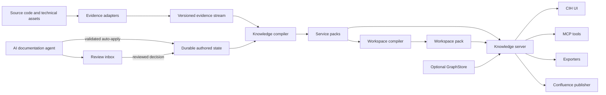

# CIH Universal Knowledge and Documentation System

Status: Proposed

Date: 2026-07-19
Last revised: 2026-07-23

Target: Replace the current hardcoded wiki generation and Docusaurus viewer with a
versioned, scalable knowledge system for source code and technical assets.

Related work:

- The current `cih-wiki` render core and resident `cih-server` wiki serving
  pipeline are the implemented baseline that this plan replaces.
- `docs/ARCHITECTURE.md` defines the server-side application ports, request
  budgets, bounded scheduler, completeness metadata, and transport boundaries
  reused by this system. This plan extends those contracts rather than creating
  a second server architecture.

## 1. Executive Summary

CIH currently turns analyzed code into a large collection of generated Markdown
pages. The generation structure, page types, navigation, and rendering are tightly
coupled. This becomes difficult to change and expensive to build, serve, search, and
display when a repository contains hundreds of thousands of graph nodes or when a
workspace contains many services.

The replacement must not treat source files or Markdown files as the primary
documentation model. It must treat documentation as a set of stable knowledge
objects, typed relations, evidence-backed content blocks, and role-specific views.
The UI, MCP server, static exporter, and optional Confluence publisher must all read
from that same model.

The resulting system will:

- Work with monoliths, microservices, libraries, data pipelines, infrastructure,
  and mixed-language workspaces.
- Organize knowledge by business domain, capability, process, system, service,
  quality, and technical evidence rather than by source directory.
- Provide PO, BA, Tester, and Dev views over the same facts without generating four
  independent documentation trees.
- Keep source files, classes, methods, and graph nodes searchable without placing
  hundreds of thousands of items in primary navigation.
- Build from versioned `GraphArtifacts` streams without requiring FalkorDB,
  LadybugDB, or another live `GraphStore`.
- Use AI to classify changes, find the correct documentation location, and generate
  typed changes with evidence, confidence, validation, review, and idempotency.
- Serve large workspaces with bounded memory, lazy section loading, server-side
  search, paginated relations, virtualized lists, and bounded graph projections.
- Continue to work without AI, embeddings, Confluence, or network access.

The system is a knowledge compiler and knowledge server. It is not another static
site generator.

## 2. Current State and Problems

### 2.1 Current pipeline

The current documentation flow is approximately:

```text
source code
  -> cih analyze
  -> GraphArtifacts
  -> cih discover / feature grouping
  -> cih wiki
  -> hardcoded Markdown pages and manifest
  -> Docusaurus build
  -> browser
```

`cih-wiki` currently defines page subjects such as system index, route index,
feature PO page, feature BA page, developer class page, controller page, API flow
page, scheduled flow, listener flow, and community pages. A `PageIndex` enumerates
those page types and slugs. Adding a new concept requires changes to the page
enumeration, render dispatch, and manifest generation — and those changes are
duplicated across two code paths that must move in lockstep: the batch emission
pipeline (`cih-wiki/src/lib.rs`) and the live single-page path (`render.rs`),
guarded only by the `resident_parity` tests — and that guard is an ignored,
env-gated comparison requiring a prebuilt fixture wiki
(`CIH_TEST_REPO`/`CIH_TEST_WIKI`); it does not run in CI. Sidebar and search
indexing are manifest-generic and usually unaffected; the dual-path duplication is
the real change tax.

The resident serving path improves per-page latency but retains a complete node and
edge graph and constructs additional `WikiGraph`, render-context, page-index, page
body, and search structures. Multiple repositories can multiply that memory.

### 2.2 Information architecture problems

- Source and generated page structure leak into user navigation.
- Package and graph communities are useful evidence but are not reliable business
  domains or capabilities.
- A strict source tree cannot represent cross-service business processes.
- PO, BA, Tester, and Dev need different levels of detail, but duplicated role pages
  cause drift and repeated generation.
- Tester documentation is not a first-class view in the current page taxonomy.
- Large class, method, API, or community collections produce unusable sidebars.
- One entity may belong to multiple capabilities, processes, or services, which a
  simple folder tree cannot represent.

### 2.3 Scale problems

- The wiki consumer loads full `Vec<Node>` and `Vec<Edge>` copies, increasing
  peak memory. (The artifact layer already exposes streaming reads; `cih-wiki`
  does not use them.)
- Derived maps clone identifiers and node values.
- Rendering every page up front produces work that most users never request.
- Static site generation and local client-side indexing scale with page count.
- A browser cannot safely render or search hundreds of thousands of navigation
  entries or graph nodes.
- Unbounded per-repository caches grow with the number of services.
- Rebuilding whole documents for a small code change prevents efficient incremental
  refresh.

### 2.4 AI generation problems

Current LLM enrichment generates prose for predefined page locations. It does not
own a stable knowledge model, cannot reliably decide where a new feature belongs,
and has no typed change set, placement confidence, conflict policy, or review
workflow.

An instruction such as "document the new refund APIs" must not result in an AI
editing arbitrary Markdown paths. It must result in a bounded, evidence-backed,
validated update to known knowledge objects.

## 3. Goals

### 3.1 Product goals

1. Make documentation useful to PO, BA, Tester, and Dev users.
2. Make business capabilities and cross-service processes the primary navigation.
3. Keep service and source-code navigation available as a technical facet.
4. Let users search from business language to implementation evidence.
5. Let AI place and update documentation from natural-language instructions.
6. Preserve human ownership, provenance, review, and audit history.
7. Support CIH's current language providers and future evidence adapters.
8. Operate locally and offline when optional AI and semantic features are disabled.
9. Export curated Markdown and static HTML from the same knowledge model.
10. Integrate with Confluence without making Confluence the source of truth.

### 3.2 Scale goals

The design target is:

- 500,000 graph nodes and 5,000,000 graph edges per service.
- 20 services in one workspace.
- 10,000,000 total graph nodes across a maximum-scale workspace.
- Thousands of high-level knowledge objects and millions of technical evidence
  records without millions of rendered pages.
- Full service-pack build in 10 minutes or less on the benchmark host fixed in
  Phase 0.
- Full service-pack build below 1 GiB peak RSS.
- No-change index check in 2 seconds or less.
- A change affecting 1 percent of evidence reindexed and published in 60 seconds
  or less in the mandatory FTS-only profile. Phase 0 fixes a separate optional
  local-semantic budget after measuring the selected vector backend.
- Warm object retrieval p95 below 200 ms.
- Workspace navigation p95 below 100 ms.
- Workspace search p95 below 500 ms.
- Documentation subsystem RSS below 512 MiB, excluding explicitly loaded embedding
  models and live graph backends.

### 3.3 Quality goals

- Every generated claim can point to evidence or be explicitly marked inferred.
- Human and pinned content is never silently overwritten.
- Re-running the same operation against the same inputs is idempotent.
- A partial or failed build never replaces the active document generation.
- Unsupported analysis is visible as unknown coverage, not reported as absence.
- Legacy wiki slugs continue to resolve during migration.

## 4. Non-goals for the First Release

- A full Confluence-style collaborative rich-text editor.
- Real-time multi-user coauthoring.
- Enterprise RBAC beyond the existing authenticated server boundary.
- Full bidirectional Confluence body synchronization.
- Simultaneous writable membership of one repository in multiple documentation
  workspaces. Existing CIH groups may overlap, but V1 assigns each repository to
  exactly one writable documentation workspace (§11.1).
- Rendering the complete code graph in the browser.
- Creating a persisted document page for every source symbol.
- Treating AI output as authoritative without evidence and validation.
- Guaranteeing deep semantic extraction for every programming language or framework
  immediately. Unsupported inputs remain importable at file/module level.

## 5. Design Principles

1. Knowledge objects, not files, are the primary model.
2. Documents are views, not persisted rendered pages.
3. Business hierarchy is primary; service hierarchy is a technical facet.
4. One object has one primary parent and many typed relations.
5. Role views share facts and differ in ordering, depth, and presentation.
6. Evidence and provenance are part of every generated claim.
7. Deterministic analysis runs before semantic or LLM classification.
8. AI proposes typed operations; it does not directly edit storage or Markdown.
9. High-confidence generated-content changes may be automatic; taxonomy mutations
   require review.
10. Primary navigation remains small even when technical evidence is large.
11. Search, rendering, graph expansion, and caches are bounded by default.
12. Graph databases are optional runtime collaborators, not documentation sources.
13. All generated formats use the same model and renderer contracts.
14. Unknown and ambiguous are valid states.

## 6. Terminology

| Term | Meaning |
| --- | --- |
| Evidence | A source-backed fact from code, tests, APIs, schemas, config, or another adapter. |
| Claim | One independently attributable statement about a knowledge object, with truth, authority, evidence, and optional deterministic attestation. |
| Knowledge object | A stable entity such as a capability, process, service, API, or scenario. |
| Knowledge block | A typed section fragment belonging to a knowledge object. |
| Document view | A role-filtered, ordered projection of an object and its blocks. |
| Service pack | A versioned SQLite projection for one repository or deployable service. |
| Workspace pack | A compact cross-service taxonomy, catalog, relation, and search projection. |
| Placement | Assignment of evidence or an object to a primary parent or related capability. |
| Change envelope | Bounded evidence describing a requested or detected code change. |
| Change set | Validated object, relation, claim, block, placement, and review operations. |
| Overlay | Repository-owned human content attached to an object or section. |
| Generation | An immutable pack version identified before artifact serialization from canonical compiler inputs. |
| Artifact manifest hash | A hash of one completed manifest, including the generation ID and immutable artifact checksums. |
| Authored state | Durable current human, reviewed, and accepted-AI intent replayed by every full or incremental compilation. |
| Workspace snapshot | One workspace generation plus the exact service generations pinned by its manifest. |

## 7. Target Architecture



### 7.1 Crate boundaries

#### `cih-knowledge`

Foundation-level, backend-independent types and ports:

- `KnowledgeKey`
- `KnowledgeKind`
- `RelationKind`
- `KnowledgeObject`
- `KnowledgeRelation`
- `RelationDefinition`
- `KnowledgeClaim`
- `KnowledgeBlock`
- `EvidenceRef`
- `CoverageRecord`
- `DocumentView`
- `ChangeEnvelope`
- `DocumentationChangeSet`
- `PlacementCandidate`
- `PlacementDecision`
- `ReviewItem`
- `KnowledgeStore`
- `KnowledgeSearch`
- `EvidenceAdapter`
- `KnowledgeProjector`
- `PlacementEngine`
- `RoleViewAssembler`
- `KnowledgePublisher`

It may depend on `cih-core`, serialization, hashing, and small utility crates. It
must not depend on SQLite, graph backends, HTTP, MCP, UI, LLM providers, or the
engine.

#### `cih-doc-store`

Storage-layer implementations:

- SQLite schema and migrations.
- Service-pack and workspace-pack readers and writers.
- FTS5 indexing and queries.
- Local vector-index mapping and USearch sidecar.
- Atomic generation publishing.
- Read-only pack pooling and LRU management.
- Integrity validation, diagnostics, and repair/rebuild decisions.

#### `cih-docs`

Deterministic product and application logic that is safe for both `cih-engine` and
`cih-server`:

- Artifact-backed evidence adapter.
- Technical-asset adapters.
- Knowledge compiler and projectors.
- Taxonomy and placement rules.
- Incremental projection.
- Role-view assembly.
- Overlay parsing and precedence.
- Change-envelope construction.
- Deterministic proposal construction.
- Change-set schema validation and apply planning.
- Markdown and HTML export.
- Confluence publication mapping.
- Legacy wiki migration and slug adapters.

`cih-docs` contains no provider client, credential resolution, prompt execution, or
LLM-specific retry logic. Provider-neutral DTOs such as `ChangeEnvelope`,
`DocumentationProposal`, and `DocumentationChangeSet` live in `cih-knowledge`.

#### `cih-llm`

Extract the generic LLM adapter core from `cih-engine` (`src/llm/`) so the docs
pipeline and other CLI commands share one implementation. `cih-server` must not
depend on `cih-llm`: the server stays LLM-egress-free (`docs/SECURITY.md` §2, and
§15.10 below).

Existing code that moves as-is:

- Provider enum and configuration.
- OpenAI-compatible, Anthropic, Bedrock, DeepSeek, Gemini, and custom HTTP adapters.
- API-key resolution.
- Timeout handling and base-URL validation.

New work consolidated into the crate (not existing generic features today):

- A shared retry layer (retry loops are currently duplicated at the
  `wiki/*_enrich.rs` call sites) and request concurrency limits (none exist).
- Dry-run and evidence-debug modes (dry-run is currently command-scoped only).
- Generic schema-validated JSON responses (current validation is
  response-type-specific in `llm/grouping.rs`).

`llm/grouping.rs` and `llm/evidence.rs` depend on `cih-wiki` and stay behind in
`cih-engine`. Transport remains blocking `ureq`, which is fine for CLI use;
revisit only if an async context ever needs the crate.

#### Existing crates

- `cih-engine` owns CLI orchestration, pack-building commands, and the AI
  documentation agent. The agent combines deterministic services from `cih-docs`
  with provider calls from `cih-llm`.
- `cih-server` owns HTTP, MCP, authentication, jobs, and runtime composition.
- `cih-search` supplies reciprocal-rank fusion and common ranking types.
- `cih-embed` supplies embedding models and the existing pgvector adapter.
- `cih-grouping` remains a source of classification signals during migration.
- `cih-wiki` remains a compatibility adapter until migration completes.
- `GraphStore` remains the port for interactive graph analysis only.

### 7.2 Dependency direction

```text
dependency                         consumer
----------                         --------
cih-core ------------------------> cih-knowledge
cih-knowledge -------------------> cih-doc-store
cih-knowledge -------------------> cih-docs
cih-search ----------------------> cih-docs
cih-embed -- optional semantic --> cih-docs

cih-doc-store / cih-docs --------> cih-engine
cih-llm -------------------------> cih-engine

cih-doc-store / cih-docs --------> cih-server
```

The workspace layering check (`scripts/check_layering.py`, CI-enforced) must
include the new crates and reject reverse dependencies. Its `LAYERS` map currently
omits the existing members `cih-ladybug` and `cih-store-factory`; bring it up to
date in the same change. `cih-llm` is consumed by `cih-engine` only (§15.10).
CI must additionally run a transitive dependency assertion equivalent to
`cargo tree -p cih-server -i cih-llm` and fail when `cih-llm` is reachable. There is
no `cih-docs` feature that enables LLM support, so a server feature combination
cannot accidentally cross the egress boundary.

Semantic dependencies are optional across the complete path:

- `cih-docs` has no default `cih-embed` dependency.
  `local-semantic`/`pgvector-semantic` enable it explicitly.
- `cih-doc-store` defaults to SQLite and FTS only. Its `local-semantic` feature
  enables the selected USearch binding; no USearch type appears in a default-feature
  public signature.
- `cih-server` propagates semantic features to those crates. Its current direct,
  unconditional `cih-embed` dependency and imports
  (`crates/cih-server/Cargo.toml`, `src/bootstrap.rs`,
  `src/infrastructure/search_provider.rs`, and
  `src/infrastructure/repo_context_provider.rs`) must be moved behind the feature
  boundary before the new crates are accepted.
- `cih-embed` pulls `fastembed` with ONNX/ORT, so merely disabling model
  initialization at runtime is insufficient.

CI checks the default server tree for absence of `cih-embed`, `fastembed`, `ort`,
and the selected USearch package, in addition to `cih-llm`. It separately compiles
and tests the `local-semantic` and `pgvector-semantic` profiles to prove that
feature propagation is intentional. The default standalone server therefore
contains SQLite/FTS but no model or native vector runtime (§12.7).

## 8. Universal Evidence Layer

### 8.1 Why an evidence layer is required

CIH's current graph schema is optimized for source analysis. A universal
documentation system also needs facts from OpenAPI, AsyncAPI, GraphQL, test
frameworks, database migrations, deployment manifests, infrastructure, repository
documents, and future external systems.

The knowledge model must not require every source to become a new `NodeKind`.
Adapters emit normalized evidence records that projectors can map into core or
namespaced knowledge kinds.

### 8.2 Evidence adapter interface

Conceptual Rust interface:

```rust
pub trait EvidenceAdapter: Send + Sync {
    fn namespace(&self) -> &'static str;
    fn schema_version(&self) -> u32;
    fn discover(
        &self,
        context: &EvidenceContext,
        sink: &mut dyn EvidenceInputSink,
    ) -> Result<DiscoveryReport>;
    fn fingerprint(&self, input: &EvidenceInput) -> Result<ContentHash>;
    fn extract(
        &self,
        input: &EvidenceInput,
        sink: &mut dyn EvidenceSink,
    ) -> Result<ExtractionReport>;
}
```

Discovery is streaming. `EvidenceInputSink` applies configured path-count,
individual-file-size, total-byte, and cancellation budgets without retaining all
discovered paths. `DiscoveryReport` records emitted, skipped, unsupported, and
budget-rejected counts. A budget rejection produces explicit incomplete coverage;
it never silently presents a partial scan as complete.

`ExtractionReport` includes:

- Adapter and schema version.
- Inputs examined.
- Objects and relations emitted.
- Unsupported constructs.
- Parse failures.
- Coverage measurements.
- Diagnostics and severity.
- Duration and peak batch size.

### 8.3 First-party adapters

Adapters are delivered incrementally (§27): the MVP ships only the first two
below; the remainder land in Phase 5.

1. `GraphArtifactsAdapter`
   - Streams `nodes.jsonl` and `edges.jsonl` via the existing
     `stream_nodes()`/`stream_edges()` iterators (`cih-core/src/artifacts.rs`).
   - Reads the graph version from the artifacts; the community version comes from
     the registry's community-artifacts sibling directory (`GraphArtifacts`
     itself carries only the graph version).
   - Emits code entities, APIs, events, processes, data access, tests, and source
     evidence.
   - Never calls `read_nodes` or `read_edges` for a full in-memory copy.
2. `RepositoryDocsAdapter`
   - Reads selected Markdown and text documentation.
   - Respects ignore rules, size limits, and explicit include patterns.
   - Marks repository documents as Human or External, not Observed code behavior.
3. `OpenApiAdapter`
   - Imports operations, schemas, parameters, responses, security, and tags.
4. `AsyncApiAdapter`
   - Imports channels, messages, producers, consumers, and schemas.
5. `GraphQlAdapter`
   - Imports operations, object types, inputs, and resolvers when available.
6. `DatabaseSchemaAdapter`
   - Imports SQL migrations, tables, columns, constraints, and migration order.
7. `ConfigurationAdapter`
   - Imports application configuration keys and environment-variable references
     without persisting secret values.
8. `ContainerAdapter`
   - Imports Dockerfiles and Compose services, ports, dependencies, and volumes.
9. `KubernetesAdapter`
   - Imports workloads, services, ingress, configuration references, and ownership.
10. `TerraformAdapter`
    - Imports modules, resources, data sources, and dependencies.

Tests already represented by graph `TESTS` edges are projected by the artifact
adapter. Framework-specific scenario or fixture extraction can be added as
namespaced adapters.

### 8.4 External adapter bundle

To support systems without recompiling CIH, define a versioned import format:

```text
evidence-bundle/
  manifest.json
  objects.jsonl
  relations.jsonl
  evidence.jsonl
  diagnostics.jsonl
```

`manifest.json` contains:

```json
{
  "format": "cih-evidence",
  "schema": 1,
  "adapter": "vendor:platform",
  "adapter_version": "1.0.0",
  "source_id": "repository-or-system-id",
  "source_version": "immutable-version",
  "generated_at": "RFC3339 timestamp"
}
```

External kinds and relation kinds must use the adapter namespace. Imports are
schema-validated, size-bounded, and treated as untrusted input.

### 8.5 Coverage semantics

Coverage must distinguish:

- Supported and found.
- Supported and not found.
- Partially supported.
- Unsupported.
- Adapter failed.
- Source omitted by configuration.

The UI and AI must not convert unsupported or failed extraction into claims such as
"this service has no tests" or "this repository has no APIs."

Coverage is persisted as scoped data, not only as a manifest summary:

```rust
pub struct CoverageRecord {
    pub id: CoverageId,
    pub adapter: AdapterId,
    pub scope_kind: CoverageScopeKind,
    pub scope_id: String,
    pub construct_kind: String,
    pub status: CoverageStatus,
    pub examined: u64,
    pub matched: u64,
    pub failed: u64,
    pub diagnostic: Option<DiagnosticId>,
    pub content_hash: ContentHash,
}
```

`CoverageStatus` has exactly the six states above. Records may be scoped to a
repository, adapter input, source file, module, service, or construct kind. UI,
search, AI-answer validation, and absence claims query these records. The adapter
coverage value in a manifest is a derived aggregate for fast status checks and is
never the only retained coverage data.

## 9. Knowledge Ontology

### 9.1 Extensible identifiers

`KnowledgeKind` and `RelationKind` are validated strings rather than closed Rust
enums.

Examples:

```text
core:workspace
core:domain
core:capability
core:process
core:service
core:api
core:test-case
kafka:consumer
terraform:resource
```

Validation rules:

- Lowercase ASCII.
- Exactly one namespace separator.
- Namespace and local name use letters, digits, and hyphens.
- `core:` is reserved.
- Unknown namespaced kinds are preserved and displayed through generic renderers.

### 9.2 Stable keys

Canonical form:

```text
cih://<workspace-id>/<scope-id>/<kind>/<stable-id>
```

Examples:

```text
cih://workspace_01j_banking/business/core:capability/payment-refunds
cih://workspace_01j_banking/repo_01j_payment_service/core:api/post-payments-id-refund
cih://workspace_01j_banking/repo_01j_payment_service/core:service/payment-service
```

Rules:

- Keys never include display titles.
- `<workspace-id>` is the persisted documentation-workspace ID, or the immutable
  repository ID for standalone operation. Repository-backed `<scope-id>` values are
  immutable registry IDs. None is a group name, repository display name, or path.
- Human-configured objects use configured IDs.
- Generated objects use deterministic hashes of durable evidence anchors.
- Renames create aliases and update titles without changing keys.
- Merges preserve old keys as aliases to the selected target.
- Splits require reviewed mappings because one old key cannot deterministically
  identify multiple new objects.

### 9.3 Core object kinds

| Kind | Purpose | Typical evidence |
| --- | --- | --- |
| Workspace | Top-level multi-repository context | CIH group registry |
| Domain | Business bounded context | Human taxonomy, capability clustering |
| Capability | Business ability provided by the system | Routes, processes, events, requirements |
| UseCase | Actor goal and outcome | Process traces, requirements, tests |
| Process | Ordered cross-component or cross-service behavior | Entrypoints and graph flow |
| BusinessRule | Constraint, validation, decision, or policy | Branches, validation code, requirements |
| System | Independently understood software system | Workspace configuration |
| Service | Deployable or independently operated unit | Repository, Compose, Kubernetes |
| Component | Cohesive technical implementation unit | Modules, communities, packages |
| Interface | Generic boundary or contract | APIs, events, CLI, files |
| API | Callable operation or endpoint | Routes, OpenAPI, GraphQL |
| Event | Published or consumed message | Kafka, AsyncAPI, framework events |
| Job | Scheduled or asynchronous entrypoint | Schedulers, workers, listeners |
| DataAsset | Table, schema, queue, file, or durable store | SQL and schemas |
| DeploymentUnit | Runtime packaging or workload | Containers, Kubernetes, Terraform |
| Scenario | Testable behavior and expected outcome | Requirements, flow branches, tests |
| TestCase | Existing executable test | Test nodes and framework adapters |
| Requirement | Intended behavior from a human/external source | Overlays or Confluence |
| Decision | Architectural or product decision | ADRs and overlays |
| Risk | Quality, security, operational, or change risk | Analysis and human input |
| CodeEntity | Class, method, function, field, or language-level definition | Graph nodes |
| SourceFile | Source or technical asset | Repository scan |

### 9.4 Core relation kinds

Core relations include:

```text
core:contains
core:implements
core:participates-in
core:depends-on
core:invokes
core:exposes
core:publishes
core:consumes
core:reads
core:writes
core:tests
core:covers
core:validates
core:evidence-for
core:derived-from
core:references
core:conflicts-with
core:replaces
core:owned-by
core:deployed-as
core:affects
```

Every relation kind has a machine-readable `RelationDefinition` containing its
canonical source and target kinds, canonical direction, inverse display label,
symmetry/transitivity flags, and any cardinality constraints. Packs persist only
the canonical direction. APIs accept `outbound`, `inbound`, or `both`; renderers
may use the inverse label for inbound results but never write an inverse relation
as if it were a second kind. Namespaced adapters must register their definitions
before emitting relations, and schema validation rejects a source/target pair that
violates the definition.

Representative canonical definitions:

| Kind | Canonical source | Canonical target | Inverse label |
| --- | --- | --- | --- |
| `core:contains` | Container object | Contained object | contained by |
| `core:implements` | Service, Component, or CodeEntity | Capability, UseCase, or BusinessRule | implemented by |
| `core:participates-in` | Capability, Service, Component, API, or Event | Process | has participant |
| `core:exposes` | System, Service, or Component | Interface or API | exposed by |
| `core:tests` | TestCase | CodeEntity, Component, API, or Service | tested by |
| `core:covers` | TestCase or Scenario | Requirement, UseCase, Process, or Capability | covered by |

Every relation has:

- Stable relation ID.
- Source and target key.
- Kind.
- Authority.
- Truth status.
- Confidence.
- Evidence references.
- Source adapter.
- Content hash.
- Created, updated, and deleted generations.

### 9.5 Knowledge object

Conceptual structure:

```rust
pub struct KnowledgeObject {
    pub key: KnowledgeKey,
    pub kind: KnowledgeKind,
    pub title: String,
    pub primary_parent: Option<KnowledgeKey>,
    pub facets: BTreeMap<String, Vec<String>>,
    pub lifecycle: Lifecycle,
    pub authority: Authority,
    pub content_hash: ContentHash,
    pub first_seen: GenerationId,
    pub last_seen: GenerationId,
}
```

Objects carry identity, taxonomy, and lifecycle. Factual content is represented by
claims. In particular, an object's summary is the active `core:summary` claim
selected by authority and lifecycle rules; it is not an untraceable text column on
the object.

`Lifecycle` values:

- Active
- Proposed
- Deprecated
- Deleted
- Merged

### 9.6 Knowledge claims

A claim is the smallest unit of truth, evidence, and attestation. A block can
present several claims with different truth states without collapsing them into
one block-level status.

```rust
pub struct KnowledgeClaim {
    pub id: ClaimId,
    pub object: KnowledgeKey,
    pub kind: ClaimKind,
    pub statement: String,
    pub value: Option<StructuredValue>,
    pub lifecycle: ClaimLifecycle,
    pub authority: Authority,
    pub truth: TruthStatus,
    pub confidence: f32,
    pub evidence: Vec<EvidenceRef>,
    pub attestation: Option<ClaimAttestation>,
    pub content_hash: ContentHash,
    pub first_seen: GenerationId,
    pub last_seen: GenerationId,
}
```

Observed claims require a reproducible deterministic attestation. Inferred and
Intended claims may cite evidence but cannot use evidence existence alone to claim
observation. Claims can outlive a presentation block during revision/history
retention, and each claim has an independent lifecycle in pack storage.
`ClaimLifecycle` is `Active` or `Deleted`; staleness and conflict remain truth
states rather than lifecycle values.

Claim IDs are stable across wording and source-location changes. Deterministic
projectors derive them from object key, claim kind, template ID, and a durable
semantic slot/evidence anchor. Human and AI proposals supply a validated stable
purpose that is persisted in authored state. Statement text and confidence are
content, never identity; changing either updates the same claim under a base-hash
precondition.

### 9.7 Knowledge blocks

A document is assembled from blocks. A block is the smallest independently
fingerprinted, generated, reviewed, searched, cached, and rendered unit.

```rust
pub struct KnowledgeBlock {
    pub id: BlockId,
    pub object: KnowledgeKey,
    pub section: SectionId,
    pub ordinal: i32,
    pub audiences: BTreeSet<Audience>,
    pub payload: BlockPayload,
    pub authority: Authority,
    pub claims: Vec<ClaimId>,
    pub content_hash: ContentHash,
    pub generator: Option<GeneratorInfo>,
}
```

Block authority controls edit/replacement ownership. Truth, confidence, evidence,
and deterministic attestations belong to claims. Generated prose that makes a
factual statement must reference claims; presentation-only text may omit them but
is excluded from fact retrieval and evidence-backed AI answers. Block truth badges
are derived summaries such as `mixed`, `conflicting`, or `stale`, never stored as a
single authoritative truth value.

Supported `BlockPayload` values:

| Payload | Purpose |
| --- | --- |
| RichText | CommonMark prose without raw HTML |
| Properties | Key/value facts |
| RelationList | Paginated typed links |
| Flow | Ordered or branching process model |
| ScenarioMatrix | Preconditions, actions, expected results, and coverage |
| EvidenceList | Source-backed references |
| CodeExcerpt | Bounded source excerpt with location |
| Metric | Count, percentage, trend, confidence, or quality value |
| Table | Typed columns and paginated rows |
| Callout | Warning, gap, conflict, decision, or stale-content notice |

Large relation lists and evidence lists store query descriptors rather than all rows
inside the block payload.

### 9.8 Truth and authority

Truth states:

- Observed: directly supported by current evidence.
- Inferred: produced by deterministic analysis or AI interpretation.
- Intended: requirement or human statement about desired behavior.
- Conflicting: evidence and intended behavior disagree.
- Stale: supporting evidence changed or disappeared.

Authority order:

```text
Pinned > Human > External > AI > Generated
```

Higher authority does not automatically delete lower-authority content. It controls
replacement and conflict behavior:

- Generated content may replace matching Generated blocks.
- AI content may replace matching AI blocks when the base hash matches.
- Human and Pinned blocks cannot be replaced automatically.
- External and Observed claims may coexist and be marked Conflicting.
- A block replacement must preserve comments and history.

## 10. Information Architecture

### 10.1 Canonical navigation

```text
Workspace
|-- Business
|   `-- Domain
|       `-- Capability
|           |-- Use cases
|           |-- Processes
|           `-- Business rules
|-- Cross-system processes
|-- Systems
|   `-- Service
|       |-- Components
|       |-- Interfaces
|       |   |-- APIs
|       |   |-- Events
|       |   `-- Jobs
|       |-- Data
|       `-- Deployments
|-- Quality
|   |-- Scenarios
|   |-- Test coverage
|   |-- Regression scope
|   `-- Risks and gaps
|-- Glossary
|-- Recent changes
`-- Documentation inbox
```

### 10.2 Primary parent and relations

Every object has at most one primary parent. This guarantees:

- Stable breadcrumbs.
- One canonical URL.
- No duplicate tree entries.
- Predictable exports.
- Deterministic move behavior.

Objects may have any number of secondary relations. The canonical stored facts for
one capability may be:

```text
payment-service       -- core:implements -----> Payment Refunds capability
ledger-service        -- core:implements -----> Payment Refunds capability
Payment Refunds       -- core:participates-in -> Merchant Refund process
payment-service       -- core:exposes --------> POST /payments/{id}/refund
refund-handler        -- core:publishes ------> RefundRequested
refund-repository     -- core:writes ---------> REFUND table
RefundIntegrationTest -- core:covers ---------> Payment Refunds capability
```

The arrows show storage direction. A capability UI may render inbound relations as
"implemented by" or "covered by" using the registered inverse labels, while the
stored kinds remain `core:implements` and `core:covers`.

### 10.3 Role modes

Role mode never creates a second object. It changes:

- Home dashboard.
- Navigation ordering.
- Section ordering.
- Default relation filters.
- Search ranking.
- Terminology and display depth.
- Suggested actions.

The same capability key remains addressable for every role.

### 10.4 PO view

Default sections:

1. Purpose and business outcome.
2. Users and stakeholders.
3. Capability status.
4. Supported use cases.
5. Business dependencies.
6. Cross-service impact.
7. Recent changes.
8. Quality and risk summary.
9. Intended-versus-observed gaps.

Technical evidence is collapsed by default.

### 10.5 BA view

Default sections:

1. Actors and triggers.
2. Preconditions.
3. Main workflow.
4. Alternate and failure flows.
5. Business rules and validations.
6. Inputs and outputs.
7. Data and event contracts.
8. External dependencies.
9. Open questions and conflicts.
10. Evidence traceability.

### 10.6 Tester view

Default sections:

1. Testable scenarios.
2. Preconditions and fixtures.
3. Expected outcomes.
4. Branch and exception matrix.
5. Existing tests.
6. Uncovered behavior.
7. Regression scope.
8. Changed APIs, events, and data.
9. Risk-ranked test recommendations.
10. Source evidence.

Generated scenarios describe observed paths unless linked to Intended requirements.
They must not be presented as approved acceptance criteria without human authority.

### 10.7 Dev view

Default sections:

1. Technical overview.
2. Components and ownership.
3. API, event, job, and data interfaces.
4. Execution and call flows.
5. Dependencies and cross-service contracts.
6. Persistence behavior.
7. Tests and quality signals.
8. Complexity and risk.
9. Source symbols.
10. Evidence and history.

### 10.8 Navigation constraints

- SourceFile and CodeEntity objects are excluded from primary navigation.
- Navigation endpoints return 100 children by default and 500 maximum.
- Large child sets become searchable collections instead of expanded tree nodes.
- The UI displays counts without preloading children.
- Unclassified objects remain visible in a dedicated inbox.
- Empty generated categories are omitted.

## 11. Configuration and Human Overrides

### 11.1 Configuration locations

Default workspace configuration:

```text
~/.cih/groups/<group>/docs.toml
```

`cih docs init --group <group> --config <path>` may record a source-controlled
configuration path in group metadata (a new field on `GroupEntry` in
`cih-core/src/group.rs`; none exists today). A per-group configuration layer is
itself new: the current settings ladder is flag > env > `<repo>/cih.toml` >
`~/.cih/config.toml` > default, with no group layer.

Phase 1 first migrates registry identity before any stable key or evidence ID is
written:

- Every `RegistryEntry` gains an immutable, globally unique `repo_id`, generated
  once and persisted atomically. Rename, path move, and re-registration preserve
  it. Registry export/import preserves it and rejects duplicate IDs.
- `GroupEntry` stores repository IDs as canonical membership. Existing
  name-based memberships migrate only when each name resolves uniquely; missing
  or ambiguous names block migration with a repair command instead of inventing
  identity.
- A documentation-enabled `GroupEntry` gains an immutable `docs_workspace_id`,
  generated once by `cih docs init`; group rename preserves it. The `[workspace].id`
  value must equal this persisted ID, while a separate mutable slug/title supplies
  human-readable URLs and labels. A standalone coordinator uses its `repo_id` as
  the workspace segment until explicitly attached.
- CLI and TOML may accept a repository display name for usability, but config
  loading immediately resolves it to `repo_id`. Packs, keys, evidence hashes,
  manifests, workflow rows, and group membership persist only IDs.
- Registry migration is versioned, takes the registry lock, writes a temporary
  validated registry, fsyncs it, and atomically replaces the old file. A backup
  and dry-run report are retained until the first successful pack build.

CIH groups may continue to overlap for analysis and search use cases. Documentation
has one additional ownership rule: `RegistryEntry.docs_workspace_id` is either
empty for standalone operation or identifies exactly one writable documentation
workspace. `cih docs init --group` claims that ownership transactionally and fails
when another documentation workspace owns the repository. This keeps the one
service `current.json`, authored-state database, and generation history
unambiguous.

Attaching an existing standalone repository is an explicit migration under the
workspace and service locks. It imports the current authored state, revisions,
comments, and terminal workflow records into the workspace coordinator, validates
ID/hash equality, rekeys the standalone workspace prefix to the target immutable
workspace ID while retaining old keys as aliases, builds a workspace snapshot,
then records ownership. It refuses to run with nonterminal proposals, reviews,
jobs, or activation journals unless the operator first resolves or explicitly
migrates them. Moving or detaching a repository from a writable documentation
workspace is an audited admin migration, not an ordinary V1 indexing operation.

Per-repository configuration:

```text
<repo>/cih.docs.toml
```

Repository-owned overlays:

```text
<repo>/cih-docs/**/*.md
```

### 11.2 Workspace configuration

Example:

```toml
schema = 1

[workspace]
id = "workspace_01j_banking"
slug = "banking"
title = "Banking Platform"
canonical_language = "en"
default_role = "dev"

[ai]
mode = "auto_high_confidence"
auto_apply_threshold = 0.90
review_threshold = 0.65
allow_taxonomy_mutation = false
max_candidates = 20
max_llm_candidates = 8

[search]
semantic = true
semantic_backend = "local"
embedding_model = "all-minilm-l6-v2"

[[domains]]
id = "payments"
title = "Payments"

[[capabilities]]
id = "payment-refunds"
domain = "payments"
title = "Payment Refunds"
aliases = ["refund", "reverse payment"]

[[mappings]]
target = "payment-refunds"
repo_id = "repo_01j_payment_service"
route = "/payments/{*}/refund"

[[mappings]]
target = "payment-refunds"
event = "RefundRequested"

[publish.confluence]
enabled = false
site_url = "https://example.atlassian.net"
space_key = "PAY"
root_page_id = "123456"
kinds = ["core:domain", "core:capability", "core:process", "core:service"]
```

### 11.3 Mapping matchers

Mapping rules may match:

- Repository or service.
- File path glob.
- Package or module prefix.
- Object or graph-node kind.
- Route method and path.
- Event or topic.
- Database table.
- Process or entrypoint.
- Source symbol ID.
- Existing tag or facet.

Rules may assign:

- Primary domain.
- Primary capability.
- Related capabilities.
- Service ownership.
- Exclusion.
- Alias.
- Display title.
- Pinned status.

### 11.4 Precedence

Placement precedence:

1. Pinned source-controlled or authored-state placement.
2. Exact configuration mapping.
3. Reviewed current authored-state placement.
4. Existing stable placement with unchanged evidence.
5. Deterministic classifier.
6. AI high-confidence classifier.
7. Review inbox.
8. Unclassified.

Content precedence:

1. Pinned source-controlled overlay block.
2. Pinned authored-state block.
3. Human source-controlled overlay block.
4. Human authored-state block.
5. External requirement block.
6. Accepted AI authored-state block.
7. Deterministic generated block.

Within one level, replacement requires the stable entity ID and expected base
content hash. A reviewed conversion changes authority through an authored-state
revision; it does not copy prose into history and hope the next compiler finds it.

### 11.5 Overlay format

Example:

```markdown
---
schema: 1
object: cih://workspace_01j_banking/business/core:capability/payment-refunds
section: business-rules
mode: append
authority: human
block_id: human-refund-settlement-rule
claim_id: human-refund-settlement-rule-claim
truth: intended
audiences: [po, ba, tester, dev]
---

Refund settlement must complete before the daily ledger close.
```

Allowed modes:

- `before`
- `after`
- `append`
- `replace-generated`

`replace-generated` replaces only the matching generated block ID. It cannot delete
another human or external block.

When `claim_id` and `truth` are present, the bounded Markdown body is one stable
human claim referenced by the overlay block. Human overlays may declare `intended`
or `inferred`, never `observed`; deterministic attestation is still required for
Observed. An overlay without claim metadata is presentation-only: it remains
rendered and lexical-searchable but cannot be cited as an evidence-backed factual
answer. Multiple independent statements use separate overlay blocks/claim IDs so
they can be reviewed and superseded independently.

Raw HTML, MDX imports, executable expressions, and scripts are rejected.

## 12. Storage Design

### 12.1 Pack layout

Service pack:

```text
<repo>/.cih/docs/v1/
  current.json
  state.sqlite
  write.lock
  history/
    <archive-segment>.sqlite
  <generation>/
    manifest.json
    service.sqlite
    vectors.usearch
    diagnostics.jsonl
```

Workspace pack:

```text
~/.cih/groups/<group>/docs/v1/
  current.json
  state.sqlite
  write.lock
  history/
    <archive-segment>.sqlite
  <generation>/
    manifest.json
    workspace.sqlite
    vectors.usearch
    diagnostics.jsonl
```

`vectors.usearch` is omitted when semantic search is disabled.

`current.json` is a small canonical pointer, not a copy of the manifest:

```json
{
  "schema": 1,
  "generation": "blake3-value",
  "manifest_hash": "blake3-value"
}
```

Readers verify both fields before opening a pack. The pointer contains no mutable
timestamp, so expected-base comparison is byte-stable.

For a standalone repository, `current.json` selects one service generation. For a
group, `current.json` selects one workspace generation, and that workspace
generation's manifest pins the exact generation and manifest hash of every service
pack in the snapshot. Group readers never follow the independently moving service
`current.json` files during a request; they open the service generations named by
the one workspace manifest they already selected. The workspace pointer is
therefore the single atomic visibility boundary for a multi-service snapshot.

Service pointers remain useful for unowned standalone repositories and direct
service inspection. A grouped publication updates them idempotently after the
workspace pointer commits, but their intermediate values cannot affect grouped
readers and they are not an independent write boundary for an owned repository.
Only the repository's owning documentation workspace may build a workspace-scoped
service generation or advance its pointer. Ordinary CIH membership in another
overlapping group grants no documentation write authority.

### 12.2 Manifest

```json
{
  "format": "cih-knowledge-pack",
  "schema": 1,
  "scope": "service",
  "workspace_id": "workspace_01j_banking",
  "repository_id": "repo_01j_payment_service",
  "service": "payment-service",
  "parent_generation": "prior-blake3-value",
  "generation": "blake3-value",
  "profile": "fts",
  "inputs": {
    "graph": {
      "schema": 1,
      "version": "graph-version",
      "nodes_hash": "blake3-value",
      "edges_hash": "blake3-value"
    },
    "community_version": "community-version",
    "configuration_hash": "blake3-value",
    "taxonomy_hash": "blake3-value",
    "overlay_hash": "blake3-value",
    "authored_state_version": 42,
    "authored_state_hash": "blake3-value",
    "projection_policy_hash": "blake3-value",
    "technical_edge_index": {
      "format": "sqlite-compact-v1",
      "kinds": ["calls", "references"],
      "policy_hash": "blake3-value"
    },
    "adapters": [
      {
        "namespace": "cih:graph-artifacts",
        "schema": 1,
        "adapter_version": "cih-version",
        "discovery_fingerprint": "blake3-value",
        "content_fingerprint": "blake3-value",
        "coverage": "complete"
      }
    ],
    "service_generations": {}
  },
  "generator_version": "cih-version",
  "builder_fingerprint": "sqlite-vector-format-and-version-hash",
  "created_at": "RFC3339 timestamp",
  "counts": {
    "objects": 0,
    "relations": 0,
    "technical_edges": 0,
    "blocks": 0,
    "claims": 0,
    "evidence": 0,
    "coverage_records": 0
  },
  "checksums": {
    "service.sqlite": "blake3-value",
    "diagnostics.jsonl": "blake3-value"
  }
}
```

For a workspace pack, `inputs.service_generations` is a key-sorted map from stable
service ID to `{ generation, manifest_hash }`; for a service pack it is empty.
`workspace_id` is the persisted group documentation ID or the repository ID in
standalone mode; `repository_id` is omitted for a workspace pack. `service` is a
display label and never identity. `parent_generation` is omitted for the first
generation.
Optional artifact fields and checksums, including the embedding model and
`vectors.usearch`, are omitted rather than populated with sentinel values.
Adapter entries are sorted by namespace and include every input needed to decide
whether extraction can be reused. The manifest also records any selected compact
technical-edge-index format and version (§13.1).

Generation and artifact identity are deliberately separate:

1. Before any pack row is serialized, the compiler canonicalizes a
   `GenerationDescriptor`: pack schema, scope and immutable IDs, parent generation,
   profile, complete versioned `inputs` (including `authored_state_hash`), generator
   version, builder fingerprint (SQLite/vector library versions and deterministic
   format settings), and projection policy. `GenerationId` is the BLAKE3 hash of
   that descriptor. It excludes timestamps, output counts, artifact bytes,
   checksums, and the generation field itself.
2. Every generation-qualified SQLite row is written with that precomputed
   `GenerationId`.
3. After SQLite, diagnostics, and optional vectors are complete and validated, the
   compiler writes counts and artifact checksums into the manifest.
   `ArtifactManifestHash` is the BLAKE3 hash of the canonical finalized manifest
   payload, including `generation` and checksums but excluding `created_at` and any
   manifest-hash field.
4. Workspace manifests pin each service as
   `{ generation, manifest_hash }`. Readers validate both values.

This ordering removes any hash cycle between a SQLite checksum and generation IDs
stored inside SQLite. A repeated deterministic build has the same generation ID;
artifact nondeterminism is exposed by a different manifest hash and fails the
reproducibility check rather than being hidden behind a new generation identity.
If a directory already exists for the same generation, an equal manifest hash is
reused idempotently; a different hash is quarantined as a blocking nondeterminism
error and never overwrites the existing generation.
Artifacts covered by the manifest must therefore be byte-reproducible.
`diagnostics.jsonl` contains canonical code/scope/details only; wall-clock times,
durations, host paths, and peak-memory measurements go to operational metrics, not
the checksummed file. SQLite insertion/order settings and vector construction use
stable ordering and fixed seeds. A vector backend that cannot produce deterministic
bytes for identical logical input fails the Phase 0 backend gate or is published as
a separately versioned semantic profile with a deterministic builder.
The two-second no-change path runs before creating a child descriptor. It compares
the active manifest's pack schema, scope IDs, profile, generator version, builder
fingerprint, projection policy, and complete versioned `inputs` to freshly resolved
values. An implementation may use cheap version/metadata checks before computing
content hashes, but it cannot report `unchanged` unless every descriptor-affecting
field and configured input is accounted for. A forced reproducibility build reuses
the original fixed parent descriptor; an ordinary changed build uses the active
generation as its parent.

### 12.3 SQLite schema

The exact migration files are versioned, but the logical schema is:

```sql
CREATE TABLE meta (
  key TEXT PRIMARY KEY,
  value TEXT NOT NULL
);

CREATE TABLE object_refs (
  key TEXT PRIMARY KEY,
  ref_scope TEXT NOT NULL CHECK (ref_scope IN ('local', 'external')),
  kind_hint TEXT
);

CREATE TABLE objects (
  key TEXT PRIMARY KEY REFERENCES object_refs(key)
    DEFERRABLE INITIALLY DEFERRED,
  kind TEXT NOT NULL,
  title TEXT NOT NULL,
  primary_parent TEXT REFERENCES object_refs(key)
    DEFERRABLE INITIALLY DEFERRED,
  lifecycle TEXT NOT NULL,
  authority TEXT NOT NULL,
  content_hash BLOB NOT NULL,
  first_seen TEXT NOT NULL,
  last_seen TEXT NOT NULL,
  deleted_generation TEXT
);

CREATE TABLE object_facets (
  object_key TEXT NOT NULL REFERENCES objects(key) ON DELETE CASCADE,
  facet TEXT NOT NULL,
  value TEXT NOT NULL,
  PRIMARY KEY (object_key, facet, value)
);

CREATE TABLE relation_definitions (
  kind TEXT PRIMARY KEY,
  source_kinds_json TEXT NOT NULL,
  target_kinds_json TEXT NOT NULL,
  inverse_label TEXT NOT NULL,
  symmetric INTEGER NOT NULL CHECK (symmetric IN (0, 1)),
  transitive INTEGER NOT NULL CHECK (transitive IN (0, 1)),
  cardinality_json TEXT,
  definition_hash BLOB NOT NULL
);

CREATE TABLE relations (
  id TEXT PRIMARY KEY,
  source_key TEXT NOT NULL REFERENCES object_refs(key)
    DEFERRABLE INITIALLY DEFERRED,
  target_key TEXT NOT NULL REFERENCES object_refs(key)
    DEFERRABLE INITIALLY DEFERRED,
  kind TEXT NOT NULL REFERENCES relation_definitions(kind),
  authority TEXT NOT NULL,
  truth_status TEXT NOT NULL,
  confidence REAL NOT NULL,
  content_hash BLOB NOT NULL,
  first_seen TEXT NOT NULL,
  last_seen TEXT NOT NULL,
  deleted_generation TEXT
);

CREATE TABLE technical_node_ids (
  -- Stable nonzero 63-bit hash ID; it is not a generation-local row ordinal.
  compact_id INTEGER PRIMARY KEY,
  object_key TEXT NOT NULL UNIQUE REFERENCES object_refs(key)
);

CREATE TABLE technical_edge_kinds (
  -- Stable nonzero 63-bit hash ID from the canonical edge-kind identifier.
  compact_id INTEGER PRIMARY KEY,
  kind TEXT NOT NULL UNIQUE
);

CREATE TABLE technical_edges (
  source_id INTEGER NOT NULL REFERENCES technical_node_ids(compact_id),
  kind_id INTEGER NOT NULL REFERENCES technical_edge_kinds(compact_id),
  target_id INTEGER NOT NULL REFERENCES technical_node_ids(compact_id),
  local_key_hash BLOB NOT NULL,
  content_hash BLOB NOT NULL,
  PRIMARY KEY (source_id, kind_id, target_id, local_key_hash)
) WITHOUT ROWID;

CREATE INDEX technical_edges_reverse
  ON technical_edges(target_id, kind_id, source_id, local_key_hash);

CREATE TABLE blocks (
  id TEXT PRIMARY KEY,
  object_key TEXT NOT NULL REFERENCES objects(key) ON DELETE CASCADE,
  section TEXT NOT NULL,
  ordinal INTEGER NOT NULL,
  audiences_json TEXT NOT NULL,
  block_type TEXT NOT NULL,
  payload_json TEXT NOT NULL,
  authority TEXT NOT NULL,
  content_hash BLOB NOT NULL,
  generator_json TEXT,
  first_seen TEXT NOT NULL,
  last_seen TEXT NOT NULL,
  deleted_generation TEXT
);

CREATE TABLE claims (
  id TEXT PRIMARY KEY,
  object_key TEXT NOT NULL REFERENCES objects(key) ON DELETE CASCADE,
  kind TEXT NOT NULL,
  statement TEXT NOT NULL,
  value_json TEXT,
  lifecycle TEXT NOT NULL CHECK (lifecycle IN ('active', 'deleted')),
  authority TEXT NOT NULL,
  truth_status TEXT NOT NULL
    CHECK (truth_status IN ('observed', 'inferred', 'intended', 'conflicting', 'stale')),
  confidence REAL NOT NULL CHECK (confidence >= 0.0 AND confidence <= 1.0),
  content_hash BLOB NOT NULL,
  first_seen TEXT NOT NULL,
  last_seen TEXT NOT NULL,
  deleted_generation TEXT
);

CREATE TABLE block_claims (
  block_id TEXT NOT NULL REFERENCES blocks(id) ON DELETE CASCADE,
  claim_id TEXT NOT NULL REFERENCES claims(id) ON DELETE CASCADE,
  ordinal INTEGER NOT NULL,
  PRIMARY KEY (block_id, claim_id),
  UNIQUE (block_id, ordinal)
);

CREATE TABLE evidence (
  id TEXT PRIMARY KEY,
  repo_id TEXT NOT NULL,
  source_version TEXT NOT NULL,
  local_key TEXT NOT NULL,
  graph_node_id TEXT,
  file TEXT,
  start_line INTEGER,
  start_col INTEGER,
  end_line INTEGER,
  end_col INTEGER,
  adapter TEXT NOT NULL,
  confidence REAL NOT NULL,
  content_hash BLOB NOT NULL,
  snippet_hash BLOB,
  lifecycle TEXT NOT NULL CHECK (lifecycle IN ('active', 'tombstone')),
  first_seen TEXT NOT NULL,
  last_seen TEXT NOT NULL,
  deleted_generation TEXT,
  metadata_json TEXT NOT NULL,
  UNIQUE (adapter, repo_id, local_key)
);

CREATE TABLE claim_evidence (
  claim_id TEXT NOT NULL REFERENCES claims(id) ON DELETE CASCADE,
  evidence_id TEXT NOT NULL REFERENCES evidence(id) ON DELETE CASCADE,
  role TEXT NOT NULL CHECK (role IN ('supports', 'contradicts', 'context')),
  PRIMARY KEY (claim_id, evidence_id, role)
);

CREATE TABLE claim_attestations (
  claim_id TEXT PRIMARY KEY REFERENCES claims(id) ON DELETE CASCADE,
  projector TEXT NOT NULL,
  projector_version TEXT NOT NULL,
  template_id TEXT NOT NULL,
  inputs_hash BLOB NOT NULL,
  claim_hash BLOB NOT NULL,
  payload_json TEXT NOT NULL
);

CREATE TABLE relation_evidence (
  relation_id TEXT NOT NULL REFERENCES relations(id) ON DELETE CASCADE,
  evidence_id TEXT NOT NULL REFERENCES evidence(id) ON DELETE CASCADE,
  PRIMARY KEY (relation_id, evidence_id)
);

CREATE TABLE coverage_records (
  id TEXT PRIMARY KEY,
  adapter TEXT NOT NULL,
  scope_kind TEXT NOT NULL
    CHECK (scope_kind IN ('repository', 'adapter-input', 'file', 'module', 'service', 'construct')),
  scope_id TEXT NOT NULL,
  construct_kind TEXT NOT NULL,
  status TEXT NOT NULL CHECK (status IN (
    'supported-found',
    'supported-not-found',
    'partially-supported',
    'unsupported',
    'adapter-failed',
    'omitted-by-configuration'
  )),
  examined_count INTEGER NOT NULL,
  matched_count INTEGER NOT NULL,
  failed_count INTEGER NOT NULL,
  diagnostic_id TEXT,
  content_hash BLOB NOT NULL,
  first_seen TEXT NOT NULL,
  last_seen TEXT NOT NULL,
  deleted_generation TEXT
);

CREATE TABLE aliases (
  alias TEXT PRIMARY KEY,
  object_key TEXT NOT NULL REFERENCES object_refs(key),
  alias_kind TEXT NOT NULL
);

CREATE TABLE comments (
  id TEXT PRIMARY KEY,
  object_key TEXT NOT NULL,
  block_id TEXT,
  author_principal_id TEXT,
  author_display TEXT,
  body TEXT NOT NULL,
  state TEXT NOT NULL,
  created_generation TEXT NOT NULL REFERENCES generation_history(generation),
  created_at TEXT NOT NULL,
  resolved_by_principal_id TEXT,
  resolved_generation TEXT REFERENCES generation_history(generation),
  resolved_at TEXT
);

CREATE TABLE change_sets (
  id TEXT PRIMARY KEY,
  proposal_id TEXT REFERENCES proposal_envelopes(id),
  proposal_envelope_hash BLOB,
  idempotency_key TEXT NOT NULL UNIQUE,
  coordination_scope TEXT NOT NULL
    CHECK (coordination_scope IN ('standalone-service', 'workspace')),
  coordinator_id TEXT NOT NULL,
  base_snapshot_id TEXT NOT NULL,
  target_snapshot_id TEXT,
  status TEXT NOT NULL,
  instruction TEXT,
  metadata_json TEXT NOT NULL,
  created_at TEXT NOT NULL,
  applied_at TEXT
);

CREATE TABLE change_operations (
  change_set_id TEXT NOT NULL REFERENCES change_sets(id) ON DELETE CASCADE,
  ordinal INTEGER NOT NULL,
  operation_type TEXT NOT NULL,
  payload_json TEXT NOT NULL,
  PRIMARY KEY (change_set_id, ordinal)
);

CREATE TABLE change_set_generations (
  change_set_id TEXT NOT NULL REFERENCES change_sets(id) ON DELETE CASCADE,
  scope_kind TEXT NOT NULL CHECK (scope_kind IN ('service', 'workspace')),
  scope_id TEXT NOT NULL,
  base_generation TEXT NOT NULL,
  base_manifest_hash BLOB NOT NULL,
  target_generation TEXT,
  target_manifest_hash BLOB,
  PRIMARY KEY (change_set_id, scope_kind, scope_id)
);

CREATE TABLE reviews (
  id TEXT PRIMARY KEY,
  change_set_id TEXT NOT NULL REFERENCES change_sets(id) ON DELETE CASCADE,
  review_type TEXT NOT NULL,
  status TEXT NOT NULL,
  payload_json TEXT NOT NULL,
  created_generation TEXT NOT NULL REFERENCES generation_history(generation),
  created_at TEXT NOT NULL,
  resolved_generation TEXT REFERENCES generation_history(generation),
  resolved_at TEXT,
  resolution_json TEXT
);

CREATE TABLE projection_state (
  projector TEXT NOT NULL,
  input_key TEXT NOT NULL,
  input_hash BLOB NOT NULL,
  output_hash BLOB NOT NULL,
  generation TEXT NOT NULL,
  PRIMARY KEY (projector, input_key)
);

CREATE TABLE legacy_slugs (
  slug TEXT PRIMARY KEY,
  object_key TEXT NOT NULL REFERENCES object_refs(key),
  preferred_role TEXT
);

CREATE TABLE vector_keys (
  vector_id INTEGER PRIMARY KEY,
  object_key TEXT NOT NULL REFERENCES object_refs(key),
  block_id TEXT REFERENCES blocks(id) ON DELETE CASCADE,
  model TEXT NOT NULL,
  content_hash BLOB NOT NULL
);
```

Additional publication tables:

```sql
CREATE TABLE publication_targets (
  id TEXT PRIMARY KEY,
  kind TEXT NOT NULL,
  config_hash BLOB NOT NULL,
  metadata_json TEXT NOT NULL
);

CREATE TABLE publication_items (
  target_id TEXT NOT NULL REFERENCES publication_targets(id) ON DELETE CASCADE,
  object_key TEXT NOT NULL,
  remote_id TEXT NOT NULL,
  remote_version TEXT,
  published_hash BLOB NOT NULL,
  published_generation TEXT NOT NULL REFERENCES generation_history(generation),
  status TEXT NOT NULL,
  last_error TEXT,
  PRIMARY KEY (target_id, object_key)
);
```

Additional mutable workflow tables:

```sql
CREATE TABLE state_meta (
  key TEXT PRIMARY KEY,
  value TEXT NOT NULL
);

CREATE TABLE authored_state_versions (
  version INTEGER PRIMARY KEY,
  parent_version INTEGER REFERENCES authored_state_versions(version),
  state_hash BLOB NOT NULL UNIQUE,
  status TEXT NOT NULL CHECK (status IN ('prepared', 'active', 'superseded', 'aborted')),
  source_change_set_id TEXT REFERENCES change_sets(id),
  source_review_id TEXT REFERENCES reviews(id),
  created_at TEXT NOT NULL,
  activated_at TEXT
);

CREATE TABLE authored_entity_revisions (
  state_version INTEGER NOT NULL REFERENCES authored_state_versions(version),
  entity_kind TEXT NOT NULL CHECK (entity_kind IN (
    'object', 'relation', 'claim', 'block', 'placement', 'alias', 'taxonomy'
  )),
  entity_id TEXT NOT NULL,
  payload_json TEXT NOT NULL,
  authority TEXT NOT NULL,
  lifecycle TEXT NOT NULL CHECK (lifecycle IN ('active', 'deleted')),
  content_hash BLOB NOT NULL,
  source_change_set_id TEXT REFERENCES change_sets(id),
  source_review_id TEXT REFERENCES reviews(id),
  created_at TEXT NOT NULL,
  PRIMARY KEY (state_version, entity_kind, entity_id)
);

CREATE TABLE authored_current_entities (
  entity_kind TEXT NOT NULL,
  entity_id TEXT NOT NULL,
  revision_version INTEGER NOT NULL REFERENCES authored_state_versions(version),
  payload_json TEXT NOT NULL,
  authority TEXT NOT NULL,
  lifecycle TEXT NOT NULL CHECK (lifecycle IN ('active', 'deleted')),
  content_hash BLOB NOT NULL,
  PRIMARY KEY (entity_kind, entity_id)
);

CREATE TABLE generation_history (
  generation TEXT PRIMARY KEY,
  scope_kind TEXT NOT NULL CHECK (scope_kind IN ('service', 'workspace')),
  scope_id TEXT NOT NULL,
  parent_generation TEXT REFERENCES generation_history(generation),
  manifest_hash BLOB NOT NULL,
  status TEXT NOT NULL,
  created_at TEXT NOT NULL,
  activated_at TEXT,
  pruned_at TEXT
);

CREATE TABLE proposal_envelopes (
  id TEXT PRIMARY KEY,
  idempotency_key TEXT NOT NULL UNIQUE,
  coordination_scope TEXT NOT NULL
    CHECK (coordination_scope IN ('standalone-service', 'workspace')),
  coordinator_id TEXT NOT NULL,
  base_snapshot_id TEXT NOT NULL,
  principal_id TEXT NOT NULL,
  envelope_json TEXT,
  envelope_hash BLOB NOT NULL,
  status TEXT NOT NULL,
  created_at TEXT NOT NULL,
  expires_at TEXT,
  purged_at TEXT
);

CREATE TABLE activation_journal (
  id TEXT PRIMARY KEY,
  operation_kind TEXT NOT NULL CHECK (operation_kind IN (
    'index', 'sync', 'apply', 'review', 'semantic', 'compaction', 'rollback', 'migration'
  )),
  change_set_id TEXT REFERENCES change_sets(id),
  job_id TEXT REFERENCES jobs(id),
  idempotency_key TEXT NOT NULL UNIQUE,
  coordination_scope TEXT NOT NULL
    CHECK (coordination_scope IN ('standalone-service', 'workspace')),
  coordinator_id TEXT NOT NULL,
  base_snapshot_id TEXT,
  target_snapshot_id TEXT NOT NULL,
  base_authored_state_version INTEGER REFERENCES authored_state_versions(version),
  target_authored_state_version INTEGER REFERENCES authored_state_versions(version),
  phase TEXT NOT NULL CHECK (phase IN (
    'prepared', 'built', 'pointer-committed', 'committed', 'aborted', 'quarantined'
  )),
  mutation_hash BLOB NOT NULL,
  created_at TEXT NOT NULL,
  updated_at TEXT NOT NULL
);

CREATE TABLE activation_journal_packs (
  journal_id TEXT NOT NULL REFERENCES activation_journal(id) ON DELETE CASCADE,
  scope_kind TEXT NOT NULL CHECK (scope_kind IN ('service', 'workspace')),
  scope_id TEXT NOT NULL,
  base_generation TEXT,
  base_manifest_hash BLOB,
  target_generation TEXT NOT NULL,
  target_manifest_hash BLOB,
  pointer_state TEXT NOT NULL,
  PRIMARY KEY (journal_id, scope_kind, scope_id)
);

CREATE TABLE document_revisions (
  entity_kind TEXT NOT NULL,
  entity_id TEXT NOT NULL,
  generation TEXT NOT NULL REFERENCES generation_history(generation),
  content_hash BLOB NOT NULL,
  payload_json TEXT NOT NULL,
  authority TEXT NOT NULL,
  source_change_set_id TEXT REFERENCES change_sets(id),
  created_at TEXT NOT NULL,
  PRIMARY KEY (entity_kind, entity_id, generation)
);

CREATE TABLE jobs (
  id TEXT PRIMARY KEY,
  kind TEXT NOT NULL,
  principal_id TEXT NOT NULL,
  idempotency_key TEXT,
  request_json TEXT NOT NULL,
  request_hash BLOB NOT NULL,
  status TEXT NOT NULL,
  progress_phase TEXT NOT NULL,
  result_kind TEXT,
  result_id TEXT,
  error_code TEXT,
  created_at TEXT NOT NULL,
  updated_at TEXT NOT NULL,
  deadline_at TEXT,
  UNIQUE (kind, idempotency_key)
);

CREATE TABLE revision_archives (
  id TEXT PRIMARY KEY,
  relative_path TEXT NOT NULL UNIQUE,
  schema_version INTEGER NOT NULL,
  min_created_at TEXT NOT NULL,
  max_created_at TEXT NOT NULL,
  row_count INTEGER NOT NULL,
  checksum BLOB NOT NULL,
  created_at TEXT NOT NULL
);

CREATE TABLE retention_refs (
  owner_kind TEXT NOT NULL,
  owner_id TEXT NOT NULL,
  target_kind TEXT NOT NULL,
  target_id TEXT NOT NULL,
  reason TEXT NOT NULL,
  created_at TEXT NOT NULL,
  PRIMARY KEY (owner_kind, owner_id, target_kind, target_id)
);

CREATE TABLE audit_events (
  id INTEGER PRIMARY KEY AUTOINCREMENT,
  occurred_at TEXT NOT NULL,
  principal_id TEXT NOT NULL,
  credential_id TEXT NOT NULL,
  action TEXT NOT NULL,
  target_kind TEXT NOT NULL,
  target_id TEXT,
  request_hash BLOB NOT NULL,
  outcome TEXT NOT NULL
);
```

The `comments`, `change_sets`, `change_set_generations`, `change_operations`, `reviews`,
`publication_targets`, `publication_items`, `state_meta`, `generation_history`,
`proposal_envelopes`, `authored_state_versions`, `authored_entity_revisions`,
`authored_current_entities`, `activation_journal`, `activation_journal_packs`,
`document_revisions`, `revision_archives`, `retention_refs`, and `jobs` tables live
in the mutable `state.sqlite` beside `current.json`, not in the immutable generation
database (§12.10). Foreign keys among those state tables are enforced. Pack-object
references and service-generation references that cross pack roots are validated
against exact manifest hashes by the application. `audit_events` also lives in
`state.sqlite`; it is append-only under normal operation and follows the explicit
retention/export policy in §12.11.

`authored_current_entities` is the materialized current compiler input for accepted
AI content, human/review edits, pinned placements, aliases, and reviewed taxonomy
decisions. `authored_entity_revisions` is the append-only delta used to prepare and
recover a new state version. Each typed `payload_json` is validated against the
`cih-knowledge` schema for its `entity_kind`; arbitrary JSON is rejected. The
canonical `state_hash` covers the authored-state schema and the key-sorted logical
set of current entity IDs, content hashes, authorities, and lifecycles, including
deletion tombstones that suppress deterministic regeneration. The active version
and hash are duplicated in `state_meta` and checked on every write.
Authored payloads contain stable knowledge/evidence IDs and intent only; generation
IDs, activation timestamps, workflow status, and source change-set/review IDs are
metadata outside the payload/content hash. Consequently `authored_state_hash` can
participate in a generation descriptor without introducing another identity cycle.
To reconstruct a noncurrent version, V1 follows explicit `parent_version` links to
genesis, applies that branch's typed entity revisions in forward order, and verifies
the resulting canonical hash before replacing `authored_current_entities`. A later
validated checkpoint from §12.11 may bound replay. Version numbers are identifiers,
not an assumption that all lower numbers belong to the same branch.

Source-controlled overlays are a separate, repository-versioned compiler input and
retain their higher precedence. `document_revisions` is historical output, not a
source of current intent, and is never replayed to reconstruct a build. A full
rebuild reads the exact active authored-state version plus evidence, configuration,
taxonomy, and overlays; therefore losing all inactive pack directories cannot drop
accepted or reviewed content.

Evidence IDs are globally stable hashes of `(adapter namespace, repo identity,
adapter-local key)`. `local_key` preserves the adapter identity used to derive the
hash. `source_version` records the source version last observed and is deliberately
excluded from the identity hash: a version-qualified identity would rotate every
evidence ID on any repository change, invalidating every stored `EvidenceRef` and
`claim_evidence` row and making the Changed and Renamed evidence sets of §13.3 —
and the 1-percent incremental budget of §3.2 — unattainable. `repo_id` is the
immutable, globally unique repository registry ID, not a display name or mutable
path. Identity is stable across versions; re-extraction upserts the row, refreshing
`source_version`, locations, and hashes, and `content_hash` decides whether the
evidence counts as Changed.

When an adapter-local key disappears, the compiler marks its row `tombstone`,
records `deleted_generation`, and preserves its last locator and join rows.
Dependent claims can therefore transition to Stale, their blocks derive a stale or
mixed summary, and a
`ChangeEnvelope.deleted` entry remains resolvable during review. Reappearance of
the same adapter-local key clears the tombstone and records a Changed transition.
Physical deletion occurs only through the protected tombstone-retention rules in
§12.11.

### 12.4 FTS schema

Use plain FTS5 tables maintained in the same transaction as source rows (not
contentless: contentless tables cannot return column values for excerpts and
restrict deletes):

```sql
CREATE VIRTUAL TABLE search_fts USING fts5(
  result_key UNINDEXED,
  object_key UNINDEXED,
  block_id UNINDEXED,
  claim_ids UNINDEXED,
  kind UNINDEXED,
  title,
  aliases,
  summary,
  body,
  evidence_terms,
  tokenize = 'unicode61 remove_diacritics 2'
);
```

The search document for a technical entity contains names, qualified names, route
paths, event names, tables, signatures, and bounded doc comments. It does not store
full source bodies by default. `summary` is derived from the selected active
`core:summary` claim, and `body`/`evidence_terms` are derived from the block's
active claims and their evidence joins. No object-summary or block-truth column is
treated as a second factual source.

### 12.5 Indexes and constraints

Required indexes:

- `object_refs(ref_scope, kind_hint)`
- `objects(primary_parent, kind, lifecycle)`
- `relations(source_key, kind, deleted_generation)`
- `relations(target_key, kind, deleted_generation)`
- `blocks(object_key, section, ordinal)`
- `claims(object_key, kind, deleted_generation)`
- `claims(truth_status, lifecycle, deleted_generation)`
- `block_claims(claim_id, block_id)`
- `evidence(repo_id, source_version, graph_node_id)`
- `evidence(lifecycle, deleted_generation)`
- `claim_evidence(evidence_id, claim_id)`
- `coverage_records(adapter, scope_kind, scope_id, construct_kind)`
- `coverage_records(status, deleted_generation)`
- `change_set_generations(scope_kind, scope_id, target_generation)`
- `reviews(status, created_at)`
- `publication_items(status)`
- `generation_history(scope_kind, scope_id, created_at)`
- `proposal_envelopes(status, created_at)`
- `authored_state_versions(status, created_at)`
- `authored_entity_revisions(entity_kind, entity_id, state_version)`
- `activation_journal(phase, updated_at)`
- `activation_journal_packs(scope_kind, scope_id, target_generation)`
- `document_revisions(entity_kind, entity_id, created_at)`
- `revision_archives(min_created_at, max_created_at)`
- `retention_refs(target_kind, target_id)`
- `jobs(status, updated_at)`
- `audit_events(principal_id, occurred_at)`
- `audit_events(action, occurred_at)`

Every SQLite connection executes `PRAGMA foreign_keys = ON`. Pack-local and
cross-pack object keys are first registered in `object_refs`; `ref_scope =
'external'` references are checked against the workspace/service manifests during
build validation. Object and relation insertion uses deferred transactions so
self-references and cycles permitted by the ontology can be inserted before commit.
`PRAGMA foreign_key_check`, a check that every `local` reference has a matching
`objects` row, and an external-reference validation pass are mandatory before
publication.

### 12.6 Revision history

V1 history covers document-visible knowledge objects, claims, blocks, reviewed
placements, comments, and applied change sets. It does not retain a revision for
every technical symbol or evidence row.

Before activation, changed document-visible rows are appended to
`document_revisions` with the target generation and complete typed payload. The
first accepted generation seeds one baseline revision for each document-visible
entity. The history API reads these revisions instead of depending on old pack
directories.
Revisions describe what a user saw; they do not define what the next compiler must
build. The active authored-state version in §12.3 is the durable current input.
Generation retention remains useful for rollback but is not the history contract.
Pruning an old generation therefore cannot remove document history. Configured
history retention moves older revisions into queryable immutable archive segments
under the protocol in §12.11. It cannot archive or remove revisions protected by an
explicit `retention_refs` row.
A revision may outlive the generation packs holding its evidence: revision
payloads retain the evidence ID, adapter, repository ID, `local_key`,
`source_version`, content hash, file, and line span. Evidence references render as
labeled but unresolvable once their generation is pruned — never as a link to
newer content at the same location, never as a broken link, and never silently
dropped.

### 12.7 Vector index

The local semantic feature uses a USearch HNSW sidecar:

- Cosine distance.
- Stable nonzero 63-bit vector IDs mapped by `vector_keys`, so every ID fits both
  SQLite's signed `INTEGER` and USearch's `u64` key without reinterpretation.
- Memory-mapped read-only serving.
- Atomic replacement with the containing generation.
- No in-place mutation of an active index.
- Incremental insert, replacement, and deletion are required against a staging
  copy. Phase 0 must verify that the selected USearch binding preserves key
  replacement and deletion semantics before the backend decision is accepted.
- Default embedding model: `all-MiniLM-L6-v2`.
- Only titles, summaries, and bounded knowledge blocks are embedded by default.
- Source symbols are embedded only when explicitly enabled.

The feature is optional:

- `local-semantic`: local embedding plus USearch.
- `pgvector-semantic`: existing `cih-embed` storage.
- No semantic feature: FTS plus graph/context ranking remains complete.

The standalone no-model build must not include ONNX/ORT or native vector
dependencies.

If the selected vector binding cannot update a staging copy correctly or within its
Phase 0 budget, the build publishes the new generation without a vector sidecar and
marks semantic search `Rebuilding`. FTS and graph/context ranking remain available.
A later semantic-enrichment build publishes another complete generation. Stale
vectors are never queried against changed blocks.

### 12.8 Generation and atomicity

Build sequence:

1. Under the coordinator lock, snapshot immutable source inputs and the exact
   authored-state version, then compute the target `GenerationDescriptor` and
   `GenerationId` before writing output (§12.2).
2. Prepare an activation journal and any authored-state delta through §12.10.
3. Create the target staging generation directory named by `GenerationId`.
4. Build SQLite with the precomputed generation ID and WAL disabled for the final
   read-only artifact.
5. Build the optional vector sidecar.
6. Run integrity, schema, referential, count, determinism, and checksum validation.
7. Write `manifest.json`, compute `ArtifactManifestHash`, and record the completed
   target in the activation journal.
8. Fsync files and generation directories where supported.
9. Activate only through the generic coordinator protocol in §12.10. On Windows
   pointer replacement requires `ReplaceFile`/`MOVEFILE_REPLACE_EXISTING`
   semantics; a plain rename does not replace an existing file there.
10. Leave the previous generation available for rollback and prune only after the
    retention policy permits it.

Standalone readers open the service generation named by one snapshot of
`current.json`. Group readers open one workspace generation and its pinned service
map (§12.2). Neither follows a moving pointer during a request.
Index, sync, review, AI apply, semantic enrichment, compaction, migration, and
rollback all use this sequence or its existing-generation rollback variant. No
producer is allowed to replace `current.json` directly.

### 12.9 Runtime pack manager

The server maintains:

- One open workspace pack.
- At most four active service-pack handles by default.
- LRU eviction by last completed request.
- A 128 MiB block/view cache by default.
- Bounded per-pack SQLite cache configuration.
- Memory-mapped vector files rather than resident vector copies.
- Single-flight pack opening to avoid duplicate initialization.
- Generation-aware cache keys.

Eviction never interrupts an active request; pack handles are reference counted.

The manager checks a cheap fingerprint of the coordinator `current.json` before
admitting a request and may also use a filesystem watcher as an optimization. For a
group, it does not watch service pointers for consistency; it validates and opens
the service generations pinned by the selected workspace manifest. A coordinator
pointer change opens and validates the complete target snapshot through single
flight, atomically swaps the active reference, and lets in-flight requests finish
on the old snapshot. A corrupt, missing, or hash-mismatched target leaves the last
valid snapshot active and raises a readiness diagnostic.

### 12.10 Mutable state and write path

Generations are immutable; collaboration and workflow state is not. The mutable
tables (§12.3: comments, change sets, reviews, publication state) live in a
separate `state.sqlite` beside `current.json`, outside any generation directory.

State ownership:

- A standalone repository uses its service-root `state.sqlite` and service
  `current.json` as the coordinator.
- A grouped workspace uses the workspace-root `state.sqlite` as the authoritative
  home for authored state, proposals, cross-service change sets, reviews, comments,
  jobs, publication state, retention references, and the activation journal.
  Service-root state files do not duplicate those rows. Its `generation_history`
  catalogs the workspace generations and every service generation referenced by a
  workspace manifest.
- The immutable `repo_id` and single `docs_workspace_id` ownership rule in §11.1
  determine which coordinator may write a repository. Overlapping non-documentation
  groups cannot create a second authored state or workspace-specific service pack.
- The grouped coordinator snapshot is the workspace generation selected by the
  workspace `current.json`. Its manifest contains the exact service-generation map
  (§12.2). A change set cannot span two workspaces; such a request is split into
  independently reviewed change sets.
- `change_set_generations` stores the typed base and target generation for every
  affected service and the workspace. `activation_journal_packs` stores the same
  resolved target set plus manifest hashes for crash recovery. Generation maps are
  never hidden only in `metadata_json`.

Rules:

- The coordinator `state.sqlite` is the only database opened for workflow writes
  during serving.
- State rows reference immutable snapshot, generation, manifest, and authored-state
  IDs and survive pointer replacement.
- No operation mutates an active generation. Index, sync, change-set apply, review
  resolution, semantic enrichment, compaction, migration, and rollback all activate
  through the same protocol below. GC uses the same locks and its dedicated archive
  transaction (§12.11), but does not create a generation unless it runs compaction.
- Generation producers and GC serialize on operating-system advisory file locks,
  not file-existence checks. A workspace operation acquires the workspace
  `write.lock` first and affected service locks in stable service-ID order; a
  standalone operation acquires only its service lock. This global order prevents
  deadlock. Process exit releases locks automatically. Lock metadata contains PID,
  host, start time, and operation ID for diagnostics. A second producer fails fast
  with a clear diagnostic rather than queueing silently.
- For a repository owned by a documentation workspace, `cih docs index --group`
  builds the changed service and a refreshed workspace generation in one activation.
  A standalone index invocation fails with the owning workspace ID; it never moves
  the service pointer independently. This eliminates competing workspace-specific
  interpretations of the same service pack.
- Readers never open `state.sqlite` transactionally with a pack; cross-database
  consistency is by the one selected coordinator snapshot, not joint transactions.

Activation idempotency keys are operation-specific but all include coordinator ID,
operation kind, expected base snapshot/manifest map, and mutation hash. Index/sync
also include target generation descriptors; review/apply include the review or
change-set ID; semantic enrichment and compaction include model/policy versions;
rollback includes the exact target generation/manifest map. The unique journal key
returns the prior result or resumes reconciliation and can never alias a request
against a newer base.

Generation activation protocol:

1. Reconcile any nonterminal journal, then acquire the coordinator and affected-pack
   locks in the global order. Read the coordinator pointer and active
   authored-state version once. Validate the caller's expected base snapshot,
   generation/manifest map, and authored-state hash. Initial creation has no base;
   every other operation must name one. A stale base fails before output is built.
2. Validate and canonicalize the operation's typed authored-state mutation. Compute
   the target logical authored state and hash without exposing it. Operations that
   change no human/reviewed intent reuse the base version and hash. A rollback names
   the authored-state version/hash recorded by the target manifest; retained state
   revisions can reconstruct that version.
3. Resolve complete compiler inputs and precompute every target `GenerationId`.
   In one coordinator-state transaction, insert an `activation_journal` in
   `prepared`, its pack map, and any prepared `authored_state_versions` and
   `authored_entity_revisions`. The mutation hash covers operation kind, expected
   base, target descriptors, and authored delta. No prepared authored row is copied
   to `authored_current_entities` yet.
4. Build and validate every affected service target without changing a pointer.
   Build the workspace target last, pinning new and inherited service
   `{ generation, manifest_hash }` pairs. Rollback validates the already existing
   target instead. In one transaction, register completed generations, fill target
   manifest hashes, append snapshot-qualified document revisions and retention
   references, and move the journal to `built`.
5. Atomically replace only the coordinator `current.json`: the workspace pointer
   for a group or service pointer for standalone operation. This one rename is the
   logical visibility commit. A best-effort state transaction records
   `pointer-committed`; recovery never depends on that write succeeding.
6. In one idempotent coordinator-state transaction, apply prepared authored deltas
   to `authored_current_entities` (or reconstruct the selected version for
   rollback), update the active authored version/hash in `state_meta`, finalize
   change-set, review, and job effects, mark generations and authored state active,
   and mark the journal `committed`.
7. For a grouped operation, idempotently repair affected service `current.json`
   pointers with expected-base-or-target comparison and record each `pointer_state`.
   Group readers do not consult those pointers, so a crash during repair cannot
   expose a mixed workspace snapshot. Release locks; cleanup occurs only through
   §12.11.

Startup reconciliation runs before write readiness, and pre-write reconciliation
runs before accepting another producer:

In the cases below, “at the base” or “at the target” means that both the generation
and manifest hash in `current.json` equal the corresponding coordinator pack row.

- `prepared` with the coordinator still at the base: resume an explicitly
  restartable durable job, or abort the prepared authored version and leave partial
  targets for GC. If all target manifests validate, reconciliation may promote the
  journal to `built` and continue.
- `built` with the coordinator at the base: validate every target generation and
  manifest hash, then resume pointer activation. Validation failure before the
  commit point aborts the journal and prepared authored version.
- `prepared`, `built`, or `pointer-committed` with the coordinator at the target:
  infer that the logical commit occurred and run finalization exactly once from the
  stored typed delta, then repair grouped service pointers.
- `committed` with the coordinator at the target: repair any remaining service
  pointers; no logical state transition is needed.
- A pointer at neither the recorded base nor target, a mismatched authored-state
  parent/hash, or an invalid target manifest quarantines the journal as a blocking
  consistency error. Recovery never guesses, rolls a pointer backward, or silently
  overwrites newer state.

State readers use the selected coordinator snapshot plus journal phase when
resolving snapshot-qualified rows; prepared authored revisions are invisible.
Group readers always derive service generations from the selected workspace
manifest, so a crash cannot expose a mixture of old and new service packs.
Fault-injection tests kill the process before and after every step for every
operation kind and after each service-pointer repair.

### 12.11 Retention, archive, and garbage collection

Default policy:

```toml
[retention]
inactive_generation_count = 3
inactive_generation_days = 30
evidence_tombstone_generations = 2
live_revision_days = 90
archive_revision_days = 0 # zero means retain archives indefinitely
proposal_ttl_days = 7
terminal_job_ttl_days = 30
terminal_job_cap = 10000
audit_live_days = 365
```

Count and age generation limits are both minimum protections: a generation is a
candidate only after it exceeds both. The active snapshot and its immediate parent
are always protected. Every service generation referenced by an active or retained
workspace manifest is also protected.

`retention_refs` is the only workflow-reference source used by GC. Workflow
transactions create and remove these typed references with their owner rows:

- Submitted change set to proposal envelope and all base/target snapshots.
- Unresolved review or comment to its change set, revision, and required snapshot.
- Publication conflict to the published revision and generation.
- Nonterminal activation journal to every pack generation in
  `activation_journal_packs` and to any prepared authored-state version.
- Active job to its proposal, change set, export, or publication result.
- Retained workspace snapshot to every service generation in its manifest.
- Retained generation to the authored-state version/hash recorded by its manifest.

GC never parses `metadata_json`, `payload_json`, `result_id`, or audit text to infer
reachability. Audit records do not pin all historical storage indefinitely: when an
audited operation requires reconstructable content, its transaction creates an
explicit `retention_refs` row. The audit row itself retains immutable hashes and
identifiers after referenced payloads expire.

Revision archiving is queryable storage, not deletion disguised as archive:

```sql
CREATE TABLE archive_meta (
  key TEXT PRIMARY KEY,
  value TEXT NOT NULL
);

CREATE TABLE archived_document_revisions (
  entity_kind TEXT NOT NULL,
  entity_id TEXT NOT NULL,
  generation TEXT NOT NULL,
  content_hash BLOB NOT NULL,
  payload_json TEXT NOT NULL,
  evidence_locators_json TEXT NOT NULL,
  authority TEXT NOT NULL,
  source_change_set_id TEXT,
  created_at TEXT NOT NULL,
  PRIMARY KEY (entity_kind, entity_id, generation)
);

CREATE INDEX archived_revisions_created
  ON archived_document_revisions(created_at, entity_kind, entity_id);
```

1. Under the coordinator lock, select unprotected live revisions older than
   `live_revision_days` in a bounded batch.
2. Write a schema-versioned temporary SQLite segment under `history/`, including
   complete revision payloads and denormalized evidence locators.
3. Validate row counts and integrity, fsync it, compute its checksum, and atomically
   rename it to `<archive-segment>.sqlite`.
4. In one `state.sqlite` transaction, insert `revision_archives`, delete exactly
   those live rows, and append an audit event.
5. On restart, delete an unregistered temporary segment. An unregistered
   final-named segment is removed only when its source rows are still live;
   otherwise reconciliation quarantines the ambiguity. Validate every registered
   segment before serving it. A missing or corrupt registered segment makes history
   readiness degraded and blocks further archive deletion.

The history API merges live `document_revisions` with
`archived_document_revisions` from the ordered `revision_archives` catalog. A
cursor identifies the coordinator snapshot, `history_catalog_epoch`, live table or
archive segment, and row position. The archive transaction increments the epoch
when it moves rows or changes the catalog; a cursor from an older epoch returns a
stable cursor-expired response instead of skipping or duplicating revisions. One
archive segment is opened at a time, so history remains bounded and queryable after
pack pruning. Archive segments may be removed only when
`archive_revision_days` is nonzero, every contained revision is unprotected, and
the removal is explicitly audited.

Generation GC deletes immutable pack directories only after computing the
transitive protected set, then records `pruned_at` without deleting
`generation_history`. Evidence tombstones are physically removed only after the
configured generation delay and when no active block, revision, review, change set,
or retention reference requires them. Expired proposal envelopes and terminal jobs
are changed only when no `retention_refs` row targets them. GC first nulls an
expired proposal's potentially large `envelope_json` and records `purged_at`; the
small identity/hash row remains while a `change_sets.proposal_id` foreign key
references it. An unreferenced purged row and an unprotected terminal job may then
be deleted under their caps. Audit rows are exported and checksum-verified before
their configured removal. Dry-run and real GC use the same candidate-selection
function.

Authored-state revisions are not document-history retention. V1 retains the full
parent chain required to reconstruct the active state and every state referenced by
a retained generation, nonterminal workflow, or audit retention root. A later
compactor may checkpoint a complete canonical authored state and remove unreachable
prefix deltas only after proving the checkpoint hash equals the original logical
state; ordinary revision archiving never deletes compiler intent.

## 13. Knowledge Compilation

### 13.1 Full service build

Before pass 1, the compiler captures the active authored-state version/hash from
the owning coordinator and validates it against the canonical materialization. The
same snapshot is used through publication; accepted intent cannot change midway
through a build.

Pass 1: metadata and nodes

- Read the repository registry entry.
- Resolve the exact `GraphArtifacts` version.
- Stream nodes.
- Insert lightweight technical objects and evidence in transaction batches.
- Record route, event, table, process, test, ownership, package, module, and source
  signals needed by projectors.

Pass 2: edges

- Stream graph edges.
- Insert normalized technical relations for projector-relevant edge kinds only:
  containment, route and entrypoint membership, API exposure, event production and
  consumption, data access, test coverage, and cross-service contracts.
- Insert configured one-hop call/reference kinds into the compact integer-keyed
  `technical_edges` index (§12.3). These rows are not `KnowledgeRelation` records:
  they carry no duplicated titles, authority payloads, or rendered content.
  Outbound lookup uses the table primary key and inbound lookup uses its reverse
  covering index.
- Accumulate only bounded high-level statistics in memory.
- Derive stable nonzero 63-bit node/kind IDs from canonical keys, preserving prior
  mappings in incremental builds. Collision groups use a deterministic salted
  rehash recorded in the mapping tables; adding or deleting an unrelated key never
  renumbers existing IDs. Populate both relation forms through bounded batches and
  temporary external-sort tables. No query path scans `edges.jsonl`.

Phase 0 measures the resulting `relations` row count and pack size on the 5M-edge
benchmark service, plus the separate row count, index size, build time, and one-hop
latency of `technical_edges`; those numbers are inputs to the storage ADR. A policy
that materializes a large fraction of raw edges as rich `relations` re-creates the
graph inside every pack and cannot meet the §3.2 build and size budgets.

Large relation-block query descriptors identify the pack generation, backend
(`knowledge-relations` or `technical-edges`), subject compact ID, direction, kind
filter, and opaque cursor. The mandatory FTS profile supports bounded one-hop
technical-edge queries without `GraphStore`. The optional `GraphStore` remains the
backend for deeper traversal, path finding, and backend-specific graph analytics;
its absence is reported only for those advanced operations. An edge kind excluded
by the manifest policy is reported as Unsupported coverage, not as an empty
relation set.

Pass 3: technical assets

- Run configured evidence adapters.
- Reuse unchanged adapter outputs by input fingerprint.
- Persist scoped `coverage_records`, then derive manifest coverage aggregates and
  diagnostics from them.

Pass 4: deterministic projection

- Build Service, Component, Interface, API, Event, Job, DataAsset, DeploymentUnit,
  TestCase, and Process objects.
- Materialize independently attributable claims, including `core:summary` claims,
  and role-neutral blocks that reference those claim IDs.
- Create evidence-backed relations.

Pass 5: classification

- Apply pinned and exact mappings.
- Reuse stable reviewed placement.
- Score deterministic capability candidates.
- Queue unresolved or ambiguous placement.

Pass 6: content

- Build deterministic blocks.
- Apply the captured current authored-state entities, then merge source-controlled
  overlays according to authority and mode.
- Mark individual claims stale or conflicting and derive block-level status
  summaries.

Pass 7: search

- Populate FTS rows.
- Generate changed embeddings only.
- Build the immutable vector index.

Pass 8: validation and publish

- Validate and atomically activate the generation.

No pass constructs a complete `WikiGraph` or renders every possible document.
A clean build with no prior generation uses evidence, configuration, taxonomy,
overlays, and current authored state to reproduce all accepted content. Revision
history and old packs are never required as hidden compiler inputs.

### 13.2 Workspace build

The workspace compiler reads service manifests and compact service summaries, not
all raw graph evidence.

It builds:

- Workspace, System, Domain, and Capability objects.
- Cross-service processes.
- Service membership and ownership.
- Cross-service API and event contracts.
- Capability implementation relations.
- Workspace quality and risk summaries.
- Workspace FTS and semantic indexes.
- Navigation counts and recent-change feeds.

When deep evidence is requested, the server opens the relevant service pack.

### 13.3 Incremental build

Inputs are fingerprinted by adapter and projector.

Incremental logic:

1. Compare active manifest inputs, including authored-state version/hash and scoped
   coverage inputs, to current inputs.
2. Exit successfully with `unchanged` when all fingerprints match.
3. Stream new artifacts and compare technical object hashes.
4. Create Added, Changed, Deleted, and Renamed evidence sets.
5. Find projectors dependent on those evidence keys.
6. Rebuild only affected objects, relations, claims, blocks, and coverage records.
7. Rebuild FTS rows and embeddings only for changed blocks.
8. Recalculate workspace objects only for changed service summaries.
9. Publish a complete immutable generation.

The output remains a complete generation even when the work was incremental.

Physical staging strategy:

1. Open one snapshot of the active generation and create the target directory.
2. Clone `service.sqlite` or `workspace.sqlite` with a platform copy-on-write
   facility when available: APFS `clonefile`, Linux reflink, or Windows block clone.
3. When copy-on-write is unavailable, use the SQLite backup API or a verified file
   copy while the source remains read-only. This cost is part of the incremental
   budget; it is not excluded from benchmarks.
4. Apply deletes and upserts to the staging database in bounded transactions.
   Update affected rich relations, compact technical edges, evidence tombstones,
   and FTS rows, then run `PRAGMA optimize`; do not run a full `VACUUM` on every
   incremental build.
5. Clone and update the vector sidecar only in staging. If the vector backend
   cannot meet correctness or budget requirements, follow the FTS-only
   `Rebuilding` fallback in §12.7.
6. Run the complete publication validation, checksum, and fsync sequence from
   §12.8 before replacing `current.json`.
7. Schedule compaction when freelist or file-amplification thresholds are exceeded;
   compaction produces another immutable generation and is never hidden inside a
   latency-sensitive incremental request.

Phase 0 benchmarks this exact path on every supported filesystem profile. If the
fallback copy cannot meet the mandatory 60-second target, Phase 1 cannot declare
the pack format accepted: the storage ADR must introduce table/file sharding or
another measured strategy before implementation proceeds.

### 13.4 Rename and deletion

Rename detection uses:

- Stable graph IDs where available.
- Git rename information.
- Content fingerprints.
- Same-kind structural similarity.
- Reviewed aliases.

Deletion behavior:

- Missing generated evidence becomes a tombstone.
- Dependent claims become Stale in the first generation; containing blocks derive
  their stale/mixed summary.
- Physical evidence removal occurs only through §12.11 after stale-block and
  workflow protections expire.
- Human overlays remain and show a missing-evidence warning.
- Legacy slugs continue to resolve to deprecated or replacement objects.

## 14. Classification and Placement

### 14.1 Replacing `FeatureStrategy`

Current feature grouping produces one feature slug per node. The new classifier
produces typed, many-to-many placement evidence:

```rust
pub struct Classification {
    pub subject: KnowledgeKey,
    pub relation: RelationKind,
    pub target: KnowledgeKey,
    pub score: f32,
    pub signals: Vec<PlacementSignal>,
    pub authority: Authority,
}
```

A code entity may:

- Belong to one primary component.
- Implement several capabilities.
- Participate in several processes.
- Expose one or more interfaces.
- Read or write multiple data assets.
- Be covered by multiple tests.

### 14.2 Deterministic signals

Classifiers use:

- Explicit mapping rules.
- Existing reviewed placement.
- Repository and deployable service.
- Module and package.
- Structural community.
- Route path and API tags.
- Entrypoint and process membership.
- Event production and consumption.
- Database table access.
- Cross-repository contract matches.
- Test ownership and fixtures.
- Naming and qualified names.
- Repository documentation links.

Package and community names are candidate evidence, not automatically accepted
business names.

### 14.3 Candidate scoring

Candidate generation is staged:

1. Exact and pinned candidates.
2. Existing classified graph neighbors.
3. Process and contract neighbors.
4. Route, event, data, module, and name candidates.
5. FTS candidates.
6. Semantic candidates.
7. LLM adjudication among the bounded top candidates.

Default decisions:

- Exact pinned or configured mapping: apply.
- Score at least `0.90` and at least two independent signals: auto-apply generated
  placement.
- Score from `0.65` through `0.89`: review.
- Score below `0.65`: Unclassified.
- New Domain or Capability: always review.
- Rename, move, merge, or split: always review.
- A conflict with a pinned placement: keep the pin and create a diagnostic.

Thresholds are configurable but validated as:

```text
0.0 <= review_threshold < auto_apply_threshold <= 1.0
```

### 14.4 Stability

Placement is sticky:

- Unchanged evidence retains its accepted placement.
- Small score changes do not move an object.
- A move is considered only when the current placement loses supporting evidence
  or a deterministic mapping changes.
- Automatic moves between capabilities are disabled.
- AI may suggest a move in review with old and new evidence.

This prevents taxonomy churn between indexing runs.

## 15. AI Documentation Agent

### 15.1 User experience

Examples:

```bash
cih docs document \
  --group banking \
  --instruction "Document the new refund APIs"

cih docs document \
  --group banking \
  --repo payment-service \
  --since origin/main \
  --instruction "Update BA and tester documentation for this change"

cih docs document \
  --group banking \
  --route "/payments/{*}/refund" \
  --proposal-only \
  --instruction "Document this endpoint and its failure scenarios"
```

When scope is omitted, the command uses evidence changed since the active document
snapshot. It refuses an unbounded instruction when no deterministic scope can be
resolved.

### 15.2 Change envelope

```rust
pub struct BoundedCollection<T> {
    pub items: Vec<T>,
    pub total_count: u64,
    pub complete: bool,
    pub continuation: Option<LocalQueryRef>,
}

pub struct PackVersionRef {
    pub generation: GenerationId,
    pub manifest_hash: ArtifactManifestHash,
}

pub struct DocumentationSnapshotRef {
    pub coordination_scope: CoordinationScope,
    pub coordinator_id: String,
    pub snapshot_id: GenerationId,
    pub snapshot_manifest_hash: ArtifactManifestHash,
    pub service_generations: BTreeMap<ServiceId, PackVersionRef>,
    pub authored_state_version: u64,
    pub authored_state_hash: ContentHash,
}

pub struct ChangeEnvelope {
    pub workspace: WorkspaceId,
    pub repositories: BoundedCollection<RepositoryVersion>,
    pub base_snapshot: DocumentationSnapshotRef,
    pub instruction: String,
    pub added: BoundedCollection<EvidenceRef>,
    pub changed: BoundedCollection<EvidenceRef>,
    pub deleted: BoundedCollection<EvidenceRef>,
    pub renamed: BoundedCollection<RenameEvidence>,
    pub affected_objects: BoundedCollection<KnowledgeKey>,
    pub affected_processes: BoundedCollection<KnowledgeKey>,
    pub diagnostics: BoundedCollection<Diagnostic>,
}
```

The envelope includes bounded summaries of:

- New or changed APIs.
- Handlers and downstream calls.
- Events and external calls.
- Database reads and writes.
- Tests and coverage.
- Cross-service contracts.
- Configuration and deployment changes.
- Existing placement and neighboring knowledge objects.

The local envelope is capped by both serialized bytes and item count: defaults are
4 MiB total and 2,000 items per collection. `total_count`, `complete`, and
`continuation` preserve completeness information when the cap is reached.
Continuation references are local, snapshot-bound query descriptors; they are
not expanded automatically into an LLM prompt. The provider request receives a
second bounded selection, default 512 KiB, chosen by deterministic relevance and
coverage rules. A request that cannot represent enough evidence to support a safe
change produces a diagnostic or review item instead of silently dropping scope.

### 15.3 AI pipeline

1. Resolve instruction scope.
2. Build the change envelope.
3. Run deterministic projections.
4. Retrieve at most 20 placement candidates.
5. Select at most 8 candidates for LLM adjudication.
6. Ask the LLM for schema-constrained placement and missing-information output.
7. Generate role-neutral Inferred claims before role-specific prose. Observed claims
   come only from deterministic projectors and attestations.
8. Generate or update stable blocks only.
9. Validate every object, relation, claim, and evidence reference.
10. Compute confidence and review requirements.
11. Create a `DocumentationChangeSet`.
12. Auto-apply eligible operations by producing a new generation through the
    incremental build path (§13.3), serialized with other generation producers
    (§12.10).
13. Place remaining operations in the review inbox.
14. Rebuild affected search and role-view cache entries.

### 15.4 Structured LLM output

The LLM never returns storage mutations directly. It returns a schema-validated
proposal:

```json
{
  "placement": {
    "selected_parent": "cih://workspace_01j_banking/business/core:capability/payment-refunds",
    "alternatives": [],
    "confidence": 0.94,
    "signals": [
      "route-prefix",
      "existing-process-neighbor"
    ],
    "rationale": "The new endpoint extends the existing refund process."
  },
  "claims": [
    {
      "claim_id": "refund-api-created",
      "truth_status": "inferred",
      "text": "A refund can be requested for an existing payment.",
      "evidence_ids": ["evidence-id"]
    }
  ],
  "blocks": [
    {
      "stable_purpose": "capability-overview-change",
      "section": "overview",
      "audiences": ["po", "ba"],
      "block_type": "rich-text",
      "claims": ["refund-api-created"]
    }
  ],
  "missing_information": [],
  "taxonomy_proposal": null
}
```

Unknown keys and unsupported object references fail validation. LLM output that
claims `truth_status: observed` also fails validation; evidence-ID existence alone
does not establish that evidence entails generated prose.

### 15.5 Documentation change set

```rust
pub struct DocumentationChangeSet {
    pub id: ChangeSetId,
    pub idempotency_key: String,
    pub base_snapshot: DocumentationSnapshotRef,
    pub instruction: Option<String>,
    pub object_operations: Vec<ObjectOperation>,
    pub relation_operations: Vec<RelationOperation>,
    pub claim_operations: Vec<ClaimOperation>,
    pub block_operations: Vec<BlockOperation>,
    pub placement_operations: Vec<PlacementOperation>,
    pub review_items: Vec<ReviewItem>,
    pub diagnostics: Vec<Diagnostic>,
    pub generator: GeneratorInfo,
}
```

Operations are Add, Update, Deprecate, DeleteGenerated, Alias, or ProposeTaxonomy.
There is no unrestricted SQL or Markdown-edit operation.
Claim operations carry their own authority, truth status, evidence joins,
attestation, and base content hash. A block operation may reference only claims
created by the same change set or present in its exact base snapshot.

### 15.6 Validation

Before apply:

- The coordinator snapshot and every service generation still exactly match
  `base_snapshot`.
- The active authored-state version/hash matches the proposal and change-set base.
- Object keys and kinds are valid.
- Referenced objects and evidence exist. Deleted-evidence operations may reference
  retained tombstones; other operations require Active evidence.
- New relations do not create forbidden primary-parent cycles.
- Relation source/target kinds and direction match the registered
  `RelationDefinition`; inverse display labels are not accepted as stored kinds.
- Block payloads match their type schema.
- Every Observed claim has a deterministic attestation containing projector
  version, claim-template ID, source evidence fields, and a reproducible claim
  hash.
- AI-originated claims are Inferred or Intended, never Observed.
- Inferred claims are labeled.
- Human and pinned authority rules are respected.
- Replacement base hashes match current blocks.
- Deletion targets are generated content.
- Prompt and model metadata are present when an LLM contributed output;
  deterministic-only change sets carry an explicit deterministic generator.
- Content and instruction sizes are within limits.
- Idempotency key has not already been applied.

Any validation or pre-activation failure leaves the active coordinator snapshot
unchanged.
Once pointer activation succeeds, a finalization failure is recovered
idempotently through `activation_journal` (§12.10); it does not roll the pointer back
without an explicit rollback operation.

Placement confidence and factual truth are independent. A `0.94` placement score
may allow generated placement while the associated prose remains Inferred. An AI
block may auto-update only a matching AI block when its base hash matches, all
references validate, no Human or Pinned authority is affected, and the
content-confidence policy passes. AI content cannot become Observed through
auto-apply. Deterministic projectors are the only automatic source of Observed
claims.

### 15.7 Idempotency

Idempotency is defined separately for proposal, change-set submission, and apply:

- Proposal key: normalized instruction, canonical resolved scope,
  `base_snapshot.snapshot_id`, the key-sorted service-generation map, graph and
  technical-asset fingerprints, taxonomy and overlay versions, and agent policy
  version, plus the base authored-state version/hash.
- Change-set key: proposal ID, envelope hash, canonical typed-operation hash, model
  and prompt versions when applicable, and generator policy version.
- Apply key: change-set ID, expected base snapshot ID, and mutation hash.

Repeating an operation against the same snapshot returns its prior result. If
human, AI, indexing, or review activity advances the coordinator snapshot, the
proposal key necessarily changes even when the source graph and instruction are
unchanged. The system then builds a fresh envelope instead of returning a stale
change set. A submitted stale key never aliases a newer operation; normal base
snapshot validation reports the conflict.

### 15.8 Review inbox

Review types:

- Ambiguous placement.
- New domain or capability.
- Proposed move.
- Merge or split.
- Human-content conflict.
- Intended-versus-observed conflict.
- Missing evidence.
- Low-confidence generated content.
- Stale external requirement.

Review actions:

- Accept.
- Reject.
- Edit title or target.
- Pin placement.
- Convert generated block to human block.
- Merge into another proposal.
- Defer.

Review resolution creates an auditable change set. It does not mutate rows directly.
Accept, edit, pin, convert-to-human, alias, and taxonomy decisions produce typed
authored-state revisions and a new generation through the generic activation
protocol. Reject and defer update workflow state only and do not create compiler
intent.

### 15.9 AI failure behavior

- Provider unavailable: deterministic output remains available.
- Timeout or rate limit: retry according to provider policy, then create diagnostic.
- Malformed JSON: one repair attempt using the validation errors, then fail closed.
- Truncated response: fail closed.
- Hallucinated key or evidence: reject.
- Valid evidence ID with an unsupported or non-entailed claim: keep the claim
  Inferred or reject it; never upgrade it to Observed.
- Low confidence: review or Unclassified.
- Stale base snapshot: rebase deterministic evidence and request explicit retry.
- Secret detection: redact or omit the affected snippet and report it.

### 15.10 LLM egress boundary

`docs/SECURITY.md` (§2, "LLM data egress") documents that `cih-server` performs no
LLM egress; this system keeps that invariant:

- All LLM calls run in the CLI/engine process (`cih docs document`).
- The server's `propose_documentation_change` builds change envelopes and
  deterministic proposals only; it never calls an LLM provider and holds no LLM
  credentials.
- `apply_documentation_change` validates and applies change sets built elsewhere.
- `cih-server` does not depend on `cih-llm`.

### 15.11 Server/CLI proposal handoff

The handoff is an explicit durable protocol:

1. `propose_documentation_change` or `POST /proposals` resolves scope, builds the
   deterministic bounded envelope, stores it in `proposal_envelopes`, and returns a
   proposal ID and envelope hash.
2. The CLI retrieves the envelope through
   `GET /proposals/<id>/envelope`, or calls the same application service directly
   when operating in local-filesystem mode.
3. `cih-engine` sends the bounded provider context to `cih-llm`, validates the
   provider response locally, and constructs a complete
   `DocumentationChangeSet`.
4. The CLI submits that typed change set through `POST /change-sets`. The server
   verifies proposal ID, envelope hash, base snapshot and generation map, schema,
   principal, idempotency key, and size limits before storing it and returning the
   change-set ID. Local-filesystem mode uses the same application service and
   `write.lock`; it does not write SQLite tables directly.
5. `apply_documentation_change` or `POST /changes/apply` accepts the stored
   change-set ID and runs the activation protocol in §12.10.

An expired proposal payload is purgeable only when no active `retention_refs` owner
requires it. Its ID and envelope hash remain in the small proposal row while a
change set references it (§12.11). A client cannot submit unrestricted SQL,
rendered Markdown mutations, or a provider response in place of the typed
change-set schema.

## 16. Search and Retrieval

### 16.1 Search tiers

1. Workspace knowledge search.
2. Service knowledge search.
3. Technical symbol and evidence search.
4. Scoped relation expansion.
5. Optional semantic search.

The default search opens only the workspace pack. Service packs are queried when:

- The user scopes to a service.
- Workspace hits reference a service.
- The query intent requests implementation details.
- The selected role is Dev and deep search is enabled.

### 16.2 Query processing

Deterministic query parsing recognizes:

- Kind filters such as API, event, service, test, or table.
- HTTP methods and paths.
- Qualified symbols.
- Role terms.
- Domain or service scope.
- Truth states such as stale, conflicting, or uncovered.
- Change windows.

AI query rewriting is optional and cannot remove explicit user filters.

### 16.3 Retrieval pipeline

1. Query FTS5.
2. Query the semantic index when enabled.
3. Expand bounded one-hop neighbors from `relations` and `technical_edges`; use
   `GraphStore` only for explicitly requested deeper analysis.
4. Merge result lists with reciprocal-rank fusion.
5. Apply role, authority, truth, freshness, and context reranking.
6. Deduplicate by object and block.
7. Return top results with score explanation.

Default limits:

- 20 results.
- Maximum 100.
- Top 50 from each internal retriever.
- Maximum one graph hop for search expansion.
- Maximum four service searches concurrently. This deliberately matches the
  default of four active service-pack handles (§12.9); raising one default
  without the other turns workspace-wide searches into pack-open and LRU churn.

### 16.4 Search response

```json
{
  "results": [
    {
      "object_key": "cih://workspace_01j_banking/business/core:capability/payment-refunds",
      "block_id": "capability-overview",
      "kind": "core:capability",
      "title": "Payment Refunds",
      "breadcrumb": ["Banking Platform", "Payments", "Payment Refunds"],
      "excerpt": "A refund can be requested...",
      "truth_summary": ["observed"],
      "authority": "generated",
      "matched_claim_ids": ["refund-api-created"],
      "evidence_count": 8,
      "scores": {
        "lexical": 0.81,
        "semantic": 0.77,
        "graph": 0.52,
        "final": 0.86
      },
      "matched_terms": ["refund"],
      "reason": "Title and API evidence matched in the active Payments domain."
    }
  ],
  "degraded": [],
  "next_cursor": null
}
```

### 16.5 AI answers

AI answers over CIH knowledge must:

- Cite knowledge object and evidence IDs.
- Separate Observed, Inferred, and Intended claims.
- State when extraction coverage is unknown.
- Avoid presenting a missing relation as proof that behavior does not exist.
- Respect repository and workspace scope.
- Use bounded evidence excerpts.

## 17. Document View Assembly

### 17.1 View request

```rust
pub struct ViewRequest {
    pub object: KnowledgeKey,
    pub role: Audience,
    pub locale: String,
    pub sections: Option<Vec<SectionId>>,
    pub include_history: bool,
}
```

`locale` is reserved for future localization; the first release renders only the
workspace `canonical_language`.

### 17.2 View response

```rust
pub struct DocumentView {
    pub object: KnowledgeObject,
    pub summary: Option<KnowledgeClaim>,
    pub claim_summary: ClaimSummary,
    pub role: Audience,
    pub breadcrumbs: Vec<NavigationItem>,
    pub sections: Vec<DocumentSection>,
    pub backlinks: Page<KnowledgeRelation>,
    pub evidence_summary: EvidenceSummary,
    pub freshness: Freshness,
    pub available_actions: Vec<ViewAction>,
    pub history: Option<Page<RevisionSummary>>,
    pub snapshot_id: GenerationId,
    pub source_generation: GenerationId,
}
```

When `include_history` is true, the response includes only the first bounded page
of document-visible revisions from the live table and archive catalog (§12.6,
§12.11). Further history uses its own snapshot-bound cursor. History is not
reconstructed by scanning or retaining every old pack generation.

### 17.3 Assembly order

1. Load object.
2. Resolve role section template.
3. Load only requested or initially visible blocks.
4. Apply authority and overlay precedence.
5. Add conflict and stale callouts.
6. Convert large block data to paginated query descriptors.
7. Add breadcrumbs, backlinks, evidence summary, and actions.
8. Cache by object, role, locale, coordinator snapshot, and source generation.

No rendered document body is stored as the source of truth.

### 17.4 Section loading

Initial object response includes:

- Header.
- Summary.
- Section metadata.
- First visible section.
- Counts for relations and evidence.

Additional sections use independent requests. A section payload is capped at 256
KiB; larger data is paginated through generation-pinned `relations`,
`technical_edges`, or evidence queries. A descriptor never triggers a scan of raw
artifact JSONL.

## 18. HTTP API

Base path:

```text
/api/knowledge/v1
```

### 18.1 Read endpoints

```text
GET /workspaces
GET /workspace?id=<workspace>
GET /navigation?workspace=<id>&role=<role>&parent=<key>&cursor=<cursor>
GET /object?key=<knowledge-key>&role=<role>
GET /section?key=<knowledge-key>&section=<id>&role=<role>
GET /relations?key=<knowledge-key>&kind=<kind>&direction=<direction>&cursor=<cursor>
GET /evidence?key=<knowledge-key>&block=<block-id>&claim=<claim-id>&cursor=<cursor>
GET /coverage?workspace=<id>&service=<id>&adapter=<id>&scope_kind=<kind>&scope_id=<id>&construct=<kind>&status=<status>&cursor=<cursor>
GET /history?key=<knowledge-key>&entity=<optional-id>&cursor=<cursor>
GET /search?q=<query>&workspace=<id>&role=<role>&filters...
GET /changes?workspace=<id>&since_snapshot=<snapshot>&cursor=<cursor>
GET /change?id=<change-set-id>
GET /proposals/<id>/envelope
GET /reviews?workspace=<id>&status=<status>&cursor=<cursor>
GET /review?id=<review-id>
GET /status?workspace=<id>
GET /legacy?slug=<legacy-slug>
```

Knowledge keys are query parameters because they contain URI separators. Cursors are
opaque, coordinator-snapshot-bound, and invalidated when filters change.

### 18.2 Write endpoints

```text
POST /proposals
POST /change-sets
POST /changes/apply
POST /reviews/resolve
POST /comments
POST /comments/resolve
POST /exports
POST /publications/confluence
```

Write routes require:

- Authenticated principal with the required capability.
- Request body size limit.
- Idempotency key where applicable.
- CSRF-safe API usage.
- Audit record.

The server refuses to enable AI apply or publication writes when running in an
explicitly open unauthenticated posture.

The read/write split is new machinery: today one bearer token gates every route
uniformly, and no distinct write-token concept exists.

V1 introduces a minimal principal model, not enterprise RBAC:

```rust
pub struct Principal {
    pub principal_id: String,
    pub credential_id: String,
    pub capabilities: BTreeSet<Capability>, // Read, Write, Publish, Admin
}
```

Configured bearer tokens are stored or compared as secret hashes and map to stable
principal and credential IDs. The existing single-token configuration maps to a
`local-admin` principal for backward-compatible local deployment. Optional named
tokens allow separate read, write, and publish capabilities. Rate limits and audit
records use `principal_id`; credential IDs permit token rotation without changing
authorship. Comment authorship is server-derived from the authenticated principal,
while an optional display label is explicitly unverified metadata.

### 18.3 Async jobs

Long operations use the bounded scheduler architecture from
`cih-server-clean-architecture-and-scalability.md`. Before Phase 3, its
`IndexJobScheduler` is generalized to a `JobScheduler` with indexing,
documentation proposal, apply, export, and publication job kinds. There is one
scheduler and one `JobRepository`; this subsystem does not add another shared jobs
map.

Today jobs are in-memory and MCP-only (`index_repo`/`index_status`, states
Running/Done/Failed). The HTTP surface below, durable `jobs` rows (§12.3), and the
additional states are new:

```text
POST /proposals -> 202 { job_id }
GET  /jobs/<id>
```

Job states:

- Queued
- Running
- AwaitingReview
- Completed
- Failed
- Cancelled
- Interrupted

Progress reports stable phases rather than unbounded log text.

Admission is bounded globally, per principal, and per repository/workspace.
Queued jobs have deadlines and cancellation tokens. Durable rows store bounded,
sanitized request data, request hashes, progress phases, status, and result
references, not credentials, unbounded logs, or provider payloads. The stored
request is sufficient to re-admit a Queued idempotent job after restart.

On restart:

- Queued jobs within their deadline are re-admitted.
- Running jobs become Interrupted and are retried only when the operation is
  declared idempotent and its deadline remains valid.
- Generation-producing jobs reconcile `activation_journal` before changing job
  state.
- Non-idempotent publication jobs resume from `publication_items` or fail with a
  stable manual-intervention code.
- Terminal job rows follow bounded TTL/cap policies, except while referenced by an
  unresolved review, change set, publication conflict, or activation journal.

## 19. MCP Interface

### 19.1 Read tools

`list_knowledge`

- Inputs: workspace, parent, role, kind, cursor, limit.
- Returns: bounded navigation or collection entries.

`search_knowledge`

- Inputs: query, workspace, role, service, kinds, truth states, limit.
- Returns: block-level search results and score explanations.

`get_knowledge`

- Inputs: key, role, sections, include_history.
- Returns: typed document view.

`get_related_knowledge`

- Inputs: key, relation kinds, direction, cursor, limit.
- Returns: paginated relations.

`get_knowledge_evidence`

- Inputs: key, optional block ID, optional claim ID, cursor, limit.
- Returns: bounded evidence references and snippets.

`get_documentation_status`

- Inputs: workspace or repository.
- Returns: coordinator snapshot, pinned pack generations, staleness, coverage,
  diagnostics, and review counts.

`get_documentation_coverage`

- Inputs: workspace, optional service, adapter, scope kind/ID, construct kind,
  status, cursor, and limit.
- Returns: paginated scoped coverage records and derived counts. It never converts
  unsupported or failed scope into a supported-not-found result.

### 19.2 Write tools

`propose_documentation_change`

- Inputs: instruction, workspace, optional repository, since ref, route, symbol,
  proposal-only flag.
- Returns: job or durable deterministic proposal ID, envelope hash, completeness,
  and diagnostics.
- Deterministic proposal generation only; LLM adjudication runs in the CLI
  (§15.10).

`get_documentation_proposal`

- Inputs: proposal ID.
- Returns: the bounded snapshot-bound envelope required by the CLI agent.
- Read classification, but requires the same workspace scope as the proposal.

`submit_documentation_change`

- Inputs: proposal ID, envelope hash, and typed `DocumentationChangeSet`.
- Returns: stored change-set ID and validation summary.
- External write classification.
- Requires explicit client approval.

`apply_documentation_change`

- Inputs: change-set ID and expected base snapshot.
- External write classification.
- Requires explicit client approval.

`resolve_documentation_review`

- Inputs: review ID, resolution, optional edited target/title, pin flag.
- External write classification.
- Requires explicit client approval.

`publish_knowledge`

- Inputs: target, workspace, object filters, dry-run.
- External write classification.
- Requires explicit client approval for non-dry-run.

Write classification is a new convention: existing tools declare no rmcp
`ToolAnnotations`; the write tools above introduce them.

### 19.3 Compatibility tools

- `search_wiki` delegates to `search_knowledge`.
- `get_wiki_page` resolves `legacy_slugs`, assembles the preferred role view, and
  renders Markdown.
- Compatibility results include a deprecation field and canonical knowledge key.

## 20. CLI Interface

```text
cih docs init
cih docs index
cih docs sync
cih docs status
cih docs search
cih docs document
cih docs review list
cih docs review show
cih docs review accept
cih docs review reject
cih docs export
cih docs publish confluence
cih docs migrate-wiki
cih docs gc
```

### 20.1 `cih docs init`

Creates or registers workspace configuration, runs or validates the immutable
repository-ID migration, resolves group names to repository IDs, claims the single
documentation-workspace ownership allowed by §11.1, and emits a starter taxonomy
with an Unclassified domain. It never invents approved business domains without
review.

### 20.2 `cih docs index`

```text
cih docs index <repo> [--group <group>] [--force] [--no-ai]
               [--semantic disabled|local|pgvector] [--json]
```

Builds or incrementally refreshes one service pack.
For a workspace-owned repository, `--group` must name the owner and the command
also refreshes and activates the workspace pack; invoking it as standalone is a
validation error. A standalone repository omits `--group`.

### 20.3 `cih docs sync`

```text
cih docs sync --group <group> [--force] [--json]
```

Validates service generations, builds the workspace pack, and reports stale or
missing services.

### 20.4 `cih docs status`

Reports:

- Active coordinator snapshot and pinned pack generations.
- Input and taxonomy versions.
- Staleness.
- Object, relation, claim, block, evidence, and coverage-record counts.
- Extraction coverage.
- Search availability.
- Review backlog.
- Confluence publication state.
- Last failed build diagnostics.

Exit codes:

- `0`: current and usable.
- `2`: stale, missing, or review-required according to selected policy.
- `3`: corrupt or unusable.

### 20.5 `cih docs export`

```text
cih docs export --group <group> --format markdown|html
                --scope curated|compatibility|full
                --out <path>
```

`curated` is the default. `full` includes generated technical entity views and
requires explicit selection because output may be very large.

### 20.6 `cih docs gc`

```text
cih docs gc [--group <group>] [--repo <repo>] [--dry-run] [--json]
```

Applies the retention policy: prunes inactive generations past the retention
window, archives document revisions according to configured history retention,
purges expired proposal payloads, and removes unreferenced proposal/job rows past
their TTL/cap policies. It uses the archive protocol and normalized
`retention_refs` reachability
rules in §12.11; it never infers protection by parsing workflow JSON. A group GC
acquires the workspace lock and affected service locks in the global order from
§12.10. `--dry-run` executes the same candidate-selection logic and reports pack
generations, tombstones, live revisions, archive segments, envelopes, jobs, and
audit rows that would change without mutating them.

`--repo` without `--group` runs standalone service GC. `--group` computes
reachability from the workspace coordinator and all retained workspace manifests;
adding `--repo` narrows eligible service payloads but never skips group-level
references. A service registered in a group cannot be pruned safely through a
standalone scan that ignores its workspace roots.

## 21. UI Design

### 21.1 Application structure

Evolve `graph-ui` into `cih-ui` and keep it embedded in `cih-server`.

Primary routes:

```text
/docs
/docs/object/<url-safe-id>
/search
/changes
/reviews
/graph
```

The application uses canonical keys internally. Browser URLs use a short URL-safe
identifier resolved through the API.

### 21.2 Main workspace

Desktop:

```text
+----------------+--------------------------------+------------------+
| Workspace tree | Document view                  | Context panel    |
| Role switcher  | Header and sections            | Backlinks        |
| Filters        | Lazy block rendering           | Evidence         |
| Recent items   | Tables and process views       | History/actions  |
+----------------+--------------------------------+------------------+
```

Mobile:

- Document view is primary.
- Navigation and context are drawers.
- Role selection is a compact segmented control.
- Long tables use responsive column priorities rather than horizontal overflow
  where possible.

### 21.3 Required features

- Workspace and service selector.
- PO, BA, Tester, and Dev role switcher.
- Lazy navigation tree.
- Breadcrumbs.
- Search and command palette.
- Document tabs/history.
- Backlinks and relation filters.
- Evidence drawer with source locations.
- Bounded graph neighborhood.
- Change history and diff.
- Documentation inbox.
- Overlay/comment display.
- Stale, inferred, conflict, and unsupported-coverage indicators.
- Copy-link and export actions.

### 21.4 Performance behavior

- Initial shell contains no workspace dataset.
- Navigation children load on expansion.
- Search runs server-side.
- Lists with more than 100 visible rows are virtualized.
- Relation and evidence tables are cursor-paginated.
- Graph defaults to 200 nodes and 400 edges.
- Graph hard maximum is 1,000 nodes and 3,000 edges per response.
- Expansions preserve viewport and do not rebuild the entire scene.
- Section requests are cancellable.
- View caches are generation-aware.
- Long code excerpts are truncated with explicit fetch-more actions.

### 21.5 Accessibility

- Full keyboard navigation.
- Visible focus.
- Semantic headings and landmarks.
- Screen-reader labels for icons and graph controls.
- Color is not the only indicator of truth or review status.
- Reduced-motion support.
- Role and truth badges meet contrast requirements.

## 22. Export

### 22.1 Shared renderer

Exporters consume `DocumentView` and typed block payloads. They do not invoke page
generators.

Render targets:

- UI JSON.
- CommonMark Markdown.
- Static HTML.
- Confluence storage/document format.
- MCP text/structured content.

### 22.2 Markdown export

- Deterministic file names from stable keys.
- Relative links from relation resolution.
- YAML frontmatter containing canonical key, kind, generation, and truth summary.
- No MDX or raw executable HTML.
- Evidence references rendered as bounded source links.
- Large collections rendered as indexes with pagination shards.

### 22.3 Static HTML export

- Curated objects by default.
- Pre-rendered document sections.
- Sharded navigation data.
- Sharded search data; no single all-workspace JSON payload.
- No requirement for a Node/Docusaurus build at runtime.
- Static snapshot banner with generation and created timestamp.
- Deep technical entities included only in compatibility or full scope.

## 23. Confluence Integration

### 23.1 Architecture

CIH is authoritative. Confluence is an optional publication and collaboration
surface.

Two independent integration paths:

1. Codex or another agent connects directly to both CIH MCP and Atlassian Rovo MCP
   for interactive reading and deliberate agent actions.
2. CIH uses Confluence Cloud REST APIs for deterministic, repeatable publication.

CIH does not proxy Rovo MCP credentials.

### 23.2 Publication scope

Default publishable kinds:

- Domain.
- Capability.
- Process.
- Service.
- Interface/API summary.
- Quality summary.

CodeEntity and SourceFile objects are excluded.

### 23.3 Page ownership

CIH creates managed pages beneath a configured root. Each managed page stores:

- Canonical `KnowledgeKey`.
- CIH workspace and generation.
- Content hash.
- Ownership marker.
- Last published CIH generation.
- Confluence page version.

Rules:

- Never claim or overwrite an unmanaged page.
- Never overwrite an unexpected remote version.
- Preserve comments.
- Report conflicts.
- Retry rate-limited operations with bounded backoff.
- Resume idempotently from publication state.

### 23.4 Content layout

One capability page contains shared sections:

- Overview.
- Analysis.
- Testing.
- Engineering.
- Evidence link back to CIH.

This avoids creating four Confluence pages for every role.

### 23.5 Authentication

- OAuth is preferred.
- API token support is optional and admin-controlled.
- Secrets come from environment or secret storage.
- Secrets are never written to config, packs, logs, or exports.

## 24. Security and Privacy

### 24.1 Server security

- Read routes use existing bearer-token policy.
- Write and external-publication routes require a principal capability (§18.2).
- Request bodies remain size-limited.
- Long-running jobs have per-principal, per-repository/workspace, and per-server
  concurrency limits.
- Error responses omit secrets and raw provider payloads.
- Audit records contain principal and credential IDs, object IDs, and hashes, not
  token values or credentials.

### 24.2 AI evidence policy

Before an external LLM call:

- Resolve an explicit bounded scope.
- Apply file and evidence allow/deny rules.
- Detect and redact likely secrets.
- Limit source excerpt sizes.
- Prefer signatures and normalized facts over full source.
- Record what evidence IDs were sent.
- Support prompt dry-run without sending data.

Configuration may require local-only AI or disable AI entirely.

### 24.3 Untrusted content

Repository documents, external bundles, comments, and LLM text are untrusted:

- Parse Markdown without raw HTML.
- Escape exported content.
- Validate URLs.
- Reject executable MDX.
- Validate JSON payloads against schemas.
- Prevent path traversal in adapter inputs and export paths.
- Bound decompression and imported-bundle sizes.

## 25. Observability and Operations

### 25.1 Metrics

Index metrics:

- Nodes and edges streamed.
- Adapter duration and coverage.
- Objects, relations, claims, blocks, evidence, and coverage records emitted.
- Reused versus rebuilt projections.
- FTS and vector build duration.
- Peak batch size and RSS.
- Validation failures.

Runtime metrics:

- Pack-open count and duration.
- LRU hits and evictions.
- Object and section latency.
- Search latency by retriever.
- Search degradation.
- Cache hit ratio.
- Graph request sizes.
- AI proposal latency and failure category.
- Review backlog.
- Publication success, conflict, and rate-limit counts.

### 25.2 Diagnostics

Diagnostics use stable codes and severities:

- Info.
- Warning.
- Error.
- Blocking.

Examples:

```text
DOC001 unsupported adapter input
DOC101 ambiguous capability placement
DOC201 stale evidence
DOC301 corrupt pack
DOC401 invalid AI response
DOC501 publication conflict
```

`cih docs status --json` exposes diagnostics for automation.

### 25.3 Health

Readiness checks:

- Active workspace pack exists and passes quick integrity checks.
- Required service packs are resolvable.
- Optional semantic and GraphStore dependencies report degraded rather than making
  documentation unavailable.
- Write readiness is separate from read readiness.

## 26. Migration from `cih-wiki` and Docusaurus

### 26.1 Migration principles

- Do not remove the current pipeline before parity gates pass.
- Do not require byte-identical page output.
- Preserve addressability, major content, evidence, and MCP behavior.
- Run old and new outputs from the same graph versions during comparison.
- Keep rollback available for one compatibility release.
- Do not switch the default embedded product link until the Phase 6 scale,
  boundedness, recovery, and fault-injection gates pass.
- Do not remove Docusaurus until Phase 7 static-export parity and the compatibility
  release complete. Confluence is never a cutover prerequisite.

### 26.2 Legacy mapping

Import current manifest slugs into `legacy_slugs`.

Examples:

```text
<feature>/po        -> capability object, PO role
<feature>/ba        -> capability object, BA role
<feature>/dev/<id>  -> CodeEntity or Component object, Dev role
<feature>/api/...   -> API object, Dev role
communities/...     -> Component object
routes              -> API collection
```

Unknown pages remain available through compatibility export until explicitly
resolved.

### 26.3 Dual-run period

For selected repositories:

1. Generate the existing wiki.
2. Build service and workspace packs.
3. Compare page subjects to knowledge objects.
4. Compare routes, processes, APIs, events, tables, tests, and source evidence.
5. Crawl legacy links.
6. Compare search recall on role-based query sets.
7. Review PO, BA, Tester, and Dev outputs with users.
8. Record unsupported parity items as migration diagnostics.

### 26.4 Cutover

Cutover order:

1. New read APIs.
2. New MCP read tools.
3. Compatibility wiki MCP adapters.
4. New embedded UI under `/docs`.
5. Phase 6 performance, boundedness, recovery, and fault-injection gates pass.
6. Default embedded product link switches to `/docs`; Docusaurus remains available
   for compatibility/static deployment workflows.
7. Phase 7 static HTML export replaces Docusaurus deployment needs and passes its
   separate removal gate.
8. Keep `cih wiki` compatibility wrapper and Docusaurus rollback for one release.
9. Remove Docusaurus and `docs-viewer` only after that release.
10. Remove resident `OwnedWiki`, `LiveWikiIndex`, and hardcoded page generation after
   no supported caller remains.

## 27. Delivery Plan

The MVP is Phases 0–3: the minimum end-to-end slice that can replace the wiki for
daily use (artifact and repository-docs adapters, deterministic projection, role
views, packs, server reads, UI). Phase 3 makes the new read path available for
opt-in use; it does not switch the default product link. Phases 4–7 are sequenced
hardening and capability slices. The Phase 6 gate permits the embedded `/docs`
read path to become the default. Static export and the compatibility release remain
required for Docusaurus removal in Phase 7. Confluence publication is conditional
when enabled and blocks neither gate.
Phase 5 adapters are delivered independently behind their coverage contracts; the
entire adapter catalog is not a default-read-path prerequisite. Unsupported assets
must remain explicit rather than delaying useful documentation for supported input.
Likewise, Phases 4C and 4D are optional feature profiles; their disabled/degraded
paths are part of the default gate, while their quality targets apply only when
enabled (§29.3).

### Phase 0: Baseline and architecture contracts

Deliverables:

- Benchmark corpus and hardware definition.
- Current wiki content inventory.
- Role-based evaluation queries.
- Architecture decision records for immutable repository/workspace identity,
  relation direction, claim/attestation ownership, generation versus artifact
  identity, authored state, generic activation, packs, workspace-snapshot
  coordination, technical-edge indexing, retention/archive, AI authority, and
  vector backend.
- New crate skeletons and layering enforcement.
- Storage dependency selection: SQLite binding, migration approach, and USearch
  binding. The workspace currently contains no SQLite or USearch usage anywhere —
  the pack storage stack is net-new, and Phase 0/1 estimates must account for
  that.
- Migration of the current direct `cih-server -> cih-embed` dependency behind
  explicit semantic features, with default and semantic dependency-tree checks.
- Physical incremental-pack prototype covering copy-on-write and portable-copy
  paths, checksum/fsync cost, and staged vector updates.
- Compact `technical_edges` prototype on the 5M-edge benchmark, including forward
  and reverse lookup size and latency.
- Reproducibility prototype for the mandatory FTS and selected semantic profiles,
  proving that generation IDs are known before SQLite is serialized, identical
  inputs produce identical artifact manifest hashes, and an intentional output-byte
  change is detected without a hash cycle.

Acceptance:

- Reproducible current memory, page-count, generation-time, and search baselines.
- Agreement on the benchmark repositories and required role outputs.
- The default `cih-server` tree has no direct or transitive `cih-llm`, `cih-embed`,
  `fastembed`, `ort`, or USearch dependency; semantic profiles compile separately.
- The selected physical pack strategy demonstrates a credible path to both full and
  incremental budgets; otherwise the storage ADR is revised before Phase 1.
- Registry fixtures prove that names/paths are not identity and that ambiguous
  name-based group migration fails closed.

### Phase 1: Knowledge model and service packs

Deliverables:

- `cih-knowledge`.
- `cih-doc-store`.
- Atomic registry migration to immutable `repo_id`, persisted documentation
  workspace IDs, ID-based group membership, and stable key/kind validation.
- Machine-readable relation definitions and canonical-direction validation.
- SQLite migrations.
- Claim, claim-evidence, deterministic-attestation, and scoped-coverage storage.
- Canonical generation descriptor, authored-state baseline, manifest
  input/fingerprint schema, and separate artifact manifest hash.
- Artifact streaming adapter.
- Streaming repository-docs adapter with include/ignore, path-count, file-size,
  total-byte, cancellation, and coverage rules.
- Technical object, knowledge relation, claim, compact technical-edge, block,
  evidence, and coverage projection.
- Evidence tombstone transitions and protected tombstone GC.
- Generic activation journal for initial and incremental service indexing; no
  direct pointer-writing path.
- Status and integrity commands.

Acceptance:

- Builds a service pack without a graph database.
- Does not load all nodes or edges into memory.
- Does not retain all discovered repository paths or document bodies in memory.
- Can resolve object, evidence, knowledge-relation, and one-hop call/reference
  queries without `GraphStore` or a scan of `edges.jsonl`.
- Manifest/descriptor comparison returns no-change only when every
  descriptor-affecting field and configured input fingerprint matches.
- Coverage state is queryable by adapter, scope, and construct; manifest coverage
  is demonstrably derived from those rows.
- Observed claims without valid deterministic attestations cannot be published.
- Generation IDs and SQLite checksums have no circular dependency, and a
  reproducibility mismatch fails publication.
- Deleted evidence remains resolvable as a tombstone until its protection and
  retention window expire.
- Survives interrupted builds without changing the active generation.

### Phase 2: Taxonomy, role views, and workspace packs

Deliverables:

- Workspace and repository config parsing.
- Single writable documentation-workspace ownership enforcement and audited
  standalone-to-workspace attach migration.
- Domain and capability taxonomy.
- Deterministic placement.
- Overlay system.
- Shared role-view assembly.
- Workspace compiler.
- Workspace manifests that pin exact service generations and manifest hashes.
- FTS5 indexing.
- Markdown export.

Acceptance:

- PO, BA, Tester, and Dev views resolve from the same object.
- No source files or code entities appear in primary navigation.
- One capability can span multiple services.
- Uncertain placement appears in Unclassified.
- One workspace pointer selects a reproducible workspace/service generation map.
- Overlapping ordinary groups cannot write a second documentation interpretation,
  and indexing an owned service activates a refreshed workspace snapshot rather
  than independently moving its service pointer.

### Phase 3: Server, MCP reads, and UI

Deliverables:

- Knowledge pack manager.
- Atomic coordinator-snapshot refresh with in-flight old-snapshot handling.
- HTTP read APIs.
- MCP read tools.
- Shared bounded job scheduler and durable job repository foundation.
- Legacy slug resolver.
- `cih-ui` document workspace.
- Lazy navigation, sections, evidence, search, and bounded graph integration.

Acceptance:

- UI meets navigation and retrieval latency targets on the benchmark workspace.
- Browser receives no unbounded collection.
- Legacy `search_wiki` and `get_wiki_page` work through adapters.
- Grouped reads use only service generations pinned by the selected workspace
  manifest, including while post-commit service-pointer repair is incomplete.

### Phase 4A: Durable authorship and generic write activation

Deliverables:

- Authored-state versions, typed revisions, current materialization, canonical hash,
  and source-controlled-overlay precedence.
- Typed object, relation, claim, block, placement, alias, and taxonomy operations.
- Snapshot-bound change-set validation and idempotent apply.
- Generic multi-pack activation journal used by index, sync, apply, review,
  semantic enrichment, compaction, migration, and rollback.
- Normalized generation maps, deterministic lock ordering, and startup/pre-write
  reconciliation.
- Minimal principal model and authenticated MCP/HTTP write foundation.

Acceptance:

- A clean full rebuild with old pack directories removed reproduces accepted AI,
  reviewed human content, pins, aliases, placements, and taxonomy from current
  authored state.
- Prepared authored changes are invisible before pointer commit and finalize
  exactly once after it.
- Process termination at every activation step for every operation kind converges
  to one consistent snapshot, authored-state version, and workflow state.
- A repository cannot be written through two documentation coordinators.

### Phase 4B: Workflow, review, history, and retention

Deliverables:

- Durable proposal and typed change-set storage/application services.
- Document revision history, normalized retention references, queryable archive
  segments, and the full `cih docs gc` workflow.
- Review inbox and UI.
- Durable jobs and authenticated MCP/HTTP review, apply, export, and publication
  write tools.

Acceptance:

- Ambiguous and taxonomy-changing scenarios require review.
- Accept, edit, pin, alias, and convert-to-human decisions become durable authored
  state rather than history-only rows.
- Archived revision history remains paginated and queryable after live revision
  and pack-generation pruning.
- GC cannot remove authored state, evidence, generations, proposals, or jobs held by
  normalized retention roots.
- Queued/running durable jobs recover according to their operation policy.

### Phase 4C: Optional semantic retrieval

Deliverables:

- Local USearch semantic index and optional pgvector adapter.
- Hybrid search, score explanation, staged vector update, and FTS-only degradation.

Acceptance:

- The default build remains free of embedding/ONNX/USearch dependencies.
- Semantic ranking improves the Phase 0 evaluation set and meets its separate
  performance budget when enabled.
- Vector failure cannot make FTS, navigation, or document reads unavailable.

### Phase 4D: Optional AI documentation agent

Deliverables:

- `cih-llm` extraction.
- Change envelopes and deterministic placement candidates.
- Structured claim/block proposals with durable server/CLI handoff.
- AI idempotency, evidence/attestation validation, and review integration.

Acceptance:

- "Document the new API" scenarios update the correct existing capability when
  evidence is strong.
- Hallucinated, non-entailed, stale, or wrong-direction references cannot be
  applied.
- AI prose cannot be marked Observed without deterministic attestation.
- Repeating an instruction against the same snapshot and authored-state hash is
  idempotent; advancing either produces a fresh proposal.
- AI-disabled and provider-failure paths retain complete deterministic documents.

### Phase 5: Universal technical assets (incremental)

Deliverables:

- OpenAPI, AsyncAPI, GraphQL, database, configuration, container, Kubernetes,
  and Terraform adapters.
- External evidence-bundle import.
- Adapter-specific scoped coverage expansion and cross-asset contract projectors.

Acceptance:

- Mixed-language and mixed-asset fixtures produce normalized knowledge.
- Unsupported constructs are reported without false absence claims.

### Phase 6: Scale and safety hardening

Deliverables:

- Full benchmark runs.
- Profiling and query-plan review.
- Cache, LRU, scheduler, and SQLite tuning.
- Fault injection for multi-pack activation, archive/GC transitions, durable jobs,
  and optional services.
- Windows, macOS, and Linux build/test matrix for selected feature profiles.
- Security and recovery review.
- Operational runbooks.

Acceptance:

- All mandatory FTS-profile performance budgets pass.
- The Phase 0 local-semantic budget passes when that feature is enabled.
- No unbounded endpoint, discovery path, envelope, job queue, log, or cache remains.
- Restart recovery converges every activation-journal operation and durable-job
  fault scenario.
- GC preserves every normalized retention root and recovers every archive
  temp-file/catalog crash point without history loss.
- Corrupt and unavailable optional components degrade safely.
- The system is approved to become the default only after these gates pass.

### Phase 7: Export, Confluence, migration, and cutover

Deliverables:

- Static HTML export.
- Optional Confluence publisher and publication state.
- Wiki migration command.
- Dual-run reports.
- Recorded default embedded-UI cutover after the Phase 6 gate.
- Docusaurus removal after the compatibility release.

Acceptance:

- Curated exports are complete and navigable.
- Confluence publication is idempotent and conflict-safe when enabled; Confluence
  availability is not a cutover prerequisite.
- All current supported wiki slugs resolve.
- Rollback works during the compatibility window.
- Docusaurus is removed only after no supported workflow depends on it and all
  removal criteria (§29.2) pass. Conditional Confluence criteria (§29.3) apply only
  when that publisher is enabled.

## 28. Test Strategy

### 28.1 Unit tests

- Knowledge kind and key validation.
- Stable ID generation.
- Globally namespaced evidence-ID generation and collision fixtures.
- Immutable repository/workspace-ID migration, rename/path preservation, import
  collision, ambiguous name-membership failure, and ID-based group round-trip.
- Single documentation-workspace ownership, overlapping ordinary groups, and
  standalone-to-workspace attach validation.
- Evidence Active/Tombstone/reappearance transitions and protected deletion.
- Alias and merge behavior.
- Primary-parent cycle prevention.
- Relation-definition registration, canonical direction, source/target kind, and
  inverse-label rendering.
- Pack-local foreign keys and external-reference validation.
- Authority precedence.
- Truth-state transitions.
- Claim lifecycle, claim-evidence roles, summary-claim selection, mixed block truth
  summaries, and deterministic attestation validation.
- Block schema validation.
- Scoped six-state coverage persistence and manifest aggregation.
- Overlay merge modes, explicit claim mapping, presentation-only behavior, and
  rejection of unattested Observed overlay claims.
- Config validation.
- Placement thresholds and sticky placement.
- Snapshot-bound proposal, change-set, and apply idempotency keys.
- Change-set validation.
- Authored-state typed-payload validation, canonical hashing, current
  materialization, branch/rollback reconstruction, and overlay precedence.
- Canonical manifest serialization, complete input accounting, precomputed
  generation IDs, artifact manifest hashes, and reproducibility mismatch detection.
- Stable compact-ID insertion/collision behavior plus technical-edge
  forward/reverse lookup and cursors.
- Multi-pack generation-map validation, lock ordering, activation-journal
  transitions for every operation kind, and reconciliation tables.
- Retention-reference reachability and cycle handling.
- Revision-archive catalog, checksum, epoch invalidation, and cross-segment cursor
  behavior.
- Observed-claim attestation and rejection of AI-originated Observed claims.
- Bounded collection byte/item limits and completeness metadata.
- Principal capability and credential-rotation behavior.
- SQLite migrations.
- FTS indexing.
- Vector-key mapping.
- Cursor encoding and coordinator-snapshot binding.
- Default and semantic-profile dependency-tree assertions.

### 28.2 Adapter tests

Each adapter requires:

- Valid minimal input.
- Representative full input.
- Malformed input.
- Unsupported construct.
- Oversized input.
- Streaming discovery with a large path count and bounded RSS.
- Path-count, per-file, total-byte, and cancellation budget exhaustion.
- Incremental unchanged input.
- Changed and deleted input.
- Deleted then reappearing adapter-local key.
- Scoped coverage-row assertions for all six states plus derived manifest
  aggregation and false-absence prevention.
- Path traversal and secret-handling assertions where relevant.

### 28.3 Cross-language fixtures

Fixtures cover:

- Java/Spring.
- TypeScript/Node.
- Python.
- Go.
- Rust.
- Kotlin.
- C#.
- Mixed-language repository.
- Unsupported-language fallback.

Each fixture asserts stable knowledge rather than language-specific page bytes.

### 28.4 Placement scenarios

1. New API belongs to an existing capability.
2. New API is ambiguous between two capabilities.
3. New event expands a cross-service process.
4. New table access changes a capability's data view.
5. API rename preserves object key and legacy alias.
6. API deletion marks blocks stale before removal.
7. New behavior has no tests.
8. Existing test covers several capabilities.
9. Pinned placement conflicts with automatic classification.
10. AI proposes a new capability.
11. AI proposes a capability move.
12. Same instruction is repeated.
13. Base snapshot or one pinned service generation changes before apply.
14. LLM returns an unknown evidence ID.
15. LLM cites a valid evidence ID that does not entail its claim.
16. LLM attempts to mark generated prose Observed.
17. External requirement conflicts with code.
18. Only document content advances; repeating the instruction creates a new proposal.

### 28.5 Search tests

- Exact symbol and route search.
- Business-language capability search.
- Acronyms and aliases.
- Role-dependent ranking.
- Truth and authority filters.
- Cross-service results.
- Search without embeddings.
- Search with one unavailable service.
- Pagination stability.
- Result explanation.
- Evidence citation integrity.
- One-hop call/reference retrieval without `GraphStore` or JSONL rescans.

### 28.6 UI tests

- Role switching preserves object identity.
- Lazy navigation.
- Deep links and legacy redirects.
- Empty, stale, conflict, and unsupported states.
- Long titles and unbroken identifiers.
- Large virtualized lists.
- Evidence and relation pagination.
- Review diff and resolution.
- Paginated history remains available across live rows and archive segments after
  old generation directories are pruned.
- Mobile and desktop layouts.
- Keyboard and screen-reader navigation.
- Bounded graph expansion.
- Cancelled and superseded requests.

### 28.7 Failure tests

- Process killed during each build phase, every activation-journal transition for
  each operation kind, and each grouped service-pointer repair.
- Crash before coordinator-pointer activation reconciles to the base snapshot and
  never exposes prepared authored entities.
- Crash after pointer activation but before journal finalization reconciles to the
  target snapshot and authored-state version without applying either state twice.
- Cross-service targets are complete while the workspace pointer remains at base.
- Group readers never observe mixed service generations while service pointers are
  being repaired.
- Standalone indexing of a workspace-owned repository and indexing through a
  non-owning overlapping group both fail before build.
- Registry migration interrupted before rename leaves the old registry readable;
  duplicate or ambiguous IDs fail closed.
- Clean full rebuild after deleting inactive packs preserves all accepted authored
  claims, blocks, placements, aliases, and taxonomy.
- Rollback reconstructs the authored-state version/hash recorded by the selected
  target manifest.
- Identical generation descriptors with different output bytes trigger a
  reproducibility failure rather than a second generation identity.
- Pointer/journal disagreement is quarantined instead of guessed.
- Invalid active pointer.
- Missing or corrupt SQLite file.
- Checksum mismatch.
- Unsupported pack schema.
- Missing vector sidecar.
- Embedding model unavailable.
- LLM timeout, rate limit, malformed JSON, and truncation.
- Read-only repository.
- Disk full.
- Concurrent index attempts.
- Concurrent apply with stale base.
- Concurrent workspace apply, service index, and GC acquire locks without deadlock.
- Crash before and after archive-segment fsync, rename, catalog insertion, and live
  revision deletion.
- Missing, corrupt, duplicate, and unregistered revision archive segments.
- GC with protected generations, authored-state chains, tombstones, revisions,
  proposals, jobs, and transitive workspace-to-service references.
- Server restart with Queued, Running, AwaitingReview, and terminal jobs.
- Expired job deadline, queue saturation, cancellation, and retained-history caps.
- Stale diagnostic lock metadata with and without an active OS file lock.
- Confluence permission, version, and rate-limit errors.

### 28.8 Performance tests

Service benchmark:

- 500k nodes.
- 5m edges.
- Representative APIs, events, data, processes, and tests.
- Materialized `relations` and compact `technical_edges` row counts, index sizes,
  and pack-size ratios relative to the raw edge count (§13.1 pass 2).
- Full and incremental builds.
- Copy-on-write and portable-copy incremental publication paths.
- Checksum, fsync, FTS update, staged-vector update, and compaction costs.
- Object, claim, coverage, knowledge-relation, forward/reverse technical-edge,
  evidence, FTS, and semantic queries.
- Authored-state hash/materialization and clean full-rebuild replay costs.
- Tombstone and generation GC, revision archive creation, and archive-history reads.

Workspace benchmark:

- 20 service packs.
- Cross-service contracts and processes.
- Atomic workspace-snapshot swaps plus post-commit service-pointer repair.
- Cold and warm navigation.
- PO, BA, Tester, and Dev search workloads.
- LRU churn.
- Concurrent users.
- Per-principal and global scheduler saturation.

Record:

- Wall time.
- CPU time.
- Peak RSS.
- Disk size.
- Read/write volume.
- Staging copy and file-amplification volume.
- p50/p95/p99 latency.
- Cache hit ratio.
- Search recall against the evaluation set.

## 29. Acceptance Criteria

### 29.1 Default embedded read-path gate

The embedded `/docs` experience may become the default only when:

1. Documentation builds from `GraphArtifacts` without a graph database and without
   loading all nodes, edges, or discovered files into memory.
2. Immutable repository-ID migration, ID-based group membership, and single
   writable documentation-workspace ownership pass rename, overlap, import, and
   interruption tests.
3. Primary navigation remains business/service oriented on the largest fixture,
   and PO, BA, Tester, and Dev views share one canonical object.
4. Facts are queryable as independent claims. Every Observed generated claim has
   evidence and a reproducible deterministic attestation; block truth is derived
   from claims rather than stored as one coarse value.
5. Accepted AI/human content, reviewed placements, pins, aliases, and taxonomy are
   durable authored state. A clean full rebuild without old packs reproduces them,
   while source-controlled overlays retain their declared precedence.
6. Full and incremental FTS-profile performance budgets pass, and no endpoint,
   adapter discovery path, change envelope, job queue, live revision set, archive
   query, retained job history, log buffer, or cache is unbounded.
7. Search and bounded one-hop call/reference retrieval work from packs without
   embeddings, `GraphStore`, or runtime JSONL scans.
8. All six coverage states are queryable at adapter/scope/construct level;
   unsupported, failed, partial, and omitted extraction cannot become false absence
   claims.
9. Every generation-producing operation uses the generic activation journal.
   Fault injection converges coordinator pointer, pack map, authored state, and
   workflow state without duplicate application or mixed service generations.
10. Generation IDs are precomputed from complete canonical inputs, artifact
    manifest hashes validate output bytes independently, and no-change checks
    account for every configured input including authored state.
11. Canonical relation direction and source/target definitions are validated, while
    inverse wording remains a presentation concern.
12. Human and pinned content survives regeneration unchanged, and deleted evidence
    remains a resolvable tombstone until all claim, review, history, and retention
    protections expire.
13. Existing MCP wiki tools and legacy slugs remain functional during migration.
14. Rollback selects an exact standalone generation or workspace/service map and
    reconstructs the authored-state version/hash recorded by that target.
15. Document history remains queryable across live/archive storage after pack
    pruning, and durable jobs recover according to policy after restart.
16. `cih-server` has no direct or transitive `cih-llm` dependency or LLM egress;
    its default feature tree also excludes `cih-embed`, `fastembed`, ONNX/ORT, and
    USearch.

### 29.2 Docusaurus removal gate

Docusaurus and `docs-viewer` may be removed only when:

1. The default embedded read-path gate above has passed in production-like dual
   runs.
2. Curated Markdown and static HTML exports are complete, bounded, navigable, and
   resolve internal and legacy links without a Node/Docusaurus runtime.
3. The compatibility release has completed with `cih wiki`, legacy MCP tools,
   legacy slugs, and rollback available.
4. The supported-workflow inventory confirms that no caller or deployment still
   depends on Docusaurus-specific output.

### 29.3 Conditional feature gates

These criteria apply only when the corresponding optional feature is enabled:

1. AI high-confidence placement meets the Phase 0 precision target; ambiguous and
   taxonomy-changing operations enter review.
2. AI proposals reject hallucinated, non-entailed, stale, or wrong-direction
   references, and AI prose cannot declare itself Observed.
3. AI proposal/apply is snapshot- and authored-state-bound, idempotent, and uses
   the same crash-consistent activation protocol as deterministic producers.
4. Semantic search improves the evaluation set and meets its separate budget;
   vector failure degrades to complete FTS behavior.
5. Confluence publication is idempotent, ownership-safe, and conflict-safe.
   Confluence availability is not required for either gate above.

## 30. Risks and Mitigations

| Risk | Mitigation |
| --- | --- |
| Automatic taxonomy becomes unstable | Sticky placement, pins, reviewed mutations, aliases, and score thresholds |
| AI places content incorrectly | Deterministic candidates first, bounded options, evidence, confidence, and review |
| AI cites real but irrelevant evidence | AI prose remains Inferred; only deterministic attestations can create Observed claims |
| Business meaning cannot be derived from code | Separate Observed from Intended; support human taxonomy and requirements |
| SQLite packs become too large | Lightweight technical entities, compact integer technical edges, no rendered symbol pages, measurement gates, and sharding by service |
| Compact edge indexes reproduce the raw graph cost | Separate rich relations from integer adjacency; benchmark row/index ratios and revise the storage ADR before Phase 1 |
| Portable incremental copy exceeds the budget | Phase 0 physical prototype is a gate; revise the ADR to shard before Phase 1 |
| Generation identity depends on its own serialized checksum | Precompute generation IDs from canonical inputs; hash finalized artifacts separately and test reproducibility |
| Accepted or reviewed content disappears on a full rebuild | Durable current authored state is a mandatory compiler input; history is never used as a substitute |
| One repository receives conflicting workspace interpretations | Immutable repository IDs plus exactly one writable documentation-workspace owner in V1 |
| A block-level truth flag hides mixed or conflicting statements | Persist independently evidenced claims and derive block truth summaries |
| Aggregate coverage creates false absence claims | Persist scoped six-state coverage rows and derive manifest summaries from them |
| Service pointers expose a mixed workspace after a crash | One workspace coordinator pointer, manifest-pinned service generations, journaled pointer repair, and quarantine |
| Restart retries duplicate a side effect | Durable job intent, operation-specific idempotency, generic activation-journal reconciliation, and publication state |
| Deleted evidence breaks stale documentation or review | Stable tombstones, preserved joins and locators, and protected delayed deletion |
| Revision archive or GC loses required history | Immutable checksummed segments, normalized retention roots, crash recovery, and one shared candidate selector |
| Search fan-out opens every service | Workspace-first retrieval, bounded service expansion, LRU and concurrency limits |
| Vector dependency breaks standalone builds | Feature-gated local semantic adapter and complete FTS fallback |
| Native vector library has platform issues | CI matrix; slim profile excludes it; active pack never depends on vector availability |
| Second native dependency (USearch beside lbug) slows builds and CI | Feature-gated; slim/no-model builds exclude it; CI budgets a reduced matrix for the semantic profile |
| Adapter failure creates false claims | Coverage states and fail-closed claim generation |
| Human content is overwritten | Authority model and content-hash preconditions |
| Confluence edits are lost | CIH-managed page ownership and remote-version conflict checks |
| Migration misses obscure wiki pages | Legacy manifest import, dual run, link crawl, compatibility export |
| Scope grows into a full CMS | Keep block overlays/comments; exclude rich editing and real-time collaboration |
| Graph rendering fails at scale | Bounded neighborhoods and server-side expansion only |

## 31. Default Decisions

The following defaults are fixed for the first implementation:

- Business-domain-first primary hierarchy.
- Service hierarchy as a secondary technical facet.
- Shared knowledge objects with role-specific views.
- Automatic grouping plus human overrides.
- Code and technical assets as initial evidence.
- Observed implementation separated from Intended requirements.
- Independent evidence-backed claims; block truth is a derived summary.
- Controlled core ontology with namespaced extensions.
- Canonical stored relation directions with registered inverse display labels.
- Immutable repository IDs and one writable documentation workspace per repository.
- SQLite service and workspace packs.
- Generation IDs derived before serialization and separate artifact manifest hashes.
- A workspace generation manifest as the atomic grouped snapshot and service-generation map.
- FTS5 as the mandatory search baseline.
- Compact pack-local technical-edge indexes for bounded one-hop queries.
- Feature-gated USearch local semantic index.
- `GraphArtifacts` as the indexing source.
- `GraphStore` as an optional runtime query collaborator.
- High-confidence automatic generated placement and matching AI-block updates;
  only deterministic projectors create Observed claims.
- Review required for taxonomy changes.
- Stable evidence tombstones with protected delayed deletion.
- Scoped six-state coverage records with derived manifest aggregates.
- Durable current authored state replayed by full and incremental compilers.
- Durable bounded jobs and generic crash-recoverable coordinator-snapshot activation.
- Queryable revision archives and normalized GC retention references.
- Minimal capability-bearing principals without an enterprise RBAC platform.
- Phase 6 scale/recovery gates before default embedded-UI cutover; Phase 7
  static-export and compatibility gates before Docusaurus removal.
- Repository-owned Markdown overlays.
- Optional Confluence Cloud publication.
- No full rich editor, RBAC platform, or bidirectional Confluence body sync in V1.

## 32. Expected End State

After migration:

```text
cih analyze
  -> versioned technical evidence

cih docs index
  -> immutable service knowledge pack
  -> evidence-backed claims and scoped coverage

cih docs sync
  -> immutable workspace snapshot
  -> exact service-generation map

cih-server
  -> CIH UI
  -> knowledge HTTP APIs
  -> knowledge MCP tools
  -> optional live GraphStore analysis

cih docs document "Document the new refund APIs"
  -> bounded change envelope
  -> deterministic and AI placement
  -> validated change set
  -> durable authored-state revision
  -> crash-recoverable generation activation
  -> review inbox for ambiguity

cih docs export / publish
  -> Markdown
  -> static HTML
  -> optional Confluence
```

The source graph remains the technical foundation, but users navigate a stable,
role-aware knowledge system rather than a generated mirror of the repository.
